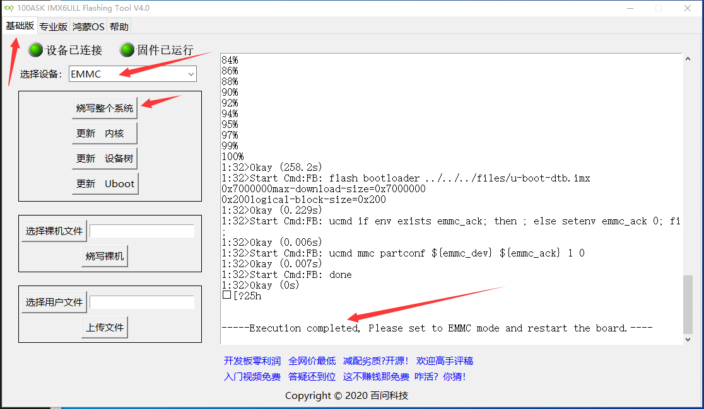
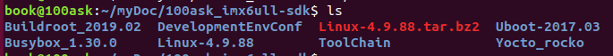
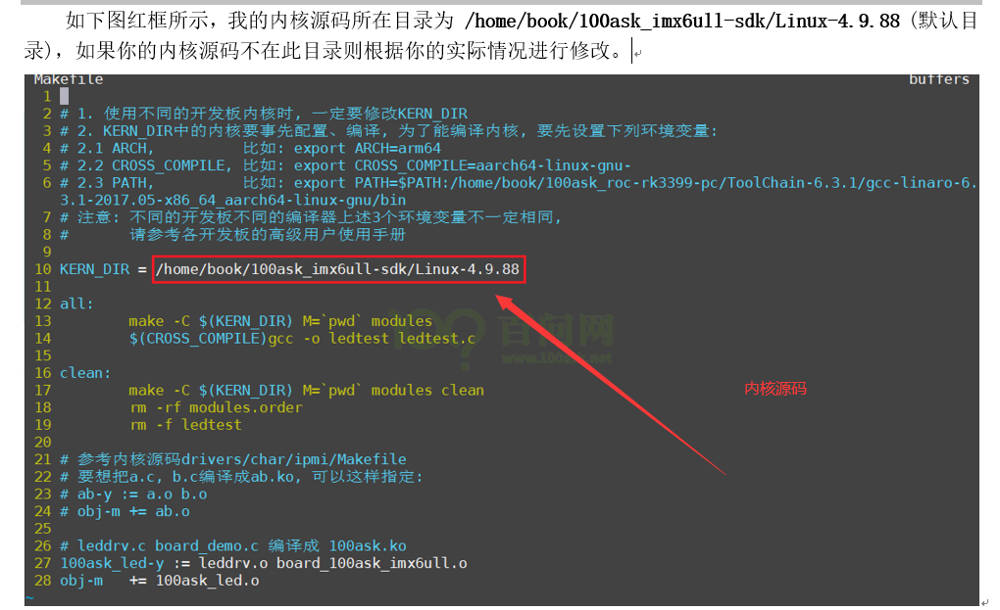

# 2021年12月10日

# 1 配置环境

## 1.1 重新烧写系统

**参考文档的第十一章**


使用下面这个工具，进行整个系统（uboot，设备树，Linux内核，文件系统）的烧录

```c
C:\Users\Administrator\Desktop\02_100ask_imx6ull_pro_2020.02.29_v2.0\01_Tools (开发工具含ubuntu镜像等)\【QT&lvgl-gui-1.0】100ask_imx6ull_pro开发板系统烧写工具
```




烧录过程中，串口打印信息如下


上面直接烧写的是100ask原始的系统，如果需要烧写自定义的修改过的系统，则需要替换掉files里面的文件


一般替换掉设备树比较多，可以直接操作开发板的/boot目录下的设备树比较快。2.4节中将会介绍


## 1.2 linux内核解压与传输

下面文件中有Linux内核的源码，交叉工具链，uboot，根文件系统这些，在window下解压会有问题，所以先使用FileZilla远程传输到ubuntu的myDoc目录下进行解压。

```c
C:\Users\Administrator\Desktop\02_100ask_imx6ull_pro_2020.02.29_v2.0\07_Bsp_sdk (系统源码，包含uboot kernel rootfs 工具链 测试代码等))
```


ubuntu中解压完成之后，得到的文件夹内容为：

执行 `7z x 100ask_imx6ull-sdk.7z` 解压缩文件(解压缩时请不要用sudo 命令，否则后面编译会有一系列错误发生)。

```c
book@100ask:~$ 7z x 100ask_imx6ull-sdk.7z
```


**注意**：如果提示没有7z命令，请先使用命令`sudo apt-get install p7zip`安装(前提是Ubuntu能上网)。



其中，需要把解压后的文件中的Linux-4.9.88内核进行压缩，然后才方便传输回window中。


然后传输回Window系统中，并创建Source Sight工程进行源码的阅读。


## 1.3 实现开发板、ubuntu、windows三者互ping


**这里采用独家usb直连网卡的方式**

参考开发手册的这一章


重新烧写系统之后，可以通过（开发板登录名为 root ，没有密码）登陆进去，然后需要连接网线进行IP设置。

```c
[root@100ask:~]# vi /etc/network/interfaces
修改并为如下内容，执行 :wq 保存并退出，执行/etc/init.d/S40network restart 重启网络服务。
auto lo
iface lo inet loopback
auto eth0
iface eth0 inet static
    address 192.168.5.9
    netmask 255.255.255.0
    gateway 192.168.5.1

```

（1）网线一端连接到靠近hdmi接口的网口处，另外一端通过直连usb网卡，连接到电脑的usb接口


### 1.3.1 开发板 ping windows 和 ubuntu


### 1.3.2 ubuntu ping windows 和 开发板


### 1.3.3 windows ping ubuntu 和 开发板


### 1.3.4 桥接模式和NAT模式区别


**模式1：**

看下图，可以知道，设置为桥接模式的时候，虚拟机和PC机器共同连接到PC机上的同一个路由器上，处于同一个网段，比如这里采用的直连网卡，就是都连接到直连USB无线网卡上，开发板也通过无线连接到直连网卡上。通过nat模式连接，是虚拟机通过PC机，然后再使用PC机的网络连接到互联网上，从而实现上网的操作。

**模式2：**

如果ubuntu桥接模式，电脑的网口连接到路由器上，则ubuntu通过这个桥接模式也是可以上网的。


### 1.3.4 给ubuntu添加一个网络适配器来上网

给ubuntu多添加一个网络设备，并且设置为桥接模式，原来的一个网络设备是nat模式的，这个用来上网使用


## 1.4 配置nfs

三者可以互ping通了，100ask配置好的ubuntu里面直接设置好nfs服务和目录了，直接在开发板上的某个目录挂载这个nfs目录就可以了。

```c
 mount -t nfs -o nolock,vers=3 192.168.5.11:/home/book/nfs_rootfs /mnt
```

开发板挂载了ubuntu的这个nfs目录，这个目录就像是自己的一样，可以直接对其进行访问，没有区别。

ubuntu桥接模式的网卡和IP地址，就是专门用来实现互ping的，以及远程登录的。

## 1.5 远程登录开发板

需要开发板有sshd服务，默认系统好像有了，那么可以ssh也可以串口登录开发板终端了。

开发板使用NFS挂载Ubuntu的前提是：**Ubuntu中已经安装了NFS服务，并且在/etc/exports中配置了某个目录供挂载。**


如果想自己搭建nfs文件夹，则可以参考文档下面这个


查看开发板是否挂载nfs目录成功

`df -h`显示板子上，可以使用的磁盘空间，nfs目录挂载过来，就像是自己的一样


## 1.6 配置交叉工具链

之所以使用 `gcc -o a a.c` 命令编译出来的可执行文件a，拷贝到nfs目录下，开发板上运行时运行不了，是因为开发板的资源和笔记本ubuntu中的是不一样的，所以需要使用交叉编译工具链编译之后得到的可执行文件才能在开发板上运行。

**gcc编译的，是给PC机编译的，里面的机器指令是x86的**


`arm-linux-gcc -o hello hello.c` 类似这样，但是不同开发板gcc的前缀是不同的。

交叉编译工具链，已经解压到ubuntu中了，如下：


交叉编译工具链用来在Ubuntu主机上编译应用程序，而这些应用程序是在ARM等其他平台上运行。


**配置交叉编译工具链永久生效的方法**

```c
gedit ~/.bashrc

// 在行尾添加或修改，加上下面几行(第3行第4行为一行命令)：

export ARCH=arm
export CROSS_COMPILE=arm-buildroot-linux-gnueabihf-
export PATH=$PATH:/home/book/myDoc/100ask_imx6ull-sdk/ToolChain/gcc-linaro-6.2.1-2016.11-x86_64_arm-linux-gnueabihf/bin

设置完毕后，要执行  source ~/.bashrc 命令使其生效，这条命令是加载这些设置的环境变量。
```

注意，指定交叉编译工具链的位置之后，就不要移动工具链的位置了。

`gedit ~/.bashrc`  在后面添加这几句话：

```c
export ARCH=arm
export CROSS_COMPILE=arm-buildroot-linux-gnueabihf-
export PATH=$PATH:/home/book/myDoc/100ask_imx6ull-sdk/ToolChain/gcc-linaro-6.2.1-2016.11-x86_64_arm-linux-gnueabihf/bin
```


使配置文件起作用

```c
source  ~/.bashrc   
```

检验是否起作用了

```c
#####  测试环境变量：

book@100ask:~$ echo $ARCH

arm

book@100ask:~$ echo $CROSS_COMPILE

arm-buildroot-linux-gnueabihf-

##### 测试交叉编译器：

执行以下命令，结果见后图：

book@100ask:~$ arm-buildroot-linux-gnueabihf-gcc -v
```

使用交叉编译工具链重新编译a.c代码


在板子上就可以运行了


查看编译得到的文件的类型：arm架构的文件


不过这个工具链好像是2016版本，文档介绍的是2020版本，这里先标记一下，以后遇到问题再改


## 1.7 编译内核


# 2 熟悉开发板资源

## 2.1 板载模块


## 2.2 一般的日常开发流程

a. 在Windows上阅读修改代码，然后通过FileZilla把代码传到VMWare中的Ubuntu；

b. 在Ubuntu上编译程序；

c. 把程序下载到开发板上，运行验证，

d. 在Windows下通过串口操作开发板。


## 2.3 Source Insight快捷键


## 2.4 更换系统内核和设备树

通过在ubuntu下重新编译设备树和内核之后，在开发板下通过/mnt挂载在下面的nfs目录，把新的内核和设备树拷贝到/boot目录下，然后重启开发板，开发板的uboot的bootarg命令就会重新从这加载内容启动开发板。


方法2：采用专用工具：


## 2.5 编译驱动模块

ubuntu下编译驱动模块，需要在makefile中定义好源码的绝对路径，这样才能加载内核源码中的一些系统函数来使用。



## 2.6 EMMC的内容和/boot目录下内容的关系


# 3 接着学习内容


## 3.1 Linux模块驱动中的函数导出

Linux内核模块驱动中的函数，想要别的文件可以调用的话，想要导出，使用 `EXPORT_SYMBOL(函数名)`


# 4 Linux应用

## 4.1 应用程序如何找到驱动程序

开发板插入SD卡，需要先挂载SD卡才能访问

查看当前挂载信息：`cat /proc/mounts`

如果想要挂载的话：`mount /dev/sda1 /mnt`

这样就把SD卡的sda1分区挂载到SD卡上了，然后直接访问/mnt目录，这些文件都是真实存在的，就可以操作这些文件把东西保存到SD卡上面了。

同时，Linux应用程序也可以通过一些虚拟的文件系统，从而访问到内核的一些信息，不如下面这个/sys目录就是，是sysfs，可以进去看看，可以看看内核有哪些设备有哪些固件。

`sysfs /sys sysfs rw,relatime 0 0`

`mount -t sysfs none /mnt`  -t表示文件类型，sysfs虚拟文件不需要真实的设备号，所以可以写none

/dev目录下的节点都是设备驱动程序，通过访问这些设备节点文件，可以调用驱动程序访问硬件。


通过打开文件的类型，找到是驱动文件，然后根据文件节点的主设备号，通过一条swi指令以及r7寄存器，从用户态进入到内核态，然后通过R7知道是open函数，然后再调用内核驱动的open函数。


通过`lsof 文件名`可以查看某个文件的信息，如果这个文件被打开了，就会有一个进程号，打开多次就有多个


然后进入到 `/proc/进程号` 里面可以看到很多进程的操作，`ls fd` 就可以看到这个文件被打开了多少次，文件描述符是多少。


我们调用open函数的时候，对应sys_open系统调用函数，它会把驱动的file_operations结构体的地址传回给file结构体中的 f_op指针，然后以后 read,write的时候，速度就会快点。


read函数只有 file 一个参数，open有 inode 和 file 两个参数，那么怎么区分 次设备号呢？可以在open的时候，就把次设备号存放到 file 结构体中的一个私有成员上。


## 4.2 copy_to_user和copy_from_user返回值

失败返回没有 被拷贝的字节数，成功返回 0


# 5 驱动开发过程新知识点

## 5.1 等待队列 wait_queue_head_t

### 5.1.1 等待队列：数据类型

```c
struct __wait_queue_head {
	spinlock_t		lock;                // 自旋锁，实现写队列和读队列过程不被打断，实现互斥访问
	struct list_head	task_list;       // 队列应该是一个双向循环链表
};

typedef struct __wait_queue_head wait_queue_head_t;

struct list_head {
	struct list_head *next, *prev;
};

static wait_queue_head_t sr501_wq;  // 等待队列
```

​		在内核里面，等待队列是有很多用处的，尤其是在中断处理、进程同步、定时等场合。可以**使用等待队列在实现阻塞进程的唤醒**。它以队列为基础数据结构，与进程调度机制紧密结合，能够用于实现内核中的**异步事件通知机制**，**同步对系统资源的访问**等。

### 5.1.2 等待队列：初始化函数

```c
// 初始化等待队列
init_waitqueue_head(&sr501_wq);  // 将自旋锁初始化为未锁，等待队列初始化为空的双向循环链表
```

### 5.1.3 等待队列：等待事件函数

```c
/**
 * wait_event - sleep until a condition gets true
 * @wq: the waitqueue to wait on
 * @condition: a C expression for the event to wait for
 */
wait_event();

#define wait_event(wq, condition)					\
do {									\
	might_sleep();							\
	if (condition)							\
		break;							\
	__wait_event(wq, condition);					\
} while (0)
// 在等待的期间，进程会被置为TASK_UNINTERRUPTIBLE进入睡眠，直到condition变量变为真
// 每次进程被唤醒的时候都会检查condition的值
```

上面：如果在睡眠期间被唤醒，且condition为真则返回

下面：

```c
wait_event_interruptible()
    
// 和wait_event()的区别是调用该宏在等待的过程中当前进程会被设置为TASK_INTERRUPTIBLE状态
// 在每次被唤醒的时候,首先检查condition是否为真,如果为真则返回 0
// 否则检查如果进程是被信号唤醒,会返回-ERESTARTSYS错误码
```


```c
wait_event_timeout()
wait_event_interruptible_timeout()
// 与wait_event_timeout()类似,不过如果在睡眠期间被信号打断则返回ERESTARTSYS错误码

```

**详细解释 wait_event_interruptible_timeout()**

```c
函数原型：wait_event_interruptible_timeout(wq, condition, timeout)

* 函数作用：~睡眠~,直到condition为真，或timeout超时；
* @wq: 要等待的等待队列
* @condition: 等待事件发生的条件（一个C表达式 ）
* @timeout: 超时时间

程序是用来睡眠的(TASK_INTERRUPTIBLE状态下)，直到@condition为真，或者收到一个信号。
每次等待队列@wq被唤醒时，检查@condition；
若有可以改变等待条件的任何更改操作，调用wake_up()；
如果@timeout超时，函数返回0；如果是被信号中断，函数返回-ERESTARTSYS；
在超时之前condition 为true，否则继续剩余的jiffies 。
```

理解所需：
1，TASK_INTERRUPTIBLE是可以**被信号和wake_up()唤醒的**，当信号到来时，进程会被设置为可运行；而TASK_UNINTERRUPTIBLE**只能被wake_up()唤醒**。
2，信号是在软件层次上对中断机制的一种模拟，为软中断。
3，signal_pending(current) :检查当前进程是否有信号处理，返回值不为0则表示有信号需要处理。
返回 -ERESTARTSYS 表示信号函数处理完毕后重新执行信号函数前的某个系统调用。(此函数只检查是否有信号，不处理信号)
条件不满足，则产生信号、开始等待。若返回非0，则表示没有信号需要处理，继续循环重新开始系统调用；若返回0，则表示有信号需要处理，直接处理数据，系统调用正常结束。
4，schedule_timeout()用来让出CPU,在指定的时间用完以后或者其它事件到达并唤醒进程时（比如接收了一个信号量），该进程才可以继续运行.
[函数返回0表示timeout用完后被唤醒；返回整数表示timeout未用完时就被唤醒，此时可能接收到了一个信号量]


### 5.1.4 等待队列：唤醒函数

```c
wake_up()
// 唤醒等待队列.可唤醒处于TASK_INTERRUPTIBLE和TASK_UNINTERUPTIBLE状态的进程，
// 和wait_event/wait_event_timeout成对使用
    
wake_up_interruptible()
// 和wake_up()唯一的区别是它只能唤醒TASK_INTERRUPTIBLE状态的进程
// 与wait_event_interruptible/wait_event_interruptible_timeout/    wait_event_interruptible_exclusive成对使用
```

等待队列

然后另外一个东西把它唤醒

然后再次执行到等待队列函数，还是会等待

（这里面要有标志位，等待一次和唤醒一次是配套使用的）


## 5.2 内核线程

```c
static struct task_struct *sr501_kthread; // 内核线程结构体
```

```c
// 1.0 开启一个内核线程
sr501_kthread = kthread_run(sr501_thread_func, NULL, "sr501thrad");
```

```c
// 停止内核线程
kthread_stop(sr501_kthread);
```

```c
// 内核线程函数
static int sr501_thread_func(void *data)
{
	// 用这个函数来控制内核线程的停止
	// 一直测试某一位，直到 __exit 函数停止内核线程，这个位被置1
	while(!kthread_should_stop())  
	{
        set_current_state(TASK_INTERRUPTIBLE);  // 需要设置当前线程的状态
		// 比较理想的延迟执行方法是使用schedule_timeout函数
		// 该方法会让需要延迟的任务睡眠到指定的延时时间耗尽后在重新运行
		// 这种会休眠的延时，不会浪费cpu资源
		// udelay()延时，是死等的方式，不太好
		// 最小延时 1ms
		schedule_timeout(HZ/5);  // 需要上面那个，这个才起作用，休眠1秒
    }
}
```


## 5.3 关闭中断

```c
local_irq_save(flags);  // 关中断
local_irq_restore(flags);  // 恢复中断
```


## 5.4 记录系统时刻

```c
static u64 sr04_data_ns = 0;  // 存储系统时刻值
sr04_data_ns = ktime_get_ns();
```


