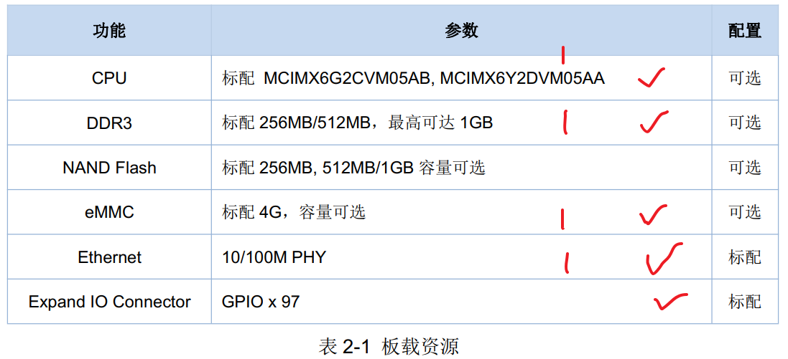

## 1 mmc操作命令

一般认为 emmc和sd卡是同一类东西，都被作为mmc对象进行识别和操作。

### 1.1 ? mmc

```c
// 查看 mmc 的所有指令
? mmc     
```

示例：

```c
=> ? mmc
mmc - MMC sub system

Usage:
mmc info - display info of the current MMC device
mmc read addr blk# cnt
mmc write addr blk# cnt
mmc erase blk# cnt
mmc rescan
mmc part - lists available partition on current mmc device
mmc dev [dev] [part] - show or set current mmc device [partition]
mmc list - lists available devices
mmc hwpartition [args...] - does hardware partitioning
  arguments (sizes in 512-byte blocks):
    [user [enh start cnt] [wrrel {on|off}]] - sets user data area attributes
    [gp1|gp2|gp3|gp4 cnt [enh] [wrrel {on|off}]] - general purpose partition
    [check|set|complete] - mode, complete set partitioning completed
  WARNING: Partitioning is a write-once setting once it is set to complete.
  Power cycling is required to initialize partitions after set to complete.
mmc bootbus dev boot_bus_width reset_boot_bus_width boot_mode
 - Set the BOOT_BUS_WIDTH field of the specified device
mmc bootpart-resize <dev> <boot part size MB> <RPMB part size MB>
 - Change sizes of boot and RPMB partitions of specified device
mmc partconf dev boot_ack boot_partition partition_access
 - Change the bits of the PARTITION_CONFIG field of the specified device
mmc rst-function dev value
 - Change the RST_n_FUNCTION field of the specified device
   WARNING: This is a write-once field and 0 / 1 / 2 are the only valid values.
mmc setdsr <value> - set DSR register value
```

### 1.2 mmc info

```c
// 查看当前 mmc设备的信息
mmc info
```

示例：

```c
// 没有插入 SD卡的时候，没有识别出信息

=> mmc info
MMC: no card present
mmc_init: -123, time 2
```

切换到 emmc 设备之后，再次查看 emmc的信息

```c
=> mmc info
Device: FSL_SDHC
Manufacturer ID: 13
OEM: 14e
Name: Q2J54
Bus Speed: 52000000        // emmc的读写速度为 52MHz
Mode : MMC High Speed (52MHz)
Rd Block Len: 512
MMC version 5.0             // 版本为 5.0
High Capacity: Yes
Capacity: 3.6 GiB           // emmc的容量为 4GB
Bus Width: 4-bit            // 总线宽度是 4bit
Erase Group Size: 512 KiB
HC WP Group Size: 8 MiB
User Capacity: 3.6 GiB WRREL
Boot Capacity: 2 MiB ENH
RPMB Capacity: 512 KiB ENH
```


### 1.3 mmc rescan

```c
// 用于扫描当前开发板上的所有 mmc设备，包括 emmc和sd卡
mmc rescan    
```

示例：

```c
// 没有输出的
=> mmc rescan
```


### 1.4 mmc list

```c
// 列出板子上的所有 mmc 设备额，包括 sd卡和emmc设备
mmc list
```

示例：

```c
=> mmc list
FSL_SDHC: 0
FSL_SDHC: 1 (eMMC)
```


### 1.5 mmc dev [dev] [part]

```c
// 切换当前 mmc设备到  dev设备的part分区，如果不写 part，就是默认第一个分区
mmc dev [dev] [part]
```

示例：

```c
// 切换到mmc0设备，也就是 sd卡
=> mmc dev 0
MMC: no card present
mmc_init: -123, time 2

// 切换到mmc1设备，也就是 emmc的第一个分区
=> mmc dev 1
switch to partitions #0, OK
mmc1(part 0) is current device
 
// 手动切换分区    
=> mmc dev 1 0
switch to partitions #0, OK
mmc1(part 0) is current device
=>
=> mmc dev 1 1
switch to partitions #1, OK
mmc1(part 1) is current device
=> mmc dev 1 2
switch to partitions #2, OK
mmc1(part 2) is current device
   
```


### 1.6 mmc part

```c
// 查看当前mmc设备的分区情况
=> mmc part

Partition Map for MMC device 1  --   Partition Type: DOS

// 可以看到 emmc有3个分区
// 分区1是扇区：4098    ~ 2048000  =>  第 0 个分区存放 uboot
// 分区2是扇区：2052098 ~ 3072000  =>  第 1 个分区存放 Linux 镜像文件和设备树
// 分区3是扇区：5124098 ~ 1024000  =>  第 2 个分区存放根文件系统     
Part    Start Sector    Num Sectors     UUID            Type
  1     4098            2048000         00000000-01     83 Boot
  2     2052098         3072000         00000000-02     83 Boot
  3     5124098         1024000         00000000-03     0c

// 前面头部        4098*512/1024/1024 = 2M

// 分区1从 4098扇区开始，大小为 2048000个扇区  --> 大小= 2048000*512/1024/1024 = 1000M
//        2048000 + 4098 = 2052098 扇区

// 分区2从 2052098扇区开始，大小为 3072000个扇区  --> 大小= 3072000*512/1024/1024 = 1500M
//        2052098 + 3072000 = 5124098 扇区

// 分区3从 5124098扇区开始，大小为 1024000个扇区  --> 大小= 1024000*512/1024/1024 = 500M
//        5124098 + 1024000 = 6148098 扇区    

// 总大小： 2M + 1000M + 1500M + 500M = 3002M = 2.931640625 G
```

 

```c
// winhex查看工具
0x6A6003F0 = 1,784,677,360  字节
```


### 1.7 mmc read

```c
// 读取 mmc 从blk(16进制)块(扇区)开始的cnt(16进制)块(扇区)数据到 SDRAM内存的 addr地址中
// 块和扇区一个意思，mmc设备中喜欢说扇区，一个扇区/块是 512字节
mmc read addr blk# cnt
```

实例：

```c
// 从 EMMC 的第 1536(0x600)个块开始，读取 16(0x10)个块的数据到 DRAM 的 0X80800000 地址处
=> mmc read 80800000 600 10
MMC read: dev # 1, block # 1536, count 16 ... 16 blocks read: OK
```

```c
//md.b 命令查看 0x80800000 处的数据就行了，查看 16*512=8192(0x2000)个字节的数据
md.b 80800000 2000
```


### 1.8 mmc write

```c
// 我们可以使用命令“mmc write”来升级 uboot，也就是在 uboot 中更新 uboot ，也就是在uoot状态下，读取文件写到里面，然后重启就加载新的内容了，这里要用到 nfs 或者 tftp 命令，通过 nfs 或者 tftp 命令将新的 u-boot.bin 下载到开发板的 DRAM 中，然后再使用命令“mmc write”将其写入到 MMC设备中。  
// dram ==> mmc 中
// 就是通过 tftp 将新的uboot文件u-boot.imx下载到 sdram的 80800000地址处
tftp 80800000 u-boot.imx
```

```c
// 将dram的addr地址处的内容，写入到 当前mmc设备 blk分区处，写入大小为 cnt块(扇区)
mmc write addr blk# cnt
```

实例：

```c
// 使用命令“mmc write”从 SD 卡分区 0 第 2 个块(扇区)开始烧写，一共烧写 814(0x32E)个块，命令如下：
// mmc dev 0 0
mmc write 80800000 2 32E
```

```c
// 同理，如果要在 uboot 中更新 EMMC 对应的 uboot，可以使用如下所示命令：
mmc dev 1 0 //切换到 EMMC 分区 0
tftp 80800000 u-boot.imx //下载 u-boot.imx 到 DRAM
mmc write 80800000 2 32E //烧写 u-boot.imx 到 EMMC 中
mmc partconf 1 1 0 0 //分区配置， EMMC 需要这一步！
```

**注意**：千万不要写 SD 卡或者 EMMC 的前两个块(扇区)，里面保存着分区表！  


### 1.9 mmc erase

```c
// blk 为要擦除的起始块， cnt 是要擦除的数量。
mmc erase blk# cnt
```


## 2 读取 mmc中文件信息

### 2.1 ext4ls

uboot 有 ext2 和 ext4 这两种格式的文件系统的操作命令，对于 ext2 和 ext4 格式的文件，只能使用 ext相关的命令来操作。


实例1：

```c
// 使用 ext4ls 就可以查询 EMMC 的分区 2 中的文件和目录
// 下面的结果可以看出，emmc的分区2中存放的主要是根文件系统的信息
=> ext4ls mmc 1:2
<DIR>       4096 .
<DIR>       4096 ..
<DIR>      16384 lost+found
<DIR>       4096 bin
<DIR>       4096 boot
<DIR>       4096 dev
<DIR>       4096 etc
<DIR>       4096 lib
<SYM>          3 lib32
            5408 linuxrc
<DIR>       4096 media
<DIR>       4096 mnt
<DIR>       4096 opt
<DIR>       4096 proc
<DIR>       4096 root
<DIR>       4096 run
<DIR>       4096 sbin
<DIR>       4096 selinux
<DIR>       4096 sys
<DIR>       4096 tmp
<DIR>       4096 usr
<DIR>       4096 var
<DIR>       4096 .config
              16 .esd_auth
<DIR>       4096 .cache
```

实例2：

```c
// 因为 emmc分区0和1中存放的不是ext2或者ext4格式的文件类型，所以读取不出来
=> ext4ls mmc 1:1
Failed to mount ext2 filesystem...
** Unrecognized filesystem type **
=> ext4ls mmc 1:0
Failed to mount ext2 filesystem...
** Unrecognized filesystem type **
```

实例3：

```c
// 原来还可以查看更加细致的目录和文件信息
=> ext4ls mmc 1:2 /boot
<DIR>       4096 .
<DIR>       4096 ..
           39456 100ask_imx6ull-14x14.dtb           // 设备树文件
           37940 100ask_imx6ull_mini.dtb            // 设备树文件
           36885 100ask_myir_imx6ull_mini.dtb       // 设备树文件 
         7924872 zImage                             // linux内核镜像，7M大小
```


说明：

```c
ext2load、 ext2ls

ext4load、 ext4ls 和 ext4write  

fatload、  fatls  和 fatwrit     一样，只是 ext2 和 ext4 都是针对 ext 文件系统的。  
```


### 2.2 fstype

分区 0 格式未知，因为分区 0 存放的 uboot，并且**分区 0 没有格式化**，所以文件系统格式未知。

分区 1 的格式为 **fat**，分区 1 用于存放 **linux 镜像和设备树**。

分区 2 的格式为 **ext4**，用于存放 **Linux 的根文件系统(rootfs)**。  


实例：

```c
=> fstype mmc 1:0
Failed to mount ext2 filesystem...
** Unrecognized filesystem type **
=> fstype mmc 1:1
Failed to mount ext2 filesystem...
** Unrecognized filesystem type **
=> fstype mmc 1:2
ext4
```


### 2.3 fatls   

有时候需要在 uboot 中对 SD 卡或者 EMMC 中存储的文件进行操作，这时候就要用到文件操作命令，跟文件操作相关的命令有： fatinfo、 fatls、 fstype、 fatload 和 fatwrite，但是这些文件操作命令只支持 FAT 格式的文件系统。

```c
// 都失败，是因为这些文件都不是 fat 格式的文件，所以使用 fat相关的操作命令是不能成功的
=> fatls mmc 1:0
** Unrecognized filesystem type **
=> fatls mmc 1:1
** Unrecognized filesystem type **
=> fatls mmc 1:2
** Unrecognized filesystem type **
```


### 2.4 fatload

```c
// 将 EMMC 分区 1 中的 zImage 文件读取到 DRAM 中的0X80800000 地址处
fatload mmc 1:1 80800000 zImage   // 这里和mmc read的区别就是，这里可以对文件进行操作，就不用计算需要写多大的字节数量了 
```


### 2.5 fatwrite  

```c
// DRAD的地址80800000开始是存放zImage， zImage 大小为 6039328(0X5C2720)个字节，接下来使用命令 fatwrite 将其写入到 EMMC 的分区 1 中，文件名字为 zImage
fatwrite mmc 1:1 80800000 zImage 0x5c2720
```


### 问题1

使用 mmc read write 和 fat 或者 ext 的命令来加载或者写mmc和dram数据交互有什么区别


## 3 查看 uboot的命令 

```c
baudrate=115200
board_name=EVK
board_rev=14X14
boot_fdt=try
bootcmd=run updateset;run findfdt;run findtee;mmc dev ${mmcdev};mmc dev ${mmcdev}; if mmc rescan; then if run loadb                            ootscript; then run bootscript; else if run loadimage; then run mmcboot; else run netboot; fi; fi; else run netboot                            ; fi
bootcmd_mfg=run mfgtool_args; if test ${tee} = yes; then bootm ${tee_addr} ${initrd_addr} ${fdt_addr}; else bootz $                            {loadaddr} ${initrd_addr} ${fdt_addr}; fi;
bootdelay=3
bootdir=/boot
bootscript=echo Running bootscript from mmc ...; source
console=ttymxc0
eth1addr=00:01:3f:2d:3e:4d
ethact=ethernet@020b4000
ethaddr=00:01:1f:2d:3e:4d
ethprime=eth1
fdt_addr=0x83000000
fdt_file=100ask_imx6ull-14x14.dtb
fdt_high=0xffffffff
fdtcontroladdr=9ef40478
findfdt=if test $fdt_file = undefined; then if test $board_name = EVK && test $board_rev = 9X9; then setenv fdt_fil                            e imx6ull-9x9-evk.dtb; fi; if test $board_name = EVK && test $board_rev = 14X14; then setenv fdt_file imx6ull-14x14                            -evk.dtb; fi; if test $fdt_file = undefined; then setenv fdt_file imx6ull-14x14-alpha.dtb; fi; fi;
image=zImage
initrd_addr=0x83800000
initrd_high=0xffffffff
ip_dyn=yes
loadaddr=0x80800000
loadbootscript=fatload mmc ${mmcdev}:${mmcpart} ${loadaddr} ${script};
loadfdt=ext2load mmc ${mmcdev}:${mmcpart} ${fdt_addr} ${bootdir}/${fdt_file}
loadimage=ext2load mmc ${mmcdev}:${mmcpart} ${loadaddr} ${bootdir}/${image}
loadtee=fatload mmc ${mmcdev}:${mmcpart} ${tee_addr} ${tee_file}
mfgtool_args=setenv bootargs console=${console},${baudrate} rdinit=/linuxrc g_mass_storage.stall=0 g_mass_storage.r                            emovable=1 g_mass_storage.file=/fat g_mass_storage.ro=1 g_mass_storage.idVendor=0x066F g_mass_storage.idProduct=0x3                            7FF g_mass_storage.iSerialNumber="" clk_ignore_unused
mmcargs=setenv bootargs console=${console},${baudrate} root=${mmcroot}
mmcautodetect=no
mmcboot=echo Booting from mmc ...; run mmcargs; if test ${tee} = yes; then run loadfdt; run loadtee; bootm ${tee_ad                            dr} - ${fdt_addr}; else if test ${boot_fdt} = yes || test ${boot_fdt} = try; then if run loadfdt; then bootz ${load                            addr} - ${fdt_addr}; else if test ${boot_fdt} = try; then bootz; else echo WARN: Cannot load the DT; fi; fi; else b                            ootz; fi; fi;
mmcdev=1
mmcpart=2
mmcroot=/dev/mmcblk1p2 rootwait rw
netargs=setenv bootargs console=${console},${baudrate} root=/dev/nfs ip=dhcp nfsroot=${serverip}:${nfsroot},v3,tcp
netboot=echo Booting from net ...; run netargs; setenv get_cmd tftp; ${get_cmd} ${image}; ${get_cmd} ${fdt_addr} ${                            fdt_file};  bootz ${loadaddr} - ${fdt_addr};
panel=TFT7016
script=boot.scr
tee=no
tee_addr=0x84000000
tee_file=uTee-6ullevk
update=yes
updateset=if test $update = undefined; then setenv update yes; saveenv; fi;

Environment size: 2765/8188 bytes

```

提取出从 emmc 启动的命令行

```c
mmcboot=echo Booting from mmc ...; run mmcargs; if test ${tee} = yes; then run loadfdt; run loadtee; bootm ${tee_addr} - ${fdt_addr}; else if test ${boot_fdt} = yes || test ${boot_fdt} = try; then if run loadfdt; then bootz ${loadaddr} - ${fdt_addr}; else if test ${boot_fdt} = try; then bootz; else echo WARN: Cannot load the DT; fi; fi; else bootz; fi; fi;
```

bootcmd：uboot倒计时结束之后就会执行 bootcmd的命令

**针对emmc中不同文件的格式使用不同的加载指令**

```c
bootcmd=
	run updateset;
	run findfdt;
	run findtee;
	mmc dev ${mmcdev};               // 切换到 emmc mmcdev分区
	mmc dev ${mmcdev}; 

	if mmc rescan;then               // 重新搜索 mmc 设备
    	if run loadbootscript;then   // 加载内容到
			run bootscript;          // 执行脚本启动
		else if run loadimage;then   // 如果是emmc启动 
			run mmcboot;             // 执行emmc启动          
		else run netboot;            // 否则就执行网络nfs启动   
		fi; 
	fi; 
	else run netboot;                // 没有emmc设备就执行网络nfs启动   
	fi;
```

（1）执行脚本启动 loadbootscript

```c
mmcdev=1
mmcpart=2
loadaddr=0x80800000
script=boot.scr
    
// 将 mmc1也就是 emmc分区2中的文件 boot.scr读取到 dram 0x80800000 地址中
	loadbootscript=fatload mmc ${mmcdev}:${mmcpart} ${loadaddr} ${script};
==> loadbootscript=fatload mmc 1:2 0x80800000 boot.scr;

// 没有做什么
bootscript=echo Running bootscript from mmc ...; source
```

（2）加载镜像  loadimage

```c
mmcdev=1
mmcpart=2
loadaddr=0x80800000
bootdir=/boot
image=zImage    

// 将 emmc 分区2的 /boot/zImage 文件读取到 DRAM的 0x80800000地址处
	loadimage=ext2load mmc ${mmcdev}:${mmcpart} ${loadaddr} ${bootdir}/${image}
==> loadimage=ext2load mmc 1:2 0x80800000 /boot/zImage
    
    
```

（3）启动内核 mmcboot

```c
mmcboot=echo Booting from mmc ...; 
run mmcargs;     // 这句话是重点
if test ${tee} = yes; then 
    run loadfdt; 
	run loadtee; 
	bootm ${tee_addr} - ${fdt_addr}; 
else if test ${boot_fdt} = yes || test ${boot_fdt} = try; then 
    if run loadfdt; then 
        bootz ${loadaddr} - ${fdt_addr}; 
	else if test ${boot_fdt} = try; then 
    	bootz; 
	else 
    	echo WARN: Cannot load the DT; 
	fi; 
	fi; 
else 
    bootz;  // 启动加载内核
	fi; 
fi;
```

```c
// 设置 bootargs 参数
console=ttymxc0         // 设置串口1作为 console 控制台
baudrate=115200    
mmcroot=/dev/mmcblk1p2 rootwait rw  // 根文件系统在这里，rootwait是说等emmc初始化完成之后才挂载，rw表示可以读写
    
	mmcargs=setenv bootargs console=${console},${baudrate} root=${mmcroot}
==> mmcargs=setenv bootargs console=ttymxc0,115200 root=/dev/mmcblk1p2 rootwait rw
```


（4）网络启动

```c
netboot=echo Booting from net ...; 
run netargs; 
setenv get_cmd tftp; 
${get_cmd} ${image}; 
${get_cmd} ${fdt_addr} ${fdt_file};  
bootz ${loadaddr} - ${fdt_addr};
```

```c
console=ttymxc0
baudrate=115200
root=/dev/nfs
    
netargs=setenv bootargs console=${console},${baudrate} root=/dev/nfs ip=dhcp nfsroot=${serverip}:${nfsroot},v3,tcp
```


### 总结【简化】

芯片内部的rom原厂固化了代码 bootrom：初始化板子的 emmc 和 DRAM（DDR3）

uboot的作用：

```c
// 整个 uboot 的起始地址就是 0X87800000（DDR运行内存的地址）
// 整个 zImage 的起始地址就是 0X80800000（DDR运行内存的地址）
// 整个 dts 的起始地址就是 0X83000000（DDR运行内存的地址）

（1）先初始化板子的 串口1
（2）然后执行 bootcmd 命令的操作，emmc启动的主要是执行下面两句话
	// 把 emmc中的/boot/目录中的zImage复制到运行内存的 0x80800000 地址处
    // 这里是有指定 mmc 1:2 中的/boot目录中的zImage文件，指示就很明确
	run loadimage;   --> loadimage=ext2load mmc 1:2 0x80800000 /boot/zImage
        
	// 设置控制台采用串口1
	// root=/dev/mmcblk1p2 只是传递给linux内核，等到内核自己加载完成之后才使用这个挂载文件系统
    // 而这个参数中的 /dev这里面的根目录是什么？
	// bootargs 保存着 uboot 传递给 Linux 内核的参数
	run mmcboot;  --> run mmcargs;  bootz 80800000 - 83000000;
	==> mmcargs=setenv bootargs console=ttymxc0,115200 root=/dev/mmcblk1p2 rootwait rw

```


### 问题1（解决）

文件系统烧写到 emmc的分区2中，难道里面就有目录结构了是吗，也有一个类似于根目录一样最顶层的目录，只是这个文件系统还没有挂接到linux镜像中，作为linux的根文件系统，所以linux还不能随意访问这个文件系统。

```c
// 答：对的，emmc各个分区中也有自己的目录框架，之前使用 ext4ls mmc 1:2
// 就看到了 emmc分区2的目录和文件框架
```


### 问题2（解决）

烧写到emmc的文件中就有/boot目录，以及里面就有 镜像zImage 和 dtbs 和文件系统了嘛

```c
// 答：对的，镜像zImage 和 dtbs就是存放 emmc分区2中的根文件系统的 /boot目录下的
```


### 问题3（解决）

uboot是存放在哪里的？是谁把它加载到内存对应地址中运行的？

```c
// uboot 要从 emmc 里面读取环境变量和参数信息启动 Linux内核了
// 答：imx6ull芯片中有一块ROM是烧写了厂家的程序（start.s启动文件），一上电，CPU从这块ROM里面读取程序来运行，初始化一些外设，然后把EMMC中的程序（UBOOT）拷贝到DDR中，然后跳转到 DDR中的 uboot中运行

// 从emmc的哪里开始拷贝，拷贝多少数据，拷贝到内存的哪里，都是在准备烧写到emmc镜像中的头部有指定的，叫DCD
```


## 4 Linux启动的问题


### 问题1（解决）

​		之前有使用nfs挂载根文件系统，那么我们这个烧写到emmc中的文件系统，emmc的分区2中存放的是我们制作的根文件系统，里面的文件目录/boot下面有我们的镜像zImage和dts设备树文件。

​		在内核启动之后，先是有一个叫做 ramfs的小文件系统，然后linux内核启动完成一些初始化工作之后，就把我们在emmc中存放的文件系统挂载到了ramfs的目录下面，并且切换我们的根文件系统的顶层目录作为根目录。


### 问题2（解决）

有内核init，也有用户init

内核 init 是 kernel_init

用户空间的init是busybox生成的


### 问题3（解决）

得把uboot,kernel,rootf在哪些位置，谁启动谁清晰了

0x80800000 内核

0x83000000 设备树

文件系统在 /etc/emmcblk2 中，由 root = 来指定，到时候内核的 ramfs文件系统挂载它

答：原厂的bootrom程序，把我们的uboot程序拷贝到DRAM中（里面指定了拷贝的地址是 0x87000000），然后运行uboot程序，uboot程序再把 emmc中的linux内核镜像 zImage以及dts分别拷贝到0x80800000 ，0x83000000，然后 bootz 0x80800000 - 0x83000000，启动Linux内核。


### 问题4（解决）

/etc/init.d/rc.S是一个shell脚本，会在linux内核启动之后帮我们启动一些服务


```shell
[root@100ask:/etc/init.d]# cat rcS
#!/bin/sh

# 启动/etc/init.d目录中的所有脚本，按照上面文件夹中文件的顺序依次执行
# Start all init scripts in /etc/init.d  
# executing them in numerical order.
#
psplash -n &
for i in /etc/init.d/S??* ;do

     # Ignore dangling symlinks (if any).
     [ ! -f "$i" ] && continue

     case "$i" in
        *.sh)
            # Source shell script for speed.
            (
                trap - INT QUIT TSTP
                set start
                . $i
            )
            ;;
        *)
            # No sh extension, so fork subprocess.
            $i start
            ;;
    esac
done

/bin/hostname -F /etc/hostname
```


### 问题5 /etc/inittab

创建/etc/inittab，因为应用空间的init进程会找到里面的东西

```shell
[root@100ask:/etc]# cat inittab
# /etc/inittab
#
# Copyright (C) 2001 Erik Andersen <andersen@codepoet.org>
#
# Note: BusyBox init doesn't support runlevels.  The runlevels field is
# completely ignored by BusyBox init. If you want runlevels, use
# sysvinit.
#
# Format for each entry: <id>:<runlevels>:<action>:<process>
#
# id        == tty to run on, or empty for /dev/console
# runlevels == ignored
# action    == one of sysinit, respawn, askfirst, wait, and once
# process   == program to run

# Startup the system
::sysinit:/bin/mount -t proc proc /proc
::sysinit:/bin/mount -o remount,rw /
::sysinit:/bin/mkdir -p /dev/pts /dev/shm
::sysinit:/bin/mount -a         # 为什么需要挂载全部
::sysinit:/sbin/swapon -a
null::sysinit:/bin/ln -sf /proc/self/fd /dev/fd
null::sysinit:/bin/ln -sf /proc/self/fd/0 /dev/stdin
null::sysinit:/bin/ln -sf /proc/self/fd/1 /dev/stdout
null::sysinit:/bin/ln -sf /proc/self/fd/2 /dev/stderr
::sysinit:/bin/hostname -F /etc/hostname
# now run any rc scripts
::sysinit:/etc/init.d/rcS       # 启动自运行文件

# Put a getty on the serial port
ttymxc0::respawn:/sbin/getty -L  ttymxc0 0 vt100 # GENERIC_SERIAL

# Stuff to do for the 3-finger salute
#::ctrlaltdel:/sbin/reboot

# Stuff to do before rebooting
::shutdown:/etc/init.d/rcK
::shutdown:/sbin/swapoff -a
::shutdown:/bin/umount -a -r    # 使用绝对路径来执行指令

```


### 问题6（解决）

head.S中定义了entry为stext，里面lookup_processor_type是看是否支持这种处理器吗，最后调用start_kernel函数，这个函数定义在init/main.c中，这里面做一些初始化工作，比如开启调度器，开启mmu，初始化定时器，最后调用rest_init，里面创建kernel_init进程，这时候还是内核进程，最后会调用应用程序也就是根文件系统的init进程，从而完成内核态向应用态的切换，pid为1，然后开启kthredd线程，pid为2，负责整个内核的调度，最后主线程就演变成idle进程，pid为0，因为没有人调用fork来创建这个空闲进程，所以是演变成的，ps可以看到pid为1,2，因为init和kthreadd都是用户态的进程，而idle为pid0看不到，因为是内核进程


### 问题7（解决）

kernel_init会在根文件系统重寻找有没有init程序，uboot一般会在bootargs中指定init=xxx，就是用户空间的init进程，如果不指定，就会默认从/sbin/init，etc/init，bin/init，bin/shell中依次寻找运行程序，如果都没有备用的init程序，linux启动失败。


### 问题8（解决）

- freeable前面还有，创建进程 kthredd并等待这个调度进程就绪，然后初始化多核调度算法，然后再到问题9

- kernel_init函数中，首先调用kernel_init_freeable来做一些初始化准备工作，包括下面的内容: driver_init完成linux驱动模型子系统的初始化，大开设备/dev/console，uboot中bootargs指定console=ttymxc0,115200，所以打开串口1作为控制台，然后复制两份控制台，一个为标准输入，一个为标准错误，

- 然后就挂载根文件系统，bootargs指定 root=/dev/emmcnlk1中，挂载才能进行内核和根文件系统的打交道，才能kernel_init运行后面的程序，找到用户态的init进程

问题9说的挂载根文件系统，意思是说，我们烧录了根文件系统到emmc的分区2中，挂载的意思就是把emmc分区2这一块真实的内存块设备，类似于一个u盘，只有挂载到内核中才能进行读写访问?（对的，linux内核后期创建了一个虚拟的文件系统，然后把emmc中真实的文件系统挂载到这个虚拟文件系统下面，并切换为根目录）


### 问题9（解决）

根文件系统是linux内核启动后mount加载的第一个文件系统，然后从文件系统中读取初始化脚本，rcS，initdtab等。


### 问题10 由虚拟文件系统切换到真实的文件系统（解决）

- 函数start_kernel()中会去调用vfs_caches_init()来初始化VFS。
- vfs_caches_init()中最重要的函数。
- 函数mnt_init()会创建一个rootfs，这是个虚拟的rootfs（虚拟根文件系统，注册根文件系统），即内存文件系统，后面还会指向真实的文件系统。

- 接下来，Kernel_Start会去调用rest_init()并会去创建系统中的第一个进程Kernel_Init，并由其调用全部模块的初始化函数，当中ROOTFS的初始化函数也在这个期间被调用。

- 检查根文件系统中是否存在文件ramdisk_execute_command，假设存在的话则运行init_post()，否则运行prepare_namespace()挂载根文件系统。**实际上就是载入/dev/mtdblock2**


- 将挂载点从当前文件夹（实际当前的文件夹在mount_root中或者在mount_block_root中指定）移到根文件夹。对于上面的command line的话，当前的文件夹就是/dev/mtdblock2。

- 将当前文件夹当作系统的根文件夹，至此虚拟系统根文件夹文件系统切换到了实际的根文件夹文件系统。


### 问题11  运行地址，链接地址，加载地址

链接地址=运行地址：是.lds链接脚本中指定的代码段的起始地址，在代码重定位的时候，把emmc等存储地址中的代码复制到这些 .lds中指定的 .Ttext 代码段中。

加载地址，就是程序存储的地址：emmc中或者nand flash中的地址。


## 5 imx6ull 的硬件资源


### 5.1 imx6ull 资源





### 5.2 imx6ull 的地址映射


## 6 imx6ull启动流程


​		这个启动流程可以猜测出来，假设板子设置为SD/TF卡启动，boot ROM程序会做什么？把程序从SD/TF卡读出来，运行。

​		从哪里读？从SD/TF卡读，这需要先初始化SD/TF卡：根据eFUSE或GPIO的设置初始化SD/TF卡。

​		读到哪里去？读到内存即DDR去，这需要先初始化DDR。

​		除了初始化启动设备、初始化DDR，还需要初始化什么？也许要初始化时钟，让CPU跑得更快一点。

​		总结起来就是：初始化CPU、时钟等，初始化内存，初始化启动设备，从启动设备上把程序读入内存，运行内存的程序。

​		官方的启动流程如下，这个流程图比较粗糙，总结起来就是：

- a. 检查CPU ID
- b. 检查Reset Type，冷启动、唤醒的启动过程是不一样的
- c. 检查启动模式BOOT_MODE，检查eFUSE或GPIO
- d. 根据上述检查从USB口、UART口或是某个启动设备下载boot image
- e. 认证image
- f. 启动


### 问题1（解决）

boot ROM程序需要知道从启动设备哪个位置读程序，读多大的程序，复制到哪里去。


### 问题2（解决）

IMX6ULL的boot ROM程序可以把程序读到DDR里，那需要先初始化DDR。每种板子接的DDR可能不一样，boot ROM程序需要初始化这些不同的DDR。boot ROM从哪里得到这些不同的参数？


​		这些参数信息，被称为“Device Configuration Data”，设备配置数据(DCD)，这些DCD将会跟bin文件一起打包烧写在启动设备上。boot ROM程序会从启动设备上读出DCD数据，根据DCD来写对应的寄存器以便初始化芯片。DCD中列出的是对某些寄存器的读写操作，我们可以在DCD中设置DDR控制器的寄存器值，可以在DCD中使用更优的参数设置必需的硬件。这样boot ROM程序就会帮我们初始化DDR和其他硬件，然后才可以把bin程序读到DDR中并运行。

总结起来，烧写在EMMC、SD卡或是TF卡上的，除了程序本身，还有位置信息、DCD信息，这些内容合并成一个映像文件，如下图：

​                               

​		这4部分内容合并成为一个映像文件，烧写在EMMC、SD卡或TF卡等启动设备的某个固定地址，boot ROM程序去这个固定地址读出映像文件。启动设备不同，固定地址不同，如下图：

 


