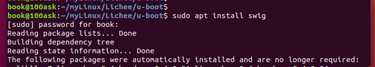
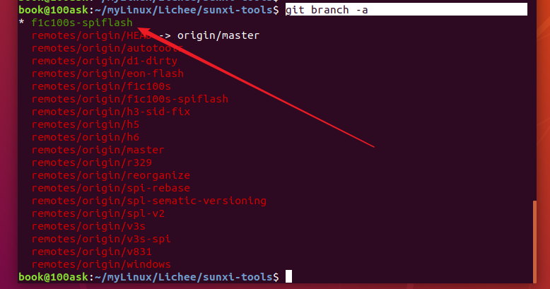
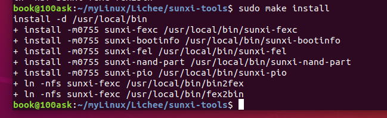

# 		1 荔枝派Nano硬件资源

## 1.1 产品信息介绍


​		荔枝派上的 spi flash 型号为 W25Q64FV，其容量为 64M。


## 1.2 参考开发资料

资料下载：http://dl.sipeed.com/LICHEE/Nano/

Nano的用户指南：[荔枝派Nano 全流程指南 — 荔枝派Nano 全流程指南 documentation (lichee.pro)](http://nano.lichee.pro/)

[Index(主页) / WhyCan Forum(哇酷开发者社区)](https://whycan.com/)

荔枝派Nano的资料下载

[Lichee Nano_免费高速下载|百度网盘-分享无限制 (baidu.com)](https://pan.baidu.com/s/1smzuGS9#list/path=%2F&parentPath=%2Fsharelink3658413294-628283680456500)


短路flash引脚，才插入USB到电脑

[[求助\] 无法识别新买的 lichee nano 板子 / 全志 SOC / WhyCan Forum(哇酷开发者社区)](https://whycan.com/t_4826.html)


这个 wiki 写的也比较好

[荔枝派Nano 全流程指南 - Sipeed Wiki](https://wiki.sipeed.com/soft/Lichee/zh/Nano-Doc-Backup/index.html)


## 1.3 说明

- **TWI接口**

TWI（Two—wire Serial Interface）接口是对I^2C总线接口的继承和发展，完全兼容I^2C总线，具有硬件实现简单、软件设计方便、运行可靠和成本低廉的优点。TWI由一根时钟线和一根传输数据线组成，以字节为单位进行传输。

- **TV-OUT**

TV-OUT是一类接口的总称。如早期常见的：vga、s端子，以及现在主流的如：hdmi、dvi、dp等。就是指显卡支持输出视频信号到电视端的接口。


## 1.4 全志芯片型号

- 全志F1C100S F1C200S，其中F1C100S内置32MB DDR1内存，F1C200S内置64MB DDR1内存

- 其实F1C100S F1C200S F1C500S F1C600 R6都是一个芯片，他们都是QFN88封装。

- 社区支持的linux，linux-4.15，社区大姥移植的uboot和内核，不支持硬解解码编码。

  其中荔枝派nano用的就是这个。


# 2 快速上手

## 2.1 材料准备

- **Nano 需要插卡启动（或者焊接spi flash），只插上 USB 基本是无反应，屏幕无输出状态，但可在不插卡无 flash 状态下通过 USB 启动 U-boot**

- **调试串口**

  Nano 的系统调试串口是 UART0 ，即板子丝印上的的 “U0：Tx Rx” 标识的两个引脚

- **材料准备**

1. 准备一个 usb转ttl 的工具 
2. 焊好排针 
3. 接好串口 
4. 准备一根 Micro-USB 数据线


## 2.2 编译、烧录Uboot

参考博客

【系列1】[(26条消息) ❏【F1C100S学习】_Yfw的博客-CSDN博客](https://blog.csdn.net/u012577474/category_9354395.html)

[(26条消息) 荔枝派nano上手笔记（一）移植Uboot_Yfw的博客-CSDN博客_荔枝派nano](https://blog.csdn.net/u012577474/article/details/100877824)

【系列2】

[(26条消息) lichee nano 荔枝派入门——上手_望星亭-CSDN博客_lichee nano](https://blog.csdn.net/u011847345/article/details/110727323)

- 最小系统只需要供电电路、SPI Flash、主芯片F1C100S即可，内置32M的DDR1无需外部RAM芯片


【系列3】这个最详细

[荔枝派nano f1c100s 开发板入坑记录 / 全志 SOC / WhyCan Forum(哇酷开发者社区)](https://whycan.com/t_1623.html)


### 2.2.1 安装交叉编译工具链

#### 2.2.1.1 方法介绍

```shell
# 此处为获取7.2.1版本，您可获取其他版本或者通过链接直接下载
wget http://releases.linaro.org/components/toolchain/binaries/7.2-2017.11/arm-linux-gnueabi/gcc-linaro-7.2.1-2017.11-x86_64_arm-linux-gnueabi.tar.xz

tar -vxJf gcc-linaro-7.2.1-2017.11-x86_64_arm-linux-gnueabi.tar.xz

sudo cp -r ./gcc-linaro-7.2.1-2017.11-x86_64_arm-linux-gnueabi /opt/

sudo vim /etc/bash.bashrc

# 在文件末尾 添加以下内容
PATH="$PATH:/opt/gcc-linaro-7.2.1-2017.11-x86_64_arm-linux-gnueabi/bin"
# 添加完毕

# 使路径生效
source /etc/bash.bashrc
```

此时可用 `arm-linux-gnueabi-gcc -v` 进行测试；若普通用户状态下没有成功，通过 `sudo su` 切换到root用户再尝试；


#### 2.2.1.2 实际操作

**【实际操作】**

- 在unbuntu中先运行

```c
wget http://releases.linaro.org/components/toolchain/binaries/7.2-2017.11/arm-linux-gnueabi/gcc-linaro-7.2.1-2017.11-x86_64_arm-linux-gnueabi.tar.xz
```


得到下面的交叉编译工具链


- 解压该工具链

```c
tar -vxJf gcc-linaro-7.2.1-2017.11-x86_64_arm-linux-gnueabi.tar.xz
```


- 可以按照wiki介绍拷贝交叉编译工具链到 /opt 目录下，也可以自己指定：

  可以把解压出来后的交叉编译工具链保留在这个文件夹，然后修改用户目录下的环境变量

  ```c
  gedit ~/.bashrc
  ```

  然后在末尾添加交叉编译工具链的路径，然后更新配置文件

  ```c
  source ~/.bashrc
  ```


**也可以每次需要编译的时候，临时指定编译工具链，为了避免较多的板子工具链冲突，就采用这种临时的方法**

```c
# this is for Lichee Pi
export ARCH=arm
export CROSS_COMPILE=arm-linux-gnueabi-
export PATH=$PATH:/home/book/myLinux/Lichee/gcc-linaro-7.2.1-2017.11-x86_64_arm-linux-gnueabi/bin
```


`arm-linux-gnueabi-gcc -v `    查看是否临时失效


### 2.2.2 编译Uboot

#### 2.2.2.1 方法介绍

从github上拉取对 Nano 进行了适配的 u-boot：

```shell
sudo apt-get install git
git clone https://github.com/Lichee-Pi/u-boot.git
cd u-boot

# 查看分支
git branch -a
# 切换到 Nano 分支
git checkout nano-v2018.01
```

u-boot 对于新手来说目录层级稍显复杂，您可参考下表进行快速的熟悉和目标文件定位（搬运并修改自 荔枝派One）

```c
.
├── api             //封装一些平台无关的操作，如字符串打印，显示，网络，内存
├── arch            //以平台架构区分
│   ├──arm
│   │   └──cpu
│   │   │   └──arm926ejs
│   │   │   │   └──sunxi   //cpu相关的一些操作，如定时器读取
│   │   │   │   │   └──u-boot-spl.lds  //spl的放置方法
│   │   └──dts
│   │   │   └──suniv-f1c100s-licheepi-nano.dts   // f1c100s芯片的一些配置
│   │   │   └──suniv-f1c100s-licheepi-nano.dtb
│   │   │   └──suniv-f1c100s.dtsi
│   │   │   └──suniv.dtsi
│   │   └──lib      //一些库文件
│   │   └──mach-sunxi
│   │   │   └──board.c          //board_init_f
│   │   │   └──dram_sun4i.c     //ddr的操作，复位，时钟，延时，odt，etc.
│   │   │   └──dram_helpers.c   //ddr的设置及读写测试
├── board
│   ├──sunxi
│   │   └──board.c              //sunxi_board_init 入口
│   │   └──dram_suniv.c        //DRAM的一些默认参数
├── cmd             //Uboot命令行的一些命令
├── common          //含spl
├── configs         //menuconfig里的默认配置,比如各类驱动适配
│   ├── licheepi_nano_defconfig
│   ├── licheepi_nano_spiflash_defconfig
├── disk            //硬盘分区的驱动
├── doc
├── drivers         //外设驱动
├── dts
├── examples
├── fs              //多种文件系统
├── include
│   ├──configs
│   │   └──sunxi_common.h   //预配置的参数，如串口号等
│   │   └──suniv.h
├── lib             //加密压缩等算法
├── net             //nfs,tftp等网络协议
├── post
├── scripts
```

了解u-boot大致结构后，我们就可以开始尝试编译了；

```shell
# 此处告知make采用arm-linux-gnueabi下的所有交叉编译工具，目标架构为Arm，设定各项默认配置为 nano 的spi-flash支持版
make ARCH=arm CROSS_COMPILE=arm-linux-gnueabi- licheepi_nano_spiflash_defconfig

# 若不带spi-flash的板子，请换成 licheepi_nano_defconfig

# 进行可视化配置
make ARCH=arm menuconfig
```

若要在套餐中附带的LCD上输出显示，请通过在可视化配置中配置下面内容：

ARM architecture ‣ Enable graphical uboot console on HDMI, LCD or VGA 为 **Y**

接着配置同级的 **LCD panel timing details** 为：

> x:800,y:480,depth:18,pclk_khz:33000,le:87,ri:40,up:31,lo:13,hs:1,vs:1,sync:3,vmode:0
>
> 注：此块屏为为 800 * 480 规格，如为 480 * 272 请尝试如下配置 x:480,y:272,depth:18,pclk_khz:10000,le:42,ri:8,up:11,lo:4,hs:1,vs:1,sync:3,vmode:0

并将 **LCD panel backlight pwm pin** 设为：

> PE6 （查自 Nano 原理图）


开始编译Uboot

```shell
# 开始编译
make ARCH=arm CROSS_COMPILE=arm-linux-gnueabi- -j8
```

编译完成后，可一看到目录下多了一堆以u-boot带头的文件，我们只需取 **u-boot-sunxi-with-spl.bin** 即可。


#### 2.2.2.2 实际操作

- 先在Ubuntu上安装 git 工具

```c
sudo apt-get install git
```

​		显示之前已经安装。


- 下载荔枝派官方适配好的Uboot

  在Ubuntu中使用 git 工具拉取的时候显示失败，可能是访问 github 网络不行


​		网上找到解决方法：**关闭命令行，重新打开，找到正确的文件路径 ，输入正确的命令 ！**

​		再次打开终端，输入 `git clone https://github.com/Lichee-Pi/u-boot.git`   ，拉取成功


		进入 u-boot目录，查看分支  `git branch -a`


​		切换分支   `git checkout nano-v2018.01`


- 开始编译官方的 u-boot

  编译之前先备份一份  `cp u-boot/ u-boot.bak -r`


​		使用临时的交叉编译工具链，在本终端运行下面指令

```c
export ARCH=arm
export CROSS_COMPILE=arm-linux-gnueabi-
export PATH=$PATH:/home/book/myLinux/Lichee/gcc-linaro-7.2.1-2017.11-x86_64_arm-linux-gnueabi/bin
```

​		查看一下是否生效，`arm-linux-gnueabi-gcc -v`


​		使用默认的配置文件配置一下，配置结果保存在 .config 中。

​		因为荔枝派 nano 已经焊上了 spi flash，所以这里选择 spiflash 的配置文件进行配置。

`make ARCH=arm CROSS_COMPILE=arm-linux-gnueabi- licheepi_nano_spiflash_defconfig`


​		如果已经指定了交叉编译工具链，简化命令也可以


​		若要在套餐中附带的LCD上输出显示，需要在可视化界面中进行配置		

​		打开可视化配置界面，配置三个地方  `make ARCH=arm menuconfig`


​		保存设置，退出。


​		开始编译 u-boot

```c
make ARCH=arm CROSS_COMPILE=arm-linux-gnueabi- -j8
```

​		编译一半报错了


```shell
unable to execute 'swig': No such file or directory
error: command 'swig' failed with exit status 1
scripts/dtc/pylibfdt/Makefile:26: recipe for target 'scripts/dtc/pylibfdt/_libfdt.so' failed
make[3]: *** [scripts/dtc/pylibfdt/_libfdt.so] Error 1
scripts/Makefile.build:425: recipe for target 'scripts/dtc/pylibfdt' failed
make[2]: *** [scripts/dtc/pylibfdt] Error 2
make[2]: *** Waiting for unfinished jobs....
  CHK     include/config.h
  CFG     u-boot.cfg
scripts/Makefile.build:425: recipe for target 'scripts/dtc' failed
make[1]: *** [scripts/dtc] Error 2
Makefile:491: recipe for target 'scripts' failed
make: *** [scripts] Error 2
make: *** Waiting for unfinished jobs....
  UPD     include/config/uboot.release
```

​		百度搜索错误 unable to execute 'swig': No such file or directory

​		找到下面答案，就是安装这个工具就行：`sudo apt install swig`

[(26条消息) 【问题解决】报错：unable to execute ‘swig‘: No such file or directory_丨晋丨-CSDN博客](https://blog.csdn.net/p1279030826/article/details/112912011)


​		接着编译 u-boot，这次编译成功。

```c
make ARCH=arm CROSS_COMPILE=arm-linux-gnueabi- -j8
```




​		编译完成后，可一看到目录下多了一堆以u-boot带头的文件，我们只需取 **u-boot-sunxi-with-spl.bin** 即可。


### 2.2.3 下载工具 sunxi-tools 安装

#### 2.2.3.1 方法介绍

在食用前，我们仍需要一个适配 Nano 的下载工具;

```shell
git clone -b f1c100s-spiflash https://github.com/Icenowy/sunxi-tools.git
cd sunxi-tools
make && sudo make install
```

如果出现：*fel_lib.c:26:20: fatal error: libusb.h: No such file or directory*，那需要安装libusb：

```shell
sudo apt-get install libusb-1.0-0-dev
```

准备完软件，可以准备一下硬件：串口默认为 **UART0**


#### 2.2.3.2 实际操作

- 克隆一个下载工具


```c
// -b f1c100s-spiflash 的意思是在克隆下来的同时，切换分支到这个上面
git clone -b f1c100s-spiflash https://github.com/Icenowy/sunxi-tools.git
```

​		又是显示克隆失败。


​		先在这个目录中 `git init`，关掉这个终端，重新打开这个终端，再次克隆就成功了。


​		工具有了


​		查看一下分支，`git branch -a`，确实是上面克隆时候指定的分支。



​		直接make编译这个工具，报错


​		安装这个库，`sudo apt-get install libusb-1.0-0-dev`


​		再次 make，可以忽略下面的提示。


​		安装，`sudo make install`



​		测试一下工具是否安装成功

	

​		准备完软件，可以准备一下硬件:) 串口默认为 **UART0**


### 2.2.4 烧录Uboot

#### 2.2.4.1 方法介绍

**不插卡上电~**

​		新到的一片 Nano ，基本上是上电无反应的，LCD亮但无内容，此时 Nano 自动进入fel下载模式，可以通过命令 `sudo sunxi-fel ver` 来确认有无成功进入fel模式。

​		此时有**两种方式**进行程序下载：

```shell
# 1.以 uboot file-with-spl形式进行（单次运行，测试时个人推荐）
sunxi-fel uboot /your/path/to/u-boot-sunxi-with-spl.bin  # 请自行修改到本机地址

# 2.烧进 spi-flash （开机自启）
sunxi-fel -p spiflash-write 0 /your/path/to/u-boot-sunxi-with-spl.bin
# note: 重新烧录或重进fel模式时，请在上电时拉低SPI flash 的 CS引脚
```

​		也就是说在烧录Uboot到spi flash里面的时候，板子要是处于 fel模式才行。如果烧录了自启动的模式，则每次开机就直接运行spi flash里面的 Uboot了，所以要重新让板子处于 fel模式，短接 spi flash 的 cs引脚到地，就是不让SOC可以片选到 spi flash。


#### 2.2.4.2 实际操作

这里是使用 2.2.3 效解中安装好的 sunxi-tools 工具来给荔枝派烧录 Uboot 的，所以要确保上面的正确安装了 sunxi-tools 工具。

- 接线说明

  - USB数据线连接荔枝派的USB口，然后USB先插入电脑的USB口，虚拟机识别出这个USB设备之后，将这个USB设备连接到Ubuntu上，dmesg可以看到识别到 USB设备了。

    

  - 然后使用 TTL转USB模块 把荔枝派的串口0连接到笔记本的USB口上，并且接入 windows系统中，打开 mobaXterm串口工具，设置波特率为 115200

- 按照上面的过程接好线之后，串口没有打印信息输出，此时的荔枝派应该是自动进入了 **fel 下载模式了**

- 在ubuntu中使用 sunxi-fel 工具给荔枝派烧录 Uboot

  运行 `sudo sunxi-fel ver` ，检查是否识别到荔枝派了，输出下面的信息说明一切正常。


```c
book@100ask:~/myLinux/Lichee/sunxi-tools$ sudo sunxi-fel ver
[sudo] password for book: 
AWUSBFEX soc=00001663(F1C100s) 00000001 ver=0001 44 08 scratchpad=00007e00 00000000 00000000
```

​		开始烧录在 2.2.2节中编译好的 uboot 文件，也就是  `u-boot-sunxi-with-spl.bin`

​		使用 `sunxi-fel uboot ./u-boot/u-boot-sunxi-with-spl.bin`  来烧录，烧录成功。

```shell
book@100ask:~/myLinux/Lichee$ sudo sunxi-fel uboot ./u-boot/u-boot-sunxi-with-spl.bin
```

​		注意使用 sunxi-fel 要 sudo 权限，才能访问到一些 USB设备


​		sudo 就成功了。


​		烧录成功的同时，串口马上就有信息输出了


```shell
U-Boot SPL 2018.01-05679-g013ca457fd (Feb 22 2022 - 21:41:39)
DRAM: 32 MiB
Trying to boot from FEL


U-Boot 2018.01-05679-g013ca457fd (Feb 22 2022 - 21:41:39 +0800) Allwinner Technology

CPU:   Allwinner F Series (SUNIV)
Model: Lichee Pi Nano
DRAM:  32 MiB
MMC:   SUNXI SD/MMC: 0
SF: Detected w25q64cv with page size 256 Bytes, erase size 4 KiB, total 8 MiB
*** Warning - bad CRC, using default environment

Setting up a 800x480 lcd console (overscan 0x0)
In:    serial@1c25000
Out:   serial@1c25000
Err:   serial@1c25000
Net:   No ethernet found.
starting USB...
No controllers found
Hit any key to stop autoboot:  0
Card did not respond to voltage select!
mmc_init: -95, time 23
starting USB...
No controllers found
USB is stopped. Please issue 'usb start' first.
starting USB...
No controllers found
No ethernet found.
missing environment variable: pxeuuid
missing environment variable: bootfile
Retrieving file: pxelinux.cfg/00000000
No ethernet found.
missing environment variable: bootfile
Retrieving file: pxelinux.cfg/0000000
No ethernet found.
missing environment variable: bootfile
Retrieving file: pxelinux.cfg/000000
No ethernet found.
missing environment variable: bootfile
Retrieving file: pxelinux.cfg/00000
No ethernet found.
missing environment variable: bootfile
Retrieving file: pxelinux.cfg/0000
No ethernet found.
missing environment variable: bootfile
Retrieving file: pxelinux.cfg/000
No ethernet found.
missing environment variable: bootfile
Retrieving file: pxelinux.cfg/00
No ethernet found.
missing environment variable: bootfile
Retrieving file: pxelinux.cfg/0
No ethernet found.
missing environment variable: bootfile
Retrieving file: pxelinux.cfg/default-arm-sunxi
No ethernet found.
missing environment variable: bootfile
Retrieving file: pxelinux.cfg/default-arm
No ethernet found.
missing environment variable: bootfile
Retrieving file: pxelinux.cfg/default
No ethernet found.
Config file not found
starting USB...
No controllers found
No ethernet found.
No ethernet found.
=>
```


- 简单测试一下 uboot 的终端模式

  - printenv 输出环境变量

    

  - bdinfo 输出板子各种信息


**注意：**这里采用的是**单次运行的烧录模式**，重新上电就会失效，在个人测试的时候使用比较合适。


- 真正烧录自启动模式使用下面的命令

```shell
# 2.烧进 spi-flash （开机自启）
sunxi-fel -p spiflash-write 0 /your/path/to/u-boot-sunxi-with-spl.bin

# note: 重新烧录或重进fel模式时，请在上电时拉低SPI flash 的 CS引脚
```

​		也就是说在烧录Uboot到spi flash里面的时候，板子要是处于 fel模式才行。如果烧录了自启动的模式，则每次开机就直接运行spi flash里面的 Uboot了，所以要重新让板子处于 fel模式，短接 spi flash 的 cs引脚到地，就是不让SOC可以片选到 spi flash。


## 2.3 烧录官方的内核和系统

### 2.3.1 在TF卡上构建系统

#### 2.3.1.1 方法介绍

在前文我们已经成功构建了 bootloader，我们接下来**需要放进TF卡的内容**有：

> 第一分区：

- boot.scr
- zImage
- suniv-f1c100s-licheepi-nano.dtb


> 第二分区：

- 根文件系统内容


在TF卡上构建系统之前，我们需要将TF卡进行分区与格式化；

```shell
sudo fdisk -l     # 首先查看电脑上已插入的TF卡的设备号
sudo umount /dev/sdXx # 若自动挂载了TF设备，请先卸载
sudo fdisk /dev/sdX   # 进行分区操作
# 若已存分区即按 d 删除各个分区
# 通过 n 新建分区，第一分区暂且申请为32M(足够大了...)，剩下的空间都给第二分区
# w 保存写入并退出
sudo mkfs.vfat /dev/sdX1 # 将第一分区格式化成FAT
sudo mkfs.ext4 /dev/sdX2 # 将第一分区格式化成EXT4
```


> Tip
>
> Nano一键快速烧录镜像包地址为： https://pan.baidu.com/s/1smzuGS9 ，便于快速验证，无需分区操作 …

后文 [一键烧录及脚本使用说明](http://nano.lichee.pro/build_sys/onekey.html) 将对各部分内容的构建进行详细描述；


#### 2.3.1.2 实际操作

- 在ubuntu中对 TF 卡进行分区

  首先将 TF通过读卡器连接到 Ubuntu 中


​		`sudo fdisk -l`     # 首先查看电脑上已插入的TF卡的设备号

​		可以看到 TF 卡原来有一个分区，sdb1，显示了它的信息。


​		`ls /dev/sdb`  自动补全，可以看到 TF 卡被当作磁盘自动挂载了


​		`sudo umount /dev/sdb1`    # 若自动挂载了TF设备，请先卸载


​		不确定是否成功，可以再执行一遍，显示这个就是卸载成功了


​		`sudo fdisk /dev/sdb`   # 进行分区操作

​		下面是进入了分区终端模式，


​		下面这个是参考方法

```shell
# 若已存分区即按 d 删除各个分区
# 通过 n 新建分区（分区操作：起始扇区默认就好直接回车，分区大小输入“+32M”按回车），第一分区暂且申请为32M(足够大了…)，剩下的空间都给第二分区
# w 保存写入并退出
sudo mkfs.vfat /dev/sdX1 # 将第一分区格式化成FAT
sudo mkfs.ext4 /dev/sdX2 # 将第一分区格式化成EXT4

sudo mkfs.vfat /dev/sdb1
sudo mkfs.ext4 /dev/sdb2
```

​		介绍一下fdisk

```shell
fdisk # 创建分区介绍               注意：下面的 sdX 表示 sdb    ；     sdXx表示sdb1

# （1）列出所有分区
sudo fdisk -l

# （2）进入fdisk命令界面准备格式化设备sdc
sudo fdisk /dev/sdX

# （3）在fdisk界面输入L列出所有命令帮助

# （4）在fdisk界面输入d依次删除原有分区，输入一次删除一个分区

# （5）在fdisk界面输入w写入数据，至此完成删除  （在每次操作之后都输入w写入，才真正起作用？）

# （6）在fdisk界面输入n创建新分区
#          输入p创建逻辑primary分区，默认创建为primary分区
#          输入e创建为扩展分区，分区号选择使用默认值即可
# （7）再输入n继续创建分区

# （8）在fdisk界面输入t更改分区类型，进入更改分区界面后
#               输入c表示创建为fat分区
#               输入83创建为ext4分区
#               输入L查看所有分区类型号

# （9）输入w完成所有分区保存
#     输入 q 不保存退出（如果不想保存上面的操作的话）

# （10）退出至控制台输入sudo mkfs.vfat /dev/sdx1格式化第一个分区
#       就是之前设置为c类型的分区，即保存linux启动文件的分区

# （11）控制台输入sudo mkfs.ext4 /dev/sdx2格式化第二个分区
#       即用作根文件系统的分区。格式化需要一段时间。
```

​		开始实际操作

​		`sudo fdisk /dev/sdb` 进入磁盘终端操作模式

​		使用 d 命令删除分区


​		 `sudo fdisk -l` 这是没分区之前的 TF 信息，有一个分区 sdb1


​		`sudo fdisk -l` 这是分区之后的 TF 信息，原来的分区 sdb1 已经没有了


​		创建分区1

```shell
book@100ask:~/myLinux/Lichee$ sudo fdisk /dev/sdb

Welcome to fdisk (util-linux 2.31.1).
Changes will remain in memory only, until you decide to write them.
Be careful before using the write command.


Command (m for help): n
Partition type
   p   primary (0 primary, 0 extended, 4 free)
   e   extended (container for logical partitions)
Select (default p): 

Using default response p.
Partition number (1-4, default 1): 
First sector (2048-62333951, default 2048): +32M
Value out of range.
First sector (2048-62333951, default 2048): 
Last sector, +sectors or +size{K,M,G,T,P} (2048-62333951, default 62333951): +32M

Created a new partition 1 of type 'Linux' and of size 32 MiB.
```


​		输入 p 可以查看刚刚分区好的情况


​		创建分区2


​		输入 p 可以查看刚刚分区好的情况	


​		最后记得写入 w 保存修改


​		`sudo fdisk -l`


​		上面创建好的分区都是 Linux格式的，需要格式化这两个分区为 FAT格式和 EXT4 格式

```shell
sudo mkfs.vfat /dev/sdX1 # 将第一分区格式化成FAT     本系统的 sdX1 是 sdb1
sudo mkfs.ext4 /dev/sdX2 # 将第一分区格式化成EXT4    本系统的 sdX2 是 sdb2
```


​		分区操作这里完成了。


​		说明：

​		（1）boot.scr脚本是用来指定 bootargs启动参数的

​		（2）tf-zImage 是Linux内核镜像

​		（3）dtb 是设备树


​		说明：

​		（1）就是一个根文件系统


### 2.3.2 一键烧录及脚本说明

#### 2.3.2.1 方法介绍

> 材料准备：

内存卡+读卡器+荔枝派Nano+支持完整指令集的x86设备一台（电脑）


> 镜像下载地址：

https://pan.baidu.com/s/1smzuGS9


**一键烧录镜像命名规则**

xx_xxx_xxxx.***

xx:适用此镜像的pi的名称

xxx:这个镜像是下载到什么介质上

xxxx:这个镜像适用于什么分辨率的lcd上

***:bin一般是下载到flash上的，dd代表这个镜像使用dd打包。


​		荔枝派上的 spi flash 型号为 W25Q64FV，其容量为 64M。可以看到这里打包的 .bin都是 16M大小。

​		而TF卡有16G/32G，所以 .dd格式的文件可以大些，文件大小在 204M大小。


**有两种烧录方法，分别为烧录到 TF 卡和烧录到 spi flash** 

**Linux环境** -----------------------------------------------------------------------------

- **一键烧录镜像(Linux环境—TF卡启动)**

镜像包中的image文件夹下的dd文件，已包含了相应的**Bootloader**、**Kernel**、**文件系统**等等，只需简单两步即可完成烧录；

1. 插上tf卡后，命令行执行 `sudo fdisk -l` 查看tf卡盘号；
2. 执行 `sudo dd if=/path/to/your-dd-image of=/your/tf-card && sync` 即可完成烧录

我们所提供的dd一键镜像包为兼容低存储的tf卡，仅为根文件系统留下有限的空间，若您需要存储某些大文件，请参阅后文 [脚本使用](http://nano.lichee.pro/build_sys/onekey.html#脚本的使用)


- **一键烧录镜像(Linux环境—16M spi-flash 启动)**

在flash内容为空的情况下（fel模式下的一种情况）进行烧录时，通过micro-usb数据线将Nano与电脑连接，执行

```
sudo sunxi-fel -p spiflash-write 0 Your-Flash-BIN
```

若flash中已有系统，可通过：

1. 短接flash的 1、4 两脚，重新上电，上电后松开短接，即可重新进入fel模式，进行再次下载
2. 在启动到内核前，回车进入uboot，执行 `sf probe 0;sf erase 0 0x100000;reset`即可重新进入fel模式


**Windows环境** ---------------------------------------------------------------------------

- **一键烧录镜像(win环境—TF卡启动)**

使用软件 **win32disk** 进行一键烧录，可到 [此处](http://www.onlinedown.net/soft/110173.html) 下载;


#### 2.3.2.2 实际操作

- 采用 Linux环境下烧写到 TF 卡的操作

  **按照2.2节的说明烧录好了uboot（boot.scr脚本是用来指定 bootargs启动参数的）**

  **按照 2.3.1 节的说明将 TF创建2个分区**

  选择官方提供的打包好了的 .dd 文件

  

  拷贝 .dd 和 .bin 到ubuntu中

  

  烧录

  ```shell
  # dd：用指定大小的块拷贝一个文件，并在拷贝的同时进行指定的转换
  # 举例：
  # 将本地的/dev/hdb整盘备份到/dev/hdd
  # dd if=/dev/hdb of=/dev/hdd
  
  # sudo dd if=/path/to/your-dd-image of=/your/tf-card && sync
  
  # 烧录完成之后，使用 sync 进行同步
  sudo dd if=/home/book/myLinux/Lichee/pack/Nano_tf_800480.dd of=/dev/sdb && sync
  sudo dd if=/home/book/myLinux/LicheeZero/imgs/brmin_dd/lichee_zero-brmin_alpha.dd of=/dev/sdb && sync
  
  sudo dd if=./lichee_zero-brpy_alpha.dd of=/dev/sdb && sync
  ```
```
  

  
  

​	

​		取出 TF 卡，然后插入荔枝派中，直接插入 串口到Windows中，可以在 mobaxterm 上看到有信息输出

​		（1）应该是荔枝派上的 spi flash 中已经烧录了 uboot了

​		（2）然后 uboot 启动之后，会读取 boot.scr 脚本，然后会自动到 TF 卡中加载 Linux内核，

​                 最后挂载根文件系统


​		用户名是 root  密码是 licheepi

​		已经进入了系统


​		对应的 linux内核是：`Linux version 4.15.0-rc8-licheepi-nano+`


​		bootargs 的命令是：

​```shell
Kernel command line: console=tty0 console=ttyS0,115200 panic=5 rootwait root=/dev/mmcblk0p2 rw
# 在串口 ttyS0 输出，波特率是115200
# 在 tty0 屏幕输出
# 
```

​		简单查看文件系统的一些信息


机子系统充分得到初始化（ random: crng init done ）


# 3 编写第一个应用程序

## 3.1 交叉编译工具链

source insight 4.0 打开闪退问题，禁止联网就行了

```c
export ARCH=arm
export CROSS_COMPILE=arm-linux-gnueabi-
export PATH=$PATH:/home/book/myLinux/Lichee/gcc-linaro-7.2.1-2017.11-x86_64_arm-linux-gnueabi/bin
```


## 3.2 荔枝派文件传输

荔枝派Nano实现文件传输的方法主要有3种：

- F1C100S 芯片没有网络外设，可以使用 USB OTG 模拟成一个网口来使用？
- F1C100S 芯片中可以使用 SDIO-WIFI 模块，但是这样系统只能烧写到空间很小的 SPI flash 上了
- 官方的文件系统中已经默认安装了 ZModem 软件，可以通过串口与PC机的 MobaXterm 进行互传


**这里主要介绍如何使用方法3：ZModem 进行文件互传**

（1）启动ZModem软件的方法也非常简单，只需要在串口命令敲代码就行了：

```shell
# rz是让板子接收文件，-y是覆盖文件的后缀
rz -y
```

（2）ctrl + 鼠标右键，然后选择 Send file using Z-modem


（3）然后文件就开始上传到开发板上了


（4）下载开发板的文件到本地PC中

```shell
# sz是下载板子的文件到PC机器上，后面要紧跟着 文件名
sz helloword
```


​	**注意：**sz功能传输很容易失败，失败需要重新传输。


## 3.3 运行可执行程序

### 3.3.1 发生段错误

（1）查看文件的类型，是给 ARM 使用的


（2）使用 rz 传输过来，总是没有可执行权限，问题不大


（3）给予可执行权限 `chmod 777 helloword`


（4）运行发生**段错误**


【程序源码】

```c
// #include <stdio.h>

int main()
{
	// printf("hello world! \n");

	int a=0;
	int b=1;
	int c=a+b;

	return 0;
}
```

- 一开始怀疑是根文件系统中没有 c的动态库，但是把 <stdio.h> 注释掉，不调用任何库了还是一样。

- 百度查找资料，说是交叉编译工具链的问题，编译给 A7 而不是 ARM9 了。

  

【解决方法】用相同的交叉编译工具链编译内核和应用程序就可以了


# 4 编译、烧录Linux内核

## 4.1 主线Linux编译

### 4.1.1 方法介绍

**源码下载**

完整下载命令为：

> ```shell
> git clone https://github.com/Icenowy/linux.git
> ```

git拉取有时速度很慢，建议做如下配置：

> ```shell
> sudo vim /etc/hosts
> # 添加下面两行  (测试发现不太行，还是不要修改了)
> 192.30.253.112  github.com
> 151.101.73.194 github.global.ssl.fastly.net
> # 添加完成
> # 可自行通过dns检测网站检测github.global.ssl.fastly.net，更换为更快的ip地址
> ```

完整拉取linux极大，建议只拉取单层分支，减少等待时间：

> ```shell
> # 这个是只拉取 f1c100s-480272lcd-test 这个分支
> git clone --depth=1 -b f1c100s-480272lcd-test https://github.com/Icenowy/linux.git
> ```


**配置**

下载 [.config](http://dl.sipeed.com/LICHEE/Nano/SDK/config) 文件，放入源码主目录进行替换 (若下载时文件名有变，请重命名回 .config );


**进行编译**

> Tip
>
> 编译工具链为 arm-linux-gnueabi，工具链的安装请参考 uboot 编译部分
>
> 这么说编译内核使用的工具链和编译 uboot 的时候是一样的


```
make ARCH=arm menuconfig
make ARCH=arm CROSS_COMPILE=arm-linux-gnueabi- -j4    #请自行修改编译线程数
```

生成的 zImage 在 arch ‣ arm ‣ boot 目录下；将其放入第一分区。


### 4.1.2 实际操作

- 在ubuntu中下载适配于荔枝派的内核源码


​		多尝试几次才可以下载，然后卡在 50% 这里了，服了。


​		关掉，再次git，这次就很快下载完成了。


​		竟然不是一个压缩包，直接就是一个linux内核文件夹。


​		内核大小 1.1G，`du -sh`


​		查看分支是对的，`git branch -a`


- 下载 [.config](http://dl.sipeed.com/LICHEE/Nano/SDK/config) 文件，放入源码主目录进行替换 (若下载时文件名有变，请重命名回 .config );

  下载这个 config 文件之后，传入 ubuntu 刚刚 git 的 linux 内核中，注意需要把名字改为 .config


​		备份一个config ，然后更改名字改为 .config


- 编译 linux内核

  设置交叉编译工具链

  ```c
  export ARCH=arm
  export CROSS_COMPILE=arm-linux-gnueabi-
  export PATH=$PATH:/home/book/myLinux/Lichee/gcc-linaro-7.2.1-2017.11-x86_64_arm-linux-gnueabi/bin
  ```

  ```shell
  # make ARCH=arm menuconfig    # 这个应该不用，.config 都配置好了
  
  # 直接开始编译吧
  make ARCH=arm CROSS_COMPILE=arm-linux-gnueabi- -j4    #请自行修改编译线程数
  ```


​	编译过程中，遇到这个选项需要手动设置，可能是因为 .config 中没有指定，所以需要询问一下，这里先输入 y 

```c
Allwinner A10 SoCs SPI controller (SPI_SUN4I) [N/m/y/?] (NEW) y
```


【参考博客1】

[(26条消息) lichee nano 荔枝派入门——linux内核_望星亭-CSDN博客_lichee nano](https://blog.csdn.net/u011847345/article/details/110727606)


​		官方打包好的内核和文件系统，一键烧录到 荔枝派上，可以查看其使用的内核版本是 4.15.0


​		我们这节介绍的要编译的内核，查看其配置文件 .config ，也是 4.15.0 的，匹配


编译（还会生成一些必要文件）之后打包一份，传回 windows 系统构建 source insight 工程和编写代码参考。


这个流程很好

[荔枝派nano(f1c100s)的SPI-Flash系统编译创建全过程 / 全志 SOC / WhyCan Forum(哇酷开发者社区)](https://whycan.com/t_2179.html)


# N  制作根文件系统


根文件系统是不是和内核关系不大，对于每一个可以加载 linux内核的板子来说


[(26条消息) 荔枝派Nano根文件系统移植_Yfw的博客-CSDN博客](https://blog.csdn.net/u012577474/article/details/102930440)

【参考2】这篇使用 busybox常见的根文件系统

[(26条消息) 根文件系统构建_lengyuefeng212的博客-CSDN博客_根文件系统](https://blog.csdn.net/lengyuefeng212/article/details/119344282)


# N 编写第一个驱动


[全志点灯LED / 全志 SOC / WhyCan Forum(哇酷开发者社区)](https://whycan.com/t_7577.html)


[(26条消息) Nano之HelloWorld驱动 （学习如何单独编译.ko模块）_Yfw的博客-CSDN博客](https://blog.csdn.net/u012577474/article/details/102913573)


```c
export ARCH=arm
export CROSS_COMPILE=arm-linux-gnueabi-
export PATH=$PATH:/home/book/myLinux/Lichee/gcc-linaro-7.2.1-2017.11-x86_64_arm-linux-gnueabi/bin
```


