	荔枝各种派的下载资料汇总 [下载站 - Sipeed](http://cn.dl.sipeed.com/shareURL/LICHEE)

学习总wiki [Zero u-boot编译和使用指南 — Lichee zero 文档](http://zero.lichee.pro/贡献/article 4.html)


这边顺便贴上荔枝派官方网盘的链接：
https://pan.baidu.com/s/1x75Uqnxl6bmBCYDN3NUdJg 提取码：ohzx
其中在根目录下的gz文件是文件系统，dd_ing文件夹下的就都是dd镜像了


**说明**：设备树或者配置文件中，加 dock 后缀的表示这个是  **荔枝派Zero带底板**  的配置文件


# 0 Zero的一些特性

## 0.1 基础说明

- Zero的usb是OTG usb，既可以供电，又能通信（比如作为usb虚拟网口 [与电脑共享网络](http://bbs.ilichee.cc/t/tutorial-pc-share-network-to-zero-via-usb/55)）
- 推荐的联网方式是：[usb虚拟网口](http://bbs.ilichee.cc/t/tutorial-pc-share-network-to-zero-via-usb/55) 或者 [tf wifi](https://www.kancloud.cn/lichee/lpi0/327885) ；或者使用淘宝店里的 [usb转网口HUB](https://item.taobao.com/item.htm?id=538814529688) 。
- Zero毕竟是上G主频的Cortex-A7处理器，运行时温度在40~60℃
- Zero 运行Linux空载电流约100mA，满载电流约150~180mA，插上LCD电流约200~300mA。不插卡上电电流约50~60mA。


## 0.2 硬件参数

- **CPU：** 全志V3S， ARM Cortex-A7, 最高1.2GHz

- **内存：** 集成64MB DDR2

- > 存储：

  - 预留SOP8 SPI Flash焊盘（可定制贴片8~32MB SPI Nor Flash,128MB Nand Flash）;

  - 板载 半槽TF卡座，可TF启动。

- > 显示：

  通用 40P RGB LCD FPC座

  - 可直插常见的40P 4.3/5/7寸屏幕（板载背光驱动），通过转接板可插50P 7/9寸屏
  - 支持常见的272x480, 480x800,1024x600等分辨率
  - 板载电阻式触摸屏芯片，支持电阻屏板载RGB LED

- > 通信接口

  - SDIO x2，可搭配配套SDIO WiFi+BT 模块

  - SPI x1

  - I2C x2

  - UART x3

  - 100M Ether x1（含EPHY，所以不用外接PHY芯片了）

  - OTG USB x1

  - MIPI CSI x1（MIPI摄像头接口）

- > 其它接口

  - PWM x2（Up to 24MHz output frequency）
- LRADC x1（LRADC是用于按键应用的6位分辨率ADC，LRADC的工作频率可达250Hz，可以做模拟按键）
  
  - Speakerx2 + Mic x1
- DMA x 8（Flexible data width of 8/16/32 bits，内存<->内存，外设<->内存，内存<->外设）
  
- > 电气特性

  - Micro USB 5V供电； 2.54mm 插针 3.3V~5V供电； 1.27mm 邮票孔供电

  - 输出 3.3V 和 3.0V（AVCC），可选择输入RTC电压

  - 1GHz linux空载运行电流 90~100mA， 满载运行电流 ~180mA

  - 存储温度 -40~125℃，运行温度 -20~70℃


## 0.3 实物资源分布图


## 0.4 所有引脚说明

### 0.4.1 引脚功能框图


### 0.4.2 引脚号和引脚名


### 0.4.3 引脚功能和复用

- DRAM部分的引脚都没有使用，直接连接到电源上了
- **PB0~PB9**            （有复用）
- **PC0~PC3**            （有复用）
- **PE0~PE24**          （有复用）
- **PF0~PF6**            （有复用）
- **PG0~PG5**            （有复用）
- **RTC外设引脚**
- **系统晶振引脚**
- **USB外设引脚**
- **音频编解码引脚**
- **网口引脚**
- **LRADC引脚**
- **MIPI CSI 引脚**
- 电源引脚


**GPIO的复用表如下**


PG_EINTx是中断引脚


### 0.4.4 学习研究点

**这些模块的功能，都会在设备树中有所体现，所以要注意设备树**


- PF和PG都用来当作SDIO功能，一个系统盘，一个WIFI网卡，就用掉了下面的这些引脚了

  型号 UART0的复用比较灵活，可以使用上面的  PB8和PB9来实现

  WIFI网卡的引脚只是占用了部分中断引脚，用来做WIFI功能比较好玩：实现WIFI功能

- LCD功能，PE0~PE19，PE23~PE24：实现fb编程

- PB4的PWM0功能作为LCD的背光引脚：实现PWM
- PC0~PC3作为SPI功能：接一个SPI模块
- PB6~PB7作为IIC功能：接一个IIC模块
- PB0~PB2作为串口2：接GPS模块
- PB2~PB3作为中断引脚，可以测试一些需要中断的模块


- MIPI摄像头
- LRADC引脚：ADC和按键实验
- USB-OTG：当作虚拟网口，或者接上USB摄像头
- 麦克风和耳机：实现录音和播放（buildroot编译这些库来实现）


- PG0,1,2 配置为wifi功能，就要在设备树中注释掉 彩色灯的节点


### 0.4.5 引脚的作用


## 0.5 读芯片手册有感

### 0.5.1 支持浮点运算

VFPv4 Floating Point Unit  

### 0.5.2 片内boom


### 0.5.3 按键使用的ADC


### 0.5.4 显示引擎


### 0.5.5 视频引擎


还有MIPI接口


### 0.5.6 声音引擎


### 0.5.7 USB 2.0 OTG

One USB 2.0 OTG controller with integrated PHY  


### 0.5.8 网口


### 0.5.9 串口


### 0.5.10 SPI


### 0.5.11 DDR2


## 0.6 功能框图


# 1 下载、编译主线Uboot（wiki）

## 1.1 下载配置交叉编译工具链

- 下载地址：网盘地址：http://pan.baidu.com/s/1hsf22fq

  下载之后传输到 ubuntu 中

  

  解压

  ```shell
  tar xvf gcc-linaro-6.3.1-2017.02-x86_64_arm-linux-gnueabihf.tar.xz 
  ```

  

  

  这里不把交叉编译工具链写死在 `~/.bashrc` 中，而是需要使用的时候临时配置

  ```shell
  # 注意 cotex-A7 的工具链后面又 hf
  export ARCH=arm
  export CROSS_COMPILE=arm-linux-gnueabihf-
  export PATH=$PATH:/home/book/myLinux/LicheeZero/gcc-linaro-6.3.1-2017.02-x86_64_arm-linux-gnueabihf/bin
  ```

  查看临时配置的工具链是否起效		`arm-linux-gnueabihf-gcc -v`


- 安装设备树编译器

  ```shell
  # dtc：device tree compiler 设备树编译器，dtb文件就是通过dtc将dts文件编译而成的。个人感觉可以类比C 语言的编译。
  sudo apt-get install device-tree-compiler
  ```

  


## 1.2 下载编译uboot 

【参考博客1】

[Zero u-boot编译和使用指南 — Lichee zero 文档](http://zero.lichee.pro/贡献/article 4.html)

【参考博客2】

[(26条消息) 1.荔枝派 zero(全志V3S)-编译及SD烧录_Jun626的博客-CSDN博客_全志v3s](https://blog.csdn.net/Jun626/article/details/90082000)


- 下载uboot，这里使用第一个链接，-b 指定下载分支 v3s-current

  ```shell
  git clone https://github.com/Lichee-Pi/u-boot.git -b v3s-current
  #or git clone https://github.com/Lichee-Pi/u-boot.git -b v3s-spi-experimental
  ```

  git下载的时候，经常会失败，因为访问 github 会有时候不好，多尝试几次就可以下载了

  好慢好慢，自己复制链接到 windows 中切换分支下载吧

  

  切换分支下载

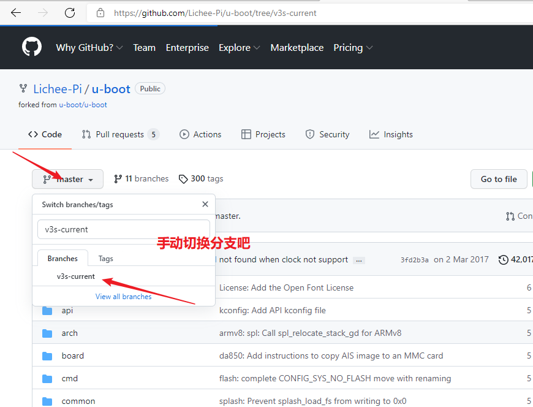

​		

​		解压

​		`unzip u-boot-3s-current.zip`

​		


- 进入 uboot目录

  首先按照 1.1 节中总结的零时配置交叉编译工具链命令配置工具链

  交叉编译

  ```shell
  cd u-boot
  
  # 这里选择适配 800x480屏幕的配置文件来配置uboot
  make ARCH=arm CROSS_COMPILE=arm-linux-gnueabihf- LicheePi_Zero_800x480LCD_defconfig
  #or make ARCH=arm CROSS_COMPILE=arm-linux-gnueabihf- LicheePi_Zero_480x272LCD_defconfig
  #or make ARCH=arm CROSS_COMPILE=arm-linux-gnueabihf- LicheePi_Zero_defconfig
  
  # 图形化界面设置
  make ARCH=arm menuconfig 
  time make ARCH=arm CROSS_COMPILE=arm-linux-gnueabihf- 2>&1 | tee build.log
  
  #2>&1 | tee build.log是把标准错误输出到标准输出和保存到文件tee build.log 中
  ```

  

  

  

  

  上面使用默认的配置文件配置了 .config，然后再执行 `make ARCH=arm menuconfig` 

  其实就是读取 .config 配置文件的结果，可以看看里面都配置了哪些东西

  

  LCD配置

  

  时钟频率配置    1G频率，666

  

  DDR配置

  

  开机延时配置

  

  SPL配置

  

  

  uboot的目录如下

  其中 configs 目录中放着各种配置文件，里面就有荔枝派的配置文件

  ```shell
  # 根据屏幕来选择，配置文件可以实现对uboot的裁剪和适配
  LicheePi_Zero_800x480LCD_defconfig
  LicheePi_Zero480x272LCD_defconfig
  LicheePi_Zero_defconfig
  ```

  ```shell
  ├── api                存放uboot提供的API接口函数
  ├── arch               平台相关的部分我们只需要关心这个目录下的ARM文件夹
  │   ├──arm
  │   │   └──cpu
  │   │   │   └──armv7
  │   │   └──dts
  │   │   │   └──*.dts 存放设备的dts,也就是设备配置相关的引脚信息
  ├── board              对于不同的平台的开发板对应的代码
  ├── cmd                顾名思义，大部分的命令的实现都在这个文件夹下面。
  ├── common             公共的代码
  ├── configs            各个板子的对应的配置文件都在里面，我们的Lichee配置也在里面
  ├── disk               对磁盘的一些操作都在这个文件夹里面，例如分区等。
  ├── doc                参考文档，这里面有很多跟平台等相关的使用文档。
  ├── drivers            各式各样的驱动文件都在这里面
  ├── dts                一种树形结构（device tree）这个应该是uboot新的语法
  ├── examples           官方给出的一些样例程序
  ├── fs                 文件系统，uboot会用到的一些文件系统
  ├── include            头文件，所有的头文件都在这个文件夹下面
  ├── lib                一些常用的库文件在这个文件夹下面
  ├── Licenses           这个其实跟编译无关了，就是一些license的声明
  ├── net                网络相关的，需要用的小型网络协议栈
  ├── post              上电自检程序
  ├── scripts           编译脚本和Makefile文件
  ├── spl               second program loader，即相当于二级uboot启动。
  ├── test              小型的单元测试程序。
  └── tools             里面有很多uboot常用的工具。
  ```


## 1.3 烧录uboot


### 1.3.1 使用 sunxi-fel 工具烧写


```shell
# 查看是否监测到 usb 设备
sudo sunxi-fel ver

# .bin 文件的路径根据实际情况确定
sudo sunxi-fel uboot u-boot-sunxi-with-spl.bin 
```


- 烧录 uboot

  

  【参考博客1】[(26条消息) lichee pi zero 荔枝派zero uboot编译 烧录_oshan2012的博客-CSDN博客](https://blog.csdn.net/oshan2012/article/details/113552039)

  

  编译完成后，在当前目录下生成了`u-boot-sunxi-with-spl.bin`，可以烧录TF卡到**8K偏移处**启动。

  ```c
  sudo dd if=u-boot-sunxi-with-spl.bin of=/dev/sdb bs=1024 seek=8
  ```

  荔枝派Zero的启动顺序：优先TF卡启动


## 1.4 dd烧录完整镜像

- 解压镜像，找到 .dd文件


```c
tar -jxvf brmin_dd.tar.bz2 
```


- TF卡格式化，并分区
- dd 镜像到 TF卡中
- 插卡然后启动，uboot会自动加载TF卡的内核和文件系统


# 2 下载、编译主线Kernel（wiki）

## 2.1 编译内核的交叉编译工具链

```shell
# 编译内核的工具链 和 前面编译 uboot 中的一样
export ARCH=arm
export CROSS_COMPILE=arm-linux-gnueabihf-
export PATH=$PATH:/home/book/myLinux/LicheeZero/gcc-linaro-6.3.1-2017.02-x86_64_arm-linux-gnueabihf/bin
```


## 2.2 下载主线Kernel

- 在Ubuntu中访问github总是失败，直接在windows下面下载

  ```c
  git clone https://github.com/Lichee-Pi/linux.git
  ```

  (默认是zero-4.10.y分支)


```shell
cd linux
make ARCH=arm licheepi_zero_defconfig
make ARCH=arm menuconfig   #add bluethooth, etc.
make ARCH=arm CROSS_COMPILE=arm-linux-gnueabihf- -j16
make ARCH=arm CROSS_COMPILE=arm-linux-gnueabihf- -j16 INSTALL_MOD_PATH=out modules
make ARCH=arm CROSS_COMPILE=arm-linux-gnueabihf- -j16 INSTALL_MOD_PATH=out modules_install
```

编译完成后，zImage在arch/arm/boot/下，驱动模块在out/下


- 查看内核printk等级设置

```shell
# 值越小等级越高
licheepi# cat /proc/sys/kernel/printk
7       4       1       7
```

其中第一个“4”表示内核打印函数printk的打印级别，只有级别比他高的信息才能在控制台上打印出来，既 0－3级别的信息

**修改打印**

```shell
echo “新的打印级别 4 1 7” >/proc/sys/kernel/printk
```

不够打印级别的信息会被写到日志中可通过dmesg 命令来查看

printk函数的使用

printk(打印级别 “要打印的信息”)

打印级别 既上面定义的几个宏


## 2.3 实际操作

【参考博客1】[(26条消息) 全志v3s学习笔记（5）——主线Linux编译与烧录_丨晋丨-CSDN博客_主线linux是什么](https://blog.csdn.net/p1279030826/article/details/113483775)

```shell
# 默认是zero-4.10.y分支：
git clone https://github.com/Lichee-Pi/linux.git

# 或者`zero-4.13.y`对网卡的支持更好
git clone -b zero-4.13.y https://github.com/Lichee-Pi/linux.git

# 或者使用最新的内核：
git clone -b zero-5.2.y https://github.com/Lichee-Pi/linux.git
```


### 2.3.1 下载内核源码和分析

- 下载解压内核


- 查看一下设备树在哪

```c
/home/book/myLinux/LicheeZero/kernel/linux-zero-4.10.y/arch/arm/boot/dts
```


​		设备树同级的Makefile


​		查看哪里用到了这个宏  CONFIG_MACH_SUN8I


​		内核到时候解析哪一个设备树文件，是在uboot的环境变量中指定使用哪一个设备树文件的


```shell
fdtfile=sun8i-v3s-licheepi-zero.dtb
```


把设备树信息列出来

```c
/dts-v1/;
#include "sun8i-v3s.dtsi"
#include "sunxi-common-regulators.dtsi"

/ {
	model = "Lichee Pi Zero";
	compatible = "licheepi,licheepi-zero", "allwinner,sun8i-v3s";

	aliases {
		serial0 = &uart0;      // 使用串口0作为终端输出
	};

	chosen {
		stdout-path = "serial0:115200n8";   // 使用串口0作为终端输出
	};
};

&mmc0 {
	pinctrl-0 = <&mmc0_pins_a>;
	pinctrl-names = "default";
	broken-cd;
	bus-width = <4>;
	vmmc-supply = <&reg_vcc3v3>;
	status = "okay";
};

&i2c0 {
	status = "okay";

	ns2009: ns2009@48 {
		compatible = "nsiway,ns2009";
		reg = <0x48>;
	};
};

&uart0 {
	pinctrl-0 = <&uart0_pins_a>;
	pinctrl-names = "default";
	status = "okay";
};

&usb_otg {
	dr_mode = "otg";
	status = "okay";
};

&usbphy {
	usb0_id_det-gpio = <&pio 5 6 GPIO_ACTIVE_HIGH>;
	status = "okay";
};
```

看到它包含了两个头文件，也找到它们

```c
#include <dt-bindings/clock/sun8i-v3s-ccu.h>
#include <dt-bindings/reset/sun8i-v3s-ccu.h>
#include <dt-bindings/interrupt-controller/arm-gic.h>
#include <dt-bindings/pinctrl/sun4i-a10.h>

/ {
	#address-cells = <1>;
	#size-cells = <1>;
	interrupt-parent = <&gic>;

	chosen {
		#address-cells = <1>;
		#size-cells = <1>;
		ranges;

		simplefb_lcd: framebuffer@0 {
			compatible = "allwinner,simple-framebuffer",
				     "simple-framebuffer";
			allwinner,pipeline = "de0-lcd0";
			clocks = <&ccu CLK_BUS_TCON0>, <&ccu CLK_BUS_DE>,
				 <&ccu CLK_DE>, <&ccu CLK_TCON0>;
			status = "disabled";
		};
	};

	cpus {
		#address-cells = <1>;
		#size-cells = <0>;

		cpu@0 {
			compatible = "arm,cortex-a7";
			device_type = "cpu";
			reg = <0>;
			clocks = <&ccu CLK_CPU>;
		};
	};

	timer {
		compatible = "arm,armv7-timer";
		interrupts = <GIC_PPI 13 (GIC_CPU_MASK_SIMPLE(4) | IRQ_TYPE_LEVEL_LOW)>,
			     <GIC_PPI 14 (GIC_CPU_MASK_SIMPLE(4) | IRQ_TYPE_LEVEL_LOW)>,
			     <GIC_PPI 11 (GIC_CPU_MASK_SIMPLE(4) | IRQ_TYPE_LEVEL_LOW)>,
			     <GIC_PPI 10 (GIC_CPU_MASK_SIMPLE(4) | IRQ_TYPE_LEVEL_LOW)>;
	};

	clocks {
		#address-cells = <1>;
		#size-cells = <1>;
		ranges;

		osc24M: osc24M_clk {
			#clock-cells = <0>;
			compatible = "fixed-clock";
			clock-frequency = <24000000>;
			clock-output-names = "osc24M";
		};

		osc32k: osc32k_clk {
			#clock-cells = <0>;
			compatible = "fixed-clock";
			clock-frequency = <32768>;
			clock-output-names = "osc32k";
		};
	};

    // 单个CPU核心，所以主要信息在这下面
	soc {
		compatible = "simple-bus";
		#address-cells = <1>;
		#size-cells = <1>;
		ranges;

		dma: dma-controller@01c02000 {
			compatible = "allwinner,sun8i-v3s-dma";
			reg = <0x01c02000 0x1000>;
			interrupts = <GIC_SPI 50 IRQ_TYPE_LEVEL_HIGH>;
			clocks = <&ccu CLK_BUS_DMA>;
			resets = <&ccu RST_BUS_DMA>;
			#dma-cells = <1>;
		};

		mmc0: mmc@01c0f000 {
			compatible = "allwinner,sun7i-a20-mmc";
			reg = <0x01c0f000 0x1000>;
			clocks = <&ccu CLK_BUS_MMC0>,
				 <&ccu CLK_MMC0>,
				 <&ccu CLK_MMC0_OUTPUT>,
				 <&ccu CLK_MMC0_SAMPLE>;
			clock-names = "ahb",
				      "mmc",
				      "output",
				      "sample";
			resets = <&ccu RST_BUS_MMC0>;
			reset-names = "ahb";
			interrupts = <GIC_SPI 60 IRQ_TYPE_LEVEL_HIGH>;
			status = "disabled";
			#address-cells = <1>;
			#size-cells = <0>;
		};

		mmc1: mmc@01c10000 {
			compatible = "allwinner,sun7i-a20-mmc";
			reg = <0x01c10000 0x1000>;
			clocks = <&ccu CLK_BUS_MMC1>,
				 <&ccu CLK_MMC1>,
				 <&ccu CLK_MMC1_OUTPUT>,
				 <&ccu CLK_MMC1_SAMPLE>;
			clock-names = "ahb",
				      "mmc",
				      "output",
				      "sample";
			resets = <&ccu RST_BUS_MMC1>;
			reset-names = "ahb";
			interrupts = <GIC_SPI 61 IRQ_TYPE_LEVEL_HIGH>;
			status = "disabled";
			#address-cells = <1>;
			#size-cells = <0>;
		};

		mmc2: mmc@01c11000 {
			compatible = "allwinner,sun7i-a20-mmc";
			reg = <0x01c11000 0x1000>;
			clocks = <&ccu CLK_BUS_MMC2>,
				 <&ccu CLK_MMC2>,
				 <&ccu CLK_MMC2_OUTPUT>,
				 <&ccu CLK_MMC2_SAMPLE>;
			clock-names = "ahb",
				      "mmc",
				      "output",
				      "sample";
			resets = <&ccu RST_BUS_MMC2>;
			reset-names = "ahb";
			interrupts = <GIC_SPI 62 IRQ_TYPE_LEVEL_HIGH>;
			status = "disabled";
			#address-cells = <1>;
			#size-cells = <0>;
		};

		usb_otg: usb@01c19000 {
			compatible = "allwinner,sun8i-h3-musb";
			reg = <0x01c19000 0x0400>;
			clocks = <&ccu CLK_BUS_OTG>;
			resets = <&ccu RST_BUS_OTG>;
			interrupts = <GIC_SPI 71 IRQ_TYPE_LEVEL_HIGH>;
			interrupt-names = "mc";
			phys = <&usbphy 0>;
			phy-names = "usb";
			extcon = <&usbphy 0>;
			status = "disabled";
		};

		usbphy: phy@01c19400 {
			compatible = "allwinner,sun8i-v3s-usb-phy";
			reg = <0x01c19400 0x2c>,
			      <0x01c1a800 0x4>;
			reg-names = "phy_ctrl",
				    "pmu0";
			clocks = <&ccu CLK_USB_PHY0>;
			clock-names = "usb0_phy";
			resets = <&ccu RST_USB_PHY0>;
			reset-names = "usb0_reset";
			status = "disabled";
			#phy-cells = <1>;
		};

		ccu: clock@01c20000 {
			compatible = "allwinner,sun8i-v3s-ccu";
			reg = <0x01c20000 0x400>;
			clocks = <&osc24M>, <&osc32k>;
			clock-names = "hosc", "losc";
			#clock-cells = <1>;
			#reset-cells = <1>;
		};

		rtc: rtc@01c20400 {
			compatible = "allwinner,sun6i-a31-rtc";
			reg = <0x01c20400 0x54>;
			interrupts = <GIC_SPI 40 IRQ_TYPE_LEVEL_HIGH>,
				     <GIC_SPI 41 IRQ_TYPE_LEVEL_HIGH>;
		};

		pio: pinctrl@01c20800 {
			compatible = "allwinner,sun8i-v3s-pinctrl";
			reg = <0x01c20800 0x400>;
			interrupts = <GIC_SPI 15 IRQ_TYPE_LEVEL_HIGH>,
				     <GIC_SPI 17 IRQ_TYPE_LEVEL_HIGH>;
			clocks = <&ccu CLK_BUS_PIO>, <&osc24M>, <&osc32k>;
			clock-names = "apb", "hosc", "losc";
			gpio-controller;
			#gpio-cells = <3>;
			interrupt-controller;
			#interrupt-cells = <3>;

			i2c0_pins: i2c0 {
				pins = "PB6", "PB7";
				function = "i2c0";
			};

			uart0_pins_a: uart0@0 {
				pins = "PB8", "PB9";
				function = "uart0";
				bias-pull-up;
			};

			mmc0_pins_a: mmc0@0 {
				pins = "PF0", "PF1", "PF2", "PF3",
				       "PF4", "PF5";
				function = "mmc0";
				drive-strength = <30>;
				bias-pull-up;
			};

			mmc1_pins: mmc1@0 {
				pins = "PG0", "PG1", "PG2", "PG3",
				       "PG4", "PG5";
				function = "mmc1";
				drive-strength = <30>;
				bias-pull-up;
			};

			spi0_pins: spi0 {
				allwinner,pins = "PC0", "PC1", "PC2", "PC3";
				allwinner,function = "spi0";
				allwinner,drive = <SUN4I_PINCTRL_10_MA>;
				allwinner,pull = <SUN4I_PINCTRL_NO_PULL>;
			};
		};

		timer@01c20c00 {
			compatible = "allwinner,sun4i-a10-timer";
			reg = <0x01c20c00 0xa0>;
			interrupts = <GIC_SPI 18 IRQ_TYPE_LEVEL_HIGH>,
				     <GIC_SPI 19 IRQ_TYPE_LEVEL_HIGH>;
			clocks = <&osc24M>;
		};

		wdt0: watchdog@01c20ca0 {
			compatible = "allwinner,sun6i-a31-wdt";
			reg = <0x01c20ca0 0x20>;
			interrupts = <GIC_SPI 25 IRQ_TYPE_LEVEL_HIGH>;
		};

		lradc: lradc@01c22800 {
			compatible = "allwinner,sun4i-a10-lradc-keys";
			reg = <0x01c22800 0x400>;
			interrupts = <GIC_SPI 30 IRQ_TYPE_LEVEL_HIGH>;
			status = "disabled";
		};

		codec: codec@01c22c00 {
			#sound-dai-cells = <0>;
			compatible = "allwinner,sun8i-v3s-codec";
			reg = <0x01c22c00 0x400>;
			interrupts = <GIC_SPI 29 IRQ_TYPE_LEVEL_HIGH>;
			clocks = <&ccu CLK_BUS_CODEC>, <&ccu CLK_AC_DIG>;
			clock-names = "apb", "codec";
			resets = <&ccu RST_BUS_CODEC>;
			dmas = <&dma 15>, <&dma 15>;
			dma-names = "rx", "tx";
			allwinner,codec-analog-controls = <&codec_analog>;
			status = "disabled";
		};

		codec_analog: codec-analog@01c23000 {
			compatible = "allwinner,sun8i-v3s-codec-analog";
			reg = <0x01c23000 0x4>;
		};

		uart0: serial@01c28000 {
			compatible = "snps,dw-apb-uart";
			reg = <0x01c28000 0x400>;
			interrupts = <GIC_SPI 0 IRQ_TYPE_LEVEL_HIGH>;
			reg-shift = <2>;
			reg-io-width = <4>;
			clocks = <&ccu CLK_BUS_UART0>;
			resets = <&ccu RST_BUS_UART0>;
			status = "disabled";
		};

		uart1: serial@01c28400 {
			compatible = "snps,dw-apb-uart";
			reg = <0x01c28400 0x400>;
			interrupts = <GIC_SPI 1 IRQ_TYPE_LEVEL_HIGH>;
			reg-shift = <2>;
			reg-io-width = <4>;
			clocks = <&ccu CLK_BUS_UART1>;
			resets = <&ccu RST_BUS_UART1>;
			status = "disabled";
		};

		uart2: serial@01c28800 {
			compatible = "snps,dw-apb-uart";
			reg = <0x01c28800 0x400>;
			interrupts = <GIC_SPI 2 IRQ_TYPE_LEVEL_HIGH>;
			reg-shift = <2>;
			reg-io-width = <4>;
			clocks = <&ccu CLK_BUS_UART2>;
			resets = <&ccu RST_BUS_UART2>;
			status = "disabled";
		};

		i2c0: i2c@01c2ac00 {
			compatible = "allwinner,sun6i-a31-i2c";
			reg = <0x01c2ac00 0x400>;
			interrupts = <GIC_SPI 6 IRQ_TYPE_LEVEL_HIGH>;
			clocks = <&ccu CLK_BUS_I2C0>;
			resets = <&ccu RST_BUS_I2C0>;
			pinctrl-names = "default";
			pinctrl-0 = <&i2c0_pins>;
			status = "disabled";
			#address-cells = <1>;
			#size-cells = <0>;
		};

		spi0: spi@01c68000 {
			compatible = "allwinner,sun8i-h3-spi";
			reg = <0x01c68000 0x1000>;
			interrupts = <GIC_SPI 65 IRQ_TYPE_LEVEL_HIGH>;
			clocks = <&ccu CLK_BUS_SPI0>, <&ccu CLK_SPI0>;
			clock-names = "ahb", "mod";
			pinctrl-names = "default";
			pinctrl-0 = <&spi0_pins>;
			resets = <&ccu RST_BUS_SPI0>;
			status = "disabled";
			#address-cells = <1>;
			#size-cells = <0>;
		};

		gic: interrupt-controller@01c81000 {
			compatible = "arm,cortex-a7-gic", "arm,cortex-a15-gic";
			reg = <0x01c81000 0x1000>,
			      <0x01c82000 0x1000>,
			      <0x01c84000 0x2000>,
			      <0x01c86000 0x2000>;
			interrupt-controller;
			#interrupt-cells = <3>;
			interrupts = <GIC_PPI 9 (GIC_CPU_MASK_SIMPLE(4) | IRQ_TYPE_LEVEL_HIGH)>;
		};
	};
};
```


```c
dma、mmc0、mmc1、mmc2、usb_otg、usbphy、ccu、rtc、pio、timer、codec、codec_analog
uart0、uart1、uart2
i2c0、spi0、gic

    
// 自定义    
mmc0
i2c0   ns2009   // 外部模块  电阻屏触摸芯片NS2009
uart0
usb_otg
usbphy
    
```


```shell
Documentation/devicetree/bindings/display/simple-framebuffer-sunxi.txt:3:This binding documents sunxi specific extensions to the simple-framebuffer
Documentation/devicetree/bindings/display/simple-framebuffer-sunxi.txt:12:- compatible: "allwinner,simple-framebuffer"
Documentation/devicetree/bindings/display/simple-framebuffer-sunxi.txt:27:		compatible = "allwinner,simple-framebuffer", "simple-framebuffer";
Documentation/devicetree/bindings/display/simple-framebuffer.txt:37:see e.g. simple-framebuffer-sunxi.txt .
Documentation/devicetree/bindings/display/simple-framebuffer.txt:40:- compatible: "simple-framebuffer"
Documentation/devicetree/bindings/display/simple-framebuffer.txt:68:		compatible = "simple-framebuffer";
Documentation/devicetree/bindings/display/simple-framebuffer.txt:89:*) Older devicetree files may have a compatible = "simple-framebuffer" node
MAINTAINERS:11282:F:	Documentation/devicetree/bindings/display/simple-framebuffer.txt
include/linux/platform_data/simplefb.h:52: * If the arch-boot code creates simple-framebuffers without DT support, it
```


pinctrl 的信息在这


### 2.3.2 配置编译内核源码

- 先临时配置交叉编译工具链


- 进入源码目录


- 编译完成后，zImage在arch/arm/boot/下，驱动模块在out/下

```shell
make ARCH=arm licheepi_zero_defconfig    # 使用已经配置好的配置文件
make ARCH=arm menuconfig   # add bluethooth, etc.        或者使用图形化界面，手动配置
make ARCH=arm CROSS_COMPILE=arm-linux-gnueabihf- -j16    # 开始编译内核源码
# 直接make，不加任何参数，就是make all，包含make modules，dtbs

# 单独编译模块
make ARCH=arm CROSS_COMPILE=arm-linux-gnueabihf- -j16 INSTALL_MOD_PATH=out modules　　
# 安装模块，才会生成 out 文件夹
make ARCH=arm CROSS_COMPILE=arm-linux-gnueabihf- -j16 INSTALL_MOD_PATH=out modules_install

# 修改了设备树文件后编译
# make dtbs
```

- 生成的 `zImage` 在 `arch ‣ arm ‣ boot` 目录下；将其放入第一分区。

- 生成的设备树`suniv-f1c100s-licheepi-nano.dtb`在`linux ‣ arch ‣ arm ‣ boot ‣ dts`目录下；将其放入第一分区。

- 生成的模块在 `linux/out/lib/modules/4.15.0-rc8-licheepi-nano+` 目录下。可以放到根文件系统 `rootfs/lib/modules/` 目录下。


​		每个板子都有其对应的默认配置文件，这些默认配置文件保存在 arch/arm/configs 目录中。

​		可以看到主线Linux源码中就有对各种Linux芯片的支持，只需要使用这个配置文件，编译后的内核对于启动一个最小系统是不成问题的。然后有一些芯片厂商，比如 NXP原厂的 im6ull，肯定在 主线Linux的基础上，针对自己的官方板又适配了一个配置文件，内核源码可能也添加了更多的驱动了。

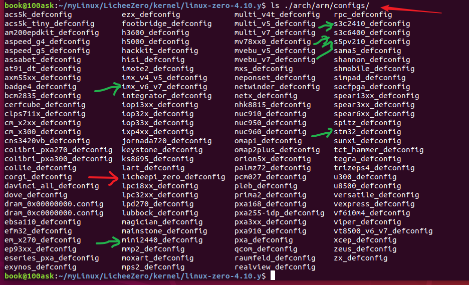

​		配置


- make menuconfig 里面看看都使能了哪些模块

  - wifi模块 cfg8012

    

  - 但是购买的模块是 r8723bs 型号，所以编译上面那个驱动应该没用

    网盘中提供的镜像的root目录下提供了r8723bs.ko, 开机后，执行

    

    ```
    insmod r8723bs.ko
    ifconfig wlan0 up
    ```

  - 还有蓝牙功能？	

    [TF WiFi使用方法 — Lichee zero 文档](http://zero.lichee.pro/贡献/article 5.html)	

    


- make ARCH=arm CROSS_COMPILE=arm-linux-gnueabihf- -j16    # 开始编译内核源码

  

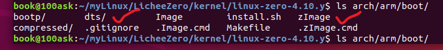


- 单独编译模块，在/out目录中

  make ARCH=arm CROSS_COMPILE=arm-linux-gnueabihf- -j16 INSTALL_MOD_PATH=out modules　

  

- 安装模块，才会生成 out 文件夹

  make ARCH=arm CROSS_COMPILE=arm-linux-gnueabihf- -j16 INSTALL_MOD_PATH=out modules_install


　

- 把需要烧录的东西拷贝出来

  内核


​		设备树


​		模块说可以放到根文件系统 `rootfs/lib/modules/` 目录下。

- 最终的结果都在 output 文件夹中


- 拷贝到 TF卡中看看

  把原来的东西备份一下


### 2.3.3 使用uboot启动linux内核

- 使用下面这个目录中的 buildroot 生成的 uboot，测试分析其启动命令不对

  

  如果uboot启动不了，修改一下命令

```shell
# TF卡启动模式

setenv bootcmd "setenv bootm_boot_mode sec; load mmc 0:1 0x41000000 zImage; load mmc 0:1 0x41800000 sun8i-v3s-licheepi-zero-dock.dtb; bootz 0x41000000 - 0x41800000;"

setenv bootargs "console=ttyS0,115200 rootwait root=/dev/mmcblk0p2 rw"
    
boot
```


- 还是使用 第1章 中介绍的主线 uboot 编译得到的文件看看

```shell
# 先取消TF卡的所有挂载
sudo umount /dev/sdb1
sudo umount /dev/sdb2

# 然后烧录到TF卡中偏移 8k 的地方
sudo dd if=u-boot-sunxi-with-spl.bin of=/dev/sdb bs=1024 seek=8
```


## 2.4 总结

- 主线的这个 Linux 内核，按照默认配置，连LCD都没有驱动起来，应该是没有配置。

- linux-zero-4.10.y 主线的内核比较旧了，wiki上介绍的下载链接

- 修改一下 \arch\arm\boot\dts\sun8i-v3s.dtsi 的设备树节点 

  内核的显示屏驱动使用的是 Simple Framebuffer，但是看到设备树节点中没有开启

  

- 听说uboot会自动创建关于LCD屏幕的设备树节点

  - 所以可以对所生成的设备树文件进行反汇编，查看到底配置了哪些节点

    


- **主线linux 4.10.y** 就体验到这里吧，之后都使用第5章所描述的 buildroot 工程进行开发


# 5 编译烧录buildroot（github工程）

- 下载最新的buildroot稳定版本（网上看到的，自己并没有使用）
    官方网站：  https://buildroot.org/download.html
    长支持版本：[buildroot-2017.02.7.tar.gz](https://buildroot.org/downloads/buildroot-2017.02.7.tar.gz)
    最新稳定版：[buildroot-2017.08.1.tar.gz](https://buildroot.org/downloads/buildroot-2017.08.1.tar.gz)


```c
To build and use the buildroot stuff, do the following:

1) run 'make menuconfig'  // 或者使用 configs目录中的配置文件，直接 make xx.config 
2) select the target architecture and the packages you wish to compile
3) run 'make'
4) wait while it compiles
5) find the kernel, bootloader, root filesystem, etc. in output/images
```


## 5.1 荔枝派zero分区和烧录

- uboot 编译完成后，在当前目录下生成了`u-boot-sunxi-with-spl.bin`，可以烧录TF卡到**8K偏移处**启动。
- 这么说荔枝派启动的时候，是优先去TF卡的8k偏移地址处去运行代码
- Linux内核、设备树放在TF卡的第一个分区
- 根文件系统放在TF卡的第二个分区


（1）卸载TF卡的全部分区，在不挂载的情况下进行烧写uboot


（2）可以自己创建一个分区挂载目录，将 sdb1 和 sdb2 分区分别挂载到上面


​		然后挂载到这些目录中，注意的是，sdb1分区是 vfat 格式的，挂载的时候需要 `-t vfat` 参数指定

​		好像不指定也可以。

```shell
sudo mount /dev/sdb1 -t vfat /home/book/myLinux/Funkey-OS/TempMount/sdb1Mount/

sudo mount /dev/sdb1 /home/book/myLinux/Funkey-OS/TempMount/sdb1Mount

sudo mount /dev/sdb2 /home/book/myLinux/Funkey-OS/TempMount/sdb2Mount/
```

​		挂载之后，访问TF卡就可以访问本地文件夹一样简单

（3）然后拷贝镜像、设备树到分区1

```shell
sudo cp zImage /home/book/myLinux/Funkey-OS/TempMount/sdb1Mount

sudo cp sun8i-v3s-licheepi-zero-dock.dtb /home/book/myLinux/Funkey-OS/TempMount/sdb1Mount

# 下面这个可以不用
sudo cp sun8i-v3s-licheepi-zero.dtb /home/book/myLinux/Funkey-OS/TempMount/sdb1Mount
```


（4）然后拷贝文件系统到分区2

```shell
sudo tar -xf rootfs.tar -C /home/book/myLinux/Funkey-OS/TempMount/sdb2Mount
```


（5）然后取消挂载，拔出TF卡

​		取消挂载的时候，如果显示该挂载点载忙，其实可能是某一个终端打开了该目录，关掉该目录就行了


​		之前就是这个目录打开了，导致挂载在这个目录中的设备卸载的时候显示在忙

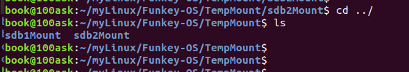

（6）取消所有TF的分区挂载，然后烧写编译好的uboot

​		编译完成后，在当前目录下生成了`u-boot-sunxi-with-spl.bin`，可以烧录TF卡到**8K偏移处**启动。

```c
sudo dd if=u-boot-sunxi-with-spl.bin of=/dev/sdb bs=1024 seek=8
```

​		荔枝派Zero的启动顺序：优先TF卡启动


## 5.2 烧录这个 buildroot 编译出来的 内容，启动之后没有反应

【工程 github】https://github.com/Unturned3/v3s_buildroot

启动之后，uboot 加载之后就错误了


```c
=> boot
switch to partitions #0, OK
mmc0 is current device
Scanning mmc 0:1...
9041 bytes read in 2 ms (4.3 MiB/s)
starting USB...
No working controllers found
USB is stopped. Please issue 'usb start' first.
starting USB...
No working controllers found
No ethernet found.
missing environment variable: pxeuuid
missing environment variable: bootfile
Retrieving file: pxelinux.cfg/00000000
No ethernet found.
missing environment variable: bootfile
Retrieving file: pxelinux.cfg/0000000
No ethernet found.
missing environment variable: bootfile
Retrieving file: pxelinux.cfg/000000
No ethernet found.
missing environment variable: bootfile
Retrieving file: pxelinux.cfg/00000
No ethernet found.
missing environment variable: bootfile
Retrieving file: pxelinux.cfg/0000
No ethernet found.
missing environment variable: bootfile
Retrieving file: pxelinux.cfg/000
No ethernet found.
missing environment variable: bootfile
Retrieving file: pxelinux.cfg/00
No ethernet found.
missing environment variable: bootfile
Retrieving file: pxelinux.cfg/0
No ethernet found.
missing environment variable: bootfile
Retrieving file: pxelinux.cfg/default-arm-sunxi-sunxi
No ethernet found.
missing environment variable: bootfile
Retrieving file: pxelinux.cfg/default-arm-sunxi
No ethernet found.
missing environment variable: bootfile
Retrieving file: pxelinux.cfg/default-arm
No ethernet found.
missing environment variable: bootfile
Retrieving file: pxelinux.cfg/default
No ethernet found.
Config file not found
starting USB...
No working controllers found
No ethernet found.
No ethernet found.
```


【解决方法】[请问各路大神直接烧录荔枝派zero提供的预编译u-boot和固件，出现这个错误， 应该如何解决？ / 全志 SOC / WhyCan Forum(哇酷开发者社区)](https://whycan.com/t_635.html)


- 根据下面的方法可以

```c
setenv bootcmd "setenv bootm_boot_mode sec; load mmc 0:1 0x41000000 zImage; load mmc 0:1 0x41800000 sun8i-v3s-licheepi-zero-dock.dtb; bootz 0x41000000 - 0x41800000;"

setenv bootargs "console=ttyS0,115200 panic=5 mtdparts=spi32766.0:1M(uboot),64k(dtb),4M(kernel),-(rootfs) rootwait root=/dev/mmcblk0p2 earlyprintk rw  vt.global_cursor_default=0"

boot
```


### 5.2.1 分析启动命令

**分析启动命令**


- 命令 bootz 有三个参数， addr 是 Linux 镜像文件在 DRAM 中的位置， initrd 是 initrd 文件在DRAM 中的地址，如果不使用 initrd 的话使用‘-’代替即可， fdt 就是设备树文件在 DRAM 中的地址。  

```shell
# 32M的大小 = 1024*1024*32=0x200 0000
setenv bootcmd "setenv bootm_boot_mode sec; 
	# 把mmc0(TF卡)分区1中的 zImage 文件加载到 内存地址 0x41000000 处
    load mmc 0:1 0x41000000 zImage; 
    # 把mmc0(TF卡)分区1中的 dtb设备树 文件加载到 内存地址 0x41800000 处
    load mmc 0:1 0x41800000 sun8i-v3s-licheepi-zero-dock.dtb; 
    # 然后启动 Linux 内核
    bootz 0x41000000 - 0x41800000;"
```


​		`512M = 0x40000 0000  ~  0x42000 0000`


### 5.2.2 分析传递的参数

**分析传递的参数**

```c
setenv bootargs "
    console=ttyS0,115200    // console控制台指定为 ttyS0串口0，波特率设置为 115200
    panic=5                 // 像是内核崩溃相关打印信息，这个参数是传递给内核的
    // spi flash 的分区设置？  uboot使用 0:1M，dtb使用64k，内核使用4M，剩下的给文件系统
    mtdparts=spi32766.0:1M(uboot),64k(dtb),4M(kernel),-(rootfs) 
        
    // root 后面有“rootwait rw”， rootwait 表示等待 mmc 设备初始化完成以后再挂载，否则的话mmc 设备还没初始化完成就挂载根文件系统会出错的。 rw 表示根文件系统是可以读写的，不加rw 的话可能无法在根文件系统中进行写操作，只能进行读操作  
    rootwait 
    // “root=/dev/mmcblk1p2”就表示根文件系统在/dev/mmcblk1p2 中，也就是 EMMC 的分区 2 中。
    root=/dev/mmcblk0p2  // mmc0也就是TF卡，p2就是分区2
    earlyprintk 
    rw  
    vt.global_cursor_default=0"
```


​		查看参数

`cat /sys/modules/vt/parameters/global_cursor_default`


​		对比 6ULL 的参数设置

```c
// 6ull的
mmcargs=setenv bootargs console= ttymxc0, 115200 root= /dev/mmcblk1p2 rootwait rw
    
// 全志的 V3S   
setenv bootargs "console=ttyS0,115200 rootwait root=/dev/mmcblk0p2 rw"    
```


- 分析之后，替换成下面的一点问题都没有

```c
setenv bootcmd "setenv bootm_boot_mode sec; load mmc 0:1 0x42000000 zImage; load mmc 0:1 0x42800000 sun8i-v3s-licheepi-zero-dock.dtb; bootz 0x42000000 - 0x42800000;"

setenv bootargs "console=ttyS0,115200 rootwait root=/dev/mmcblk0p2 rw"
    
boot
```


### 5.3.3 介绍buildroot中的启动命令

- 下面分析buildroot中的启动命令，感觉就没有实现启动的信息

```c
bootcmd=run distro_bootcmd
    distro_bootcmd=for target in ${boot_targets}; do run bootcmd_${target}; done
        boot_targets=fel mmc0 usb0 pxe dhcp
        bootcmd_${target}
		bootcmd_fel
        bootcmd_mmc0
        bootcmd_usb0    
```

```c
bootcmd_fel=
    if test -n ${fel_booted} && test -n ${fel_scriptaddr}; 
	then 
        echo '(FEL boot)'; source ${fel_scriptaddr}; 
	fi
```

```c
bootcmd_mmc0=devnum=0; run mmc_boot
mmc_boot=
    if mmc dev ${devnum};      // 切换到 mmc0 存储设备
	then 
        devtype=mmc;           // 启动设备类型为 mmc
		run scan_dev_for_boot_part; 
	fi    
  
// ************************************************************  测试     
      
=> mmc dev 0
switch to partitions #0, OK
mmc0 is current device
```

```c
scan_dev_for_boot_part=
    part list ${devtype} ${devnum} -bootable devplist;  // part list mmc0 
	env exists devplist || setenv devplist 1; 

	for distro_bootpart in ${devplist}; 
	do if fstype ${devtype} ${devnum}:${distro_bootpart} bootfstype; 
	then run scan_dev_for_boot; 
	fi; 
	done; 
	setenv devplist
```


# 6 buildroot操作总结

## 6.1 操作汇总

```shell
# 工程路径
~/myLinux/Funkey-OS/v3s_buildroot-master

# 想配置linux内核
make linux-menuconfig

# 修改linux内核配置之后，buildroot的根目录下面重新编译内核
make linux-build

# 生成的 zImage 在这个目录下
cd output/images/

# 这个是修改 buildroot 的配置文件，可以设置内核的路径之类的
make menuconfig

# uboot的源码路径在这里
cd output/build/uboot-2019.10/

# 在buildroot的根目录下面重新编译uboot，是完完全全重新编译
make uboot-rebuild

# 清空uboot工程
make uboot-dirclean

# 只编译修改后的文件
make uboot-build
```


## 6.2 重新烧录第5章中介绍的输出文件

- uboot，注意需要修改

  ```shell
  # 这个是博客的介绍
  
  vim boot.cmd
  # 写入以下内容
  setenv bootargs console=ttyS0,115200 panic=5 console=tty0 rootwait root=/dev/mmcblk0p2 earlyprintk rw vt.global_cursor_default=0
  load mmc 0:1 0x41000000 zImage
  load mmc 0:1 0x41800000 sun8i-v3s-licheepi-zero.dtb
  bootz 0x41000000 - 0x41800000
  
  
  第一行setenv命令，设定了变量bootargs(启动参数)为：通过tty0和ttyS0串口输出启动信息；启动失败延迟5秒重启，根文件在TF卡的第二分区，可读写；
  
  第二行指定了从TF中将设备树的dtb文件加载到0x80C00000的位置(地址参考自官方SDK)
  
  第三行指定了将压缩后的内核zImage加载到0x80008000的位置
  
  第四行为从加载地址启动内核的命令
  
  #console=ttyS[,options] 使用特定的串口
  # mmcblk0p2
  # mmc TF卡
  # blk（block，块设备）
  # 0（第一个块设备，也就是第一张sd卡）
  # p（partition，分区）
  # 通过设置early_printk选项，可以在内核串口设备初始化之前，看到打印输出
  
  ```

  **使用下面这个**

  ```shell
  setenv bootcmd "setenv bootm_boot_mode sec; load mmc 0:1 0x41000000 zImage; load mmc 0:1 0x41800000 sun8i-v3s-licheepi-zero-dock.dtb; bootz 0x41000000 - 0x41800000;"
  
  # 只加这个，只有在串口中有输出，LCD没输出 console=ttyS0,115200 
  #　加这个，console=tty0
  
  setenv bootargs "console=ttyS0,115200 panic=5　console=tty0 rootwait root=/dev/mmcblk0p2 earlyprintk rw vt.global_cursor_default=0"
  
  saveenv
  
  boot
  ```

  


​		自己修改环境变量之后，保存直接写入到 mmc0中，也就是 TF的8k偏移之后的 uboot 中，之后每次启动都会这样启动了。


- buildroot的输出文件在 `/home/book/myLinux/Funkey-OS/v3s_buildroot-master/output/images`
  - 里面的 bootscr 、zImage 、 dtb 都要拷贝到TF卡的第1个分区
  - 里面的 rootfs.tar 要解压后拷贝到 TF卡的第2个分区


- TF卡分区1

  

- TF卡分区2

  

- uboot覆盖

  


## 6.3 内核和Uboot源码

- 内核源码时 5.3.5 的


- uboot版本是 2019.10


- 源码路径 `/home/book/myLinux/Funkey-OS/v3s_buildroot-master/output/build`

  

- 设备树使用的是 dock 这个

  


## 6.4 设备树反汇编

```shell
# 使用命令：root# dtc -I dtb -O dts -o temp1.dts s5pv210-smdkv210.dtb

dtc -I dtb -O dts -o sun8i-v3s-licheepi-zero-dock.dts sun8i-v3s-licheepi-zero-dock.dtb

dtc -I dtb -O dts -o sun8i-v3s-licheepi-zero.dts sun8i-v3s-licheepi-zero.dtb
```


# 7 buildroot 操作


## 7.1 挖坑网的buildroot操作

【博客1】

[licheepi_zero开发板 buildroot配置 一键编译 / 全志 SOC / WhyCan Forum(哇酷开发者社区)](https://whycan.com/t_1842.html)

【博客2】

[荔枝派Zero V3s开发板入坑记录 (TF/SD卡启动)(主线Linux,主线u-boot) / 全志 SOC / WhyCan Forum(哇酷开发者社区)](https://whycan.com/t_561.html/)


sudo apt-get update

sudo apt-get upgrade

因为V3s支持VFPv4 浮点单元

zero-4.13.y分支对网卡支持比较好


# 8 RGB灯实验

## 8.1 原理图


## 8.2 设备树节点

```c
/{
	leds {
                compatible = "gpio-leds";

                blue_led {
                        label = "licheepi:blue:usr";
                        gpios = <&pio 6 1 GPIO_ACTIVE_LOW>; /* PG1 */
                };

                green_led {
                        label = "licheepi:green:usr";
                        gpios = <&pio 6 0 GPIO_ACTIVE_LOW>; /* PG0 */
                        default-state = "on";
                };

                red_led {
                        label = "licheepi:red:usr";
                        gpios = <&pio 6 2 GPIO_ACTIVE_LOW>; /* PG2 */
                };
        }
};  

// A  B  C  D  E  F  G 
// 0  1  2  3  4  5  6
```


# 9 按照本章可以得到最终使用的镜像

## 9.1 资料准备

[荔枝派Zero V3s开发板入坑记录 (TF/SD卡启动)(主线Linux,主线u-boot) / 全志 SOC / WhyCan Forum(哇酷开发者社区)](https://whycan.com/t_561.html/)

[licheepi_zero开发板 buildroot配置 一键编译 / 全志 SOC / WhyCan Forum(哇酷开发者社区)](https://whycan.com/t_1842.html)

【博客1】[(26条消息) 编译全志V3S（荔枝派zero）整个系统流程及后续故障答疑使用技巧等_Zcode的博客-CSDN博客_全志v3s](https://blog.csdn.net/a480694856/article/details/115328891)


- uboot 版本：git clone https://github.com/Lichee-Pi/u-boot.git -b v3s-current

- linux内核：git clone https://github.com/Lichee-Pi/linux.git -b zero-4.13.y

- 根文件系统：最新稳定版buildroot下载：[buildroot-2017.08.1.tar.gz](https://buildroot.org/downloads/buildroot-2017.08.1.tar.gz)

  ​					   最新稳定版buildroot下载：[buildroot-2018.08.02稳定版](https://buildroot.org/downloads/buildroot-2018.08.2.tar.gz)
  
  ​			

- buildroot使用 2017.8 编译wpa工具时会出错，2018.8版本无 mplayer，这些坑都踩过了，所以最终采用 2018.2 版本比较顺利。


## 9.2 编译下载流程

### 9.2.1 编译linux内核

- 详细过程参考 第2章

```shell
# 配置交叉编译工具链

export ARCH=arm
export CROSS_COMPILE=arm-linux-gnueabihf-
export PATH=$PATH:/home/book/myLinux/LicheeZero/gcc-linaro-6.3.1-2017.02-x86_64_arm-linux-gnueabihf/bin
```

```shell
make ARCH=arm licheepi_zero_defconfig
# make ARCH=arm menuconfig
# 修改设备树
make ARCH=arm CROSS_COMPILE=arm-linux-gnueabihf- -j4
make ARCH=arm CROSS_COMPILE=arm-linux-gnueabihf- dtbs
```

- 最终得到 zImage、dtb，设备树中竟然有lcd的


### 9.2.2 编译uboot

- 详细过程参考 第1章           

  v3s-spi-experimental 分支是支持 spi flash的，没用到

  v3s-current  这里使用这个分支

```shell
cd u-boot
make ARCH=arm CROSS_COMPILE=arm-linux-gnueabihf- LicheePi_Zero_800x480LCD_defconfig
# make ARCH=arm menuconfig 
make ARCH=arm CROSS_COMPILE=arm-linux-gnueabihf-
```

- 生成 u-boot-sunxi-with-spl.bin
- 如果想支持uboot直接从tf卡启动，修改uboot，也可以在tf卡第1个分区添加一个 boot.scr 文件指定

```c
// 修改 include/configs/sun8i.h, 使u-boot可以直接从tf卡启动：
#define CONFIG_BOOTCOMMAND  "setenv bootm_boot_mode sec; " \
                            "load mmc 0:1 0x41000000 zImage; "  \
                            "load mmc 0:1 0x41800000 sun8i-v3s-licheepi-zero-dock.dtb; " \
                            "bootz 0x41000000 - 0x41800000;"

#define CONFIG_BOOTARGS      "console=ttyS0,115200 panic=5 rootwait root=/dev/mmcblk0p2 earlyprintk rw  vt.global_cursor_default=0"
```

- **注意：**如果使用 with-800x480-lcd 的 dts，就需要修改启动指令 bootcmd

```c
sudo dd if=u-boot-sunxi-with-spl.bin of=/dev/sdb bs=1024 seek=8
```


boot.scr 需要设置一个。


### 9.2.3 编译buildroot得到根文件系统

**注意：**这个系统因为没有密码，并且进入之后直接就在 /root 目录下，所以没有 sudo 了

- 不知道需不需要

```shell
# 配置交叉编译工具链

export ARCH=arm
export CROSS_COMPILE=arm-linux-gnueabihf-
export PATH=$PATH:/home/book/myLinux/LicheeZero/gcc-linaro-6.3.1-2017.02-x86_64_arm-linux-gnueabihf/bin
```

**make menuconfig**

- 配置SOC架构相关


- 不编译内核


- 不编译根文件系统


- 首先配置工具链，因为之前开发uboot和内核都用到了自己下载的工具链，所以这里也配置成外部工具链。

```shell


# 查询编译工具链所在位置
$ which arm-linux-gnueabihf-gcc

/home/book/myLinux/LicheeZero/gcc-linaro-6.3.1-2017.02-x86_64_arm-linux-gnueabihf/bin/arm-linux-gnueabihf-gcc
# 注意了，这里找出来就截取 /home/book/myLinux/LicheeZero/gcc-linaro-6.3.1-2017.02-x86_64_arm-linux-gnueabihf  作为最终的路径


# 读取编译工具链里的内核版本
$ cat /home/book/myLinux/LicheeZero/gcc-linaro-6.3.1-2017.02-x86_64_arm-linux-gnueabihf/arm-linux-gnueabihf/libc/usr/include/linux/version.h

#define LINUX_VERSION_CODE 263680
#define KERNEL_VERSION(a,b,c) (((a) << 16) + ((b) << 8) + (c))

# 外部工具链gcc版本：我们使用的是最新的6.3版本
# 十进制数263680的十二进制为0x40600，则对应的内核版本号为4.6.0。 
```


```shell
Target options  --->
	Target Architecture (ARM (little endian))  --->
	Target Binary Format (ELF)  --->
	Target Architecture Variant (cortex-A7)  --->
	Target ABI (EABIhf)  --->
	Floating point strategy (VFPv4)  --->
	ARM instruction set (ARM)  ---> 


### 编译工具链配置：
Toolchain  --->
	Toolchain type (External toolchain)  --->
	*** Toolchain External Options ***
	Toolchain (Custom toolchain)  --->
	Toolchain origin (Pre-installed toolchain)  --->
	/opt/gcc-linaro-7.5.0-2019.12-x86_64_arm-linux-gnueabihf/arm-linux-gnueabihf/) 
	Toolchain path
	($(ARCH)-linux-gnueabihf) Toolchain prefix 改为工具链前缀是： arm-linux-gnueabihf
	External toolchain gcc version (7.0.x)  --->
	External toolchain kernel headers series (4.10.x)  --->
	External toolchain C library (glibc/eglibc)  --->
	[*] Toolchain has SSP support? (NEW)
	[*] Toolchain has RPC support? (NEW)
	[*] Toolchain has C++ support? 
	[*] Enable MMU support (NEW) 
 
```


- C库还是选择传统的glibc。需要小体积可以选uclibc（需要自行编译安装）。

- 最后就是配置自己需要的软件包，在menuconfig中选中即可。

- 再在system 设置下主机名，root密码等。

**注意：**有时候下载速度慢，可以复制下载链接，使用迅雷等下载好后，拷贝到dl目录下，会自动识别。


- make

  **如果出错则使用make clean然后再编译。
  编译完成后，生成的根文件系统在 output/images/rootfs.tar。**

  

- 编译出错1


​		还是报错，原来是工具链路径写错了


​		正确的路径是：

​		`/home/book/myLinux/LicheeZero/gcc-linaro-6.3.1-2017.02-x86_64_arm-linux-gnueabihf`

- 似乎编译完成


- 这里编译的是最简单的文件系统，没有添加任何的工具库。


```c
du -sh
4.9M	.   // 文件系统只有 4.9M大小
```


- 把原TF卡分区2中的内容全部删除


- 然后解压拷贝新创建的系统到TF卡的分区2中

```shell
sudo tar -xf rootfs.tar -C /home/book/myLinux/LicheeZero/kernel/MountTemp
sudo tar -xf rootfs.tar -C /media/book/96a86b0e-67db-4055-8771-81300fc0c8e0
```


## 9.3 测试网口和LCD功能

### 9.3.1 测试普通设备树

boot.scr中指定的设备树文件是   `sun8i-v3s-licheepi-zero-dock.dtb`

测试发现：

（1）led 可以控制

（2）uboot阶段是使用 800x480-lcd 配置文件来配置的，所以使能了LCD功能

（3）但是Linux内核使用的是默认的配置文件，make ARCH=arm licheepi_zero_defconfig

​          可以分析一下 licheepi_zero_defconfig 做了什么，开启了什么驱动

​		  然后设备树中使用的也是没有 LCD 后缀的dtb文件


**zero-4.13.y 内核已经适配Ethernet**

**测试发现：**

- 这里使用 `sun8i-v3s-licheepi-zero-dock.dtb` 设备树也可以使用网口和LCD。以为 dock 就是为带底板的荔枝派准备的，所以会支持部分底板的外设。
- 这里使用 `sun8i-v3s-licheepi-zero.dtb` 设备树，网口驱动没有，LCD驱动使能了，以为Uboot就配置好了800x480的LCD参数，所以对于荔枝派来说，其是uboot来讲LCD的参数设置给linux内核的。


### 9.3.2 修改为带LCD后缀的设备树

**（1）手动修改**  使用 sun8i-v3s-licheepi-zero-with-800x480-lcd.dtb 设备树

直接放弃 boot.scr，以为这个是靠 boot.cmd 编译后生成的，自己修改是不行的。

然后在uboot中手动指定一次，保存，下次都可以了。

```shell
setenv bootcmd "setenv bootm_boot_mode sec; load mmc 0:1 0x41000000 zImage; load mmc 0:1 0x41800000 sun8i-v3s-licheepi-zero-dock.dtb; bootz 0x41000000 - 0x41800000;"

#  sun8i-v3s-licheepi-zero-with-800x480-lcd.dtb 这个也可以

# 只加这个，只有在串口中有输出，LCD没输出 console=ttyS0,115200 
#　加这个，console=tty0，这样两个显示终端都设置了，到时候可以选择一个
# global_cursor_default 难道就是设置光标在 ttyS0 上还是 tty0 上

setenv bootargs "console=ttyS0,115200 panic=5　console=tty0 rootwait root=/dev/mmcblk0p2 earlyprintk rw vt.global_cursor_default=0"

saveenv

boot
```

**（2）测试网口**

查看系统启动后的设备节点


可以看到有两个和网络相关的设备节点   

- network_throughput（网络吞吐量）指的是单位时间内最大的I/O流量
- network_latency（网络延迟）

```shell
ifconfig -a
```


接上网线后，可以使用

```shell
udhcpc -i eth0   # 自动获取 Ip 地址
ping baidu.com   # 获取iP之后可以访问外网
```


**说明网口驱动加载成功**


**（3）测试LCD屏幕**

可以看到其中有 fb0 节点，说明framebuffer驱动启动了


测试花屏和黑屏功能

```c
chvt 1
cat /dev/urandom > /dev/fb0
cat /dev/zero > /dev/fb0
```


## 9.4 打包uboot和linux源码

- 编译之后，打包传回windows系统中，方便阅读源码和编写代码


## 9.5 wifi模块研究

【参考博客1】 [[荔枝派zero萌新向\]r8723WIFI的正确打开方式！超级详细ing / 全志 SOC / WhyCan Forum(哇酷开发者社区)](https://whycan.com/t_6057.html)


【参考博客2】  [TF WIFI 小白编 — Lichee zero 文档](http://zero.lichee.pro/贡献/article 12.html)


### 9.5.0 去除一个错误电阻

**这个电阻后来测试没有摘除也能工作**

- TF-WIFI-8723BS 支持连接 5G 的wifi。


### 9.5.1 RTL8723BS 驱动与调试

【这个博客写的非常的好】[(26条消息) 荔枝派zero编译rtl8723bs驱动并连接WiFi_Yfw的博客-CSDN博客_rtl8723bs](https://blog.csdn.net/u012577474/article/details/104678522)


- 这些wifi蓝牙芯片都是固件外置的，或许是为了节省成本，也或者是为了更方便更新固件。
- 拷贝 [rtl8723bs_nic.bin](https://raw.githubusercontent.com/wkennington/linux-firmware/master/rtlwifi/rtl8723bs_nic.bin) 到根文件系统的 /lib/firmware/rtlwifi/ 目录下.

- 4.13.y 内核支持 rtl8723bs型号的 wifi驱动


/home/book/myLinux/LicheeZero/kernel/linux-4.13.y/linux-zero-4.13.y/drivers/staging/rtl8723bs


里面竟然编译出了 .ko 文件，看日期就是编译内核的时候生成的。


- 拷贝到 licheepi 的 /mnt 目录，挂载一下看看

  ```shell
  book@100ask:~/myLinux/LicheeZero/kernel/linux-4.13.y/linux-zero-4.13.y/drivers/staging/rtl8723bs$ cp r8723bs.ko ~/licheepi_nfs/
  ```

  


- 有这个 .ko 文件，是因为内核配置了


- 分析一下 makefile 

  

- 分析一下 Kconfig

  

- 查看 rtl8723bs 的Kconfig


- 想看这个 rtl8723bs  驱动的源码，找到这个文件夹就可以了

- 注意下面这个问题：

  


​		我的这个错误不是在装载的时候报错，是在 启动 wlan0 的时候报错

​		


- 解决方法

  

  【实际操作】

  

  ```shell
  # mkdir 选项说明
  
  -m,--mode=模式,设定权限<模式>(类似chmod),如mkdir -m 755 test
  -p,--parents,此时若路径中的某些目录尚不存在,加上此选项后,系统将自动建立好那些尚不存在的目录,即一次可以建立多个目录。
  ```

  ```shell
  # mkdir -p /lib/firmware/rtlwifi/
  # ls
  rtl8723bs_nic.bin
  # cp rtl8723bs_nic.bin /lib/firmware/rtlwifi/
  # ls /lib/firmware/rtlwifi/
  rtl8723bs_nic.bin
  ```

  ```shell
  # ls
  r8723bs.ko         rtl8723bs_nic.bin
  # 
  # lsmod
  Module                  Size  Used by    Tainted: G
  r8723bs               528384  0
  #
  # rmmod r8723bs
  [ 2363.073718] RTL8723BS: module exit start
  [ 2363.078172] RTL8723BS: rtw_ndev_uninit(wlan0)
  [ 2363.106941] RTL8723BS: module exit success
  #
  # insmod ./r8723bs.ko
  [ 2373.954608] r8723bs: module is from the staging directory, the quality is unknown, you have been warned.
  [ 2373.972541] RTL8723BS: module init start
  [ 2373.976655] RTL8723BS: rtl8723bs v4.3.5.5_12290.20140916_BTCOEX20140507-4E40
  [ 2373.983697] RTL8723BS: rtl8723bs BT-Coex version = BTCOEX20140507-4E40
  [ 2373.991277] pnetdev = c329b800
  [ 2374.035515] RTL8723BS: rtw_ndev_init(wlan0)
  [ 2374.041308] RTL8723BS: module init ret =0
  #
  ```

  ```shell
  # ifconfig -a
  
  wlan0     Link encap:Ethernet  HWaddr 0C:CF:89:32:8F:0A
            BROADCAST MULTICAST  MTU:1500  Metric:1
            RX packets:0 errors:0 dropped:0 overruns:0 frame:0
            TX packets:0 errors:0 dropped:0 overruns:0 carrier:0
            collisions:0 txqueuelen:1000
            RX bytes:0 (0.0 B)  TX bytes:0 (0.0 B)
  ```

  ```shell
  # ifconfig wlan0 up
  [ 2506.014366] rtl8723bs: acquire FW from file:rtlwifi/rtl8723bs_nic.bin
  # [ 2509.447495] RTL8723BS: nolinked power save enter
  
  问题分析：估计是密码配置不对， 导致wifi无事可做，睡觉去了
  所以在启动 wlan0 之前，先把 wpa_supplicant工具 和密码安装上了再说
  ```

  ```shell
  # wpa_supplicant
  -sh: wpa_supplicant: not found
  #
  
  这个工具还没安装，
  ```

- 配置连接wifi修改  `vi /etc/network/interfaces`

```shell
# interface file auto-generated by buildroot

auto lo
iface lo inet loopback  # 指定为回环模式，所以其 ip 地址永远是 127.0.0.1

# usb-otg
allow-hotplug usb0
auto usb0
iface usb0 inet static  # 指定为静态 ip 模式，之后就配置为下面指定的 静态 ip
address 192.168.2.100
netmask 255.255.255.0
gateway 192.168.2.1

# wlan0
auto wlan0
iface wlan0 inet dhcp  # 指定为动态获取 ip 模式
```

注意修改这个之后，如果没有其他的东西系统会一直报错


- wpa_supplicant连接WIFI的时候会从配置文件中读取账号和密码，以及加密方式等， 所以我们再运行wpa_supplicant工具的时候要提前写好配置文件。
  配置文件名称自定，但是要以 .conf 为后缀，并保存在 /etc/ 目录下，这边给出一个配置文件的例子。

  

  创建一个文件夹    mkdir -p /var/run/wpa_supplicant

  

  

​		编辑 /etc/wpa_supplicant.conf 文件:

```c
ctrl_interface=/var/run/wpa_supplicant
ctrl_interface_group=0
ap_scan=1
network={
    ssid="wifi_name"
    scan_ssid=1
    key_mgmt=WPA-EAP WPA-PSK IEEE8021X NONE
    pairwise=TKIP CCMP
    group=CCMP TKIP WEP104 WEP40
    psk="wifi_password"
    priority=5
}
```

- 

·


[  106.052388] sunxi-mmc 1c10000.mmc: data error, sending stop command


### 9.5.2 安装 wpa 工具与测试

- 针对 4.13.y分支的内核

[各路大神，荔枝派v3s(有底板的那种)开发板怎挂载wifi【RTL8723BS】，求写入门教程! / 全志 SOC / WhyCan Forum(哇酷开发者社区)](https://whycan.com/t_652.html#p13049)


【编译 buildroot 使其支持 wap】

- (1) 先配置临时交叉编译工具链

```shell
# 注意 cotex-A7 的工具链后面又 hf
export ARCH=arm
export CROSS_COMPILE=arm-linux-gnueabihf-
export PATH=$PATH:/home/book/myLinux/LicheeZero/gcc-linaro-6.3.1-2017.02-x86_64_arm-linux-gnueabihf/bin
```

- (2) 在 buildroot 的根目录下面，make menuconfig

晕哥 说：

> buildroot
> -> make menuconfig
> -> Target packages -> Networking applications
> 选中
> wireless tools
> wpa_supplicant

- (3) 勾上配置


- (4) 编译如果出错，就看看这些


- (5) 出错1


解决方法1（不行）：[buildroot 编译出错recipe for target 'stage1scan.c' failed / 全志 SOC / WhyCan Forum(哇酷开发者社区)](https://whycan.com/t_2954.html)

```c
sudo apt-get install flex
```

```shell
make clean
make
# 得到的结果还是一样
```


解决方法2（不行）：[大家有没有遇到使用buildroot-2017.08编译host-flex 2.6.4 失败 / 全志 SOC / WhyCan Forum(哇酷开发者社区)](https://whycan.com/t_3063.html)


解决方法3（不行，**但是这里提到的需要开启 openssl 和 libnl 库是对的**）：[编译出错误,谁能我看下这是什么错误,这错误要怎么才解决? / 全志 SOC / WhyCan Forum(哇酷开发者社区)](https://whycan.com/t_676.html)


看这个手动编译的过程

[(26条消息) wpa_supplicant-2.6交叉编译及错误解决_csdn66_2016的博客-CSDN博客_wpa_supplicant交叉编译](https://blog.csdn.net/csdn66_2016/article/details/80368775)

其依赖   libnl交叉编译、openssl-1.0.0交叉编译、wpa_supplicant交叉编译


**解决方法4**（可以）：直接使用 buildroot 2018.02 版本，还是使用已有的工具链 6.x 版本，编译之后 wpa 没啥问题。


- （6）设置其他配置

  拷贝 r8723bs.ko 驱动到 /mnt 目录

```c
book@100ask:~/myLinux/LicheeZero/kernel/linux-4.13.y/linux-zero-4.13.y/drivers/staging/rtl8723bs$ cp r8723bs.ko ~/licheepi_nfs/
```


​		拷贝 .bin 文件到 /lib/firmware/rtlwifi/ 目录

```shell
# mkdir -p /lib/firmware/rtlwifi/
# ls
rtl8723bs_nic.bin
# cp rtl8723bs_nic.bin /lib/firmware/rtlwifi/
# ls /lib/firmware/rtlwifi/
rtl8723bs_nic.bin
```


​		编辑 /etc/wpa_supplicant.conf 文件:

```c
ctrl_interface=/var/run/wpa_supplicant
ctrl_interface_group=0
ap_scan=1
network={
    ssid="wifi_name"
    scan_ssid=1
    key_mgmt=WPA-EAP WPA-PSK IEEE8021X NONE
    pairwise=TKIP CCMP
    group=CCMP TKIP WEP104 WEP40
    psk="wifi_password"
    priority=5
}
```


​		配置连接wifi修改  `vi /etc/network/interfaces`

```shell
# interface file auto-generated by buildroot

auto lo
iface lo inet loopback  # 指定为回环模式，所以其 ip 地址永远是 127.0.0.1

# usb-otg
allow-hotplug usb0
auto usb0
iface usb0 inet static  # 指定为静态 ip 模式，之后就配置为下面指定的 静态 ip
address 192.168.2.100
netmask 255.255.255.0
gateway 192.168.2.1

# wlan0
auto wlan0
iface wlan0 inet dhcp  # 指定为动态获取 ip 模式
```


- 遇到问题  ifconfig wlan0 up ，直接报错下面的情况


解决方法1：led和sdi0 确实是复用引脚的，所以可能是这个问题，而且一开始上电的时候，led是亮的，说明是收到控制的，所以设备树中一定设置了，所以要使用 SDIO的WIFI，就必须把设备树的 led 节点 disable 了

[v3s下通过SDIO0使用无线网卡的问题 / 全志 SOC / WhyCan Forum(哇酷开发者社区)](https://whycan.com/t_3585.html)


【操作】

```shell
# 备份一下 sun8i-v3s-licheepi-zero-dock.dt 设备树
book@100ask:~/myLinux/LicheeZero/kernel/linux-4.13.y/linux-zero-4.13.y/arch/arm/boot/dts$ cp sun8i-v3s-licheepi-zero-dock.dts sun8i-v3s-licheepi-zero-dock_bak.dts
    
# 修改设备树(参考下面2个图)

# make dtbs
```

vim sun8i-v3s-licheepi-zero-dock.dts


vim sun8i-v3s-licheepi-zero.dts


​		改设备树没效果，因为从反汇编看到，设备树原来就是禁止了 led 的


解决方法2：难道是传说中的移除掉那个电阻吗？？？

​					没有去掉那个电阻，然后修改 .conf 文件，让其连接一个路由器的 5G wifi ，竟然就成功了，不知道是不是之前手机热点设置的不对。


### 9.5.3 挖坑网的一些帖子


```shell
建立 /etc/wpa_supplicant.conf 文件:

ctrl_interface=/var/run/wpa_supplicant 
ctrl_interface_group=0 
ap_scan=1 
network={
    ssid="debugdump"       
    scan_ssid=1
    key_mgmt=WPA-EAP WPA-PSK IEEE8021X NONE
    pairwise=TKIP CCMP
    group=CCMP TKIP WEP104 WEP40
    psk="13800138000" 
    priority=5             
}

依次执行下面的shell命令:

#安装驱动
#激活WIFI网卡
#加密连接无线WIFI热点
#DHCP获取IP
insmod /usr/lib/r8723bs.ko
ifconfig wlan0 up
wpa_supplicant -B -d -i wlan0 -c /etc/wpa_supplicant.conf
udhcpc -i wlan0
```


[V3S 配置rtl8723模块起没有反应 / 全志 SOC / WhyCan Forum(哇酷开发者社区)](https://whycan.com/t_2699.html)

晕哥 说：

> buildroot
> -> make menuconfig
>   -> Target packages -> Networking applications
> 选中
> wireless tools
> wpa_supplicant


- 需要修改文件系统，让其支持 wifi 无线相关的应用程序，比如 wpa 就经常用到


好像3期视频中的3G上网卡，也是需要找到厂家对应型号的配置文件，放到指定目录下

然后还要添加一个连接配置文件，添加 wifi 密码和名称，不同的加密协议等等信息。


### 9.5.4 操作成功

- 前提是设置好了 12.5 所示的内容


```shell
insmod r8723bs.ko

ifconfig wlan0 up

wpa_supplicant -B -c /etc/wpa_supplicant.conf -i wlan0

udhcpc -i wlan0
```


- 加载wifi驱动

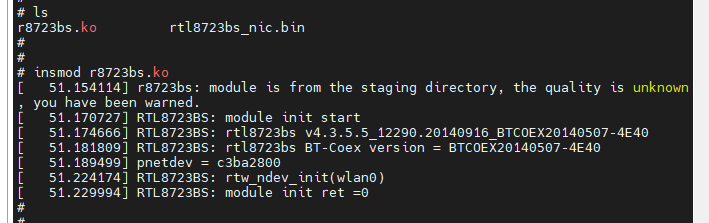

- 使能wlan0


- 查看出现wlan0网络设备


- 使用 wpa_supplicant加载 .conf 配置文件，读取要连接的wifi账号和密码，进行连接


- licheepi连接上wifi之后，相当于网口接上了网线，但是都还没有分配 ip 地址


- 指定使用 udhcpc 给 wlan0 自动分配IP地址


- 使用 wpa_cli 查看wlan0的状态，可以看到 ip 已经分配好了


- ping一下路由网关


- ping一下baidu.com


### 9.5.5 开机自启动

- 进入 `/etc/init.d` 目录中，创建一个wifi连接的脚本

- `vi S42wifi`

  添加下面的内容

```shell
# !/bin/sh

insmod /root/Driver/r8723bs.ko

ifconfig wlan0 up

wpa_supplicant -B -c /etc/wpa_supplicant.conf -i wlan0

sleep 3s

udhcpc -i wlan0

echo "wifi finish!!"
```

- 赋予可执行权限 `chmod 777 S42wifi`


### 9.5.6 如何选择 wifi 模块

【这个博客写的很好】[linux 下wifi 功能的实现 - 卧似长剑 - 博客园 (cnblogs.com)](https://www.cnblogs.com/chencanjian/p/5983997.html)

最直接的方法就是从内核中寻找其支持的wifi型号。


## 9.6 usb_otg模拟网口

【参考博客1】[(26条消息) 让Linux支持usb虚拟网卡。_我以为我爱了的博客-CSDN博客_usb虚拟网卡](https://blog.csdn.net/qq_31878855/article/details/80742593)

- 如何基于这个共享PC网络，构建 NFS虚拟文件系统


- Usb作为device端插入pc，在pc中会出现对用的usb虚拟网卡，可以像普通网卡一样传递数据，socket编程。
- 让平台支持usb虚拟网卡，需要Linux内核支持UDC（usb 设备控制器）驱动和 Ethernet Gadget（ CDC Ethernet ）驱动，cdc是usb的设备通讯类，Ethernet Gadget 驱动支持将多个以太网帧分组为一个USB传输。


### 9.6.1 使能usb-otg功能

- 插入USB到PC机器上


- ubuntu 中，ifconfig -a


- licheepi中，ifconfig -a


- 设置两者在同一个网段中

  ```shell
  # ubuntu
  sudo ifconfig ens35u1 192.168.2.6
  
  # licheepi
  sudo ifconfig usb0 192.168.2.7
  ```

  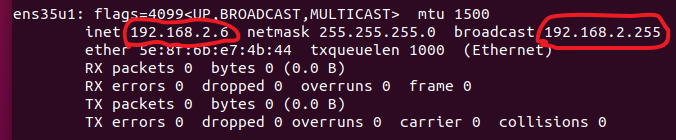


- 两者互相能ping通，但是现在板子还不能上网


### 9.6.2 找到在linux中的配置项

- CDC：通信设备类（Communication Device Class）
- ACM：抽象控制模型（Abstract Control Model）


- 根据下面这个文档，还需要进行下一步的设置  [Zero通过otg与PC共享网络 — Lichee zero 文档](http://zero.lichee.pro/应用/otg2PC.html)

```shell
Everything is ok now, let's edit network config(/etc/network/interfaces) to save it:

# On PC add:
allow-hotplug usb0
auto usb0
iface usb0 inet static
address 192.168.2.1
netmask 255.255.255.0

# On Zero add:
allow-hotplug usb0
auto usb0
iface usb0 inet static
address 192.168.2.100
netmask 255.255.255.0
gateway 192.168.2.1

# Share Network from PC
# Enable forwarding on your PC:
echo 1 | sudo tee /proc/sys/net/ipv4/ip_forward > /dev/null
sudo iptables -P FORWARD ACCEPT
sudo iptables -A POSTROUTING -t nat -j MASQUERADE -s 192.168.2.0/24

# test Ping google (if you are in china, ping baidu.com please...)
ping google.com

```


- 实际操作

```shell
sudo vim /etc/network/interfaces

# ************* ubuntu 

# interfaces(5) file used by ifup(8) and ifdown(8)
auto lo
iface lo inet loopback
allow-hotplug ens35u1
auto ens35u1
iface ens35u1 inet static
address 192.168.2.1
netmask 255.255.255.0
```

```shell
vi /etc/network/interfaces

# ************* zero  根文件系统中没有 vim

# interfaces(5) file used by ifup(8) and ifdown(8)
auto lo
iface lo inet loopback

allow-hotplug usb0
auto usb0
iface usb0 inet static
address 192.168.2.100
netmask 255.255.255.0
gateway 192.168.2.1
```

- 开始共享网路，让路由表更新一下（ubuntu中操作的，好像不是必须的）

```shell
# Share Network from PC
# Enable forwarding on your PC:

echo 1 | sudo tee /proc/sys/net/ipv4/ip_forward > /dev/null
sudo iptables -P FORWARD ACCEPT
sudo iptables -A POSTROUTING -t nat -j MASQUERADE -s 192.168.2.0/24

# test Ping google (if you are in china, ping baidu.com please...)
ping google.com
```

【实际操作】

```shell
book@100ask:~$ echo 1 | sudo tee /proc/sys/net/ipv4/ip_forward > /dev/null
book@100ask:~$ sudo iptables -P FORWARD ACCEPT
book@100ask:~$ sudo iptables -A POSTROUTING -t nat -j MASQUERADE -s 192.168.2.0/24
```


- 重启开发板，之前的配置都生效


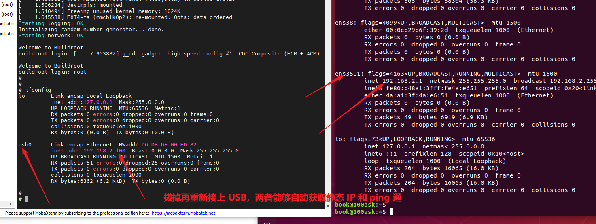


### 9.6.3 DNS域名服务

【参考博客1】[嵌入式LInux-让开发板访问外网-ping bad address baidu.com - 叶念西风 - 博客园 (cnblogs.com)](https://www.cnblogs.com/ynxf/p/6367385.html)

- 开发板设置1


- 开发板设置2

```shell
# 参考ubunut的
nameserver 127.0.0.53

# 重启开发板即可
```


- 测试

  如果licheepi重启了，usb-otg会掉电，然后没有插入的操作，是触发不了ubuntu 为其配置ip的服务

  插拔一下就可以出IP了

  


- ubuntu resolv.conf 重启丢失

[(26条消息) ubuntu resolv.conf 重启丢失_jamikabin的专栏-CSDN博客](https://blog.csdn.net/jamikabin/article/details/52351083)

resolvconf -u就不用重启，直接生效


- 这个设置可以了

[lichee zero Kernel如何适配Ethernet / 全志 SOC / WhyCan Forum(哇酷开发者社区)](https://whycan.com/t_1455.html)


```c
echo "nameserver 8.8.8.8" > /etc/resolv.conf
echo "nameserver 114.114.114.114" >> /etc/resolv.conf
echo "nameserver 1.1.1.1" >> /etc/resolv.conf
```

所以，在自启动脚本 rcS 中添加三句话

```c
# set dns, then can ping wide area network

echo "nameserver 8.8.8.8" > /etc/resolv.conf
echo "nameserver 114.114.114.114" >> /etc/resolv.conf
echo "nameserver 1.1.1.1" >> /etc/resolv.conf
```

重启后发现 rcS  又恢复原样了，所以写了一个自启动脚本。


- 如果开发板 ping baidu.com 不行
- 就在ubuntu 中执行下面几条命令

```shell
echo 1 | sudo tee /proc/sys/net/ipv4/ip_forward > /dev/null
sudo iptables -P FORWARD ACCEPT
sudo iptables -A POSTROUTING -t nat -j MASQUERADE -s 192.168.2.0/24
```


### 9.6.4 ssh登录开发板

【具体操作】

- 查看 buildroot 是否开启了 openssh 服务


- 配置 buildroot  的 make menuconfig，选上 openssh
- 保存配置到 .config 
- 退出之后，直接 make ，发生错误了就  make clean，让后再 make 
- ~~把新的文件系统重新解压替换掉 TF 卡的原来的系统~~
- ~~不能直接替换，替换之前在文件系统中做的一些工作就费了~~
- 目前只知道先把文件系统有更换的地方，在 12 章中总结出来吧，替换之后再设置回来

  


- 之前buildroot没有配置 openssh 时，是没有 S50ssd这个脚本的


- 配置了之后，马上就看到这个ssh服务脚本了


- 在ubuntu中想用ssh连接开发板，但是需要输入密码，原来的根文件系统是没有密码的，所以这里一直没有通过。


```shell
# 手动给现有的根文件系统设置密码
passwd root
Licheepi
```


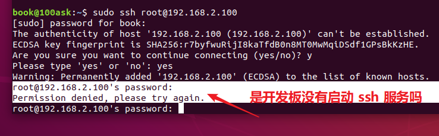


[SSH连接报错 “Permission denied” 的解决方法 - Yogile - 博客园 (cnblogs.com)](https://www.cnblogs.com/Yogile/p/12469843.html)


出现如上问题的原因是： **服务端 SSH 服务配置了禁止root用户登录策略**

- 开发板启动 `service sshd restart`，启动 sshd 服务之后，别人就可以远程连接它了。

  局域网或者公网IP才能访问到。

- vi  /etc/ssh/sshd_config

  /PermitRootLogin  查找

  n向上查找，N向下查找


- 修改


- 然后又一直提示密码过期

```c
book@100ask:~$ 
book@100ask:~$ ssh root@192.168.2.100
root@192.168.2.100's password: 
WARNING: Your password has expired.
You must change your password now and login again!
Changing password for root
New password: Connection to 192.168.2.100 closed by remote host.
Connection to 192.168.2.100 closed.
```

- 查看开发板系统的这个文件（可以，就是修改 /etc/shadow里面的零为5就行）

  [移植ssh：WARNING: Your password has expired.-fangdikui-ChinaUnix博客](http://blog.chinaunix.net/uid-21419530-id-4928333.html)

```shell
# cat /etc/shadow
# 原来的参数
root:$1$.jkC2rBN$Yjjhfah6Cwm1zza3obGwF0:0:0:99999:7:::
daemon:*:10933:0:99999:7:::
bin:*:10933:0:99999:7:::
sys:*:10933:0:99999:7:::
sync:*:10933:0:99999:7:::
mail:*:10933:0:99999:7:::
www-data:*:10933:0:99999:7:::
operator:*:10933:0:99999:7:::
nobody:*:10933:0:99999:7:::
sshd:*:::::::


# 修改后的参数
root:$1$.jkC2rBN$Yjjhfah6Cwm1zza3obGwF0:10933:5:99999:7:5:20000:
daemon:*:10933:5:99999:7:5:20000:
bin:*:10933:5:99999:7:5:20000:
sys:*:10933:5:99999:7:5:20000:
sync:*:10933:5:99999:7:5:20000:
mail:*:10933:5:99999:7:5:20000:
www-data:*:10933:5:99999:7:5:20000:
operator:*:10933:5:99999:7:5:20000:
nobody:*:10933:5:99999:7:5:20000:
sshd:*:10933:5:99999:7:5:20000:

```

- 下面是博客的修改例子

这样的话，使用SSH登录就会出现用户登录失败，提示诸如“WARNING: Your password has expired. You must change your password now and login again!”等等。

```shell
root:$1$m.jegaqA$vA.rBTVryyUAcRvyZ2gOL1:0:0:99999:7:::
telnetd:$1$N4uZUEcU$yotoDExxgGXs6PE7PQuIR1:0:0:99999:7:::
honey:$1$SwtHyL/h$MsEX6Vnqz/qhwDsivDqD20:0:0:99999:7:::
sshd:$1$elylgRon$FOHgkwpPMcNI5s.iL8ZS/.:0:0:99999:7:::

# cat /etc/shadow
root:$1$m.jegaqA$vA.rBTVryyUAcRvyZ2gOL1:15695:5:99999:7:5:20000:
telnetd:$1$N4uZUEcU$yotoDExxgGXs6PE7PQuIR1:15695:5:99999:7:5:20000:
honey:$1$SwtHyL/h$MsEX6Vnqz/qhwDsivDqD20:15695:5:99999:7:5:20000:
sshd:$1$elylgRon$FOHgkwpPMcNI5s.iL8ZS/.:15695:5:99999:7:5:20000:
```

- 现在 ubuntu 可以ssh登录开发板了

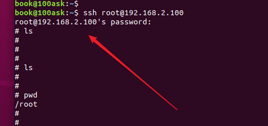


### 9.6.5 NFS挂载ubuntu目录到荔枝派

- 因为是把 ubuntu 的一个文件夹挂载到 荔枝派的某个目录下，所以要确保 ubuntu 开启了 ssh服务

  - `ps -e | grep ssh`      出现下面四行说明已经开启了服务

    

  - 如果没有安装 ssh，则安装  `apt-get install openssh-server`

- 安装NFS服务

  - `sudo apt-get install nfs-kernel-server rpcbind` 

    

- 创建一个文件夹    `mkdir licheepi_nfs`

- 打开 nfs 的配置文件   `sudo vi /etc/exports`  

- 打开/etc/exports 以后在后面添加如下所示内容：  

  （方式1）`/home/linux/nfs *(rw,sync,no_root_squash)`  

  （方式2）`/home/book/  *(rw,nohide,insecure,no_subtree_check,async,no_root_squash)`

  

- 重启ubuntu的 NFS 服务    `sudo /etc/init.d/nfs-kernel-server restart`  

- 到这里，主要就是把要被挂载的目录路径写入配置文件中，然后给予要被挂载的目录 777 权限


**说明：**我们一般使用 uboot 中的 nfs 命令将 Ubuntu 中的文件下载到开发板的 DRAM 中，在使用之前需要开启 Ubuntu 主机的 NFS 服务，并且要新建一个 NFS 使用的目录，以后所有要通过NFS 访问的文件都需要放到这个 NFS 目录中。   


- 参照 100ask_6ull 的挂载命令

  `mount -t nfs -o nolock,vers=3 192.168.5.11:/home/book/nfs_rootfs /mnt`

  修改为适合荔枝派的

  `mount -t nfs -o nolock,vers=3 192.168.2.1:/home/book/licheepi_nfs /mnt`

  (1)   -t nfs 表示挂载的是 nfs 类型

  (2)   -o 指定挂载选项

  

  (3)   vers=3

  (4)  后面是ubuntu的ip地址和文件目录

  (5)  /mnt是挂载到荔枝派的 mnt 目录下


- 取消挂载  `umount /mnt`

- 测试：发现挂载命令可以成功的，同时，要刷新挂载目录的内容，要荔枝派先退出 /mnt 目录再进入才能刷新。

  


### 9.6.6 荔枝派通过NFS挂载ubuntu中的文件系统测试

- 需要修改启动参数

  ```c
  setenv bootargs ‘console=tty1 console=ttymxc0,115200 root=/dev/nfs nfsroot=192.168.1.253:/home/linux/nfs/ubuntu_rootfs rw ip=192.168.1.251:192.168.1.253:192.168.1.1:255.255.255.0::eth0:off’
  
  saveenv //保存环境变量
  ```

- `nfs [loadAddress] [[hostIPaddr:]bootfilename]`
  loadAddress 是要保存的 DRAM 地址， [[hostIPaddr:]bootfilename]是要下载的文件地址。

- 使用 nfs 命令来将 zImage 下载到开发板 DRAM 的 0X80800000 地址处  

  `nfs 80800000 192.168.1.250:/home/zuozhongkai/linux/nfs/zImage`  


```c
setenv bootcmd "setenv bootm_boot_mode sec; load mmc 0:1 0x41000000 zImage; load mmc 0:1 0x41800000 sun8i-v3s-licheepi-zero-dock.dtb; bootz 0x41000000 - 0x41800000;"
setenv bootargs "console=ttyS0,115200 panic=5　console=tty0 rootwait root=/dev/mmcblk0p2 earlyprintk rw vt.global_cursor_default=0"
saveenv
boot
```


### 9.6.7 把TF卡的分区1挂载到根文件系统的 /boot 目录下


/boot 目录，难道是什么指令，把TF卡的分区1挂载到了文件系统的 /boot 目录下吗？


## 9.7 测试网口

### 9.7.1 udhcpc获取IP

- 因为 linux 4.13.y 版本的主线linux，已经支持 licheepi v3s 的网卡驱动了，所以使用默认配置编译出来的系统，上电之后就自动支持网卡。

- 由于硬件的原因，网口接头的闪烁灯的引脚没有焊接使用，所以就算接上网线也没有灯闪烁

- 查看系统有没有识别网卡的方法

  ifconfig -a 就可以看到出现了 eth0 

  

- 接上网线之后，网线要连接到路由器，才能分配到 IP

  udhcpc -i eth0   # 自动获取 Ip 地址

  

- 测试 eth0 是否连接到互联网了

  ping baidu.com -I eth0     # 获取iP之后可以访问外网

  

  ping baidu.com -I usb0  

  

  ```shell
  # ubuntu 每次重启之后，如果开发板想通过 usb0 共享到 ubuntu 的网络，需要执行下面这3句话才行，不然 ping 不同互联网
  
  # Share Network from PC
  # Enable forwarding on your PC:
  
  echo 1 | sudo tee /proc/sys/net/ipv4/ip_forward > /dev/null
  sudo iptables -P FORWARD ACCEPT
  sudo iptables -A POSTROUTING -t nat -j MASQUERADE -s 192.168.2.0/24
  ```

  


### 9.7.2 自动获取IP

- 插着网线启动系统，它不会为网口分配 IP 地址
- 感觉要添加一个开机脚本，开机之后自动运行一下 udhcpc


- 运行过 udhcpc 之后，再次拔出插入网线，都可以自动识别到了


## 9.8 windows与licheepi互传文件

### 9.8.1 使用 fileZilla 实现

- 因为 licheepi 接上了网口，并且通过网线连接到了公司的路由器

- 所以 eth0 使用的是公司的网络

- 同时笔记本电脑也是连接公司路由器的 wifi

- 所以两者在同一个网段下，所以可以通过 fileZilla 直接登录 licheepi 

  


# 10 各种功能测试

## 10.1 开机自启动

对于使用 buildroot 生成的根文件系统，其开机自启动文件在   `/etc/init.d/rcS`  这里。

```shell
# rcS 是启动脚本
#!/bin/sh

# Start all init scripts in /etc/init.d     启动这个目录下面的所有需要自启动的脚本
# executing them in numerical order.        这个是按照文件前后顺序执行的
# 注意这里搜寻的是以 S数字开头的脚本来执行
for i in /etc/init.d/S??* ;do     # *可以代表任何字符串；?仅代表单个字符串，但此单字必须存在

     # Ignore dangling symlinks (if any).
     [ ! -f "$i" ] && continue

     case "$i" in
        *.sh)
            # Source shell script for speed.
            (
                trap - INT QUIT TSTP
                set start  # 启动
                . $i
            )
            ;;
        *)
            # No sh extension, so fork subprocess.
            $i start
            ;;
    esac
done

```


```shell
# pwd
/etc/init.d
# ls
S01logging  S20urandom  S40network  rcK         rcS
```


```shell
# rcK 是关闭脚本
#!/bin/sh

# Stop all init scripts in /etc/init.d
# executing them in reversed numerical order.
#
for i in $(ls -r /etc/init.d/S??*) ;do

     # Ignore dangling symlinks (if any).
     [ ! -f "$i" ] && continue

     case "$i" in
        *.sh)
            # Source shell script for speed.
            (
                trap - INT QUIT TSTP
                set stop  # 关闭
                . $i
            )
            ;;
        *)
            # No sh extension, so fork subprocess.
            $i stop
            ;;
    esac
done
```

- 可以自己编写一个脚本，里面使用 shell 指令就可以了


# 11 应用程序

## 11.1 文件互传

### 11.1.1 使用荔枝派系统的ZModem

【参考安装过程】[使用sz/rz基于串口传输文件 - 开发者知识库 (itdaan.com)](https://www.itdaan.com/blog/2019/03/15/6178b662087665294677e396cf2c08ba.html)

- 因为我们的文件系统是最简化的，没有添加任何的包，所以还没有 ZModem

- 使用buildroot使能对 rz/sz 的支持

  - Target packages->Networking applications->lrzsz，也即打开了BR2_PACKAGE_LRZSZ。

  - 编译buildroot的时候，记得备份.config，还有 make clean不会删除 .config，make distclean会

  - **记得先配置临时工具链**

    

  - 直接 make ，出错了再 make clean，再重新 make

    

  - 编译完成之后，替换TF卡中的系统，重新启动，可以使用rz了

    


（1）启动ZModem软件的方法也非常简单，只需要在串口命令敲代码就行了：

```shell
# rz是让板子接收文件，-y是覆盖文件的后缀
rz -y
```

（2）ctrl + 鼠标右键，然后选择 Send file using Z-modem


（3）然后文件就开始上传到开发板上了


（4）下载开发板的文件到本地PC中

```shell
# sz是下载板子的文件到PC机器上，后面要紧跟着 文件名
sz helloword
```


​	**注意：**sz功能传输很容易失败，失败需要重新传输。


### 11.1.2 使用 usb-otg 


## 11.2 第一个应用程序

- buildroot 构建根文件系统的时候，是添加了 glibc 库的，所以可以运行一些带有c库头文件的应用程序

- 放到ubuntu中编译，再传到荔枝派上

  


```c
#include <stdio.h>

int main(int argc, char ** argv)
{
	if(argc!=2)
	{
		printf("Usage: %s <str> \n", argv[0]);
	}

	printf("i ask: %s \n", argv[1]);

	return 0;
}
```


## 11.3 TCP复杂应用程序


这说明这个文件系统是稳定的，glibc库很可以。而且使用同一套交叉编译工具链编译的 uboot、linux kernel、buildroot  以及应用程序也是使用的。


# 12 根文件系统更新部分(每次换系统都要重新设置)

## 12.1 usb-otg 设置

【修改1】usb-otg 设置固定 IP

```shell
vi /etc/network/interfaces

# ************* zero  根文件系统中没有 vim

# interfaces(5) file used by ifup(8) and ifdown(8)
auto lo
iface lo inet loopback

allow-hotplug usb0
auto usb0
iface usb0 inet static
address 192.168.2.100
netmask 255.255.255.0
gateway 192.168.2.1
```

【修改2】usb-otg 设置DNS域名

```shell
# 新创建一个脚本
cd /etc/init.d/
vi /etc/init.d/S41setdns

# 添加下面的内容
# set dns, then can ping wide area network

echo "nameserver 8.8.8.8" > /etc/resolv.conf
echo "nameserver 114.114.114.114" >> /etc/resolv.conf
echo "nameserver 1.1.1.1" >> /etc/resolv.conf

# 添加可执行权限
chmod 777 S41setdns
```


## 12.2 ssh设置(很少用，可以不配置这个)

- 设置了密码

```shell
# 手动给现有的根文件系统设置密码
passwd root
Licheepi
```


- vi  /etc/ssh/sshd_config

  /PermitRootLogin  查找

  n向上查找，N向下查找


- 修改


## 12.3 mount /mnt

mount -t nfs -o nolock,vers=3 192.168.2.1:/home/book/licheepi_nfs /mnt


## 12.4 挂载TF卡分区1到 /boot目录（没弄）

- mkdir /boot
- fdisk -l


- 但是挂载出错

  ```shell
  # mount /dev/mmcblk0p1 /boot/
  [ 5353.471285] FAT-fs (mmcblk0p1): Volume was not properly unmounted. Some data may be corrupt. Please run fsck.
  # ^C
  ```

  

- 不知道这种方式可不可以，问一下


- 可以给TF卡再创建一个分区，然后在第3个分区里面存放一些和系统无关的音视频数据之类的，到时候刷系统的时候，只需要替换分区2中的根文件系统就可以了


## 12.5 WiFi相关（需要设置）

- 拷贝 r8723bs.ko 驱动到 /mnt 目录

```c
book@100ask:~/myLinux/LicheeZero/kernel/linux-4.13.y/linux-zero-4.13.y/drivers/staging/rtl8723bs$ cp r8723bs.ko ~/licheepi_nfs/
```


- 拷贝 .bin 文件到 /lib/firmware/rtlwifi/ 目录

```shell
# mkdir -p /lib/firmware/rtlwifi/
# ls
rtl8723bs_nic.bin
# cp rtl8723bs_nic.bin /lib/firmware/rtlwifi/
# ls /lib/firmware/rtlwifi/
rtl8723bs_nic.bin
```


- 编辑 /etc/wpa_supplicant.conf 文件:

```c
ctrl_interface=/var/run/wpa_supplicant
ctrl_interface_group=0
ap_scan=1
network={
    ssid="wifi_name"
    scan_ssid=1
    key_mgmt=WPA-EAP WPA-PSK IEEE8021X NONE
    pairwise=TKIP CCMP
    group=CCMP TKIP WEP104 WEP40
    psk="wifi_password"
    priority=5
}
```


- 配置连接wifi修改  `vi /etc/network/interfaces`

```shell
# interface file auto-generated by buildroot

auto lo
iface lo inet loopback  # 指定为回环模式，所以其 ip 地址永远是 127.0.0.1

# usb-otg
allow-hotplug usb0
auto usb0
iface usb0 inet static  # 指定为静态 ip 模式，之后就配置为下面指定的 静态 ip
address 192.168.2.100
netmask 255.255.255.0
gateway 192.168.2.1

# wlan0
auto wlan0
iface wlan0 inet dhcp  # 指定为动态获取 ip 模式
```


- 开机自启动
  - 进入 `/etc/init.d` 目录中，创建一个wifi连接的脚本
  - `vi S42wifi`

  添加下面的内容

```shell
# !/bin/sh

insmod /root/Driver/r8723bs.ko

ifconfig wlan0 up

wpa_supplicant -B -c /etc/wpa_supplicant.conf -i wlan0

sleep 3s

udhcpc -i wlan0

echo "wifi finish!!"
```

​		赋予可执行权限 `chmod 777 S42wifi`


# 13 建议开发流程

## 13.1 开发工具

- USB-otg 用来连接到 ubuntu 上，可以实现：
  - ssh 访问开发板
  - 开启 ubuntu 共享网络之后，licheepi 也可以通过 usb-otg 的 usb0 虚拟网口连接互联网
  - licheepi 通过 nfs mount 挂载 ubuntu 的一个 nfs目录到 /mnt 中，方便文件的传输

- 硬件网口，连接路由器的网线，自动识别网线插入并且自动获取IP
  - 在有网线的地方使用这个网线来上网，socket通信

- WIFI模块，连接环境中的热点信息
  - 在有wifi的场所，可以通过wifi连接来连接到互联网上，socket通信

- 


## 13.2 工具实际需求用 buildroot 添加库

目前开启的库有

- → Target packages 
  - → Networking applications
    - ifupdown scripts        （ifconfig up / down）
    - lrzsz                              （传输文件的）
    - openssh                       （远程 ssh 登录的）
    - 


# 14 buildroot-2018.02.2 勾选的内容

## 14.1 最小系统勾选 

参考 9.2.3 节的内容


- 保存为 rootf_18_min.rar


## 14.2 添加工具包1

### 14.2.1 lrzsz

### 14.2.2 openssh

### 14.2.3 wpa_supplicant

依赖：openssl   libnl


**编译结果**：一点错误都没有，很完美


都是网络相关

- 保存为 rootf_18_net.rar


## 14.5 打包根文件系统

```shell
sudo tar -cvf rootf_17.tar rootf_17/
```


## 14.6 烧录rootf

```shell
sudo tar -xf rootfs.tar -C /home/book/myLinux/Funkey-OS/TempMount/sdb2Mount

sudo tar -xf rootfs.tar -C /home/book/myLinux/LicheeZero/Rootfs/rootf_mount
```


# ------------------等待填坑-----------------


# 15 USB 摄像头使用

【参考 wiki：介绍在 ubuntu中的使用】[USB摄像头使用 — Lichee zero 文档 ](http://zero.lichee.pro/应用/USB_cam.html#)


## 15.1 构建 mjpg-streamer


## 15.2 otg接口


# 16 触摸屏的使用

## 16.1 tslib 工具的移植


## 16.2 基于tslib工具编写应用程序


# 17 GPIO操作

- 点灯操作


# 18 Uart操作

- 需要开启除了串口0之外的一个串口，串口0用来调试，虽然 ssh 也可以远程连接

- 操作 GPS定位


# 19 I2C操作

- 操作 eeprom


# 20 SPI操作

- 操作SPI屏幕


# 21 PWM操作

- 操作舵机


# 22 中断操作

- 操作红外接收，使用中断实现


# 23 音频CODEC的使用

## 23.0 论坛截图

- 实现录音和播放声音

[各位大神,全志Allwinner V3s用mplayer播放mp3没声音,要怎么做才能有声音? / 全志 SOC / WhyCan Forum(哇酷开发者社区)](https://whycan.com/t_742.html)


[[慢更\]小白探索如何使用V3s播放音乐 / 全志 SOC / WhyCan Forum(哇酷开发者社区)](https://whycan.com/t_5793.html)

请教晕哥得知，可以使用tinyplay播放音频文件。那么我第一步，先使用tinyplay 播放本机文件吧。(慢更)

先用 tinyplay 完成功能逻辑, V3s自带的声卡太渣, 不能输出高品质音乐, 如果对效果有要求, 一定得上I2S声卡.


[编译开源播放器madplayer，播放音乐 / 全志 SOC / WhyCan Forum(哇酷开发者社区)](https://whycan.com/t_5826.html)


翻阅sinlinx的手册，执行下面2行命令，打开声音。

```
amixer cset numid=1,iface=MIXER,name='Master Playback Volume' 63
amixer cset numid=17,iface=MIXER,name='Speaker Function' 0
```

​    然后，再次使用madplayer播放mp3文件

```
madplayer ./0001.mp3
```

​    这一次，确实有声音了，也就是说，成功了。


## 23.1 codec介绍

[(26条消息) v3S驱动音频_lengyuefeng212的博客-CSDN博客_v3s音频电路](https://blog.csdn.net/lengyuefeng212/article/details/120055703)

默认dts中使能了codec，可以和主线内核中的codec驱动进行匹配，所以设备树默认添加了，驱动部分就准备好了

**需要使用的话，在buildroot中勾选 alsa-utils相关命令**，因为自己写音频驱动需要调用很多复杂的 ioctl，而借助一些开源的音频相关的应用软件，可以很快的开发驱动的引用，所以这里我们采用 alsa-utils 的应用程序库来测试，这需要依赖于 alsa-lib 库。


## 23.2 编译 alsa-lib

- 首先就要设置临时的交叉编译工具链

  ```shell
  export ARCH=arm
  export CROSS_COMPILE=arm-linux-gnueabihf-
  export PATH=$PATH:/home/book/myLinux/LicheeZero/gcc-linaro-6.3.1-2017.02-x86_64_arm-linux-gnueabihf/bin
  ```

- make menuconfig

- 使能 alsa-lib

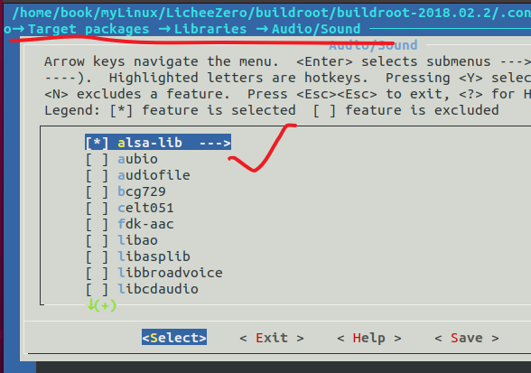

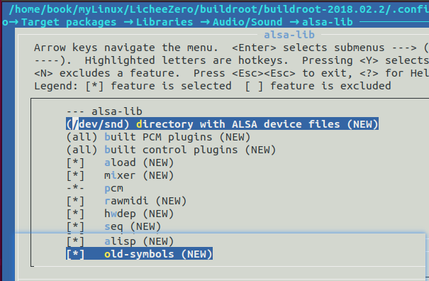

- 使能 alsa-utils


- 选择上这些选项之后，就可以 make 编译了
- 如果有出错，就 make clean，然后再重新编译。

只是有2个小警告，整体编译情况还不错。


- 解压编程得到的文件系统到 tf 卡的分区2中。

```c
sudo tar -xf rootfs.tar -C /home/book/myLinux/LicheeZero/Rootfs/rootf_mount
```


- 由于 alsa-utils 要用到 alsa-lib 库，因此要先编译 alsa-lib 库。alsa-lib 就是 ALSA 相关库文件，应用程序通过调用 ALSA 库来对 ALSA 框架下的声卡进行操作。

- alsa-utils 是 ALSA 的一些小工具集合，我们可以通过这些小工具还测试我们的声卡。


## 23.3 测试声卡

【示例1】[CODEC的使用 — Lichee zero 文档](http://zero.lichee.pro/驱动/CODEC.html#id8)

【示例2】[4.Licheepi Mplayer - R1chie - 博客园 (cnblogs.com)](https://www.cnblogs.com/r1chie/p/14418223.html)


### 23.3.1 查看声卡设备节点

```shell
# ls /dev/snd
controlC0  pcmC0D0c   pcmC0D0p   timer
```

- controlC0表示控制器
- pcmC0D0c 表示capture
- pcmC0D0p 表示play
- timer 表示定时器


直接使用该设备节点进行编程

使用该设备编程可以参考：http://blog.csdn.net/zhenwenxian/article/details/5901239

出现了该设备说明codec驱动被正确加载。


### 23.3.2 alsa-utils使用

**1. 查看设备**

```shell
# arecord -l
**** List of CAPTURE Hardware Devices ****
card 0: Codec [V3s Audio Codec], device 0: CDC PCM Codec-0 []
Subdevices: 1/1
Subdevice #0: subdevice #0
```

​		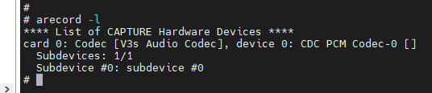


声卡相关选型默认都是关闭的，比如耳机和喇叭的左右声道输出等。因此我们在使用之前一定要先设置好声卡，alsa-utils 自带了 amixer 这个声卡设置工具。输入如下命令即可查看 amixer的帮助信息：


**2. 调节音量**

alsamixer是图形化的amixer工具,如下图所示


从左到右是：耳机音量，耳机输出源，Mic增益，mic1 boost, DAC增益。

可以很方便地调整音频输出设置

00表示当前音量正常，**MM表示此声道是静音**.可以通过键盘上的**M键**来切换静音和正常状态.

开机后默认状态是静音状态，需要取消掉静音状态

> ```shell
> amixer -c 0 sset 'Headphone',0 100% unmute
> ```


**3. 录音**

耳机输入内置了放大器。

耳机，linein，同时只能使用1种。

使用输入端口前需要设置mixer控制器，ADC input Mux

ADC Input Mux 和对应的输入端口


- 使用下面命令使能耳机并录音

```shell
amixer -c 0 cset numid=12 2         # 使能mic1
arecord -D hw:0,0 -d 3 -f S16_LE -r 16000 tmp.wav   # 录音测试
```

- 播放

```shell
amixer -c 0 sset 'Headphone',0 100% unmute
speaker-test -twav -c2
atest
aplay  tmp.wav
```


### 23.3.3 录制、播放操作

（1）打开 alsamixer


说明是成功的。

从左到右是：耳机音量，耳机输出源，Mic增益，mic1 boost, DAC增益。


（2）播放

由于开机默认是静音的，要使用命令取消静音：

```shell
amixer -c 0 sset 'Headphone',0 100% unmute
```


把耳机插在板子上的耳机接口，从电脑中C:\Windows\media，拷贝Alarm01.wav到根目录下，播放.wav格式的文件：

```shell
aplay song1.wav
```

就能听到音乐了。


调节音量大小

```c
amixer -c 0 set PCM 30db+
```


（3）录制

首先使能mic1：

```shell
amixer -c 0 cset numid=12 2
```

amixer命令说明：

```c
amixer -c <"card"> cset numid=<"control#"> <"input_port">

where:
<"card"> is the card, 0 for the sunxi-codec and 1 for the hdmi audio output
<"input_port"> is the input port from the table
<"control#"> is the control # showed using: aximer contents
```

然后开始录制：

```c
arecord -D hw:0,0 -d 3 -f S16_LE -r 16000 tmp.wav
```

在播放录制好的文件tmp.wav之前，要重新使能耳机：

```c
amixer -c 0 sset 'Headphone',0 100% unmute
```

播放录制好的文件：

```c
aplay  tmp.wav
```


### 23.3.4 Mplayer的编译和使用

- 首先就要设置临时的交叉编译工具链

  ```shell
  export ARCH=arm
  export CROSS_COMPILE=arm-linux-gnueabihf-
  export PATH=$PATH:/home/book/myLinux/LicheeZero/gcc-linaro-6.3.1-2017.02-x86_64_arm-linux-gnueabihf/bin
  ```

- make menuconfig


# 24 RGB屏幕 mplayer播放视频

- 实现播放指定视频，或者是给定网址链接的视频
- USB摄像头获取数据，在RGB屏幕上显示


【参考博客1】[f1c200s(tiny200,f1c100s)如何播放视频spi flash里的视频? / 全志 SOC / WhyCan Forum(哇酷开发者社区)](https://whycan.com/t_4282.html)

【参考博客2】


# 25 framebuffer应用编程


# 26 input子系统

- 模拟按键


# N 问题

## n.1 问题总结

（1）主线linux内核：

（2）主线uboot内核：

​		某款板子被合并到主线内核中了，说明该主线内核源码中已经有关于该芯片的底层驱动了，也就是操作寄存器这些都不用管了

​		但是主线内核中的驱动并不一定是所有外设都具备了的，所以挖坑网中还有很多大牛有改进或者修改的内核。

（3）根文件系统就没有主线的说法了，根据实际项目的需求进行。


## n.2 为啥是8k

① 8K偏移是全志芯片的BROM规定的
② 全志全系列芯片都是用BROM轮询启动介质，而不是像别的SOC那样检测bootstrap引脚状态进入何种启动介质。


## n.3 全过程开发博客

【博客1】[(26条消息) 编译全志V3S（荔枝派zero）整个系统流程及后续故障答疑使用技巧等_Zcode的博客-CSDN博客_全志v3s](https://blog.csdn.net/a480694856/article/details/115328891)

【官方wiki】[linux-sunxi.org](https://linux-sunxi.org/Main_Page)


## n.4 压缩解压  tar.bz2  tar.gz


**tar.bz2**

```bash
# 压缩
tar -cjf images.tar.bz2 ./images/
```

```bash
# 解压缩
tar -xjf images.tar.bz2
```

**tar.gz**

```shell
# 压缩
tar -zcvf 压缩文件名 .tar.gz 被压缩文件名
```

```shell
# 解压缩
tar -zxvf 压缩文件名.tar.gz
```


**tar**

```shell
【例 1】打包文件和目录。

[root@localhost ~]# tar -cvf anaconda-ks.cfg.tar anaconda-ks.cfg
# 把anacondehks.cfg 打包为 anacondehks.cfg.tar文件

```


## n.5 TF卡分区操作


具有wifi功能的dtb是sun8i-v3s-licheepi-zero-dock.dtb


[Licheepi Zero Ethernet适配指南 — Lichee zero 文档](http://zero.lichee.pro/贡献/article 6.html)


[荔枝派zero 网口 - 搜索 (bing.com)](https://cn.bing.com/search?q=荔枝派zero+网口&qs=n&sp=-1&pq=荔枝派zero+网口&sc=1-10&sk=&cvid=FF971A5AE35145DDAD89A92EA8E6C060&first=11&FORM=PERE)

[关于 lichee-pi zero v3s 以太网硬件严重发热问题和解决办法 / 全志 SOC / WhyCan Forum(哇酷开发者社区)](https://whycan.com/t_3887.html)

[终于搞明白为何荔枝派zero与电脑网线直连不行了，排除所有问题之后，发现是因为.... / 全志 SOC / WhyCan Forum(哇酷开发者社区)](https://whycan.com/t_5590.html)

```c
ls /dev/sdb
sudo umount /dev/sdb1
sudo fdisk /dev/sdb    
sudo mkfs.vfat /dev/sdb1
sudo mkfs.ext4 /dev/sdb2 
    
sudo dd if=./lichee_zero-brpy_alpha.dd of=/dev/sdb && sync
```

可以使用 gparted 查看分区后的文件格式


## n.6 指定网络ping

```shell
#　指定 eth0 自动获取ip
udhcpc -i eth0

#　指定　eth0 去 ping 网关　
ping -I eth0 192.168.1.1
```


## n.7 为什么linux设备树中没有指定LCD的参数

[荔枝派zero V3s用主线u-boot和主线Linux,为什么只需要在u-boot里面设置LCD参数，而不需要在Linux里面设置？ / 全志 SOC / WhyCan Forum(哇酷开发者社区)](https://whycan.com/t_692.html)


[(26条消息) 基于荔枝派实现uboot到系统应用启动过程不间断logo显示_小飞的博客-CSDN博客](https://blog.csdn.net/Bruno_Mars/article/details/104576492)

对于lichee zero来说, lcd控制器是由uboot进行配置的, 内核显示屏驱动无需改动


## n.8 一开始Uboot的环境变量是谁生成的呢


## n.9 设置buildroot不编译内核，uboot


## n.10 buildroot编译出现警告

和编译buildroot选择的交叉编译器有关


## n.11 mount 挂载 TF 分区1

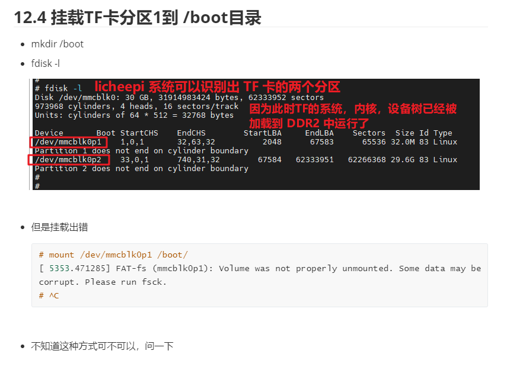

## n.12 如何开机自动识别到网线

插着网线开机，ifconfig不会显示出 eth0

可以在脚本里面让机器开机之后运行一下 udhcpc


