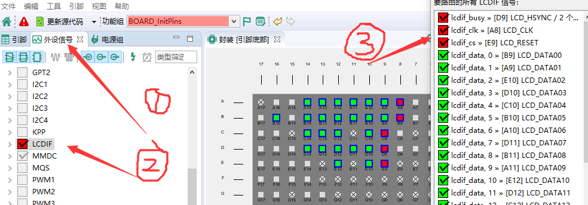
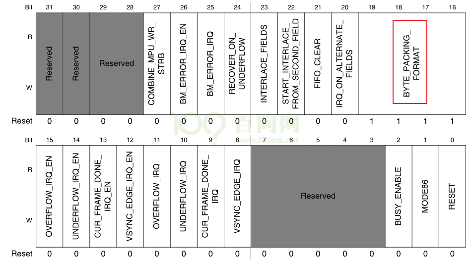

# LCD


##  1 framebuffer框架

总的来说：

1. 内核中已经编写了一个驱动框架 fbmem.c，里面已经有设备驱动框架那一套了，有read，write，open这些函数
2. 这个 fbmem.c可以适配到很多不同的单板和lcd，所以这些单板和lcd的信息，又抽象出了一个共同描述硬件信息的结构体，就是 fb_info 结构体，


分为上下两层：

* fbmem.c：承上启下**（只是起到中转的作用，最终还是调用到 具体单板的 read,write 函数）**

  * 实现、注册file_operations结构体
  * 把APP的调用向下转发到具体的硬件驱动程序

  **在内核里面，已经有一个fbmem.c，帮我们实现了这个0~4个字符设备驱动的框架。**

  **对于不同的硬件，不同的LCD，都会有不同的  fb_info   结构体。**

  

* xxx_fb.c：硬件相关的驱动程序

  * 实现、注册fb_info结构体
  * 实现硬件操作


**fb_info结构体是和硬件相关，驱动程序的那些 read，write，open函数，最先都先获取到这个 fb_info结构体，然后取出里面的LCD硬件和时序相关的信息。**


**info->screen_base就是显存的基地址，p是offset，**


**先把用户空间的数据buf拷贝到src也就是动态申请的内存 buffer中，然后再把 buffer的数据拷贝到显存的基地址中**


调用关系：

```c
例子1：
app:  open("/dev/fb0", ...)   主设备号: 29, 次设备号: 0
--------------------------------------------------------------
kernel:
         fb_open
         	int fbidx = iminor(inode);
         	struct fb_info *info = = registered_fb[0];


例子2：
app:  read()
---------------------------------------------------------------
kernel:
		fb_read
			int fbidx = iminor(inode);
			struct fb_info *info = registered_fb[fbidx];
			if (info->fbops->fb_read)
				return info->fbops->fb_read(info, buf, count, ppos);
         	
			src = (u32 __iomem *) (info->screen_base + p);
			dst = buffer;
			*dst++ = fb_readl(src++);
			copy_to_user(buf, buffer, c)         	
```

### 1.1 怎么编写Framebuffer驱动程序

核心：分配、设置、注册 fb_info结构体


* 分配fb_info

  * framebuffer_alloc

    

* 设置fb_info

  * var
  * fbops
  * 硬件相关操作

* 注册fb_info

  * register_framebuffer

    


## 2 从驱动工程师和应用工程师的角度看LCD

对于**应用工程师**，只需要知道下面的三点，就可以对LCD进行操作了

（1）framebuffer的基地址（也就是指针）

（2）使用多少位数据来表示一个像素点

（3）知道LCD屏幕的尺寸，从而可以找到像素点所对应的framebuffer的位置


对于**驱动工程师**，需要知道更多

（1）需要知道framebuffer存在哪里？在控制器的里面，还是在LCD上就有GRAM

（2）谁把framebuffer的数据刷新到LCD上，需要有LCD控制器，而驱动工程师就是要完成这个LCD控制器的初始化工作


## 3 不同接口的LCD引脚

### 3.1 157的引脚


### 3.2 103的引脚


## 4 pinctrl子系统

### 4.1 分析 pinctrl 子系统的实现原理

根节点下的这个 iomuxc ，里面有 compatible 属性，所以必定会转换成一个平台设备，所以 pinctrl 在内核中的实现，必定会有一个对应的驱动。直接查看 pinctrl-imx.c 驱动文件中的 probe 函数


找到  pinctrl 的驱动文件。


设备树信息

```c
iomuxc: iomuxc@020e0000 {
	compatible = "fsl,imx6ul-iomuxc";
	reg = <0x020e0000 0x4000>;
};
```


源码分析

```c
int imx_pinctrl_probe(struct platform_device *pdev,
		      struct imx_pinctrl_soc_info *info)
{
	struct regmap_config config = { .name = "gpr" };
    // 从平台设备结构体中获得设备树结构体device_node，然后可以调用 of函数调用里面的属性值
	struct device_node *dev_np = pdev->dev.of_node;  
    // pinctrl描述符结构体，非常重要
	struct pinctrl_desc *imx_pinctrl_desc;
    
	struct device_node *np;
	struct imx_pinctrl *ipctl;
	struct resource *res;  // 下面肯定要获取设备树的资源信息
	struct regmap *gpr;
	int ret, i;

	if (!info || !info->pins || !info->npins) {
		dev_err(&pdev->dev, "wrong pinctrl info\n");
		return -EINVAL;
	}
	info->dev = &pdev->dev;

	if (info->gpr_compatible) {
		gpr = syscon_regmap_lookup_by_compatible(info->gpr_compatible);
		if (!IS_ERR(gpr))
			regmap_attach_dev(&pdev->dev, gpr, &config);
	}

	/* Create state holders etc for this driver */
	ipctl = devm_kzalloc(&pdev->dev, sizeof(*ipctl), GFP_KERNEL);
	if (!ipctl)
		return -ENOMEM;

	if (!(info->flags & IMX8_USE_SCU)) {
		info->pin_regs = devm_kmalloc(&pdev->dev, sizeof(*info->pin_regs) *
					      info->npins, GFP_KERNEL);
		if (!info->pin_regs)
			return -ENOMEM;

		for (i = 0; i < info->npins; i++) {
			info->pin_regs[i].mux_reg = -1;
			info->pin_regs[i].conf_reg = -1;
		}

        // 获取 platform_device 平台设备中的存储类信息，其实就是 reg = <0x020e0000 0x4000>;
        // 获取其中的第一个资源
		res = platform_get_resource(pdev, IORESOURCE_MEM, 0);
        // 检查一个资源是否是一个有效的内存区域，请求内存区域并对其进行ioremap。
        // 所有的操作都是管理的，并将在驱动器分离时撤消。
        // 这里得到了设备映射后的虚拟基地址
		ipctl->base = devm_ioremap_resource(&pdev->dev, res);
		if (IS_ERR(ipctl->base))
			return PTR_ERR(ipctl->base);

		if (of_property_read_bool(dev_np, "fsl,input-sel")) {
			np = of_parse_phandle(dev_np, "fsl,input-sel", 0);
			if (!np) {
				dev_err(&pdev->dev, "iomuxc fsl,input-sel property not found\n");
				return -EINVAL;
			}

			ipctl->input_sel_base = of_iomap(np, 0);
			of_node_put(np);
			if (!ipctl->input_sel_base) {
				dev_err(&pdev->dev,
					"iomuxc input select base address not found\n");
				return -ENOMEM;
			}
		}
	}

    // 申请一个描述符空间
	imx_pinctrl_desc = devm_kzalloc(&pdev->dev, sizeof(*imx_pinctrl_desc),
					GFP_KERNEL);
	if (!imx_pinctrl_desc)
		return -ENOMEM;
	
    // 设置里面的值
	imx_pinctrl_desc->name = dev_name(&pdev->dev);
	imx_pinctrl_desc->pins = info->pins;
	imx_pinctrl_desc->npins = info->npins;
	imx_pinctrl_desc->pctlops = &imx_pctrl_ops;
	imx_pinctrl_desc->pmxops = &imx_pmx_ops;
	imx_pinctrl_desc->confops = &imx_pinconf_ops;
	imx_pinctrl_desc->owner = THIS_MODULE;

	ret = imx_pinctrl_probe_dt(pdev, info);
	if (ret) {
		dev_err(&pdev->dev, "fail to probe dt properties\n");
		return ret;
	}

	ipctl->info = info;
	ipctl->dev = info->dev;
	platform_set_drvdata(pdev, ipctl);
    // 注册描述符
	ipctl->pctl = devm_pinctrl_register(&pdev->dev,
					    imx_pinctrl_desc, ipctl);
	if (IS_ERR(ipctl->pctl)) {
		dev_err(&pdev->dev, "could not register IMX pinctrl driver\n");
		return PTR_ERR(ipctl->pctl);
	}

	dev_info(&pdev->dev, "initialized IMX pinctrl driver\n");

	return 0;
}
```


```c
platform_device
	device
		of_node
```


## 5 LCD自定义驱动实现流程

### 5.1 例程流程

（1）需要更换设备树

- 把原来的设备树复制到目录`C:\Users\Administrator\Desktop\LYH\myLinux\driver_total\03 LCD\03_my_cld_drv\origin`中了。
- 把例程的设备树`C:\Users\Administrator\Desktop\imx6ull\02_driver_total\doc_and_source_for_drivers\IMX6ULL\source\03_LCD\11_lcd_drv_imx6ull_ok`添加到内核对应目录中`/home/book/myDoc/100ask_imx6ull-sdk/Linux-4.9.88/arch/arm/boot/dts`。

（2）需要修改 makefile，屏蔽内核的LCD驱动，添加自定义的LCD驱动

- 需要修改的是LCD驱动程序目录中的子makefile，如下图，mxsfb.c这个LCD驱动文件就在下面的文件夹中`/home/book/myDoc/100ask_imx6ull-sdk/Linux-4.9.88/drivers/video/fbdev`
- 需要修改的是这个文件夹中的makefile


- 打开 Makefile进行修改


（3）需要把LCD驱动源程序添加到某个文件夹中


（4）重新编译内核zImage，重新编译设备树dtb

- 根据完全开发手册编译内核 zImage 的流程进行编译

  ```c
  book@100ask:~/100ask_imx6ull-sdk$ cd Linux-4.9.88
  book@100ask:~/100ask_imx6ull-sdk/Linux-4.9.88$ make mrproper
  book@100ask:~/100ask_imx6ull-sdk/Linux-4.9.88$ make 100ask_imx6ull_defconfig
  book@100ask:~/100ask_imx6ull-sdk/Linux-4.9.88$ make zImage  -j4
  book@100ask:~/100ask_imx6ull-sdk/Linux-4.9.88$ make dtbs
  book@100ask:~/100ask_imx6ull-sdk/Linux-4.9.88$ cp arch/arm/boot/zImage ~/nfs_rootfs
  book@100ask:~/100ask_imx6ull-sdk/Linux-4.9.88$ cp arch/arm/boot/dts/100ask_imx6ull-14x14.dtb  ~/nfs_rootfs
  ```

- 编译设备树

  ```c
  book@100ask:~/100ask_imx6ull-sdk/Linux-4.9.88$ make dtbs
  ```

  

（5）上机实验，出现小企鹅和开机之后的logo，说明成功了

- 编译完成 `zImage` 和 `dtb` 之后，可以拷贝这两个东西到开发板的 `/boot` 目录下，然后重启开发板，查看是否有企鹅出现
- 测试成功，直接可以运行QT的界面


### 5.2 编写自己的LCD驱动程序流程

#### 5.2.1 修改设备树配置引脚

- 注释掉系统自带的 LCD 部分
- 然后需要添加 LCD 必备的参数信息
- 注意引脚有没有别的节点也使用了
- pin GUI 的使用


（1）查看原理图，看LCD屏幕的哪些引脚接到了imx6ull芯片的哪些pin角上面。

- 如下图所示，`B0~B7`、`G0~G7`、`R0~R7` 这就是RGB888接口的LCD屏幕，在后面设置参数的时候需要使用到。

- framebuffer那边选择的可能是 RGB565的数据格式，LCD屏幕是 RGB888的数据格式，所以LCD控制器内部需要实现把 RGB565的数据格式转换为RGB888的数据格式。


- 通过imx6ull和LCD的原理图，可以知道其使用到的引脚为 RGB888和下面的4个引脚和一个PWM引脚。

- 可以在pin的GUI设计软件中进行配置。

- 选择外设信号，LCDIF控制器，路由所有，会出现有冲突的引脚，然后选择去除掉没有使用的引脚，解决冲突问题



- 解释


- LCD屏幕的引脚功能如下所示，注意 BL_CN是背光引脚


- 因为背光引脚不是LCD的功能引脚，可以使用任意一个GPIO引脚或者有PWM的功能引脚上，就可以了
- 在`C:\Users\Administrator\Desktop\imx6ull\02_driver_total\doc_and_source_for_drivers\IMX6ULL\开发板配套资料\原理图\Base_board`目录中的原理图上搜索这个引脚，就可以一直找到其 GPIO 的符号。


- 有些引脚找不到，可以在下面这个路径中查看这个 excel，**这里我直接在原理图就找全了**

- `C:\Users\Administrator\Desktop\imx6ull\02_driver_total\doc_and_source_for_drivers\IMX6ULL\开发板配套资料\原理图\Core_board`


- 注意de引脚


- 背光引脚


- 设置完成之后，记得要更新源代码


- 修改设备树1：添加 pinctrl信息


- 代码中，lcd 中使用 pinctrl 设置的引脚内核自动帮我们解析配置好了，唯一需要我们设置的就是 gpio 引脚

```c
	static struct gpio_desc *bl_gpio;

	/* get gpio from device tree */
	bl_gpio = gpiod_get(&pdev->dev, "backlight", 0);

	/* config bl_gpio as output */
	gpiod_direction_output(bl_gpio, 1);

	/* 设置引脚值 */
	gpiod_set_value(bl_gpio, 1); 
```


#### 5.2.2 修改设备树配置时钟

- LCD控制器需要设置2个时钟


- 对于时钟的使能，我们可以参考裸机例程，对时钟的寄存器进行 ioremap ，然后直接怼寄存器就可以了
- 但是我们可以使用内核的时钟子系统，就可以更加方便的使用时钟


- 参考内核的时钟在设备树中是怎么设置的

- 参考：`arch/arm/boot/dts/imx6ull.dtsi`
- // 这个节点就没有使能，我们先不管它，需要使用到这个控制器 `lcdif` 时，我们再引用这个节点使能就行

```shell
lcdif: lcdif@021c8000 {
    compatible = "fsl,imx6ul-lcdif", "fsl,imx28-lcdif";
    reg = <0x021c8000 0x4000>;
    interrupts = <GIC_SPI 5 IRQ_TYPE_LEVEL_HIGH>;
    clocks = <&clks IMX6UL_CLK_LCDIF_PIX>,
             <&clks IMX6UL_CLK_LCDIF_APB>,
             <&clks IMX6UL_CLK_DUMMY>;
    clock-names = "pix", "axi", "disp_axi";
    status = "disabled";           
};
```

定义了3个时钟：

* pix：Pixel clock，用于LCD接口，设置为LCD手册上的参数，主要是设置它的频率，

  **注意：像素时钟是和具体的LCD设备息息相关的，所以这个内核没有帮我们设置**

* axi：AXI clock，用于传输数据、读写寄存器，使能即可，系统上电内核就给这个时钟进行频率配置了

* disp_axi：一个虚拟的时钟，可以不用设置


- 设备树修改完成如下：


- 示例代码，还不能直接运行：**可以通过设备树中的名字来获取时钟**


* 获得时钟

  ```c
  	host->clk_pix = devm_clk_get(&host->pdev->dev, "pix");
  	if (IS_ERR(host->clk_pix)) {
  		host->clk_pix = NULL;
  		ret = PTR_ERR(host->clk_pix);
  		goto fb_release;
  	}
  
  	host->clk_axi = devm_clk_get(&host->pdev->dev, "axi");
  	if (IS_ERR(host->clk_axi)) {
  		host->clk_axi = NULL;
  		ret = PTR_ERR(host->clk_axi);
  		dev_err(&pdev->dev, "Failed to get axi clock: %d\n", ret);
  		goto fb_release;
  	}
  
  	host->clk_disp_axi = devm_clk_get(&host->pdev->dev, "disp_axi");
  	if (IS_ERR(host->clk_disp_axi)) {
  		host->clk_disp_axi = NULL;
  		ret = PTR_ERR(host->clk_disp_axi);
  		dev_err(&pdev->dev, "Failed to get disp_axi clock: %d\n", ret);
  		goto fb_release;
  	}
  ```

* 设置频率：只需要设置pixel clock的频率

  ```c
  		ret = clk_set_rate(host->clk_pix,
  				PICOS2KHZ(fb_info->var.pixclock) * 1000U);
  ```

* 使能时钟

  ```c
  		clk_enable_pix(host);
  			clk_prepare_enable(host->clk_pix);
  		clk_enable_axi(host);
  			clk_prepare_enable(host->clk_axi);
  		clk_enable_disp_axi(host);
  			clk_prepare_enable(host->clk_disp_axi);
  ```


#### 5.2.3 修改设备树配置基本参数

- 需要根据 LCD的数据手册里面的参数来设置设备树的值

- LCD 设备树要参考内核中写好的例程格式，这样的好处就是可以使用 内核提供的获取设备树信息的函数，可以用来解析设备树的 LCD节点的信息，从而可以使用这些信息来设置 LCD控制器的值。

**分析设备树的结构**

- 1个timing 代表一个分辨率信息吧，可以有很多个 timing，但是对于嵌入式的 LCD，分辨率都是写死了的。
- display 代表我们要使用哪一个显示器
- display 中共用的属性，比如总线宽度、bpp 呀这些


- 对于解析设备树，我们需要做的是3方面的事情
  - 找到 dispaly节点
  - 提取出里面的共用信息
  - 找到里面的 timing 信息


- 设备树参数和数据手册的对应关系（时序参数）


- 设备树参数和数据手册的对应关系（极性参数）


- 设备树中 LCD的节点结构是固定的，所以内核中必定有解析这个节点的函数，可以参考内核的驱动例程
  - `drivers\video\of_display_timing.c`

  - `drivers\video\fbdev\mxsfb.c`


**解析设备树之后的参数值，都保存在 display_timing 结构体中**


- 下面这个图表示了解析设备树之后，参数都保存到哪里了


#### 5.2.4 使用设备树中解析出来的参数用于设置LCD控制器寄存器

- 首先需要找到 LCDIF控制器的寄存器和地址的关系

  在编写裸机程序的时候，imx6ull官方给我们提供了一个 `imx6ull_soc.h`头文件，里面定义了一些 lcdif 控制器的寄存器的地址，我们可以把这部分的内容复制出来。

  `C:\Users\Administrator\Desktop\imx6ull\02_driver_total\doc_and_source_for_drivers\IMX6ULL\source\03_LCD\05_参考的裸机源码\02_dot_line_circle`


**根据芯片手册，一个一个设置寄存器：**


* （1）Framebuffer地址设置

  `reg = <0x021c8000 0x4000>;`  查询芯片手册，然后在设备树中指定


​	如何从设备树中获取LCD的信息


* （2）Framebuffer中数据格式设置

  - 注意：LCD接口和framebuffer的数据位数的关系

    第一个寄存器中的 `LCDIF_CTRLn`  这个的设置问题：需要根据 LCD接口的 fb 格式来设置

  

  

  ​	第一个寄存器中的 `LCDIF_CTRL1n`  的这个位设置问题，主要是如何使用 32bit 的内存中4字节的问题

  ​	**注意**：这所说的数据格式，是 `framebuffer` 中的数据存储格式，也就是CPU先写到 `framebuffer` 中的数据。

  

  

  ​	**对于 24bpp，也就是 RGB 888格式，直接设置为 0111比较好，一个32bit数据保存一组 RGB888的值，最高一字节舍弃不用，如果使用 1111格式，全部字节都是用的话，有些 RGB888数据保存的格式就不对其，有点别扭。**

  ​	**对于 16bpp，设置为 1111，则高2字节可以保存，低2字节也可以保存，都使用上了。**

  ​	所以在设置寄存器的参数的时候，要注意适配各种不同 bpp 的情况，分别处理。

* （3）LCD时序参数设置

* （4）LCD引脚极性设置


**注意1**：记得使能背光引脚和开启 lcd run，才能搬运数据和看到东西

**注意2**：先使能时钟，再去设置LCD控制器，没有使能时钟，设置也没有用

**任务**：根据程序中设置的值，对照数据手册，把每一个寄存器的设置原理都标记好


### 5.2.5 编写程序

编程的大体结构如下：

（1）从LCD设备树节点中提取出重要的参数信息

（2）通过 fb_info 结构体设置部分参数，通过寄存器 设置部分参数


### 5.2.6 编译程序报错

解决BUG1 （解决）

* 现象：LCD上没有企鹅LOGO，在终端中执行`ls -l /dev/fb0`发现没有设备节点

* 观察内核启动信息，看到：

  ```shell
  [    0.619880] imx6ul-pinctrl 20e0000.iomuxc: pin MX6UL_PAD_GPIO1_IO08 already requested by 2080000.pwm; cannot claim for 21c8000.framebuffer-mylcd
  [    0.619920] imx6ul-pinctrl 20e0000.iomuxc: pin-31 (21c8000.framebuffer-mylcd) status -22
  [    0.619954] imx6ul-pinctrl 20e0000.iomuxc: could not request pin 31 (MX6UL_PAD_GPIO1_IO08) from group mylcd_pingrp  on device 20e0000.iomuxc
  [    0.619985] mylcd 21c8000.framebuffer-mylcd: Error applying setting, reverse things back
  [    0.620070] mylcd: probe of 21c8000.framebuffer-mylcd failed with error -22
  ```

* 原因：引脚冲突

  * 设备树中pwm节点、framebuffer-mylcd节点，都使用到的同一个引脚：PAD_GPIO1_IO08

* 解决方法：修改`arch/arm/boot/dts/100ask_imx6ull-14x14.dts`，禁止pwm节点，如下：


解决BUG2 （解决）


- 之前漏了 ; 号，看编译报错提示的行号来判断：185行


解决BUG3 （解决）


原来是之前 删除 /boot 目录中的设备树和zImage的时候，命令搞错了

```c
rm /boot/100askxxx zImage 
```

这样删除的是 `/boot/100askxxx` 和 本目录下的 `zImage` ，不匹配，所以就重启加载不成功，添加正确的 zImage 和 设备树，reboot就成功了。


### 5.2.7 实验现象

重启开发板观察现象

* 如果可以看到企鹅LOGO，就表示正常

* 如果在终端中可以查看到存在`/dev/fb0`节点，也表示正常


## 6 LCD控制器寄存器简介

**数据手册中 LCD的相关寄存器很多，主要就是下面的 10个，设置其中的某些位**

查看任何芯片的LCD控制器寄存器时，记住几个要点：

① 怎么把LCD的信息告诉LCD控制器：即分辨率、行列时序、像素时钟等；
② 怎么把显存地址、像素格式告诉LCD控制器。


上图是我们将要使用到的寄存器，下面逐个讲解这些寄存器，在后续的LCD控制编程实验会用到。


#### 6.1 LCDIF_CTRL寄存器


| 位域    | 名                   | 读写 | 描述                                                         |
| ------- | -------------------- | ---- | ------------------------------------------------------------ |
| [31]    | SFTRST               | R/W  | 软件复位，正常工作时应设为0；如果设为1，它会复位整个LCD控制器 |
| [30]    | CLKGATE              | R/W  | 时钟开关，  0：正常工作时要设置为0；  1：关闭LCD控制器时钟   |
| [29]    | YCBCR422_INPUT       | R/W  | 使用RGB接口时，设置为0；其他接口我们暂时不关心               |
| [28]    | READ_WRITEB          | R/W  | 使用RGB接口时，设置为0；其他接口我们暂时不关心               |
| [27]    | WAIT_FOR_VSYNC_EDGE  | R/W  | 在VSYNC模式时，设置为1；我们不关心                           |
| [26]    | DATA_SHIFT_DIR       | R/W  | 在DVI模式下才需要设置，我们不关心                            |
| [25:21] | SHIFT_NUM_BITS       | R/W  | 在DVI模式下才需要设置，我们不关心                            |
| [20]    | DVI_MODE             | R/W  | 设置为1时，使用DVI模式，就是ITU-R BT.656数字接口             |
| [19]    | BYPASS_COUNT         | R/W  | DOTCLK和DVI模式下需要设置为1;MPU、VSYNC模式时设为0           |
| [18]    | VSYNC_MODE           | R/W  | 使用VSYNC模式时，设置为1                                     |
| [17]    | DOTCLK_MODE          | R/W  | 使用DOTCLK模式时，设置为1；本实验用的就是这个模式            |
| [16]    | DATA_SELECT          | R/W  | MPU模式下才用到，我们不关心                                  |
| [15:14] | INPUT_DATA_SWIZZLE   | R/W  | 显存中像素颜色的数据转给LCD控制器时，字节位置是否交换：  <br />0x0：NO_SWAP，不交换； <br />0x0：LITTLE_ENDIAN，小字节序，跟NO_SWAP一样；  <br />0x1：BIG_ENDIAN_SWAP，字节0、3交换；字节1、2交换；  <br />0x1：SWAP_ALL_BYTES，字节0、3交换；字节1、2交换；  <br />0x2：HWD_SWAP，半字交换，即0x12345678转为0x56781234  <br />0x3：HWD_BYTE_SWAP，在每个半字内部放换字节，     即0x12345678转换为0x34127856 |
| [13:12] | CSC_DATA_SWIZZLE     | R/W  | 显存中的数据被传入LCD控制器内部并被转换为24BPP后，在它被转给LCD接口之前，字节位置是否交换：  0x0：NO_SWAP，不交换；  0x0：LITTLE_ENDIAN，小字节序，跟NO_SWAP一样；  0x1：BIG_ENDIAN_SWAP，字节0、3交换；字节1、2交换；  0x1：SWAP_ALL_BYTES，字节0、3交换；字节1、2交换；  0x2：HWD_SWAP，半字交换，即0x12345678转为0x56781234  0x3：HWD_BYTE_SWAP，在每个半字内部放换字节，     即0x12345678转换为0x34127856 |
| [11:10] | LCD_DATABUS_WIDTH    | R/W  | LCD数据总线宽度，就是对外输出的LCD数据的位宽，  0x0：16位；  0x1：8位；  0x2：18位；  0x3：24位 |
| [9:8]   | WORD_LENGTH          | R/W  | 输入的数据格式，即显存中每个像素占多少位，  0x0：16位；  0x1：8位；  0x2：18位；  0x3：24位 |
| [7]     | RGB_TO_YCBCR422_CSC  | R/W  | 设置为1时，使能颜色空间转换：RGB转为YCbCr                    |
| [6]     | ENABLE_PXP_HANDSHAKE | R/W  | 当LCDIF_MASTER设置为1时，再设置这位，  则LCD控制器跟PXP之间的握手机制被关闭(我们不关心) |
| [5]     | MASTER               | R/W  | 设置为1时，LCD控制器成为bus master                           |
| [4]     | RSRVD0               | R/W  | 保留                                                         |
| [3]     | DATA_FORMAT_16_BIT   | R/W  | WORD_LENGTH为0时，表示一个像素用16位，此位作用如下：  0：数据格式为ARGB555；  1：数据格式为RGB565 |
| [2]     | DATA_FORMAT_18_BIT   | R/W  | WORD_LENGTH为2时，表示一个像素用18位，RGB数据还是保存在32位数据里，此位作用如下：  0：低18位用来表示RGB666，高14位无效  1：高18位用来表示RGB666，低14位无效 |
| [1]     | DATA_FORMAT_24_BIT   | R/W  | WORD_LENGTH为3时，表示一个像素用24位，此位作用如下：  0：所有的24位数据都有效，格式为RGB888  1：转给LCD控制器的数据是24位的，但只用到其中的18位，    每个字节用来表示一个原色，每字节中高2位无效 |
| [0]     | RUN                  | R/W  | 使能LCD控制器，开始传输数据                                  |

 

#### 6.2 LCDIF_CTRL1寄存器



本实验中使用TFT LCD，LCD控制器使用DOTCLK模式。本寄存器中其他用不到的位，就不介绍了。

| 位域    | 名                  | 读写 | 描述                                                         |
| ------- | ------------------- | ---- | ------------------------------------------------------------ |
| [19:16] | BYTE_PACKING_FORMAT | R/W  | 用来表示一个32位的word中，哪些字节是有效的，即哪些字节是用来表示颜色的。  bit16、17、18、19分别对应byte0、1、2、3；某位为1，就表示对应的字节有效。  默认值是0xf，表示32位的word中，所有字节都有效。  对于8bpp，可以忽略本设置，所有的字节都是有效的；  对于16bpp，bit[1:0]、bit[3:2]分别对应一个字节，组合中的2位都为1时，对应的字节才有效；  对于24bpp，0x7表示32位数据中只用到3个字节，这称为“24 bit unpacked format”，即ARGB，其中的A字节被丢弃 |
| [0]     | RESET               | R/W  | 用来复位了接的LCD，  0：LCD_RESET引脚输出低电平；  1：LCD_RESET引脚输出高电平 |


#### 6.3 LCDIF_TRANSFER_COUNT寄存器


| 位域    | 名      | 读写 | 描述                     |
| ------- | ------- | ---- | ------------------------ |
| [31:16] | V_COUNT | R/W  | 一帧中，有多少行有效数据 |
| [15:0]  | H_COUNT | R/W  | 一行中，有多少个像素     |


#### 6.4 LCDIF_VDCTRL0寄存器


​	本寄存器用来设置Vsync信号相关的时序，及极性。

| 位域   | 名                     | 读写 | 描述                                                         |
| ------ | ---------------------- | ---- | ------------------------------------------------------------ |
| [29]   | VSYNC_OEB              | R/W  | 用来控制VSYNC信号，对于DOTCLK模式，设为0，  0：VSYNC是输出引脚，用LCD控制器产生；  1：VSYNC是输入引脚 |
| [28]   | ENABLE_PRESENT         | R/W  | 在DOTCLK模式下，硬件是否会产生数据使能信号ENALBE：  0：不产生；  1：产生 |
| [27]   | VSYNC_POL              | R/W  | 用来决定VSYNC脉冲的极性，  0：低脉冲；  1：高脉冲            |
| [26]   | HSYNC_POL              | R/W  | 用来决定HSYNC脉冲的极性，  0：低脉冲；  1：高脉冲            |
| [25]   | DOTCLK_POL             | R/W  | 用来决定DOTCLK的极性，  0：LCD控制器在DOTCLK下降沿发送数据，LCD在上升沿捕获数据；  1：反过来 |
| [24]   | ENABLE_POL             | R/W  | 用来决定ENABLE信号的极性，  0：数据有效期间，ENABLE信号为低；  1：反过来 |
| [21]   | VSYNC_PERIOD_UNIT      | R/W  | 用来决定VSYNC_PERIOD的单位，  0：单位是像素时钟(pix_clk)，这在VSYNC模式下使用；  1：单位是“整行”，这在DOTCLK模式下使用 |
| [20]   | VSYNC_PULSE_WIDTH_UNIT | R/W  | 用来决定VSYNC_PULSE_WIDTH的单位，  0：单位是像素时钟(pix_clk)；  1：单位是“整行” |
| [19]   | HALF_LINE              | R/W  | VSYNC周期是否周加上半行的时间，  0：VSYNC周期=VSYNC_PERIOD；  1：VSYNC周期=VSYNC_PERIOD+HORIZONTAL_PERIOD/2 |
| [18]   | HALF_LINE_MODE         | R/W  | 0：第1帧将在一行的中间结束，第2帧在一行的中间开始；  1：所有帧结束前都加上半行时间，这样所有帧都会起始于“行的开头” |
| [17:0] | VSYNC_PULSE_WIDTH      | R/W  | VSYNC脉冲的宽度                                              |


#### 6.5 LCDIF_VDCTRL1寄存器


| 位域 | 名           | 读写 | 描述                                                         |
| ---- | ------------ | ---- | ------------------------------------------------------------ |
| [29] | VSYNC_PERIOD | R/W  | 两个垂直同步信号之间的间隔，即垂直方向同步信号的总周期；  单位由VSYNC_PERIOD_UNIT决定 |


#### 6.6 LCDIF_VDCTRL2寄存器


​	HSYNC_PULSE_WIDTH：水平同步信号脉冲宽度；

​	HSYNC_PERIOD：两个水平同步信号之间的总数，即水平方向同步信号的总周期

| 位域    | 名                | 读写 | 描述                                                 |
| ------- | ----------------- | ---- | ---------------------------------------------------- |
| [31:18] | HSYNC_PULSE_WIDTH | R/W  | HSYNC脉冲的宽度(单位：pix_clk)                       |
| [17:0]  | HSYNC_PERIOD      | R/W  | 整行的宽度，即两个HYSNC信号之间的宽度(单位：pix_clk) |


#### 6.7 LCDIF_VDCTRL3寄存器


 

| 位域    | 名                  | 读写 | 描述                                                    |
| ------- | ------------------- | ---- | ------------------------------------------------------- |
| [29]    | MUX_SYNC_SIGNALS    | R/W  | 用不着                                                  |
| [28]    | VSYNC_ONLY          | R/W  | 0：DOTCLK模式时必须设置为0；  1：VSYNC模式时必须设置为1 |
| [27:16] | HORIZONTAL_WAIT_CNT | R/W  | 水平方向上的等待像素个数，等于thp+thb                   |
| [15:0]  | VERTICAL_WAIT_CNT   | R/W  | 垂直方向上的等待行数，等于tvp+tvb                       |

 

#### 6.8 LCDIF_VDCTRL4寄存器


 

| 位域    | 名                      | 读写 | 描述                                                         |
| ------- | ----------------------- | ---- | ------------------------------------------------------------ |
| [31:29] | DOTCLK_DLY_SEL          | R/W  | 在LCD控制器内部的DOTCLK输出到LCD_DOTCK引脚时，延时多久：  0：2ns；  1：4ns；  2：6ns；  3：8ns；  其他值保留 |
| [18]    | SYNC_SIGNALS_ON         | R/W  | DOTCLK模式下必须设为1                                        |
| [17:0]  | DOTCLK_H_VALID_DATA_CNT | R/W  | 水平方向上的有效像素个数(pix_clk)，即分辨率的y               |

 

#### 6.9 LCDIF_CUR_BUF寄存器


| 位域   | 名   | 读写 | 描述                                    |
| ------ | ---- | ---- | --------------------------------------- |
| [31:0] | ADDR | R/W  | LCD控制器正在传输的当前帧在显存中的地址 |

 

#### 6.10 LCDIF_NEXT_BUF寄存器


| 位域   | 名   | 读写 | 描述                 |
| ------ | ---- | ---- | -------------------- |
| [31:0] | ADDR | R/W  | 下一帧在显存中的地址 |

LCD控制器传输完当前帧后，会把LCDIF_NEXT_BUF寄存器的值复制到LCDIF_CUR_BUF寄存器。


```c
	// 3. 设置具体的寄存器，总共有 10 个
	// 3.1 
	/* 
     * 初始化LCD控制器的CTRL寄存器
     * [31]       :  0      : 正常模式必须设置为0
     * [30]       :  0      : 正常模式必须设置为0
     * [29]       :  0      : 设置为0代表从RGB颜色区域中获取数据
     * [28]       :  0      : TFT-RGB接口时，设置为0，8080接口设置为1
     * [27:21]    :  0      : 不用管
     * [20]       :  0      : 没有使用这种模式
     * [19]       :  1      : DOTCLK和DVI modes需要设置为1 
     * [18]       :  0      : 没有使用这种模式
     * [17]       :  1      : 设置为1工作在DOTCLK模式
     * [16]       :  0      : 8080接口模式下，设置发出去的是命令还是数据本身
     * [15:14]    : 00      : 输入数据不交换（小端模式）默认就为0，不需设置
     * [13:12]    : 00      : CSC数据不交换（小端模式）默认就为0，不需设置
     * [11:10]    : 11		: 数据总线为24bit，也就是 LCD屏幕的RGB总线条数
     * [9:8]    根据显示屏资源文件bpp来设置：8位0x1 ， 16位0x0 ，24位0x3，也就是 framebuffer的RGB格式
     * [7:6]      :  0      : 不用管
     * [5]        :  1      : 设置elcdif工作在主机模式，主动去获取fb数据刷新到lcd屏幕上
     * [4]        :  0      : 保留位
     * [3]        :  0      : fb使用 RGB565，设置为1代表使用 RGB555
     * [2]        :  0      : 不用管
     * [1]        :  0      : 24位数据均是有效数据，默认就为0，不需设置
     * [0]        :  0      : 设置为1，马上进行数据传输
	 */	
	lcdif->CTRL = (0<<30) | (0<<29) | (0<<28) | (1<<19) | (1<<17) | (lcd_data_bus_width << 10) |\
	              (fb_width << 8) | (1<<5);

	// 3.2
	/*
	 * 设置ELCDIF的寄存器CTRL1
	 * 根据bpp设置，bpp为24或32才设置
	 * [19:16]  : 111	:表示ARGB传输格式模式下，传输24位无压缩数据，A通道不用传输）
	 */	
	if(fb_bpp == 24 || fb_bpp == 32)
	{ 	
		lcdif->CTRL1 &= ~(0xf << 16);  // 先清除 ~0x1111
		lcdif->CTRL1 |=  (0x7 << 16);  // 再设置     0x0111
	}
	else
	{
		// 对于 RGB565=16 的 fb_buffer 格式
		// 设置为 1111 可以一个 32bit 数据保存2个RGB数据
	  	lcdif->CTRL1 |= (0xf << 16); 
	}

	// 3.3
	/*
   	 * 设置ELCDIF的寄存器TRANSFER_COUNT寄存器
  	 * [31:16]  : 垂直方向上的像素个数:600
  	 * [15:0]   : 水平方向上的像素个数:1024
  	 *            是可以显示出来的像素个数
  	 */
	lcdif->TRANSFER_COUNT  = (dt->vactive.typ << 16) | (dt->hactive.typ << 0);

	// 3.4	
	/*
	 * 设置ELCDIF的VDCTRL0寄存器
	 * [29] 0 : VSYNC输出  ，默认为0，无需设置
	 * [28] 1 : 在DOTCLK模式下，设置1硬件会产生使能ENABLE输出
	 * [27] 0 : VSYNC低电平有效	,根据屏幕配置文件将其设置为0
	 * [26] 0 : HSYNC低电平有效 , 根据屏幕配置文件将其设置为0
	 * [25] 1 : DOTCLK下降沿有效 ，根据屏幕配置文件将其设置为1
	 * [24] 1 : ENABLE信号高电平有效，根据屏幕配置文件将其设置为1
	 * [21] 1 : 帧同步周期单位，DOTCLK mode设置为1
	 * [20] 1 : 帧同步脉冲宽度单位，DOTCLK mode设置为1
	 * [17:0] : vysnc脉冲宽度 
	 */
	lcdif->VDCTRL0 = (1 << 28)|( vsync_pol << 27)\
					|( hsync_pol << 26)\
					|( clk_pol << 25)\
					|( de_pol << 24)\
					|(1 << 21)|(1 << 20)|( dt->vsync_len.typ << 0);

	// 3.5
	/*
	 * 设置ELCDIF的VDCTRL1寄存器
	 * 设置垂直方向的总周期:上黑框tvb+垂直同步脉冲tvp+垂直有效高度yres+下黑框tvf
	 */	  
	lcdif->VDCTRL1 = dt->vback_porch.typ + dt->vsync_len.typ + dt->vactive.typ + dt->vfront_porch.typ;	
	
	// 3.6
	/*
	 * 设置ELCDIF的VDCTRL2寄存器
	 * [18:31]  : 水平同步信号脉冲宽度
	 * [17: 0]  : 水平方向总周期
	 * 设置水平方向的总周期:左黑框thb+水平同步脉冲thp+水平有效高度xres+右黑框thf
	 */ 
	lcdif->VDCTRL2 = (dt->hsync_len.typ << 18) | (dt->hback_porch.typ + dt->hsync_len.typ + dt->hactive.typ + dt->hfront_porch.typ);

	// 3.7
	/*
	 * 设置ELCDIF的VDCTRL3寄存器
	 * [27:16] ：水平方向上的等待时钟数 =thb + thp
	 * [15:0]  : 垂直方向上的等待时钟数 = tvb + tvp
	 */ 
	lcdif->VDCTRL3 = ((dt->hback_porch.typ + dt->hsync_len.typ) << 16) | (dt->vback_porch.typ + dt->vsync_len.typ);

	// 3.8
	/*
	 * 设置ELCDIF的VDCTRL4寄存器
	 * [18]	     使用VSHYNC、HSYNC、   DOTCLK模式此为置1
	 * [17:0]  : 水平方向的宽度: 1024
  	 *           是可以显示出来的像素个数
	 */ 
	lcdif->VDCTRL4 = (1<<18) | (dt->hactive.typ);

	// 3.9   3.10
	/*
	 * 设置ELCDIF的CUR_BUF和NEXT_BUF寄存器
 	 * CUR_BUF	 :	当前显存地址，eLCDI控制将从这个地址获取数据
 	 * NEXT_BUF :	下一帧显存地址
	 * 方便运算，都设置为同一个显存地址
	 */ 
	lcdif->CUR_BUF  =  fb_phy;  // 所以双 buffer 是不是要在这里动手脚
	lcdif->NEXT_BUF =  fb_phy;

```

## 7 LCD显示时序和对应时序参数的关系

### 7.1 使用**同步模式**下的解释


水平方向：HSYNC、HBP、ACTIVE_WIDTH、HFP

- HSYNC是水平提示信号，经过HSYNC个clk（LCD的时钟）之后，提醒LCD控制器需要换行了，然后前面和后面的HBP个和HFP个clk，这时候打印出来的像素点是不显示在屏幕上的
- ACTIVE_WIDTH 中的每一个 clk，对应一个像素点的显示

**注意：这些时序信号应该是CPU需要发出的，然后通知LCD控制器应该怎么做**


垂直方向：VSYNC 、VBP、ACTIVE_HEIGHT、VFP

- VSYNC是垂直提示信号，经过VSYNC个clk（LCD的时钟）之后，提醒LCD控制器需要换行了，然后前面和后面的VBP个和VFP个clk，这时候打印出来的像素点是不显示在屏幕上的
- ACTIVE_HEIGHT 中的每一个 clk，对应一个像素点的显示


### 7.2 重要的时序对应关系图


- 两个图对照起来了，之后接上新的LCD的时候，按照这个图一样，参考数据的手册的参数进行设置就行了


## 8 修改回原来的系统

（1）


（2）


（3）重新编译zImage和dtbs

（4）复制到 /boot 中重启


## 9 双buffer

### 9.1 单Buffer的缺点

**APP和LCD控制器都同时使用一个 buffer 就会有问题，APP访问太快或者太慢都会有问题。**

**APP在写buffer的时候，LCD控制器也在搬运buffer的数据，两边同时进行就会有问题**

* 如果APP速度很慢，可以看到它在LCD上缓慢绘制图案

* 即使APP速度很高，LCD控制器不断从Framebuffer中读取数据来显示，而APP不断把数据写入Framebuffer

  * 假设APP想把LCD显示为整屏幕的蓝色、红色

  * 很大几率出现这种情况：

    * LCD控制器读取Framebuffer数据，读到一半时，在LCD上显示了半屏幕的蓝色
    * 这是APP非常高效地把整个Framebuffer的数据都改为了红色
    * LCD控制器继续读取数据，于是LCD上就会显示半屏幕蓝色、半屏幕红色
    * 人眼就会感觉到屏幕闪烁、撕裂

    

### 9.2 使用多Buffer来改进

上述两个缺点的根源是一致的：**Framebuffer中的数据还没准备好整帧数据，就被LCD控制器使用了。**
使用双buffer甚至多buffer可以解决这个问题：

* 假设有2个Framebuffer：FB0、FB1
* LCD控制器正在读取FB0
* APP写FB1
* 写好FB1后，让LCD控制器切换到FB1
* APP写FB0
* 写好FB0后，让LCD控制器切换到FB0	


### 9.3 内核驱动程序、APP互相配合使用多buffer

流程如下：


**切换是由APP写完buffer之后，主动叫驱动程序去切换的，切换完成之后再把数据写入切换好的buffer中。**


* 驱动：分配多个buffer

  ```c
  fb_info->fix.smem_len = SZ_32M;
  fbi->screen_base = dma_alloc_writecombine(fbi->device,
  				fbi->fix.smem_len,  // 分配的大小，fix.smem_len就是一个framebuffer的大小
  				(dma_addr_t *)&fbi->fix.smem_start,
  				GFP_DMA | GFP_KERNEL);
  ```

  

* 驱动：保存buffer信息

  ```c
  fb_info->fix.smem_len  // 含有总buffer大小 
  fb_info->var           // 含有单个buffer信息
  ```

  


（1）一般x方向的分辨率 == x方向的虚拟分辨率

（2）y方向的虚拟分辨率就根据采用多少个buffer来计算==y方向的分辨率*buffer数量

（3）fb0->screen_base是framebuffer的虚拟基地址，&fbi->fix.smem_start中保存的是framebuffer的物理基地址

（4）xoffset、yoffset是LCD控制器去framebuffer的哪里读取数据，相对于左上角的基地址进行偏移作为目前的读取起始地址

（5）一般多buffer，都是xoffset基本不变，然后通过修改yoffset的值来实现不同buffer之间的切换


* APP：读取buffer信息

  ```c
  ioctl(fd_fb, FBIOGET_FSCREENINFO, &fix);
  ioctl(fd_fb, FBIOGET_VSCREENINFO, &var);
  
  // 计算是否支持多buffer，有多少个buffer
  screen_size = var.xres * var.yres * var.bits_per_pixel / 8;
  nBuffers = fix.smem_len / screen_size;  // 计算出驱动程序中给我们分配了多少个 buffer
  ```


一开始的时候，虚拟分辨率==真实分辨率，并且一开始不允许使用多Buffer，


想要使用 多buffer 的话，还需要做一些事情：set：yres_virtual = yres*n;


这个 n 怎么来的呢？

在固定信息里，我们知道：总的framebuffer的大小

在可变信息里，我们知道：xres，yres，bpp的大小

然后 `n = smem_len / (xres * yres * bpp / 8)`


APP怎么设置到驱动程序里面去呢？

应用程序切换buffer的过程如下

（1）先通过 ioctrl 获取到固定和可变的信息，然后计算好 yres_virtual 的值，然后再用 ioctrl把可变信息的值设置回去告诉驱动程序，**然后驱动程序就可以处理多个 buffer了**。

前面一开始的时候，驱动程序是不支持多buffer的，想要应用程序这样设置了才支持多个buffer。


（2）执行完前面之后，还需要进行 mmap来映射显存，这些都是在应用程序 APP 中进行的。


* APP：使能多buffer

  ```c
  var.yres_virtual = nBuffers * var.yres;     // 修改读取出来的可变信息的值
  ioctl(fd_fb, FBIOPUT_VSCREENINFO, &var);    // 写回去，使能驱动的多buffer
  ```

  

* APP：写buffer

  ```c
  fb_base = (unsigned char *)mmap(NULL , fix.smem_len, PROT_READ | PROT_WRITE, MAP_SHARED, fd_fb, 0);  // mmap多buffer的每一个基地址
  
  /* get buffer */
  pNextBuffer =  fb_base + nNextBuffer * screen_size;//修改提取哪一个framebuffer
  
  /* set buffer */
  lcd_draw_screen(pNextBuffer, colors[i]);//传入mmap之后的framebuffer的基地址，从这里获取数据
  ```

  

* APP：开始切换buffer

  ```c
  /* switch buffer */
  var.yoffset = nNextBuffer * var.yres;  // 修改 yoffet 可变信息的值
  ioctl(fd_fb, FBIOPAN_DISPLAY, &var);   // 然后通过 ioctl 来启动
  ```


这个next_buf寄存器什么时候有效的呢，从 vsync信号来了之后，表示一帧数据完成了，


在驱动程序里面，既设置了这个地址，还等待了这个地址有效


* 驱动：切换buffer

  ```c
  // fbmem.c
  fb_ioctl
      do_fb_ioctl
      	fb_pan_display(info, &var);
  			err = info->fbops->fb_pan_display(var, info) // 调用硬件相关的函数            
  ```

  示例：
  


* APP：等待切换完成(在驱动程序中已经等待切换完成了，所以这个调用并无必要)

  ```c
  ret = 0;
  ioctl(fd_fb, FBIO_WAITFORVSYNC, &ret);
  ```

  


### 9.4 使用多buffer的应用和驱动流程


（1）驱动程序可以分配1个或者多个buffer，只是分配了这么多个内存空间而已，还没有buffer的概念，这里是显存的概念


（2）驱动需要描述总buffer和单个buffer的信息，都保存在下面

总 buffer：固定信息

单 buffer：可变信息

（3）应用程序去获取信息，知道驱动分配了多大的显存，然后计算出这个驱动程序支持的最多的buffer是多少

（4）然后应用程序想用多少个buffer，就计算出y的虚拟分辨率，设置到驱动程序中，让驱动程序支持多个 buffer

（5）然后mmap映射显存，然后在显存里构造数据

（6）构造好数据之后，然后应用程序想把framebuffer1中的数据用起来，让lcd控制器从framebuffer1中读取数据来显示，则需要使用 ioctrl。

（7）ioctrl会导致驱动程序中的某一个 ioctrl函数被调用，这个函数里面和硬件密切相关

它需要把哪个新的地址给用起来，它会根据传来的yoffset信息计算出新的地址，然后设置到LCD的某个寄存器next_buffer中，并且等待这个地址起效。


## 9.5 上机测试

**（1）禁止开发板自带的GUI程序**

在开发板上执行以下命令：

```shell
[root@100ask:~]# mv /etc/init.d/S99myirhmi2 /etc/
[root@100ask:~]# reboot  // 重启，之后要换回来再拷贝回去

[root@100ask:~]# mv /etc/S99myirhmi2  /etc/init.d/
```

**（2）LCD自动黑屏**

为了省电，LCD在10分钟左右会自动黑屏。
如果你正在运行multi_framebuffer_test程序，可能会有如下提示(以IMX6ULL为例)：

```shell
[  961.147548] mxsfb 21c8000.lcdif: can't wait for VSYNC when fb is blank
```

这表示：当屏幕为blank(黑屏)时，无法等待VSYNC。

我们可以禁止LCD自动黑屏，执行以下命令即可：

```shell
#close lcd sleep
echo -e "\033[9;0]" > /dev/tty1
echo -e "\033[?25l"  > /dev/tty1
```

**（3）驱动程序可以支持 13个buffer**


## 10 疑问

（1）（解决）

```c
myfb_info->screen_base = dma_alloc_wc(NULL, myfb_info->fix.smem_len, &phy_addr, GFP_KERNEL);
```

这个  `&phy_addr` 是干嘛的，就是系统内核给我们自动分配的 frame buffer 的物理基地址，

并且返回映射之后的虚拟基地址。


（2）（解决）

```c
myfb_info->fix.line_length
```

什么时候添加这个 属性的

quem的时候就提供了，之前是为了排查是什么错误的时候添加的，还有下面这个属性

```c
myfb_info->pseudo_palette = pseudo_palette;
```


（3）

忘记为什么要设置 fb_info结构体的值了

- 套了个框架，帮我们创建了设备节点，帮我们创建了字符设备驱动


（4）还需要重新开前面部分的视频，了解系统内核的 LCD 驱动程序做了什么工作


（5）还需要学习单片机的LCD程序，8080接口，看看和TFT-RGB有什么区别，设置的时序参数有什么不同


## 11 编译过程

预处理

`gcc -o hello.i hello.c -E`

汇编

`gcc -o hello.s -S hello.i`

.o是对象文件

`gcc -o hello.o hello.s -c`

**（前面三步分别执行的结果和下面一步执行的结果是一样的）**

.o是对象文件

`gcc -o hello1.o hello.c -c`


得到可执行文件

`gcc -o hello hello.o`