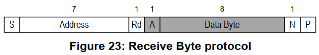
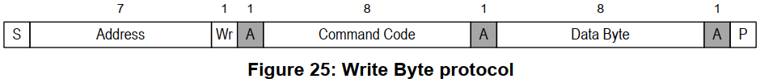
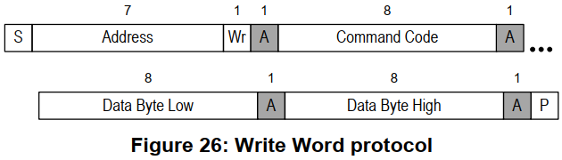
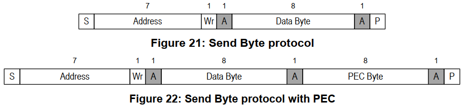
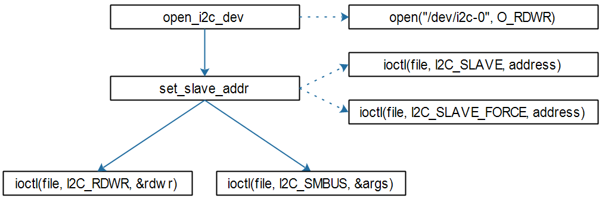
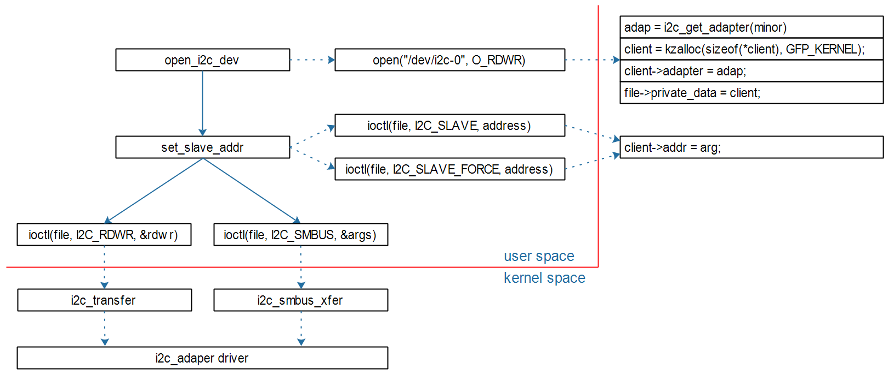
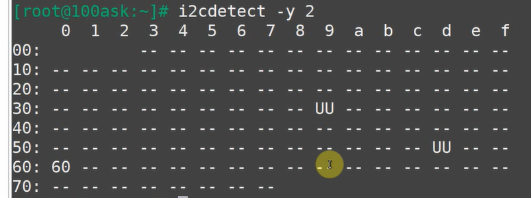

最首先，学会从 linux文档中寻找有用的信息，和例程   Documentation 

Linux内核文档:

* `Documentation\i2c\instantiating-devices.rst`
* `Documentation\i2c\writing-clients.rst`


### 整体的结构

- **APP** 是通过调用 **i2c设备驱动层** 提供的通用函数来操作

- **i2c设备驱动层** 是通过调用 **i2c核心层** 的收发函数来实现发送

- **i2c核心层** 是通过调用 **i2c_adapter** 里面的 **i2c_algorithm 的底层发送函数 master_xfer**

- I2C Controller Driver 这一层有两个东西，一个是操作CPU内部的I2C控制器实现的底层收发函数

  另外一个是通过模拟gpio-i2c提供的 bit_xfer 底层收发函数来实现的。

  那么对于上层来说，i2c-core.c这一层提供的smbus和标准的iic收发函数，其实里面是需要传入 i2c_adapter的，所以这种实现方法和底层使用的模拟或者硬件实现是分割开的


举例:

```c
s32 i2c_smbus_read_word_data(const struct i2c_client *client, u8 command)
{
	union i2c_smbus_data data;
	int status;

    // ************ 最终还是靠这个底层函数 client->adapter 来实现收发 ********************//
	status = i2c_smbus_xfer(client->adapter, client->addr, client->flags,
				I2C_SMBUS_READ, command,
				I2C_SMBUS_WORD_DATA, &data);
	return (status < 0) ? status : data.word;
}
```


## 1  I2C系统重要的结构体


linux 内核中 I2C 比较重要的文件：

`C:\Users\Administrator\Desktop\Linux_kernel\Linux-4.9.88_new\drivers\i2c\i2c-dev.c`

`C:\Users\Administrator\Desktop\Linux_kernel\Linux-4.9.88_new\include\linux\i2c.h`

`C:\Users\Administrator\Desktop\Linux_kernel\Linux-4.9.88_new\drivers\i2c\i2c-core.c`


### 1.1  I2C master 在 linux 中的描述

```c
// I2C master 在 Linux 中使用 i2c_adapter 来描述

/*
 * i2c_adapter is the structure used to identify a physical i2c bus along
 * with the access algorithms necessary to access it.
 */

// i2c_adapter 是用来标识物理i2c总线以及访问它所需的访问算法的结构。
```

```c
struct i2c_adapter {
	struct module *owner;
	unsigned int class;		  /* classes to allow probing for */
    
    // I2C 算法，比较重要
	const struct i2c_algorithm *algo; /* the algorithm to access the bus */
	void *algo_data;

	/* data fields that are valid for all devices	*/
	const struct i2c_lock_operations *lock_ops;
	struct rt_mutex bus_lock;
	struct rt_mutex mux_lock;

	int timeout;			/* in jiffies */  // 发送超时函数
	int retries;                              // 失败时，重复发送的次数
	struct device dev;		/* the adapter device */

	int nr;  // 第几个 I2C 控制器（或者是第几条 I2C 总线）
	char name[48];
	struct completion dev_released;

	struct mutex userspace_clients_lock;
	struct list_head userspace_clients;

	struct i2c_bus_recovery_info *bus_recovery_info;
	const struct i2c_adapter_quirks *quirks;
};
```


```c
struct i2c_algorithm {
	/* If an adapter algorithm can't do I2C-level access, set master_xfer
	   to NULL. If an adapter algorithm can do SMBus access, set
	   smbus_xfer. If set to NULL, the SMBus protocol is simulated
	   using common I2C messages */
    
	/* master_xfer should return the number of messages successfully
	   processed, or a negative value on error */
    // Master_xfer应该返回成功处理的消息数，或者在错误时返回负值
    
    
    // I2C 主控发送函数
	int (*master_xfer)(struct i2c_adapter *adap, struct i2c_msg *msgs,
			   int num);
	int (*smbus_xfer) (struct i2c_adapter *adap, u16 addr,
			   unsigned short flags, char read_write,
			   u8 command, int size, union i2c_smbus_data *data);

	/* To determine what the adapter supports */
	u32 (*functionality) (struct i2c_adapter *);

#if IS_ENABLED(CONFIG_I2C_SLAVE)
	int (*reg_slave)(struct i2c_client *client);
	int (*unreg_slave)(struct i2c_client *client);
#endif
};
```


以后我们想使用 I2C 发送数据，需要通过 `int nr` 序号来找到 `i2c_adapter` ，然后使用里面的 `struct i2c_algorithm` 中的 `master_xfer` 函数来发送数据。


### 1.2  I2C client 在 linux 中的描述

```c
// I2C client 在 Linux 中使用 i2c_client 来描述

/*
 * An i2c_client identifies a single device (i.e. chip) connected to an
 * i2c bus. The behaviour exposed to Linux is defined by the driver
 * managing the device. 
 */

// i2c客户 代表 连接到i2c总线的单个设备(即芯片)
```

```c
struct i2c_client {
	unsigned short flags;		/* div., see below		*/
    
    // 最重要的就是 I2C 从设备的地址，这里默认是 7位的
	unsigned short addr;		/* chip address - NOTE: 7bit	*/
					/* addresses are stored in the	*/
					/* _LOWER_ 7 bits		*/
	char name[I2C_NAME_SIZE];
    
    // 这个 I2C 设备挂在哪一个 i2c_adapter 下面，这里有一个 i2c_adapter 指针指向它
	struct i2c_adapter *adapter;	/* the adapter we sit on	*/
	struct device dev;		/* the device structure		*/
	int irq;			/* irq issued by device		*/
	struct list_head detected;
#if IS_ENABLED(CONFIG_I2C_SLAVE)
	i2c_slave_cb_t slave_cb;	/* callback for slave mode	*/
#endif
};
```


### 1.3  I2C  传入数据  在 linux 中的描述

```c
struct i2c_msg {
    // i2c_client 设备地址
	__u16 addr;	/* slave address */
    // 表示是读还是写
	__u16 flags;
    
#define I2C_M_RD		0x0001	/* read data, from slave to master */
					/* I2C_M_RD is guaranteed to be 0x0001! */
#define I2C_M_TEN		0x0010	/* this is a ten bit chip address */
#define I2C_M_RECV_LEN		0x0400	/* length will be first received byte */
#define I2C_M_NO_RD_ACK		0x0800	/* if I2C_FUNC_PROTOCOL_MANGLING */
#define I2C_M_IGNORE_NAK	0x1000	/* if I2C_FUNC_PROTOCOL_MANGLING */
#define I2C_M_REV_DIR_ADDR	0x2000	/* if I2C_FUNC_PROTOCOL_MANGLING */
#define I2C_M_NOSTART		0x4000	/* if I2C_FUNC_NOSTART */
#define I2C_M_STOP		0x8000	/* if I2C_FUNC_PROTOCOL_MANGLING */
    
    // 一个消息包的长度
	__u16 len;		/* msg length */
    // 指向消息包的基地址的指针，真正的要传输的数据：应该可以传输任意类型的数据
	__u8 *buf;		/* pointer to msg data */
};
```


我们分析这个 `mater_xfer` 传输函数，

- 其里面需要传输 i2c_adapter 参数
- i2c_msg是消息的基地址，应该可以传输多个i2c_msg
- num应该是传输几个 i2c_msg 
- 为什么没有列出 i2c_client 形参呢，因为 i2c_msg  中已经包含了 i2c_client 的地址信息，靠这个就能找到设备了

```c
int (*master_xfer)(struct i2c_adapter *adap, struct i2c_msg *msgs, int num);
```


#### 1.3.1 更加简单的 I2C 收发函数


查看 `i2c-dev.c` 中的 `read` 和 `write` 函数就可以知道

```c
i2c_master_send(client, tmp, count)
```

```c
i2c_master_recv(client, tmp, count);
```


```c
static ssize_t i2cdev_write(struct file *file, const char __user *buf,
		size_t count, loff_t *offset)
{
	int ret;
	char *tmp;
	struct i2c_client *client = file->private_data;

	if (count > 8192)
		count = 8192;

	tmp = memdup_user(buf, count);
	if (IS_ERR(tmp))
		return PTR_ERR(tmp);

	pr_debug("i2c-dev: i2c-%d writing %zu bytes.\n",
		iminor(file_inode(file)), count);

	ret = i2c_master_send(client, tmp, count);
	kfree(tmp);
	return ret;
}
```


```c
static ssize_t i2cdev_read(struct file *file, char __user *buf, size_t count,
		loff_t *offset)
{
	char *tmp;
	int ret;

	struct i2c_client *client = file->private_data;

	if (count > 8192)
		count = 8192;

	tmp = kmalloc(count, GFP_KERNEL);
	if (tmp == NULL)
		return -ENOMEM;

	pr_debug("i2c-dev: i2c-%d reading %zu bytes.\n",
		iminor(file_inode(file)), count);

	ret = i2c_master_recv(client, tmp, count);
	if (ret >= 0)
		ret = copy_to_user(buf, tmp, count) ? -EFAULT : ret;
	kfree(tmp);
	return ret;
}
```


#### 1.3.2  I2C传输多个 megs 的分析

```c
// 为什么需要发送多个 msgs 呢？（个数由 num 来指定）
int (*master_xfer)(struct i2c_adapter *adap, struct i2c_msg *msgs, int num);
```

是因为比如我们需要访问 EEPROM，通过上面的发送函数，里面 `i2c_msg` 里面的 `addr` 地址已经可以找到 `EEPROM` 设备了，那么我想读取 EEPROM 中某一个内存地址的数据时，就需要发送2次：

- 第一次是 `i2c_msg` 中 `flags` 标记为写，消息中存放要读取的 EEPROM 的内存地址
- 第二次是 `i2c_msg` 中 `flags` 标记为读，读取返回来的数据


举例：设备地址为0x50的EEPROM，要读取它里面存储地址为0x10的一个字节，应该构造几个i2c_msg？

* 要构造2个i2c_msg

* 第一个i2c_msg表示写操作，把要访问的存储地址0x10发给设备

* 第二个i2c_msg表示读操作

* 代码如下

```c
u8 data_addr = 0x10;
i8 data;
struct i2c_msg msgs[2];

msgs[0].addr   = 0x50;
msgs[0].flags  = 0;
msgs[0].len    = 1;
msgs[0].buf    = &data_addr;

msgs[1].addr   = 0x50;
msgs[1].flags  = I2C_M_RD;
msgs[1].len    = 1;
msgs[1].buf    = &data;
```


## 2 Linux中 I2C 总体框架

### 2.1 APP 访问 I2C 总线上的设备过程分析


#### 

 


生成 i2c_client 的方法很多，我们可以在应用程序中来创建 i2c_client 


## 3 SMBUS协议

参考资料：

* Linux内核文档：`Documentation\i2c\smbus-protocol.rst`

* SMBus协议：

  * http://www.smbus.org/specs/
* `SMBus_3_0_20141220.pdf`
* I2CTools: `https://mirrors.edge.kernel.org/pub/software/utils/i2c-tools/`

### 3.1 SMBus是I2C协议的一个子集

SMBus: System Management Bus，系统管理总线。
SMBus最初的目的是为智能电池、充电电池、其他微控制器之间的通信链路而定义的。
SMBus也被用来连接各种设备，包括电源相关设备，系统传感器，EEPROM通讯设备等等。
SMBus 为系统和电源管理这样的任务提供了一条控制总线，使用 SMBus 的系统，设备之间发送和接收消息都是通过 SMBus，而不是使用单独的控制线，这样可以节省设备的管脚数。
SMBus是基于I2C协议的，SMBus要求更严格，SMBus是I2C协议的子集。


SMBus有哪些更严格的要求？跟一般的I2C协议有哪些差别？

* VDD的极限值不一样

  * I2C协议：范围很广，甚至讨论了高达12V的情况
  * SMBus：1.8V~5V

* 最小时钟频率、最大的`Clock Stretching `

  * Clock Stretching含义：某个设备需要更多时间进行内部的处理时，它可以把SCL拉低占住I2C总线

  * I2C协议：时钟频率最小值无限制，Clock Stretching时长也没有限制
  * SMBus：**时钟频率最小值是10KHz**，Clock Stretching的最大时间值也有限制

* 地址回应(Address Acknowledge)

  * 一个I2C设备接收到它的设备地址后，是否必须发出回应信号？
  * I2C协议：没有强制要求必须发出回应信号
  * SMBus：**强制要求必须发出回应信号**，这样对方才知道该设备的状态：busy，failed，或是被移除了

* SMBus协议明确了数据的传输格式

  * I2C协议：它只定义了怎么传输数据，但是并没有定义数据的格式，这完全由设备来定义
  * SMBus：定义了几种数据格式(后面分析)

* REPEATED START Condition(**重复发出S信号**)

  * 比如读EEPROM时，涉及2个操作：

    * 把存储地址发给设备
    * 读数据

  * **在写、读之间，可以不发出P信号**，而是直接发出S信号：这个S信号就是`REPEATED START`

  * 如下图所示
    

    

    

    

* SMBus Low Power Version 

  * SMBus也有低功耗的版本


### 3.2 SMBus协议分析

这里面的函数有2套：

- 来自 i2c-tools ，给应用程序用的
- 来自内核 i2c-core.c，给驱动程序用的


对于I2C协议，它只定义了怎么传输数据，但是并没有定义数据的格式，这完全由设备来定义。
对于SMBus协议，它定义了几种数据格式。


**注意**：

* 下面文档中的`Functionality flag`是Linux的某个I2C控制器驱动所支持的功能。
* 比如`Functionality flag: I2C_FUNC_SMBUS_QUICK`，表示需要I2C控制器支持`SMBus Quick Command`

#### 3.2.1 symbols(符号)

```shell
S     (1 bit) : Start bit(开始位)
Sr    (1 bit) : 重复的开始位
P     (1 bit) : Stop bit(停止位)
R/W#  (1 bit) : Read/Write bit. Rd equals 1, Wr equals 0.(读写位)
A, N  (1 bit) : Accept and reverse accept bit.(回应位)
Address(7 bits): I2C 7 bit address. Note that this can be expanded as usual to
                get a 10 bit I2C address.
                (地址位，7位地址)
Command Code  (8 bits): Command byte, a data byte which often selects a register on
                the device.
                (命令字节，一般用来选择芯片内部的寄存器)
Data Byte (8 bits): A plain data byte. Sometimes, I write DataLow, DataHigh
                for 16 bit data.
                (数据字节，8位；如果是16位数据的话，用2个字节来表示：DataLow、DataHigh)
Count (8 bits): A data byte containing the length of a block operation.
				(在block操作总，表示数据长度)
[..]:           Data sent by I2C device, as opposed to data sent by the host
                adapter.
                (中括号表示I2C设备发送的数据，没有中括号表示host adapter发送的数据)
```


#### 3.2.2 SMBus Quick Command


只是用来发送一位数据：R/W#本意是用来表示读或写，但是在SMBus里可以用来表示其他含义。
比如某些开关设备，可以根据这一位来决定是打开还是关闭。（**开关设备**）

```shell
Functionality flag: I2C_FUNC_SMBUS_QUICK
```


#### 3.2.3 SMBus Receive Byte



I2C-tools中的函数：i2c_smbus_read_byte()。
读取一个字节，Host adapter接收到一个字节后不需要发出回应信号(上图中N表示不回应)。

```shell
Functionality flag: I2C_FUNC_SMBUS_READ_BYTE
```


#### 3.2.4 SMBus Send Byte


I2C-tools中的函数：i2c_smbus_write_byte()。
发送一个字节。

```shell
Functionality flag: I2C_FUNC_SMBUS_WRITE_BYTE
```


#### 3.2.5 SMBus Read Byte


I2C-tools中的函数：i2c_smbus_read_byte_data()。

先发出`Command Code`(**它一般表示芯片内部的寄存器地址**)，再读取一个字节的数据。
上面介绍的`SMBus Receive Byte`是不发送Comand，直接读取数据。

```shell
Functionality flag: I2C_FUNC_SMBUS_READ_BYTE_DATA
```


#### 3.2.6 SMBus Read Word


I2C-tools中的函数：i2c_smbus_read_word_data()。

先发出`Command Code`(它一般表示芯片内部的寄存器地址)，再读取2个字节的数据。

```shell
Functionality flag: I2C_FUNC_SMBUS_READ_WORD_DATA
```


#### 3.2.7 SMBus Write Byte



I2C-tools中的函数：i2c_smbus_write_byte_data()。

先发出`Command Code`(它一般表示芯片内部的寄存器地址)，再发出1个字节的数据。

```shell
Functionality flag: I2C_FUNC_SMBUS_WRITE_BYTE_DATA
```


#### 3.2.8 SMBus Write Word



I2C-tools中的函数：i2c_smbus_write_word_data()。

先发出`Command Code`(它一般表示芯片内部的寄存器地址)，再发出1个字节的数据。

```shell
Functionality flag: I2C_FUNC_SMBUS_WRITE_WORD_DATA
```


#### 3.2.9 SMBus Block Read


I2C-tools中的函数：i2c_smbus_read_block_data()。

先发出`Command Code`(它一般表示芯片内部的寄存器地址)，再发起度操作：

* 先读到一个字节(Block Count)，表示后续要读的字节数
* 然后读取全部数据

```shell
Functionality flag: I2C_FUNC_SMBUS_READ_BLOCK_DATA
```


#### 3.2.10 SMBus Block Write


I2C-tools中的函数：i2c_smbus_write_block_data()。

先发出`Command Code`(它一般表示芯片内部的寄存器地址)，再发出1个字节的`Byte Conut`(表示后续要发出的数据字节数)，最后发出全部数据。

```shell
Functionality flag: I2C_FUNC_SMBUS_WRITE_BLOCK_DATA
```


#### 3.2.11 I2C Block Read

在一般的I2C协议中，也可以连续读出多个字节。
它跟`SMBus Block Read`的差别在于设备发出的第1个数据不是长度N，如下图所示：


I2C-tools中的函数：i2c_smbus_read_i2c_block_data()。

先发出`Command Code`(它一般表示芯片内部的寄存器地址)，再发出1个字节的`Byte Conut`(表示后续要发出的数据字节数)，最后发出全部数据。

```shell
Functionality flag: I2C_FUNC_SMBUS_READ_I2C_BLOCK
```


#### 3.2.12 I2C Block Write

在一般的I2C协议中，也可以连续发出多个字节。
它跟`SMBus Block Write`的差别在于发出的第1个数据不是长度N，如下图所示：


I2C-tools中的函数：i2c_smbus_write_i2c_block_data()。

先发出`Command Code`(它一般表示芯片内部的寄存器地址)，再发出1个字节的`Byte Conut`(表示后续要发出的数据字节数)，最后发出全部数据。

```shell
Functionality flag: I2C_FUNC_SMBUS_WRITE_I2C_BLOCK
```


#### 3.2.13 SMBus Block Write - Block Read Process Call

先写一块数据，再读一块数据。

```shell
Functionality flag: I2C_FUNC_SMBUS_BLOCK_PROC_CALL
```


#### 3.2.14 Packet Error Checking (PEC)

PEC是一种错误校验码，如果使用PEC，那么在P信号之前，数据发送方要发送一个字节的PEC码(它是CRC-8码)。

以`SMBus Send Byte`为例，下图中，一个未使用PEC，另一个使用PEC：




### 3.3 SMBus和I2C的建议

因为很多设备都实现了SMBus，而不是更宽泛的I2C协议，所以优先使用SMBus。
即使I2C控制器没有实现SMBus，软件方面也是可以使用I2C协议来模拟SMBus。
所以：Linux建议优先使用SMBus。


## 7 I2C adapter (I2C控制器)


使用 gpio 模拟 i2c 进行数据传输的话，由于时序的要求，在传输过程中，没办法做其他的事情，系统需要等待。

所以一般芯片上都会集成有 I2C 控制器，CPU发送完成指令之后，就由 I2C 控制器自己去完成发送的过程，此时CPU就可以去做其他事情，发送完成之后就可以产生一个中断来提醒。


## 8 分析通用的 i2c-dev.c（课程学习）

- 在第5章中，我们是通过在 APP 中，直接阅读 AT24C02 的芯片手册，然后根据逻辑调用内核中的通用I2C驱动程序 i2c-dev.c来操作外设的，这里是直接把驱动程序在 APP 中实现了。i2c-dev.c 只是提供了通用的I2C读写函数。

- 另外一种方法，就是编写自己的I2C外设驱动程序，不使用内核提供的 i2c-dev.c 来访问特定的硬件。这时候 APP就只管读取设备节点得到数据就行了。
- 之所以  i2c-dev.c 只能提供给APP应用程序来使用，是因为  i2c-dev.c  中已经写好了接口，就是给应用程序来调用的，所以在驱动程序中就不再设计一层来使用  i2c-dev.c  来操作硬件了。 i2c-tools 这个工具也是通过调用  i2c-dev.c 中提供的接口函数来实现的。
- 而我们在第5章中实现的 APP，就模仿  i2c-tools 的函数来实现的。


- 真正底层的，应该是调用 i2c.h 和 i2c-core.c 中的底层函数来实现的 i2c 设备驱动


### 8.1 分析 i2c-dev.c 

抓住三个问题：

1. 使用哪一个 I2C 控制器
2. I2C 设备的地址是多少
3. 需要传输什么数据


### 8.2 i2c-dev.c注册过程分析

 #### 8.2.1 register_chrdev的内部实现

  


#### 8.2.2 i2c-dev驱动的注册过程


### 8.3 file_operations函数分析

i2c-dev.c的核心：

```c
static const struct file_operations i2cdev_fops = {
	.owner		= THIS_MODULE,
	.llseek		= no_llseek,
	.read		= i2cdev_read,
	.write		= i2cdev_write,
	.unlocked_ioctl	= i2cdev_ioctl,
	.compat_ioctl	= compat_i2cdev_ioctl,
	.open		= i2cdev_open,
	.release	= i2cdev_release,
};
```

主要的系统调用：open, ioctl：



要理解这些接口，记住一句话：APP通过I2C Controller与I2C Device传输数据。

#### 8.3.1 i2cdev_open


#### 8.3.2 i2cdev_ioctl: I2C_SLAVE/I2C_SLAVE_FORCE


#### 8.3.3 i2cdev_ioctl: I2C_RDWR


#### 8.3.4 i2cdev_ioctl: I2C_SMBUS


#### 8.3.5 总结




## 9 分析 i2c-dev.c 源码（me）

i2c-dev并没有使用平台设备这套方法，而是采用普通的给每一个 i2c_adapter （i2c控制器）注册一个设备驱动的方式，给APP提供上层调用的应用程序标准接口。

i2c-dev.c是一个独立的驱动程序，首先从入口函数进行分析

### 9.1 入口函数

对于每一个 i2c_adpter，当加载这个驱动之后，给每一个 i2c_adpter 都注册一个字符设备驱动，以及设备节点，并且提供相应的 fops操作函数。

**问题是**：i2c_adpter 一开始是由谁来创建的？

```c
static int __init i2c_dev_init(void)
{
	int res;

    // 内核打印等级
	printk(KERN_INFO "i2c /dev entries driver\n");

    // 指定设备编号来静态注册一个字符设备，（89，0），89主设备号的所有 次设备号都注册了 
    // 这个设备驱动的设备名称为 i2c ，在 cat /proc/devices 中可以查看到设备号和设备名称
	res = register_chrdev_region(MKDEV(I2C_MAJOR, 0), I2C_MINORS, "i2c");
	if (res)
		goto out;
	
    // 创建一个 i2c系统的类，里面可以创建很多个设备，可以自动生成设备节点
    // /sys/class/i2c-dev 中可以查看到类中的设备节点
	i2c_dev_class = class_create(THIS_MODULE, "i2c-dev");
	if (IS_ERR(i2c_dev_class)) {
		res = PTR_ERR(i2c_dev_class);
		goto out_unreg_chrdev;
	}
    
	i2c_dev_class->dev_groups = i2c_groups;

	/* Keep track of adapters which will be added or removed later */
    // 跟踪以后要添加或删除的适配器，不重要
	res = bus_register_notifier(&i2c_bus_type, &i2cdev_notifier);
	if (res)
		goto out_unreg_class;

	/* Bind to already existing adapters right away */
    // 对于目前已经存在的每一个 i2c控制器，都执行 i2cdev_attach_adapter 函数
    // 里面给每一个 i2c_adapter 都创建了一个字符设备驱动(fops)和自动申请了设备节点
	i2c_for_each_dev(NULL, i2cdev_attach_adapter);

    // 因为 i2c控制器的去送函数是类似的，所以所有的 i2c控制器可以共用一套 i2cdev_fops 
    // 在具体的 read write 等函数中，通过次设备号来区分不同的 i2c_adapter
    /*
    static const struct file_operations i2cdev_fops = {
        .owner		= THIS_MODULE,
        .llseek		= no_llseek,
        .read		= i2cdev_read,
        .write		= i2cdev_write,
        .unlocked_ioctl	= i2cdev_ioctl,
        .open		= i2cdev_open,
        .release	= i2cdev_release,
    };
    */
    
	return 0;

out_unreg_class:
	class_destroy(i2c_dev_class);
out_unreg_chrdev:
	unregister_chrdev_region(MKDEV(I2C_MAJOR, 0), I2C_MINORS);
out:
	printk(KERN_ERR "%s: Driver Initialisation failed\n", __FILE__);
	return res;
}
```


```c
/* 指定设备编号来静态注册一个字符设备 */

int register_chrdev_region(dev_t from, unsigned count, const char *name);　　 

// from: 注册的指定起始设备编号,比如:MKDEV(100, 0),表示起始主设备号100, 起始次设备号为0

// count: 需要连续注册的次设备编号个数,比如: 起始次设备号为0,count=100,表示0~99的次设备号都要绑定在同一个 file_operations 操作方法结构体上

// *name:字符设备名称

// 当返回值小于0,表示注册失败
```

```c
#define MINORBITS	20
#define MINORMASK	((1U << MINORBITS) - 1)
#define I2C_MINORS	MINORMASK    =  (1<<20 -1) = 0xFFFFF   (也就是低20bit的掩码)

// 所以 I2C_MINORS 作为参数传入 register_chrdev_region 中，则相当于把这个主设备号，所有的次设备号都注册了，20bit的次设备号都绑定到这个主设备号对应的 file_operations 结构体中。

#define MAJOR(dev)	((unsigned int) ((dev) >> MINORBITS))  // 提取主设备号
#define MINOR(dev)	((unsigned int) ((dev) & MINORMASK))   // 提取次设备号
#define MKDEV(ma,mi)	(((ma) << MINORBITS) | (mi))       // 合成设备号
```

查看i2c系统的主设备号


查看类中有没有注册了设备


查看设备节点


```c
static int i2cdev_attach_adapter(struct device *dev, void *dummy)
{
	struct i2c_adapter *adap;  // i2c_adapter 就是 i2c控制器
	struct i2c_dev *i2c_dev;   // 里面包含 i2c_adapter
    
	/*struct i2c_dev {
		struct list_head list;
		struct i2c_adapter *adap; // i2c控制器相关的信息
		struct device *dev; 
		struct cdev cdev;         // 设备驱动相关的信息
	};
	*/
    
	int res;

	if (dev->type != &i2c_adapter_type)
		return 0;
	adap = to_i2c_adapter(dev);

	i2c_dev = get_free_i2c_dev(adap);
	if (IS_ERR(i2c_dev))
		return PTR_ERR(i2c_dev);

    // 创建一个设备驱动，这里是把 fops构建进cdev中
	cdev_init(&i2c_dev->cdev, &i2cdev_fops);
	i2c_dev->cdev.owner = THIS_MODULE;
    // 把 cdev注册进内核中，次设备号是 i2c_adapter中的 nr参数，添加1个字符设备驱动
	res = cdev_add(&i2c_dev->cdev, MKDEV(I2C_MAJOR, adap->nr), 1);
	if (res)
		goto error_cdev;

    
	/* register this i2c device with the driver core */
    // 在类下面创建设备，自动创建设备节点
	i2c_dev->dev = device_create(i2c_dev_class, &adap->dev,
				     MKDEV(I2C_MAJOR, adap->nr), NULL,
				     "i2c-%d", adap->nr);  // 设备节点就是 i2c-%d 的形式
	if (IS_ERR(i2c_dev->dev)) {
		res = PTR_ERR(i2c_dev->dev);
		goto error;
	}

	pr_debug("i2c-dev: adapter [%s] registered as minor %d\n",
		 adap->name, adap->nr);
	return 0;
error:
	cdev_del(&i2c_dev->cdev);
error_cdev:
	put_i2c_dev(i2c_dev);
	return res;
}
```

```c
// 对于每一个 i2c adapter,都调用这个函数

struct device *dev;

while ((dev = next_device(&i)) && !error)
	error = fn(dev, data);  // data=NULL
```

新型的字符设备驱动


优点：

- 可以指定具体的次设备号的范围
- 可以使用 cdev 灵活的给不同的设备注册不同 fops

网上的例子：


### 9.2 open函数

创建一个 i2c_client ，并与对应的次设备号进行绑定。

```c
static int i2cdev_open(struct inode *inode, struct file *file)
{
	unsigned int minor = iminor(inode);  // 从inode 中获取次设备号
	struct i2c_client *client;   // i2c_client代表挂在i2c控制器上的具体 i2c设备
	struct i2c_adapter *adap;    // i2c_adapter代表i2c控制器
	
    // 通过次设备号，提取出 i2c_adapter，因为 init函数给内核注册了多个 i2c_adapter
    // 当你 open的时候，就根据次设备号来找到你真正想要操作的 i2c_adapter
	adap = i2c_get_adapter(minor);
	if (!adap)
		return -ENODEV;
	
	/* This creates an anonymous i2c_client, which may later be
	 * pointed to some address using I2C_SLAVE or I2C_SLAVE_FORCE.
	 *
	 * This client is ** NEVER REGISTERED ** with the driver model
	 * or I2C core code!!  It just holds private copies of addressing
	 * information and maybe a PEC flag.
	 */
	client = kzalloc(sizeof(*client), GFP_KERNEL);  // 动态申请一块空间
	if (!client) {
		i2c_put_adapter(adap);
		return -ENOMEM;
	}
    
    // 配凑一个 i2c_client 设备的名字，  i2c-dev %d
	snprintf(client->name, I2C_NAME_SIZE, "i2c-dev %d", adap->nr);
	
    // 这个 I2C 设备挂在哪一个 i2c_adapter 下面，这里有一个 i2c_adapter 指针指向它
	client->adapter = adap;
	file->private_data = client;  // 把 i2c_client 这个结构体存入这个文件描述符 file 的私有数据中
	
	return 0;
}
```

APP应用程序，应该是 open 其中一个设备节点，然后从中提取出次设备号，虽然这个 89 的主设备号下面的所有次设备号都是共用的一套 fops，但是通过次设备号可以划分操作不同的功能。


### 9.3 read函数

APP系统读取数据，驱动程序想要在 read函数中读取传感器的数据，然后返回给应用程序APP。

```c
static ssize_t i2cdev_read(struct file *file, char __user *buf, size_t count,
		loff_t *offset)
{
	char *tmp;
	int ret;

    // 把 file 中的私有数据提取出来
	struct i2c_client *client = file->private_data;

    // 要读取的字节数超过了 8192，就维持为 8192
	if (count > 8192)
		count = 8192;

    // 申请 count个字节的内存空间
	tmp = kmalloc(count, GFP_KERNEL);
	if (tmp == NULL)
		return -ENOMEM;

    // 没有 inode形参来获得次设备号，还可以从 file中获得次设备号
    // iminor(file_inode(file))
	pr_debug("i2c-dev: i2c-%d reading %zu bytes.\n",
		iminor(file_inode(file)), count);

    // 一层层下去，直到调用底层的传输函数
	ret = i2c_master_recv(client, tmp, count);
	if (ret >= 0)
        // 读取数据成功之后，就将数据拷贝会用户空间
		ret = copy_to_user(buf, tmp, count) ? -EFAULT : ret;
    
    // 释放动态申请的内存空间
	kfree(tmp);
	return ret;
}
```

这个函数关联到下面这些函数

```c
i2cdev_read  // i2c-dev.c                                
    i2c_master_recv  // i2c-core.c                                             
    	i2c_transfer  // i2c-core.c
    		__i2c_transfer  // i2c-core.c
    			adap->algo->master_xfer(adap, msgs, num)

const struct i2c_client *client    
	struct i2c_adapter *adap = client->adapter;     
    	adap->algo->master_xfer(adap, msgs, num)     // 一层层找到 发送函数

// 这个底层函数 master_xfer 就只管发送，发送还是接收，由 i2c_msg里面的 flags标志位来判断  
msg.flags |= I2C_M_RD;    // 读取设备的数据      
```


### 9.4 write函数

APP想写数据给 I2C 设备，通过 i2c-dev.c 这个一层，再调用到 i2c-core.c 这一层，最终通过 CPU 的I2C控制器的寄存器，控制SCL和SDA总线写数据给设备。

```c
static ssize_t i2cdev_write(struct file *file, const char __user *buf,
		size_t count, loff_t *offset)
{
	int ret;
	char *tmp;
    
    // 把 file 中的私有数据提取出来
	struct i2c_client *client = file->private_data;

    // 要读取的字节数超过了 8192，就维持为 8192
	if (count > 8192)
		count = 8192;

    // 复制用户空间写入的字符数据
	tmp = memdup_user(buf, count);
	if (IS_ERR(tmp))  // 失败返回
		return PTR_ERR(tmp);

	pr_debug("i2c-dev: i2c-%d writing %zu bytes.\n",
		iminor(file_inode(file)), count);

    // 把用户空间要发送的内容
	ret = i2c_master_send(client, tmp, count);
	kfree(tmp);
	return ret;
}
```

`Linux-4.9.88_new\mm\util.c`

```c
void *memdup_user(const void __user *src, size_t len)
{
	void *p;

	/*
	 * Always use GFP_KERNEL, since copy_from_user() can sleep and
	 * cause pagefault, which makes it pointless to use GFP_NOFS
	 * or GFP_ATOMIC.
	 */
	p = kmalloc_track_caller(len, GFP_KERNEL);  // 申请一个内存空间
	if (!p)
		return ERR_PTR(-ENOMEM);  // 申请失败返回错误

	if (copy_from_user(p, src, len)) {  // 从用户空间复制字节内容到内存空间中
		kfree(p);                 // 复制失败就是否内存空间
		return ERR_PTR(-EFAULT);  // 返回错误
	}

	return p;  // 返回内核中的内存空间指针
}
```

这个函数关联到下面这些函数

```c
i2cdev_write  // i2c-dev.c
    i2c_master_send  // i2c-core.c
    	i2c_transfer  // i2c-core.c
    		__i2c_transfer  // i2c-core.c
    			adap->algo->master_xfer(adap, msgs, num) 		
```

- 综上所述，不管是写还是读，最终都是调用到 `i2c-core.c` 中的函数，再调用到 `adap->algo->master_xfer(adap, msgs, num)`  函数，这里面可以根据 `i2c_msg` 来判断是发送还是接收。

- 猜测，`i2c-dev.c` 也只是起到一个中转的作用，其最终还是通过调用到 `i2c-core.c` 中的函数，再调用到 `master_xfer` 这个函数与更加底层的内容进行打交道。
- 猜测，`master_xfer` 内部会解析 `i2c_msg`，然后把数据填写到 `imx6ull` 的 `i2c` 控制器的寄存器上，从而实现与挂接在该 `i2c` 控制器上的外部设备进行通信。
- 写就是通过 `master_xfer` 控制寄存器，发送数据到具体的 `i2c` 设备上。
- 写就是通过 `master_xfer` 读取寄存器，将具体的 `i2c` 设备返回的数据读取出来。


### 9.5 ioctl函数

ioctl 操作应该有顺序的，先通过一些指令设置一些参数，然后再设置，最后再通过 ioctl 调用一些收发函数，是否采用 SMBUS 模式也是通过 参数来指定。

（大部分是操作 i2c_client 这个对象）

```c
// 参数：file   文件句柄
// 参数：cmd    ioctl指令
// 参数：arg    根据【ioctl指令】的不同，其含义也不同
static long i2cdev_ioctl(struct file *file, unsigned int cmd, unsigned long arg)
{
    // 获取 i2c_client 
	struct i2c_client *client = file->private_data;
	unsigned long funcs;

	dev_dbg(&client->adapter->dev, "ioctl, cmd=0x%02x, arg=0x%02lx\n",
		cmd, arg);

    // 根据 cmd 这个 ioctl指令，执行不同的内容
	switch (cmd) {
            
    // 这个 ioctl 指令设置【设备从机地址】
	case I2C_SLAVE:
	case I2C_SLAVE_FORCE:        /* 如果已经有驱动了，需要强制访问 */
		if ((arg > 0x3ff) ||
		    (((client->flags & I2C_M_TEN) == 0) && arg > 0x7f))
			return -EINVAL;
        
        // 如果内核中有驱动了的 I2C 设备，这里使用 ioctl访问设备的话，需要判断这个地址有没有被占用
        // 如果被占用了，就返回错误
		if (cmd == I2C_SLAVE && i2cdev_check_addr(client->adapter, arg))
			return -EBUSY;
            
		/* REVISIT: address could become busy later */
        // 把地址设置到 client->addr 中
		client->addr = arg;
		return 0;
    
    // 这个 ioctl 指令设置【10位地址模式】
	case I2C_TENBIT:
		if (arg)
			client->flags |= I2C_M_TEN;
		else
			client->flags &= ~I2C_M_TEN;
		return 0;
    
    // 这个应该用的不多   
	case I2C_PEC:
		/*
		 * Setting the PEC flag here won't affect kernel drivers,
		 * which will be using the i2c_client node registered with
		 * the driver model core.  Likewise, when that client has
		 * the PEC flag already set, the i2c-dev driver won't see
		 * (or use) this setting.
		 */
		if (arg)
			client->flags |= I2C_CLIENT_PEC;
		else
			client->flags &= ~I2C_CLIENT_PEC;
		return 0;
                
    // 如果自己实现了 i2c_adapter 中的 argthm中的函数
    // 就调用这个函数来执行，参数为 arg 
	case I2C_FUNCS:
		funcs = i2c_get_functionality(client->adapter);
		return put_user(funcs, (unsigned long __user *)arg);
            
    // 这个 ioctl 指令设置【采用 通用的 I2C 收发函数】 
	case I2C_RDWR:
		return i2cdev_ioctl_rdwr(client, arg);

    // 这个 ioctl 指令设置【采用 SMBUS 收发函数】
    // 通过 arg 来区分不同的功能
	case I2C_SMBUS:
		return i2cdev_ioctl_smbus(client, arg);

    // 这个 ioctl 指令设置【重复发送的次数】  
	case I2C_RETRIES:
		client->adapter->retries = arg;
		break;
            
    // 这个 ioctl 指令设置【每次发送超时时间】 
	case I2C_TIMEOUT:
		/* For historical reasons, user-space sets the timeout
		 * value in units of 10 ms.
		 */
		client->adapter->timeout = msecs_to_jiffies(arg * 10);
		break;
            
	default:
		/* NOTE:  returning a fault code here could cause trouble
		 * in buggy userspace code.  Some old kernel bugs returned
		 * zero in this case, and userspace code might accidentally
		 * have depended on that bug.
		 */
		return -ENOTTY;
	}
	return 0;
}
```


### 9.5A i2cdev_ioctl_smbus函数

```c
static noinline int i2cdev_ioctl_smbus(struct i2c_client *client,
		unsigned long arg)
{
    // 把 arg 转换成 i2c_smbus_ioctl_data 类型数据，方便进行解析
	struct i2c_smbus_ioctl_data data_arg;  
	union i2c_smbus_data temp = {};
	int datasize, res;
	
    // 将应用程序发送来数据 arg 拷贝到驱动空间的内存中
	if (copy_from_user(&data_arg,
			   (struct i2c_smbus_ioctl_data __user *) arg,
			   sizeof(struct i2c_smbus_ioctl_data)))
		return -EFAULT;
    
    // SMBUS 的事务类型
	if ((data_arg.size != I2C_SMBUS_BYTE) &&
	    (data_arg.size != I2C_SMBUS_QUICK) &&
	    (data_arg.size != I2C_SMBUS_BYTE_DATA) &&
	    (data_arg.size != I2C_SMBUS_WORD_DATA) &&
	    (data_arg.size != I2C_SMBUS_PROC_CALL) &&
	    (data_arg.size != I2C_SMBUS_BLOCK_DATA) &&
	    (data_arg.size != I2C_SMBUS_I2C_BLOCK_BROKEN) &&
	    (data_arg.size != I2C_SMBUS_I2C_BLOCK_DATA) &&
	    (data_arg.size != I2C_SMBUS_BLOCK_PROC_CALL)) {
		dev_dbg(&client->adapter->dev,
			"size out of range (%x) in ioctl I2C_SMBUS.\n",
			data_arg.size);
		return -EINVAL;
	}
    
	/* Note that I2C_SMBUS_READ and I2C_SMBUS_WRITE are 0 and 1,
	   so the check is valid if size==I2C_SMBUS_QUICK too. */
    
    // SMBUS 判断是读还是写方向
	if ((data_arg.read_write != I2C_SMBUS_READ) &&
	    (data_arg.read_write != I2C_SMBUS_WRITE)) {
		dev_dbg(&client->adapter->dev,
			"read_write out of range (%x) in ioctl I2C_SMBUS.\n",
			data_arg.read_write);
		return -EINVAL;
	}

	/* Note that command values are always valid! */
	// 写1字节 （或者） I2C_SMBUS_QUICK是只是用来发送一位数据
	if ((data_arg.size == I2C_SMBUS_QUICK) ||
	    ((data_arg.size == I2C_SMBUS_BYTE) &&
	    (data_arg.read_write == I2C_SMBUS_WRITE)))
		/* These are special: we do not use data */
        
        // 这个发送函数有点东西，提供了 smbus_xfer 就用，没提供就用模拟的 smbus_xfer
		return i2c_smbus_xfer(client->adapter, client->addr,
				      client->flags, data_arg.read_write,
				      data_arg.command, data_arg.size, NULL);

    // 判断数据是否为空
	if (data_arg.data == NULL) {
		dev_dbg(&client->adapter->dev,
			"data is NULL pointer in ioctl I2C_SMBUS.\n");
		return -EINVAL;
	}

    // 判断数据类型，1字节还是2字节还是数据包
	if ((data_arg.size == I2C_SMBUS_BYTE_DATA) ||
	    (data_arg.size == I2C_SMBUS_BYTE))
		datasize = sizeof(data_arg.data->byte);
	else if ((data_arg.size == I2C_SMBUS_WORD_DATA) ||
		 (data_arg.size == I2C_SMBUS_PROC_CALL))
		datasize = sizeof(data_arg.data->word);
	else /* size == smbus block, i2c block, or block proc. call */
		datasize = sizeof(data_arg.data->block);

    // 各种各样不同的 SMBUS 发送函数 
	if ((data_arg.size == I2C_SMBUS_PROC_CALL) ||
	    (data_arg.size == I2C_SMBUS_BLOCK_PROC_CALL) ||
	    (data_arg.size == I2C_SMBUS_I2C_BLOCK_DATA) ||
	    (data_arg.read_write == I2C_SMBUS_WRITE)) {
		if (copy_from_user(&temp, data_arg.data, datasize))
			return -EFAULT;
	}
	if (data_arg.size == I2C_SMBUS_I2C_BLOCK_BROKEN) {
		/* Convert old I2C block commands to the new
		   convention. This preserves binary compatibility. */
		data_arg.size = I2C_SMBUS_I2C_BLOCK_DATA;
		if (data_arg.read_write == I2C_SMBUS_READ)
			temp.block[0] = I2C_SMBUS_BLOCK_MAX;
	}
    
    // 发送函数
	res = i2c_smbus_xfer(client->adapter, client->addr, client->flags,
	      data_arg.read_write, data_arg.command, data_arg.size, &temp);
	if (!res && ((data_arg.size == I2C_SMBUS_PROC_CALL) ||
		     (data_arg.size == I2C_SMBUS_BLOCK_PROC_CALL) ||
		     (data_arg.read_write == I2C_SMBUS_READ))) {
		if (copy_to_user(data_arg.data, &temp, datasize))
			return -EFAULT;
	}
	return res;
}
```


`i2c-dev.h` 中

```c
/* This is the structure as used in the I2C_SMBUS ioctl call */
struct i2c_smbus_ioctl_data {
	__u8 read_write;
	__u8 command;
	__u32 size;  // 表示 SMBUS 的事务类型
	union i2c_smbus_data __user *data;  // 真正的数据内容
};
```

```c
/*
 * Data for SMBus Messages
 */
#define I2C_SMBUS_BLOCK_MAX	32	/* As specified in SMBus standard */
union i2c_smbus_data {
    // 1个字节
	__u8 byte;   
    // 2个字节
	__u16 word;
    // 数据块，第一个字节表示长度，最长 32+1 个字节
	__u8 block[I2C_SMBUS_BLOCK_MAX + 2]; /* block[0] is used for length */
			       /* and one more for user-space compatibility */
};
```


### 9.5B i2cdev_ioctl_smbus函数

```c
static noinline int i2cdev_ioctl_rdwr(struct i2c_client *client,
		unsigned long arg)
{
	struct i2c_rdwr_ioctl_data rdwr_arg;
	struct i2c_msg *rdwr_pa;
	u8 __user **data_ptrs;
	int i, res;

    // 拷贝用户空间传输过来的数据
	if (copy_from_user(&rdwr_arg,
			   (struct i2c_rdwr_ioctl_data __user *)arg,
			   sizeof(rdwr_arg)))
		return -EFAULT;

	/* Put an arbitrary limit on the number of messages that can
	 * be sent at once */
    // 如果消息 i2c_msg 太多了，返回错误
    // I2C_RDWR_IOCTL_MAX_MSGS = 42
	if (rdwr_arg.nmsgs > I2C_RDWR_IOCTL_MAX_MSGS)
		return -EINVAL;

    // 拷贝具体的消息内容 i2c_msg
	rdwr_pa = memdup_user(rdwr_arg.msgs,
			      rdwr_arg.nmsgs * sizeof(struct i2c_msg));
	if (IS_ERR(rdwr_pa))
		return PTR_ERR(rdwr_pa);

    // 申请 空间
	data_ptrs = kmalloc(rdwr_arg.nmsgs * sizeof(u8 __user *), GFP_KERNEL);
	if (data_ptrs == NULL) {
		kfree(rdwr_pa);
		return -ENOMEM;
	}

	res = 0;
	for (i = 0; i < rdwr_arg.nmsgs; i++) {
		/* Limit the size of the message to a sane amount */
		if (rdwr_pa[i].len > 8192) {
			res = -EINVAL;
			break;
		}

		data_ptrs[i] = (u8 __user *)rdwr_pa[i].buf;
		rdwr_pa[i].buf = memdup_user(data_ptrs[i], rdwr_pa[i].len);
		if (IS_ERR(rdwr_pa[i].buf)) {
			res = PTR_ERR(rdwr_pa[i].buf);
			break;
		}

		/*
		 * If the message length is received from the slave (similar
		 * to SMBus block read), we must ensure that the buffer will
		 * be large enough to cope with a message length of
		 * I2C_SMBUS_BLOCK_MAX as this is the maximum underlying bus
		 * drivers allow. The first byte in the buffer must be
		 * pre-filled with the number of extra bytes, which must be
		 * at least one to hold the message length, but can be
		 * greater (for example to account for a checksum byte at
		 * the end of the message.)
		 */
		if (rdwr_pa[i].flags & I2C_M_RECV_LEN) {
			if (!(rdwr_pa[i].flags & I2C_M_RD) ||
			    rdwr_pa[i].buf[0] < 1 ||
			    rdwr_pa[i].len < rdwr_pa[i].buf[0] +
					     I2C_SMBUS_BLOCK_MAX) {
				res = -EINVAL;
				break;
			}

			rdwr_pa[i].len = rdwr_pa[i].buf[0];
		}
	}
	if (res < 0) {
		int j;
		for (j = 0; j < i; ++j)
			kfree(rdwr_pa[j].buf);
		kfree(data_ptrs);
		kfree(rdwr_pa);
		return res;
	}

    // 最主要就是这里发送，也是调用底层的发送函数
	res = i2c_transfer(client->adapter, rdwr_pa, rdwr_arg.nmsgs);
	while (i-- > 0) {
		if (res >= 0 && (rdwr_pa[i].flags & I2C_M_RD)) {
			if (copy_to_user(data_ptrs[i], rdwr_pa[i].buf,
					 rdwr_pa[i].len))
				res = -EFAULT;
		}
		kfree(rdwr_pa[i].buf);
	}
	kfree(data_ptrs);
	kfree(rdwr_pa);
	return res;
}
```


```c
/* This is the structure as used in the I2C_RDWR ioctl call */
struct i2c_rdwr_ioctl_data {
	struct i2c_msg __user *msgs;	/* pointers to i2c_msgs */
	__u32 nmsgs;			/* number of i2c_msgs */
};
```


### 9.6 release函数

```c
static int i2cdev_release(struct inode *inode, struct file *file)
{
    // 把 i2c_client 对象从 file 的私有数据中提取出来
	struct i2c_client *client = file->private_data;
	
    // 解除 client 和 i2c_adapter 的关系
	i2c_put_adapter(client->adapter);
    
    // 释放在 open 函数中申请的 client 内存
	kfree(client);
    
    // 把这个 file 中的私有数据也释放了
	file->private_data = NULL;
	
	return 0;
}
```

这个函数关联到下面这些函数

```
i2cdev_release
	i2c_put_adapter
```


### 9.7 总结

```c
i2c-dev.c // 这一层，就是通过 open 函数，创建一个 i2c_client  -->  对应一个设备
		  // open函数中只做了简单的初始化：
          // （1）i2c_client 对应哪一个 i2c_adapter
          // （2）i2c_client 的名字初始化

i2c-dev.c // 能操作到具体的 I2C 设备，其实是通过 i2c_msg 中的 addr 设备地址来找到的

```


总的来说，i2c-dev.c 就是提供了一套上层可以调用的接口函数，然后底层都是通过 i2c-core.c 中实现的收发函数来实现的，最终还是调用到 i2c_adapter.c 中提供的 argthm_xfer 发送函数


## 10 i2c-core.c文件分析（me）

### 10.1 i2c_master_recv 函数


```c
/**
 * i2c_master_recv - issue a single I2C message in master receive mode
 * @client: Handle to slave device
 * @buf: Where to store data read from slave
 * @count: How many bytes to read, must be less than 64k since msg.len is u16
 *
 * Returns negative errno, or else the number of bytes read.
 */
int i2c_master_recv(const struct i2c_client *client, char *buf, int count)
{
    // 从 i2c_client 中提取出 i2c_adapter
	struct i2c_adapter *adap = client->adapter;
    
    // i2c的消息包
	struct i2c_msg msg;
	int ret;

    // 下面就是要设置好 i2c_msg
	msg.addr = client->addr;  // 这个 i2c_msg 要发送给那个设备的设备地址
	msg.flags = client->flags & I2C_M_TEN;
	msg.flags |= I2C_M_RD;    // 读取设备的数据
	msg.len = count;  // 读取多少个字节数据
	msg.buf = buf;    // buf是一个地址，读取到的数据存储在 buf 中

    // 采用 i2c_adapter这个 i2c控制器，发送的消息是 msg，发送1个msg
	ret = i2c_transfer(adap, &msg, 1);

	/*
	 * If everything went ok (i.e. 1 msg received), return #bytes received,
	 * else error code.
	 */
	return (ret == 1) ? count : ret;
}
EXPORT_SYMBOL(i2c_master_recv);
```

### 10.2 i2c_transfer函数

```c
/**
 * i2c_transfer - execute a single or combined I2C message
 * @adap: Handle to I2C bus
 * @msgs: One or more messages to execute before STOP is issued to
 *	terminate the operation; each message begins with a START.
 * @num: Number of messages to be executed.
 *
 * Returns negative errno, else the number of messages executed.
 *
 * Note that there is no requirement that each message be sent to
 * the same slave address, although that is the most common model.
 */
int i2c_transfer(struct i2c_adapter *adap, struct i2c_msg *msgs, int num)
{
	int ret;

	/* REVISIT the fault reporting model here is weak:
	 *
	 *  - When we get an error after receiving N bytes from a slave,
	 *    there is no way to report "N".
	 *
	 *  - When we get a NAK after transmitting N bytes to a slave,
	 *    there is no way to report "N" ... or to let the master
	 *    continue executing the rest of this combined message, if
	 *    that's the appropriate response.
	 *
	 *  - When for example "num" is two and we successfully complete
	 *    the first message but get an error part way through the
	 *    second, it's unclear whether that should be reported as
	 *    one (discarding status on the second message) or errno
	 *    (discarding status on the first one).
	 */

    // 检查 i2c_adapter 中的 algo->master_xfer 这个发送函数是否存在
	if (adap->algo->master_xfer) {
        
#ifdef DEBUG  // 调试信息，不用管这个分支
		for (ret = 0; ret < num; ret++) {
			dev_dbg(&adap->dev,
				"master_xfer[%d] %c, addr=0x%02x, len=%d%s\n",
				ret, (msgs[ret].flags & I2C_M_RD) ? 'R' : 'W',
				msgs[ret].addr, msgs[ret].len,
				(msgs[ret].flags & I2C_M_RECV_LEN) ? "+" : "");
		}
#endif

		if (in_atomic() || irqs_disabled()) {
			ret = i2c_trylock_bus(adap, I2C_LOCK_SEGMENT);
			if (!ret)
				/* I2C activity is ongoing. */
				return -EAGAIN;
		} else {
			i2c_lock_bus(adap, I2C_LOCK_SEGMENT);
		}

        // 主要是这个发送函数
		ret = __i2c_transfer(adap, msgs, num);
        
		i2c_unlock_bus(adap, I2C_LOCK_SEGMENT);

		return ret;
        
	} else {
        // 没有发送函数，就返回错误
		dev_dbg(&adap->dev, "I2C level transfers not supported\n");
		return -EOPNOTSUPP;
	}
}
```

### 10.3 __i2c_transfer函数

```c
/**
 * __i2c_transfer - unlocked flavor of i2c_transfer
 * @adap: Handle to I2C bus
 * @msgs: One or more messages to execute before STOP is issued to
 *	terminate the operation; each message begins with a START.
 * @num: Number of messages to be executed.
 *
 * Returns negative errno, else the number of messages executed.
 *
 * Adapter lock must be held when calling this function. No debug logging
 * takes place. adap->algo->master_xfer existence isn't checked.
 */
int __i2c_transfer(struct i2c_adapter *adap, struct i2c_msg *msgs, int num)
{
	unsigned long orig_jiffies;
	int ret, try;

	if (adap->quirks && i2c_check_for_quirks(adap, msgs, num))
		return -EOPNOTSUPP;

	/* i2c_trace_msg gets enabled when tracepoint i2c_transfer gets
	 * enabled.  This is an efficient way of keeping the for-loop from
	 * being executed when not needed.
	 */
	if (static_key_false(&i2c_trace_msg)) {
		int i;
		for (i = 0; i < num; i++)
			if (msgs[i].flags & I2C_M_RD)
				trace_i2c_read(adap, &msgs[i], i);
			else
				trace_i2c_write(adap, &msgs[i], i);
	}

	/* Retry automatically on arbitration loss */
    // 仲裁失败时，重复发送
	orig_jiffies = jiffies;
    // 尝试重复发送 adap->retries 次
	for (ret = 0, try = 0; try <= adap->retries; try++) {
        // 真正的底层发送函数
		ret = adap->algo->master_xfer(adap, msgs, num);
        
        // i2c_adapter 中有下面两个成员
        // 	int timeout;			/* in jiffies */  // 发送超时函数
		// int retries;                              // 失败时，重复发送的次数
        
		if (ret != -EAGAIN)
			break;
		if (time_after(jiffies, orig_jiffies + adap->timeout))
			break;
	}
	
	if (static_key_false(&i2c_trace_msg)) {
		int i;
		for (i = 0; i < ret; i++)
			if (msgs[i].flags & I2C_M_RD)
				trace_i2c_reply(adap, &msgs[i], i);
		trace_i2c_result(adap, i, ret);
	}

	return ret;
}
```


### 10.4 i2c_master_send 函数

```c
int i2c_master_send(const struct i2c_client *client, const char *buf, int count)
{
	int ret;
	struct i2c_adapter *adap = client->adapter;
	struct i2c_msg msg;

    // 配凑 i2c_msg
	msg.addr = client->addr;
	msg.flags = client->flags & I2C_M_TEN;
	msg.len = count;
	msg.buf = (char *)buf;

    // 发送函数
	ret = i2c_transfer(adap, &msg, 1);

	/*
	 * If everything went ok (i.e. 1 msg transmitted), return #bytes
	 * transmitted, else error code.
	 */
	return (ret == 1) ? count : ret;
}
```


### 10.5 i2c_transfer函数


```c
int i2c_transfer(struct i2c_adapter *adap, struct i2c_msg *msgs, int num)
{
	int ret;

	/* REVISIT the fault reporting model here is weak:
	 *
	 *  - When we get an error after receiving N bytes from a slave,
	 *    there is no way to report "N".
	 *
	 *  - When we get a NAK after transmitting N bytes to a slave,
	 *    there is no way to report "N" ... or to let the master
	 *    continue executing the rest of this combined message, if
	 *    that's the appropriate response.
	 *
	 *  - When for example "num" is two and we successfully complete
	 *    the first message but get an error part way through the
	 *    second, it's unclear whether that should be reported as
	 *    one (discarding status on the second message) or errno
	 *    (discarding status on the first one).
	 */

	if (adap->algo->master_xfer) {
#ifdef DEBUG
		for (ret = 0; ret < num; ret++) {
			dev_dbg(&adap->dev,
				"master_xfer[%d] %c, addr=0x%02x, len=%d%s\n",
				ret, (msgs[ret].flags & I2C_M_RD) ? 'R' : 'W',
				msgs[ret].addr, msgs[ret].len,
				(msgs[ret].flags & I2C_M_RECV_LEN) ? "+" : "");
		}
#endif

		if (in_atomic() || irqs_disabled()) {
			ret = i2c_trylock_bus(adap, I2C_LOCK_SEGMENT);
			if (!ret)
				/* I2C activity is ongoing. */
				return -EAGAIN;
		} else {
			i2c_lock_bus(adap, I2C_LOCK_SEGMENT);
		}

        // 还是这个发送函数
		ret = __i2c_transfer(adap, msgs, num);
		i2c_unlock_bus(adap, I2C_LOCK_SEGMENT);

		return ret;
	} else {
		dev_dbg(&adap->dev, "I2C level transfers not supported\n");
		return -EOPNOTSUPP;
	}
}
```


### 10.6 i2c_put_adapter函数

```c
void i2c_put_adapter(struct i2c_adapter *adap)
{
	if (!adap)  // 如果传入的参数为空，直接返回
		return;

    // 
	put_device(&adap->dev);
	module_put(adap->owner);
}
```

```c
void put_device(struct device *dev)
{
	/* might_sleep(); */
	if (dev)
		kobject_put(&dev->kobj);  // 就是把这个设备移除
}
```

```c
void module_put(struct module *module)
{
	int ret;

	if (module) {
		preempt_disable();  // 关闭抢占
		ret = atomic_dec_if_positive(&module->refcnt);
		WARN_ON(ret < 0);	/* Failed to put refcount */
		trace_module_put(module, _RET_IP_);
		preempt_enable();  // 打开抢占
	}
}
```


### 10.7 i2c_smbus_xfer

    // 使用模拟的 i2c_smbus，就是说，如果没有提供 i2c_smbus 函数
    // 就使用 adap->algo->master_xfer(adap, msgs, num)来模拟
```c
s32 i2c_smbus_xfer(struct i2c_adapter *adapter, u16 addr, unsigned short flags,
		   char read_write, u8 command, int protocol,
		   union i2c_smbus_data *data)
{
	unsigned long orig_jiffies;
	int try;
	s32 res;

	/* If enabled, the following two tracepoints are conditional on
	 * read_write and protocol.
	 */
	trace_smbus_write(adapter, addr, flags, read_write,
			  command, protocol, data);
	trace_smbus_read(adapter, addr, flags, read_write,
			 command, protocol);

	flags &= I2C_M_TEN | I2C_CLIENT_PEC | I2C_CLIENT_SCCB;

	if (adapter->algo->smbus_xfer) {
        // 如果 i2c_adapter 中提供了算法函数 
		i2c_lock_bus(adapter, I2C_LOCK_SEGMENT);

		/* Retry automatically on arbitration loss */
		orig_jiffies = jiffies;
		for (res = 0, try = 0; try <= adapter->retries; try++) {
            // 也是调用底层的传输函数，然后加上超时判断
			res = adapter->algo->smbus_xfer(adapter, addr, flags,
							read_write, command,
							protocol, data);
			if (res != -EAGAIN)
				break;
            // 超时判断
			if (time_after(jiffies,
				       orig_jiffies + adapter->timeout))
				break;
		}
		i2c_unlock_bus(adapter, I2C_LOCK_SEGMENT);

		if (res != -EOPNOTSUPP || !adapter->algo->master_xfer)
			goto trace;
		/*
		 * Fall back to i2c_smbus_xfer_emulated if the adapter doesn't
		 * implement native support for the SMBus operation.
		 */
	}
	
    // 使用模拟的 i2c_smbus，就是说，如果没有提供 i2c_smbus 函数
    // 就使用 adap->algo->master_xfer(adap, msgs, num)来模拟
	res = i2c_smbus_xfer_emulated(adapter, addr, flags, read_write,
				      command, protocol, data);

trace:
	/* If enabled, the reply tracepoint is conditional on read_write. */
	trace_smbus_reply(adapter, addr, flags, read_write,
			  command, protocol, data);
	trace_smbus_result(adapter, addr, flags, read_write,
			   command, protocol, res);

	return res;
}
```


## 11 I2C系统的整体层次结构

### 11.1 整体的结构

- **APP** 是通过调用 **i2c设备驱动层** 提供的通用函数来操作
- **i2c设备驱动层** 是通过调用 **i2c核心层** 的收发函数来实现发送
- **i2c核心层** 是通过调用 **i2c_adapter** 里面的 **i2c_algorithm 的底层发送函数 master_xfer**


### 11.2 I2C-Tools的访问I2C设备的2种方式 

#### 11.2.1 归纳 

**下面则个解释思路，和我们在第 9、10 章中解释的 i2c-dev.c 的结构框架是一致的**

【**i2c-dev.c中，最主要的就是 fops中的 open 和 ioctl 函数**】

I2C-Tools可以通过SMBus来访问I2C设备，也可以使用一般的I2C协议来访问I2C设备。
使用一句话概括I2C传输：**APP通过I2C Controller与I2C Device传输数据。**
在APP里，有这几个问题：

* 怎么指定I2C控制器？
  * i2c-dev.c提供为每个I2C控制器(I2C Bus、I2C Adapter)都生成一个设备节点：/dev/i2c-0、/dev/i2c-1等待（**说明**：i2c-dev.c 在init函数中就是给目前存在的 i2c_adapter 都创建一个设备节点）
  * open某个/dev/i2c-X节点，就是去访问该I2C控制器下的设备（**说明**：open某个 i2c_adapter的设备节点，就是想通过这个节点来访问i2c控制器上挂接的设备）
* 怎么指定I2C设备？  ioctl传输不同的指令，其参数 args 的含义就不同
  * 通过ioctl指定I2C设备的地址
  * ioctl(file,  I2C_SLAVE, **address**)
    * 如果该设备已经有了对应的设备驱动程序，则返回失败
  * ioctl(file,  I2C_SLAVE_FORCE, **address**)
    * 如果该设备已经有了对应的设备驱动程序
    * 但是还是想通过i2c-dev驱动来访问它
    * 则使用这个ioctl来指定I2C设备地址
* 怎么传输数据？
  * 两种方式
  * 一般的I2C方式：ioctl(file, I2C_RDWR, **&rdwr**)
  * SMBus方式：ioctl(file, I2C_SMBUS, **&args**)

#### 11.2.2 i2c-tools使用I2C的方式

##### 11.2.2.1 使用I2C方式

示例代码：i2ctransfer.c

关键是3要素要说清楚：

1. 使用哪个 i2c 控制器：在 open 设备节点的时候已经指定了
2. 要和哪一个从设备通信：使用 ioctl 指定从机地址
3. 要发送什么数据：构造好 i2c_msg 数据包，使用 ioctl 将数据包发送出去


##### 11.2.2.2 使用SMBus方式

示例代码：i2cget.c、i2cset.c

关键是3要素要说清楚：

1. 使用哪个 i2c 控制器：在 open 设备节点的时候已经指定了

2. 要和哪一个从设备通信：使用 ioctl 指定从机地址

3. 要发送什么数据：构造好 i2c_msg 数据包，使用 ioctl 将数据包发送出去

   

   **注意** “使用封装好的smbus函数” 这一部分，应该是包含在 `ioctl(file, I2C_SMBUS, &args)` 中的

   


## 12 I2C-Tools的使用（实验）

### 12.1 I2C-Tools的用法（在 imx6ull 上测试）

#### 12.1.1 列出单板所有的I2C Adapter

```c
// 列出当前的I2C Adapter(或称为I2C Bus、I2C Controller)
i2cdetect -l
```

imx6ull 有2个I2C控制器。


#### 12.1.2 打印某个I2C Adapter的支持的函数 

```c
// 打印某个I2C Adapter的Functionalities, I2CBUS为0、1、2等整数
i2cdetect -F I2CBUS
```

支持普通 I2C发送接收函数，也支持 SMBus 的特殊发送接收函数。


#### 12.1.3 看看有哪些I2C设备

```c
// 看看有哪些I2C设备, I2CBUS为0、1、2等整数
i2cdetect -y -a I2CBUS
```

UU的代表该地址有I2C设备，并且内核中已经有对应的驱动程序了。

其他数字代表该地址有I2C设备，但是内核中还没有驱动程序。


#### 12.1.4 使用SMBus收发函数

- i2cget：I2C读
  使用说明如下：

```shell
# i2cget
Usage: i2cget [-f] [-y] [-a] I2CBUS CHIP-ADDRESS [DATA-ADDRESS [MODE]]
  I2CBUS is an integer or an I2C bus name
  ADDRESS is an integer (0x03 - 0x77, or 0x00 - 0x7f if -a is given)
  MODE is one of:
    b (read byte data, default)
    w (read word data)
    c (write byte/read byte)
    Append p for SMBus PEC
```

使用示例：

```shell
// 读一个字节: I2CBUS为0、1、2等整数, 表示I2C Bus; CHIP-ADDRESS表示设备地址
i2cget -f -y I2CBUS CHIP-ADDRESS

// 读某个地址上的一个字节: 
//    I2CBUS为0、1、2等整数, 表示I2C Bus
//    CHIP-ADDRESS表示设备地址
//    DATA-ADDRESS: 芯片上寄存器地址
//    MODE：有2个取值, b-使用`SMBus Read Byte`先发出DATA-ADDRESS, 再读一个字节, 中间无P信号
//                   c-先write byte, 在read byte，中间有P信号 
i2cget -f -y I2CBUS CHIP-ADDRESS DATA-ADDRESS MODE  

// 读某个地址上的2个字节: 
//    I2CBUS为0、1、2等整数, 表示I2C Bus
//    CHIP-ADDRESS表示设备地址
//    DATA-ADDRESS: 芯片上寄存器地址
//    MODE：w-表示先发出DATA-ADDRESS，再读2个字节
i2cget -f -y I2CBUS CHIP-ADDRESS DATA-ADDRESS MODE  
```

- i2cset：I2C写
  使用说明如下：

```shell
# i2cset
Usage: i2cset [-f] [-y] [-m MASK] [-r] [-a] I2CBUS CHIP-ADDRESS DATA-ADDRESS [VALUE] ... [MODE]
  I2CBUS is an integer or an I2C bus name
  ADDRESS is an integer (0x03 - 0x77, or 0x00 - 0x7f if -a is given)
  MODE is one of:
    c (byte, no value)
    b (byte data, default)
    w (word data)
  i (I2C block data)
    s (SMBus block data)
    Append p for SMBus PEC
```

使用示例：

```shell
  // 写一个字节: I2CBUS为0、1、2等整数, 表示I2C Bus; CHIP-ADDRESS表示设备地址
  //           DATA-ADDRESS就是要写的数据
  // 就只写入 1 个地址
  i2cset -f -y I2CBUS CHIP-ADDRESS DATA-ADDRESS
  
  // 给address写1个字节(address, value):
  //           I2CBUS为0、1、2等整数, 表示I2C Bus; CHIP-ADDRESS表示设备地址
  //           DATA-ADDRESS: 8位芯片寄存器地址; 
  //           VALUE: 8位数值
  //           MODE: 可以省略，也可以写为b
  i2cset -f -y I2CBUS CHIP-ADDRESS DATA-ADDRESS VALUE [b]
  
  // 给address写2个字节(address, value):
  //           I2CBUS为0、1、2等整数, 表示I2C Bus; CHIP-ADDRESS表示设备地址
  //           DATA-ADDRESS: 8位芯片寄存器地址; 
  //           VALUE: 16位数值
  //           MODE: w
  i2cset -f -y I2CBUS CHIP-ADDRESS DATA-ADDRESS VALUE w
  
  // SMBus Block Write：给address写N个字节的数据
  //   发送的数据有：address, N, value1, value2, ..., valueN
  //   跟`I2C Block Write`相比, 需要发送长度N
  //           I2CBUS为0、1、2等整数, 表示I2C Bus; CHIP-ADDRESS表示设备地址
  //           DATA-ADDRESS: 8位芯片寄存器地址; 
  //           VALUE1~N: N个8位数值 （注意是8位）
  //           MODE: s
  i2cset -f -y I2CBUS CHIP-ADDRESS DATA-ADDRESS VALUE1 ... VALUEN s
  
  // I2C Block Write：给address写N个字节的数据
  //   发送的数据有：address, value1, value2, ..., valueN   （这里不用发送字节数 N）
  //   跟`SMBus Block Write`相比, 不需要发送长度N
  //           I2CBUS为0、1、2等整数, 表示I2C Bus; CHIP-ADDRESS表示设备地址
  //           DATA-ADDRESS: 8位芯片寄存器地址; 
  //           VALUE1~N: N个8位数值 （注意是8位）
  //           MODE: i
  i2cset -f -y I2CBUS CHIP-ADDRESS DATA-ADDRESS VALUE1 ... VALUEN i
```

不带参数 -y ，就会每次都提示你是否 Continue，所以可以加上 -y 选项


添加参数 -y


- i2ctransfer：I2C传输(不是基于SMBus)
  使用说明如下：

```shell
# i2ctransfer
Usage: i2ctransfer [-f] [-y] [-v] [-V] [-a] I2CBUS DESC [DATA] [DESC [DATA]]...
  I2CBUS is an integer or an I2C bus name
  DESC describes the transfer in the form: {r|w}LENGTH[@address]
    1) read/write-flag 2) LENGTH (range 0-65535) 3) I2C address (use last one if omitted)
  DATA are LENGTH bytes for a write message. They can be shortened by a suffix:
    = (keep value constant until LENGTH)
    + (increase value by 1 until LENGTH)
    - (decrease value by 1 until LENGTH)
    p (use pseudo random generator until LENGTH with value as seed)

Example (bus 0, read 8 byte at offset 0x64 from EEPROM at 0x50):
  # i2ctransfer 0 w1@0x50 0x64 r8
Example (same EEPROM, at offset 0x42 write 0xff 0xfe ... 0xf0):
  # i2ctransfer 0 w17@0x50 0x42 0xff-
```

使用举例：

```shell
// Example (bus 0, read 8 byte at offset 0x64 from EEPROM at 0x50):
# i2ctransfer -f -y 0 w1@0x50 0x64 r8

// Example (bus 0, write 3 byte at offset 0x64 from EEPROM at 0x50):
# i2ctransfer -f -y 0 w9@0x50 0x64 val1 val2 val3

// Example 
// first: (bus 0, write 3 byte at offset 0x64 from EEPROM at 0x50)
// and then: (bus 0, read 3 byte at offset 0x64 from EEPROM at 0x50)
# i2ctransfer -f -y 0 w9@0x50 0x64 val1 val2 val3 r3@0x50  
# i2ctransfer -f -y 0 w9@0x50 0x64 val1 val2 val3 r3 //如果设备地址不变,后面的设备地址可省略
```

### 12.2 AP3216C 传感器


对于 AP3216C 设备，有2中方式进行通信访问：

* 使用SMBus协议

```shell
i2cset -f -y 0 0x1e 0 0x4
i2cset -f -y 0 0x1e 0 0x3
i2cget -f -y 0 0x1e 0xc w
i2cget -f -y 0 0x1e 0xe w
```

* 使用I2C协议

```shell
i2ctransfer -f -y 0 w2@0x1e 0 0x4
i2ctransfer -f -y 0 w2@0x1e 0 0x3
i2ctransfer -f -y 0 w1@0x1e 0xc r2
i2ctransfer -f -y 0 w1@0x1e 0xe r2
```


### 12.3 使用 I2C-Tools 查找总线上有啥I2C设备

如果我们不想打开原理图来确定有哪些 I2C 设备的话，我们可以使用 `I2C-Tools` 来发送命令监测有哪些设备：


**原理**：是该 I2C controller 上不断发出地址信息，地址信息从 0~255 ，看有没有受到回应信号。收到回应信号说明该地址上有设备。


```c
// UU 代表是该地址的I2C设备存在，并且在内核中已经有该设备的驱动程序了
// 1e 代表是该地址的I2C设备存在，并且在内核中还没有该设备的驱动程序
```


想知道这个单板上有多少条 I2C 总线呢？可以使用 i2cdetect -l 列出所有的 I2C 总线。


然后可以一个个总线去监测是否有 I2C 设备





### 12.4 使用 SMBus协议操作 AP3216C


```c
// -f 是强制写入，对于 UU 的设备，因为内核中已经有驱动程序了，如果不加 -f 的话，就会写入失败
// 我都有驱动程序了，就不允许你通过其他方法来访问我

i2cset -f -y 0 0x1e 0 0x4  // 复位：往寄存器0写入 0x4
i2cset -f -y 0 0x1e 0 0x3  // 使能：往寄存器0写入 0x3
i2cget -f -y 0 0x1e 0xc w  // 读光强：读寄存器 0xC、0xD 得到 2字节光强信息值
i2cget -f -y 0 0x1e 0xe w  // 读距离：读寄存器 0xE、0xF 得到 2字节距离信息值
```


### 12.5 使用 I2C协议操作 AP3216C

```c
//             写入2个字节@设备地址  0号寄存器  写入值0x04
i2ctransfer -f -y 0 w2@0x1e 0 0x4  
//             写入2个字节@设备地址  0号寄存器  写入值0x03
i2ctransfer -f -y 0 w2@0x1e 0 0x3
//             写入1个字节@设备地址  0xc号寄存器  读这个oxc寄存器的2字节数据
i2ctransfer -f -y 0 w1@0x1e 0xc r2
//             写入1个字节@设备地址  0xe号寄存器  读这个oxe寄存器的2字节数据（这里可以省略设备地址）
i2ctransfer -f -y 0 w1@0x1e 0xe r2
```


### 12.6 分析 I2C-Tools 的实现原理


芯片原厂已经提供了I2C的设备树，内核中也有了I2C控制器的驱动程序，所以就已经有了I2C的设备节点。


### 12.7 自己编译 I2C-Tools 的源码

**发现一个规律：**

编译开源的一些工具或者程序的时候（例如这个 I2C-Tools、tslib）

- 首先就是修改交叉编译工具链：因为这些工具最终是要在你自己的单板上运行的，所以想要使用你单板的交叉编译工具链才能编译出可以在你单板上运行的可执行程序
- 就是看是否想要执行配置文件，有些想要 make .xxxconfig 
- 最后就是 make ，然后想要注意是否想要指定对应的库  -l库  ，动态编译或者动态变量


正常的直接 make 的编译


如果不想使用动态库的话，想要打开 readme 查看里面的说明，使用下面的指令来编译：使用静态库


#### 


## 13 编写APP直接访问EEPROM（实验）

说是不用我们编写驱动程序了，但是其实还是需要用到我们内核中这个万能的 `i2c` 驱动程序。

Linux驱动程序: `drivers/i2c/i2c-dev.c`

### 13.1 AT24C02的访问方法

#### 13.1.1 设备地址

从芯片手册上可以知道，AT24C02的设备地址跟它的A2、A1、A0引脚有关：


打开I2C模块的原理图(这2个文件是一样的)：

* `STM32MP157\开发板配套资料\原理图\04_Extend_modules(外设模块)\eeprom.zip\i2c_eeprom_module_v1.0.pdf`
* `IMX6ULL\开发板配套资料\原理图\Extend_modules\eeprom.zip\i2c_eeprom_module_v1.0.pdf`
* 如下：
  

从原理图可知，A2A1A0都是0，所以AT24C02的设备地址是：0b1010000，即0x50。


#### 13.1.2 写数据


#### 13.1.3 读数据

可以读1个字节，也可以连续读出多个字节。
连续读多个字节时，芯片内部的地址会自动累加。
当地址到达存储空间最后一个地址时，会从0开始。


可以在上面的基础上，可以一直读数据，它会自动给我们把存储指针移动。


### 13.2 编写 APP 注意点

- 在写数据的时候，两次写数据之间需要一定的时间间隔，手册里面写的是 10ms


### 13.3 APP程序分析


```c
// 源码

#include <sys/ioctl.h>
#include <errno.h>
#include <string.h>
#include <stdio.h>
#include <stdlib.h>
#include <unistd.h>
#include <linux/i2c.h>
#include <linux/i2c-dev.h>
#include <i2c/smbus.h>
#include "i2cbusses.h"
#include <time.h>


// 编译问题：可以编译 i2c-tools，然后把库添加进去
//           也可以直接使用 i2c-tools 的源文件，一起来编译

/*               整数
 * ./at24c02 <i2cbus_num> w "lyh write data"
 * ./at24c02 <i2cbus_num> r
 */

int main(int argc, char **argv)
{
	unsigned char dev_addr = 0x50;  // 设备地址
	unsigned char mem_addr = 0x0;   // 存储地址
	unsigned char buf[32];          // 存储读取到的数据的 buf
	int file;
	char filename[20];
	unsigned char *str;

	int ret;
	struct timespec req;

	if(argc != 3 && argc != 4)
	{
		printf("Usage:\n");
		printf("write eeprom: %s <i2cbus_num> w string \n", argv[0]);
		printf("read eeprom: %s <i2cbus_num> r \n", argv[0]);
		return -1;
	}

	// 因为命令终端输入的是字符串，所以这里 -'0' 才变为数字
	// argv[1]是一个字符串，不能用来减去字符，argv[1][0]才是一个字符
	file = open_i2c_dev(argv[1][0]-'0', filename, sizeof(filename), 0);
	if (file < 0)
	{
		printf("can't open %s \n", filename);
		return -1;
	}

	// 设置设备地址
	if(set_slave_addr(file, dev_addr, 1))
	{
		printf("can't set_slave_addr \n");
		return -1;		
	}

	// 判断是要读还是要写
	if(argv[2][0] == 'w')
	{
		// write str: argv[3]   把这段字符串写入eeprom中
		str = argv[3];
		
		req.tv_sec= 0;
		req.tv_nsec = 20000000;  // 20ms
		
		while(*str)  // 如果有数据的话，就一直写
		{
			// mem_addr,*str
			// mem_addr++,*str++
			ret = i2c_smbus_write_byte_data(file, mem_addr, *str);
			if(ret < 0)  // 成功返回0
			{
				printf("i2c_smbus_write_byte_data fail \n)");
				return -1;
			}
			
			mem_addr++;
			str++;

			// at24c02手册上说，连续写的两个字节之间需要延时 10ms
			nanosleep(&req, NULL);  
		}
		ret = i2c_smbus_write_byte_data(file, mem_addr, 0);  // 把结束符也写进去
		if(ret < 0)  // 成功返回0
		{
			printf("i2c_smbus_write_byte_data fail \n)");
			return -1;
		}
	}
	else
	{
		// read
		ret = i2c_smbus_read_i2c_block_data(file, mem_addr, sizeof(buf), buf);
		if(ret < 0)  // 成功返回0
		{
			printf("i2c_smbus_read_i2c_block_data fail \n)");
			return -1;
		}
				
		buf[31] = '\0';
		// 如果读出来没有32个字符，则读出来的字符串中末尾就有结束符了
		// 如果读出来的数据很长，超过了32个字符，则buf末尾没有结束符，这里自己加上
		printf("get data: %s \n", buf);
	}
	
	return 0;
	
}
```


```c

// 1. 打开设备节点，选择对应 i2c控制器
open_i2c_dev
// 2. 通过 ioctl 设置从机地址
set_slave_addr
// 3. 调用i2c-core.c中的读写函数
// 3. 调用smbus.c中也有一套smbus读写函数  
    
```


#### 13.3.1 open_i2c_dev

`i2c-tools 中的 i2cbusses.c 文件`

```c
// 分析这个 i2c-tools 应用程序库中的 open 函数
// 参数i2cbus：哪一条i2c总线 （i2c控制器）
// 参数filename：应用程序中用来存储设备节点名称的字符指针
// 参数size：字符串长度
// 参数quiet：好像是控制是否打印报错信息
// 返回值：成功就返回文件句柄 file
int open_i2c_dev(int i2cbus, char *filename, size_t size, int quiet)
{   
	int file, len;

    // 根据指定的i2c总线号来配凑设备节点名称
    // 格式：/dev/i2c/%d
	len = snprintf(filename, size, "/dev/i2c/%d", i2cbus);
	if (len >= (int)size) {
		fprintf(stderr, "%s: path truncated\n", filename);
		return -EOVERFLOW;
	}
    // 可读可写的方式打开上面配凑好的 设备节点
	file = open(filename, O_RDWR);

    // 打开失败，返回错误
	if (file < 0 && (errno == ENOENT || errno == ENOTDIR)) {
        // 重新根据指定的i2c总线号来配凑设备节点名称
        // 格式：/dev/i2c-%d
		len = snprintf(filename, size, "/dev/i2c-%d", i2cbus);
		if (len >= (int)size) {
			fprintf(stderr, "%s: path truncated\n", filename);
			return -EOVERFLOW;
		}
        // 再次尝试换种设备节点的格式打开设备节点
		file = open(filename, O_RDWR);
	}

   	// 对于 imx6ull 的i2c设备节点格式 /dev/i2c-%d ，应该第二次能打开成功
    
    // 如果打开失败，返回错误
    // quiet=0，  (&& !0) ==> (&& 1)，也就是设置使能打印错误信息的功能
	if (file < 0 && !quiet) {
		if (errno == ENOENT) {
			fprintf(stderr, "Error: Could not open file "
				"`/dev/i2c-%d' or `/dev/i2c/%d': %s\n",
				i2cbus, i2cbus, strerror(ENOENT));
		} else {
			fprintf(stderr, "Error: Could not open file "
				"`%s': %s\n", filename, strerror(errno));
			if (errno == EACCES)
				fprintf(stderr, "Run as root?\n");
		}
	}

	return file;
}
```


#### 13.3.2 set_slave_addr

`i2c-tools 中的 i2cbusses.c 文件`

```c
// 分析这个 i2c-tools 应用程序库中的 设置从机地址 函数
// 参数file：文件句柄，前面使用open打开得到的返回值
// 参数address：要设置的从机地址
// 参数force：是否强制设置，如果该 i2c_adapter控制器已经有对应的驱动程序了，就不能让你随便操作这个控制器了，除非指定要强制访问
// 返回值：设置成功就返回0
int set_slave_addr(int file, int address, int force)
{
	/* With force, let the user read from/write to the registers
	   even when a driver is also running */
    // 通过参数 force 来确实是采用普通的还是强制的方式
	if (ioctl(file, force ? I2C_SLAVE_FORCE : I2C_SLAVE, address) < 0) {
        // 错误就打印信息
		fprintf(stderr,
			"Error: Could not set address to 0x%02x: %s\n",
			address, strerror(errno));
		return -errno;
	}

	return 0;
}
```


#### 13.3.3 i2c_smbus_write_byte_data

这个函数就是写入1字节数据到某个存储地址上

`i2c-tools 中的 smbus.c 文件`

```c
// 本例程中，形参的含义如下
// 参数file：文件句柄
// 参数command：EEPROM的存储地址
// 参数value：要写入EEPROM的存储地址中的值
__s32 i2c_smbus_write_byte_data(int file, __u8 command, __u8 value)
{
	union i2c_smbus_data data;  // 定义一个i2c_smbus_data变量 
	data.byte = value;  // 把要写入存储地址的值，存放到 data.byte 中
	return i2c_smbus_access(file, I2C_SMBUS_WRITE, command,
				I2C_SMBUS_BYTE_DATA, &data);
}
```

```c
// 本例程中，形参的含义如下
// 参数file：文件句柄
// 参数read_write：#define I2C_SMBUS_WRITE	0  【写入方向】
// 参数command：EEPROM的存储地址  【存储地址】
// 参数size：#define I2C_SMBUS_BYTE_DATA 2  【写入1字节】
// 参数data：要写入EEPROM的存储地址中的值  【值】
__s32 i2c_smbus_access(int file, char read_write, __u8 command,
		       int size, union i2c_smbus_data *data)
{
	struct i2c_smbus_ioctl_data args;  // 新的数据类型
	__s32 err;

	args.read_write = read_write;  // 读写方向
	args.command = command;  // 存储地址
	args.size = size;  // 写入1字节
	args.data = data;  // 要写入的数据

    // 还是调用 i2c-dev.c 中的 ioctl 的 smbus 读写函数
    // 最终还是调用 i2c-core.c 中的 smbus 读写函数
	err = ioctl(file, I2C_SMBUS, &args);  
	if (err == -1)
		err = -errno;
	return err;
}
```

```c
/*
 * Data for SMBus Messages
 */
#define I2C_SMBUS_BLOCK_MAX	32	/* As specified in SMBus standard */
union i2c_smbus_data {
	__u8 byte;
	__u16 word;
	__u8 block[I2C_SMBUS_BLOCK_MAX + 2]; /* block[0] is used for length */
			       /* and one more for user-space compatibility */
};
```

`ic-dev.h`

```c
/* This is the structure as used in the I2C_SMBUS ioctl call */
struct i2c_smbus_ioctl_data {
	__u8 read_write;
	__u8 command;
	__u32 size;
	union i2c_smbus_data __user *data;
};
```

`args.size =  I2C_SMBUS_BYTE_DATA` 走的是 `i2c-dev.c` 中的 `i2cdev_ioctl_smbus` 的下面这个分支

```c
	if ((data_arg.size == I2C_SMBUS_BYTE_DATA) ||
	    (data_arg.size == I2C_SMBUS_BYTE))
		datasize = sizeof(data_arg.data->byte);

	res = i2c_smbus_xfer(client->adapter, client->addr, client->flags,
	      data_arg.read_write, data_arg.command, data_arg.size, &temp);

```


`i2c-core.c` 中的发送函数，用来对比一下

```c
s32 i2c_smbus_write_byte_data(const struct i2c_client *client, u8 command,
			      u8 value)
{
	union i2c_smbus_data data;
	data.byte = value;
	return i2c_smbus_xfer(client->adapter, client->addr, client->flags,
			      I2C_SMBUS_WRITE, command,
			      I2C_SMBUS_BYTE_DATA, &data);
}
```

- **说明**：无论是 `i2c-tools库中的 smbus.c ` 还是 `i2c-dev.c中通过 ioctl` 中的发送函数，都是通过i2c_smbus_xfer函数或者是模拟的i2c_smbus_xfer函数来实现最终的发送的。smbus.c 中函数这一套多了一些判断，ioctl这一套，就是把各种 smbus收发函数集中到一起了。

-  `i2c-tools库中的 smbus.c ` 这一套 `smbus` 函数，最终也是调用 `smbus.c` 中的 `i2c_smbus_access` 来实现的。

  

#### 13.3.4 i2c_smbus_read_i2c_block_data


```c
// 本例程中，形参的含义如下
// 参数file：文件句柄
// 参数command：EEPROM的存储地址
// 参数length：读取多少长度的数据
// 参数value：读EEPROM的存储地址中的值到本地的values指针buf中
__s32 i2c_smbus_read_i2c_block_data(int file, __u8 command, __u8 length,
				    __u8 *values)
{
	union i2c_smbus_data data;  // 定义一个i2c_smbus_data变量
	int i, err;

	if (length > I2C_SMBUS_BLOCK_MAX)
		length = I2C_SMBUS_BLOCK_MAX;  // 读取长度超长就限制住   I2C_SMBUS_BLOCK_MAX = 32
	data.block[0] = length;  // 把要读取的数据长度保存在 data的block中

    // 调用终极函数
	err = i2c_smbus_access(file, I2C_SMBUS_READ, command,
			       length == 32 ? I2C_SMBUS_I2C_BLOCK_BROKEN :
				I2C_SMBUS_I2C_BLOCK_DATA, &data);
	if (err < 0)
		return err;  // 读取失败返回错误

    // 成功读取出数据之后，把读取到 data.block 中的数据拷贝到 values中
	for (i = 1; i <= data.block[0]; i++)
		values[i-1] = data.block[i];
    
	return data.block[0];  // 返回读取成功的字节长度数
}
```


```c
// 本例程中，形参的含义如下
// 参数file：文件句柄
// 参数read_write：#define I2C_SMBUS_READ	1  【读取方向】
// 参数command：EEPROM的存储地址  【存储地址】
// 参数size：#define I2C_SMBUS_I2C_BLOCK_BROKEN 6  【读】
//      或者 #define I2C_SMBUS_I2C_BLOCK_DATA   8  【读】
// 参数data：要写入EEPROM的存储地址中的值  【值】
__s32 i2c_smbus_access(int file, char read_write, __u8 command,
		       int size, union i2c_smbus_data *data)
{
	struct i2c_smbus_ioctl_data args;
	__s32 err;

	args.read_write = read_write;  // 读方向
	args.command = command;
	args.size = size;
	args.data = data;

	err = ioctl(file, I2C_SMBUS, &args);
	if (err == -1)
		err = -errno;
	return err;
}
```

`args.size =  I2C_SMBUS_I2C_BLOCK_BROKEN 或者 I2C_SMBUS_I2C_BLOCK_DATA 走的是 `i2c-dev.c` 中的 `i2cdev_ioctl_smbus` 的下面这个分支

```c
// I2C_SMBUS_I2C_BLOCK_DATA
	if ((data_arg.size == I2C_SMBUS_I2C_BLOCK_DATA)  {
		if (copy_from_user(&temp, data_arg.data, datasize))
			return -EFAULT;
	}
        
        
    if (data_arg.size == I2C_SMBUS_I2C_BLOCK_BROKEN) { // 情况1
        data_arg.size = I2C_SMBUS_I2C_BLOCK_DATA;
        if (data_arg.read_write == I2C_SMBUS_READ)     // 读 
                temp.block[0] = I2C_SMBUS_BLOCK_MAX;   // 直接采用最大长度
   }

/*
 * i2c_smbus_xfer - execute SMBus protocol operations
 * @adapter: Handle to I2C bus【哪一个i2c总线】
 * @addr: Address of SMBus slave on that bus【设备地址】
 * @flags: I2C_CLIENT_* flags (usually zero or I2C_CLIENT_PEC)【】
 * @read_write: I2C_SMBUS_READ or I2C_SMBUS_WRITE【读写方向】
 * @command: Byte interpreted by slave, for protocols which use such bytes【】
 * @protocol: SMBus protocol operation to execute, such as I2C_SMBUS_PROC_CALL【使用smbus哪一种协议】
 * @data: Data to be read or written【要发送或者读取的数据】        
 */     
	res = i2c_smbus_xfer(client->adapter, client->addr, client->flags,
	      data_arg.read_write, data_arg.command, data_arg.size, &temp);        
        
```


## 14 I2C总线驱动模型 i2c-core.c

I2C Core就是I2C核心层，它的作用：

* 提供统一的访问函数，比如i2c_transfer、i2c_smbus_xfer等
* 实现`I2C总线-设备-驱动模型`，管理：I2C设备(i2c_client)、I2C设备驱动(i2c_driver)、I2C控制器(i2c_adapter)


### 14.1 i2c总线设备驱动模型分析

platform_device_driver 总线是一条虚拟的总线，i2c_bus总线是一条真实的总线。

**尝试解释**：

- i2c_init 函数中的bus_register(&i2c_bus_type)帮我们注册了 i2c_bus 这条总线，之后就可以按照 i2c_bus 总线的框架使用了

- 也就是可一把注意力集中了 i2c_client 的创建，i2c_driver 的创建，以及匹配后调用的 probe 函数要做什么

-     // 应该匹配之后，系统先调用这个 i2c_device_probe，然后再调用到我们自己定义的 i2c_driver 中的probe函数
      status = driver->probe(client, i2c_match_id(driver->id_table, client));  


#### 14.1.1 i2c_driver数据类型【创建方法】

```c
struct i2c_driver {
	int (*probe)(struct i2c_client *, const struct i2c_device_id *);  // i2c驱动设备匹配成功
	int (*remove)(struct i2c_client *);  // i2c设备被移除
    
	struct device_driver driver;
    
	const struct i2c_device_id *id_table;  // 匹配表
    
	struct list_head clients;  // 一个 i2c_driver 可以挂接很多个 i2c_client
};
```

```c
struct device_driver {
	const char		*name;                          // 名字好像是必须提供的
	const struct of_device_id	*of_match_table;    // 主要是这个 设备树匹配方法
	const struct acpi_device_id	*acpi_match_table;  // 这个匹配方法用的很少，基本没用
};
```

主要的两种匹配过程

i2c_driver表明能支持哪些设备：

* **使用of_match_table来判断**
  * 设备树中，某个I2C控制器节点下可以创建I2C设备的节点
    * 如果I2C设备节点的compatible属性跟of_match_table的某项兼容，则匹配成功
  * i2c_client.name跟某个of_match_table[i].compatible值相同，则匹配成功
* **使用id_table来判断**
  * i2c_client.name跟某个id_table[i].name值相同，则匹配成功

i2c_driver跟i2c_client匹配成功后，就调用i2c_driver.probe函数。


#### 14.1.2 i2c_client数据类型【创建方法】

最核心的：就是需要指定  i2c_client设备的名字，以及设备的地址

```c
struct i2c_client {
	unsigned short flags;
	unsigned short addr;		  // 设备地址
	char name[I2C_NAME_SIZE];
	struct i2c_adapter *adapter;  // i2c设备所属的 i2c控制器
	struct device dev;		     
	int irq;			          // 中断号
};
```

（1）用户态生成、（2）安装ap3216c_client驱动、（3）使用设备树

i2c_client表示一个I2C设备，创建i2c_client的方法有4种：

* 方法1

  * 通过I2C bus number来创建【基本不用】

    ```c
    int i2c_register_board_info(int busnum, struct i2c_board_info const *info, unsigned len);
    
    * 内核没有`EXPORT_SYMBOL(i2c_register_board_info)`
    * 使用这个函数的驱动必须编进内核里去
    
    ```

  * 通过设备树来创建

    ```shell
    	i2c1: i2c@400a0000 {
    		/* ... master properties skipped ... */
    		clock-frequency = <100000>;
    
    		flash@50 {                               // 1个i2c_client设备
    			compatible = "atmel,24c256";
    			reg = <0x50>;
    		};
    
    		pca9532: gpio@60 {                       // 另外1个i2c_client设备
    			compatible = "nxp,pca9532";
    			gpio-controller;
    			#gpio-cells = <2>;
    			reg = <0x60>;
    		};
    	};	
    ```

  查看设备树创建的 i2c_client 节点在哪，可以在 `/sys/bus/i2c/devices/` 中查找

  然后我们注册的 i2c_driver 的话，如果成功了，也会在

  


自己测试：

```c
&i2c1 {
    clock-frequency = <100000>;
    pinctrl-names = "default";
    pinctrl-0 = <&pinctrl_i2c1>;
    status = "okay";

    myap3216c@1e {
        compatible = "lite-on,ap3216c_to_name";
        reg = <0x1e>;
    };	
    
};
```

```c
// 和 i2c_client 名字匹配，不管这个 client 是来自设备树还是手工创建
static const struct i2c_device_id example_ids[] = {
	{ "ap3216c_to_name",	(kernel_ulong_t)NULL},
	{ /* END OF LIST */ },
};

// 设备树的 compatible 属性匹配
static const struct of_device_id i2c_driver_ap3216c_ids[] = {
	{ .compatible = "lite-on, ap3216c",	.data = NULL},
	{ /* END OF LIST */ }  // 需要最后一项才能知道遍历完了
};

static struct i2c_driver ap3216c_driver = {
	.driver = {
		.name = "ap3216c_driver",
		.of_match_table = i2c_driver_ap3216c_ids,
	},
	.probe = ap3216c_probe,
	.remove = ap3216c_remove,
	.id_table = example_ids,  
};
```

运行结果


* 方法2
  有时候无法知道该设备挂载哪个I2C bus下，无法知道它对应的I2C bus number。
  但是可以通过其他方法知道对应的i2c_adapter结构体。
  可以使用下面两个函数来创建i2c_client：

  * i2c_new_device

    ```c
      static struct i2c_board_info sfe4001_hwmon_info = {
    	I2C_BOARD_INFO("max6647", 0x4e),
      };
    
      int sfe4001_init(struct efx_nic *efx)
      {
    	(...)
    	efx->board_info.hwmon_client =
    		i2c_new_device(&efx->i2c_adap, &sfe4001_hwmon_info);
    
    	(...)
      }
    ```

  

在 imx6ull 中进行测试：

```c
  // 创建一个驱动文件，在加载驱动的过程中 init 中创建这个 i2c_client 
  
  static struct i2c_client *ap3216c_client = NULL;
  
  static int __init i2c_client_ap3216c_init(void)
  {
  	printk("%s %s line = %d \n", __FILE__, __FUNCTION__, __LINE__);
  
  	struct i2c_adapter *adapter;
  
  	static struct i2c_board_info board_info = {
  		I2C_BOARD_INFO("ap3216c_new_client", 0x1e),  // 单板信息有名字和地址 就可以了
  	};
  
  	adapter = i2c_get_adapter(0);  // 通过标号获取 i2c_adapter 控制器
  
  	// 创建 i2c_client 方法1：这个不管 i2c_client 是否存在都会返回成功	
  	ap3216c_client = i2c_new_device(adapter, &board_info);
  
	i2c_put_adapter(adapter);  // 创建完 i2c_client 之后，就可以把这个 adapter 释放掉     
      
	return 0;
  }

  static void __exit i2c_client_ap3216c_exit(void)
{
  	printk("%s %s line = %d \n", __FILE__, __FUNCTION__, __LINE__);

  	// 退出不卸载这个 client，就会一直占用 i2c-0 的 0x1e 的地址
	i2c_unregister_device(ap3216c_client);  
  }

```

  然后 i2c_driver 中就是靠 id_table 名字来实现匹配的

  ```c
  // 和 i2c_client 名字匹配，不管这个 client 是来自设备树还是手工创建
  // 设备树指定的 compatible 属性，也是可以转换为 name 的
  static const struct i2c_device_id example_ids[] = {
  	{ "ap3216c_new_client",	(kernel_ulong_t)NULL},
  	{ /* END OF LIST */ },
  };
  ```

  

  

  * i2c_new_probed_device     // probed是明确的，这个 i2c_client 是必定存在的
  
    ```c
      static const unsigned short normal_i2c[] = { 0x2c, 0x2d, I2C_CLIENT_END };
    
      static int usb_hcd_nxp_probe(struct platform_device *pdev)
      {
    	(...)
    	struct i2c_adapter *i2c_adap;
    	struct i2c_board_info i2c_info;
    
    	(...)
    	i2c_adap = i2c_get_adapter(2);
    	memset(&i2c_info, 0, sizeof(struct i2c_board_info));
    	strscpy(i2c_info.type, "isp1301_nxp", sizeof(i2c_info.type));
    	isp1301_i2c_client = i2c_new_probed_device(i2c_adap, &i2c_info,
    						   normal_i2c, NULL);
    	i2c_put_adapter(i2c_adap);
    	(...)
      }
    ```

  在 imx6ull 中进行测试：

  ```c
  // 地址列表，因为1个设备可能有多个地址，在不同的硬件引脚设置下，
  // 其地址也不一样，所以这里可以先列出所有的情况，它会使用这些地址来枚举设备
  static const unsigned short normal_i2c[] = {0x1e, 0xee ,I2C_CLIENT_END}; 
  
  static int __init i2c_client_ap3216c_init(void)
  {
  	printk("%s %s line = %d \n", __FILE__, __FUNCTION__, __LINE__);
  
  	struct i2c_adapter *adapter;
  
  	struct i2c_board_info i2c_info;
  	memset(&i2c_info, 0, sizeof(struct i2c_board_info));  // 先清空
  	strcpy(i2c_info.type, "ap3216c_prob_cl", sizeof(i2c_info.type)); //type是名字
  
  	adapter = i2c_get_adapter(0);  // 通过标号获取 i2c_adapter 控制器
  
  	// 创建 i2c_client 方法2：需要检测 i2c_client 存在才能返回成功
  	ap3216c_client = i2c_new_probed_device(adapter, &i2c_info, normal_i2c, NULL);
  
  	i2c_put_adapter(adapter);  // 创建完 i2c_client 之后，就可以把这个 adapter 释放掉    
      
  	return 0;
  }
  
  static void __exit i2c_client_ap3216c_exit(void)
  {
  	printk("%s %s line = %d \n", __FILE__, __FUNCTION__, __LINE__);
  
  	// 退出不卸载这个 client，就会一直占用 i2c-0 的 0x1e 的地址
  	i2c_unregister_device(ap3216c_client);  
  }
  
  ```

  然后 i2c_driver 中就是靠 id_table 名字来实现匹配的

  ```c
  // 和 i2c_client 名字匹配，不管这个 client 是来自设备树还是手工创建
  // 设备树指定的 compatible 属性，也是可以转换为 name 的
  static const struct i2c_device_id example_ids[] = {
  	{ "ap3216c_prob_cl",	(kernel_ulong_t)NULL},
  	{ /* END OF LIST */ },
  };
  ```

  

  去哪里查看新生成的 i2c_client 信息 `/sys/bus/i2c/devices`

  如果有新创建的 i2c_client ，下面就会出现该设备地址为名字的一个文件夹

  

  并且

  

  查看挂载的 i2c_driver 

  

  

  * 差别：
  
    * i2c_new_device：会创建i2c_client，即使该设备并不存在
    
    * i2c_new_probed_device：
    
      * 它成功的话，会创建i2c_client，并且表示这个设备肯定存在
    
      * I2C设备的地址可能发生变化，比如AT24C02的引脚A2A1A0电平不一样时，设备地址就不一样
    
      * 可以罗列出可能的地址
    
      * i2c_new_probed_device使用这些地址判断设备是否存在
    
        
  
* 方法3(不推荐)：由i2c_driver.detect函数来判断是否有对应的I2C设备并生成i2c_client

* 方法4：通过用户空间(user-space)生成【调试时使用】
  调试时、或者不方便通过代码明确地生成i2c_client时，可以通过用户空间来生成。

```c
  // 创建一个i2c_client, .name = "eeprom", .addr=0x50, .adapter是i2c-3
  // 注意，这样创建的 i2c_client 的名字就是 eeprom，只能和 i2c_driver->id_table 进行名字匹配
  # echo eeprom 0x50 > /sys/bus/i2c/devices/i2c-3/new_device
  # echo ap3216c 0x1e > /sys/bus/i2c/devices/i2c-0/new_device

  // 删除一个i2c_client
  # echo 0x50 > /sys/bus/i2c/devices/i2c-3/delete_device
  # echo 0x1e > /sys/bus/i2c/devices/i2c-0/delete_device
```

  

  ​      


#### 14.1.3 回顾一下 platform_device_driver 模型


### 14.2 入口函数

```c
postcore_initcall(i2c_init);
module_exit(i2c_exit);
```


```c
static int __init i2c_init(void)
{
	int retval;

	retval = of_alias_get_highest_id("i2c");

	retval = bus_register(&i2c_bus_type);  // 注册 i2c_bus_type 这条总线

	is_registered = true;

	retval = i2c_add_driver(&dummy_driver);  // 添加一个 i2c_设备 ？  // 假的 i2c_设备驱动

	return 0;
}
```


```c
struct bus_type i2c_bus_type = {
	.name		= "i2c",
	.match		= i2c_device_match,
	.probe		= i2c_device_probe,
	.remove		= i2c_device_remove,
	.shutdown	= i2c_device_shutdown,
};
```


```c
static struct i2c_driver dummy_driver = {     // 假的 i2c_设备驱动
	.driver.name	= "dummy",
	.probe		= dummy_probe,     // 空函数
	.remove		= dummy_remove,    // 空函数 
	.id_table	= dummy_id,        // 空
};
```


### 14.3  i2c_device_match

之后注册了 i2c_client 和 i2c_driver 之后，就靠这个函数判断是否匹配

```c
static int i2c_device_match(struct device *dev, struct device_driver *drv)
{
    //.....
    
	if (of_driver_match_device(dev, drv))     // 设备树与匹配表
		return 1;

	driver = to_i2c_driver(drv);
	if (driver->id_table)
		return i2c_match_id(driver->id_table, client) != NULL;  // id_table 与名字匹配

	return 0;
}
```

```c
static const struct i2c_device_id *i2c_match_id(const struct i2c_device_id *id,
						const struct i2c_client *client)
{
	while (id->name[0]) {
		if (strcmp(client->name, id->name) == 0)   // 就是比较名字
			return id;
		id++;
	}
	return NULL;
}
```


### 14.4 i2c_device_probe

```c
static int i2c_device_probe(struct device *dev)
{
	struct i2c_client	*client = i2c_verify_client(dev);
	struct i2c_driver	*driver;
	int status;

	if (!client)
		return 0;

	if (!client->irq) {
		client->irq = irq;  // 设置中断
	}

	driver = to_i2c_driver(dev->driver); 

	status = of_clk_set_defaults(dev->of_node, false);  // 设置时钟频率

    // 应该匹配之后，系统先调用这个 i2c_device_probe，然后再调用到我们自己定义的 i2c_driver 中的probe函数
	status = driver->probe(client, i2c_match_id(driver->id_table, client));  

	return 0;
}
```


### 14.5 i2c_device_remove

```c
static int i2c_device_remove(struct device *dev)
{
	struct i2c_client	*client = i2c_verify_client(dev);
	struct i2c_driver	*driver;
	int status = 0;

	if (!client || !dev->driver)
		return 0;

	driver = to_i2c_driver(dev->driver);
	if (driver->remove) {                      // 最主要还是这句话，调用到我们自己的 i2c_driver 中的 remove 函数
		dev_dbg(dev, "remove\n");
		status = driver->remove(client);
	}

	dev_pm_domain_detach(&client->dev, true);

	dev_pm_clear_wake_irq(&client->dev);
	device_init_wakeup(&client->dev, false);

	return status;
}
```


### 14.x 出口函数

```c
static void __exit i2c_exit(void)
{
	i2c_del_driver(&dummy_driver);
	bus_unregister(&i2c_bus_type);
}
```


## 15 i2c_adapter

### 15.1 i2c系统整体框架


·

### 15.2 分配、设置、注册 i2c_adapter


### 15.3 编写一个虚拟的 i2c_adapter

#### 15.3.1 设备树

```c
// add by lyh at 2022-1-12
/{
	i2c-bus-virtual {
		compatible = "XXX,i2c-bus-virtual";
	};
};

// 在根节点外添加一个i2c设备节点，主要目的是提供一些与 i2c控制器相关的信息
// 比如使用哪些引脚，通信速率是多高
// 这里只提供一个简单的节点，主要是为了和 i2c_adapter的驱动匹配，然后调用 probe函数实现 i2c控制器的注册
```


#### 15.3.2 i2c_adapter驱动编程

```c
static struct i2c_adapter *g_adapter;  // 1条 IIC总线

static int i2c_bus_virtual_probe(struct platform_device *pdev)
{
	// 1.动态申请变量空间
	// g_adapter是static修饰，初始值就为 NULL，所以 *g_adapter 代表取其数据类型大小
	g_adapter = kzalloc(sizeof(*g_adapter), GFP_KERNEL);

	// 2.设置i2c_adapter的属性
	g_adapter->owner = THIS_MODULE;
	g_adapter->class = I2C_CLASS_HWMON | I2C_CLASS_SPD;
	g_adapter->nr = -1;  // 设置为 -1    系统自动分配 I2C总线
	snprintf(g_adapter->name, sizeof(g_adapter->name), "i2c-bus-virtual");

	g_adapter->algo = &i2c_bus_virtual_algo;  // I2C总线传输算法

	i2c_add_adapter(g_adapter);  // 向内核添加一个 i2c_adapter

	return 0;
}

static int i2c_bus_virtual_remove(struct platform_device *pdev)
{
	i2c_del_adapter(g_adapter);
	return 0;
}
```

```c
static unsigned char eeprom_buffer[512];
static int eeprom_cur_addr = 0;

// 参数 i2c_adapter 使用那条总线来发送
// 参数 i2c_msg 实际的数据包
static void eeprom_emulate_xfer(struct i2c_adapter *i2c_adap, struct i2c_msg *msg)
{
	int i;
	if (msg->flags & I2C_M_RD)  // 如果是读
	{
		for (i = 0; i < msg->len; i++)  // 需要读这么长的数据
		{
			msg->buf[i] = eeprom_buffer[eeprom_cur_addr++];  // 把buffer的值赋值给 msg
			if (eeprom_cur_addr == 512)
				eeprom_cur_addr = 0;
		}
	}
	else  // 如果是写
	{
		if (msg->len >= 1)
		{
			eeprom_cur_addr = msg->buf[0];
			for (i = 1; i < msg->len; i++)  // 把数据写入buffer中存着
			{
				eeprom_buffer[eeprom_cur_addr++] = msg->buf[i];
				if (eeprom_cur_addr == 512)
					eeprom_cur_addr = 0;
			}
		}
	}
}


static int i2c_bus_virtual_master_xfer(struct i2c_adapter *i2c_adap,
	struct i2c_msg msgs[], int num)
{
	int i;

	// emulate eeprom , addr = 0x50    模拟IIC
	for (i = 0; i < num; i++)
	{
		if (msgs[i].addr == 0x50)  // 如果数据包的地址是 0x50，就进行读写操作
		{
			eeprom_emulate_xfer(i2c_adap, &msgs[i]);
		}
		else
		{
			i = -EIO;
			break;
		}
	}
	
	return i;		
}


// 这个II2总线支持的功能
static u32 i2c_bus_virtual_func(struct i2c_adapter *adap)
{
	return I2C_FUNC_I2C | I2C_FUNC_NOSTART | I2C_FUNC_SMBUS_EMUL |
	       I2C_FUNC_SMBUS_READ_BLOCK_DATA |
	       I2C_FUNC_SMBUS_BLOCK_PROC_CALL |
	       I2C_FUNC_PROTOCOL_MANGLING;
}

const struct i2c_algorithm i2c_bus_virtual_algo = {
	.master_xfer = i2c_bus_virtual_master_xfer,
	.functionality = i2c_bus_virtual_func;
};
```


#### 15.3.3 实验测试（模拟EEPROM）


为什么能检测到有这个模拟的 eeprom？

- 因为 `i2cdetect -y -a 4` 这个指令，绝对是对所有的地址都遍历了一遍，然后查看IIC从设备是否有回应来判断的。这么说，最大的地址范围就是  0x7f。

- 这个设备还没有对应 i2c_driver 驱动，所以才显示 0x50，没有显示 0xUU。


```c
// 假设虚拟I2C BUS号为4
[root@100ask:~]# i2cset -f -y 4 0x50 0 12   // 往0地址写入12
[root@100ask:~]# i2cget -f -y 4 0x50 0        // 读0地址
0x0c
```


## 16 gpio 模拟的 i2c

使用模拟 i2c 的原因：

- CPU芯片上本来就没有带有 i2c 控制器。
- CPU上的 i2c控制器 数量不够用，使用 gpio-i2c 来模拟。
- Linux系统中的 gpio-i2c 这个模拟总线的驱动，已经写的很完善了，我们通过 make menuconfig 可以打开这个 gpio-i2c ，然后重新编译内核，make modules -j 16 编译为模块，这个 .ko 会在 /sys/bus/i2c/ 文件夹下面，可以复制到开发板上，然后 insmod 之后，使用 i2cdetect -l 就可以检测出一个新的 i2c 控制器，其实就是使用 i2c 模拟的。
- 使用：加载这个 i2c_adapter 之后，就可以和普通的 i2c控制器一样，对于 i2c-dev.c 的使用是不是一样的呢？可能是一样的，因为加载 i2c-dev.ko 之后，里面的 init 函数会根据已经存在的 i2c_adapter  的个数，来创建多个设备节点  /dev/i2c-x，之后应用程序APP就可以直接操作这个设备节点，然后使用里面的 open 和 ioctl 来实现 i2c_client的创建和数据的收发了。
- 数据收发是通过索引到 i2c_adapter->algorihtm->transmit_xfer 来实现的，adapter自己就实现了收发函数，i2c-dev.c 这一层只是用来过度一下
- 那么，对于自己编写的 i2c 驱动的话，如果采用设备树创建 i2c_client，这个节点放在哪个 i2c的节点下面，就代表使用哪个 i2c_adapter的收发函数，使用哪个i2c_adapter这个信息会记录在 i2c_client 中，之后作为参数传入 i2c_smbus_read_word_data 这一套收发函数中
- 需要注意的是：模拟的 gpio-i2c 有没有实现这一套 底层收发函数  i2c_smbus_read_word_data？


### 16.1 设备树编写


### 16.2 模拟协议时序

I2C协议中数据传输的单位是字节，也就是8位。但是要用到9个时钟：前面8个时钟用来传输8数据，第9个时钟用来传输回应信号。传输时，先传输最高位(MSB)。

* 开始信号（S）：SCL为高电平时，SDA山高电平向低电平跳变，开始传送数据。
* 结束信号（P）：SCL为高电平时，SDA由低电平向高电平跳变，结束传送数据。
* 响应信号(ACK)：接收器在接收到8位数据后，在第9个时钟周期，拉低SDA
* SDA上传输的数据必须在SCL为高电平期间保持稳定，SDA上的数据只能在SCL为低电平期间变化

I2C协议信号如下：


**使用GPIO模拟I2C的要点**

* 引脚设为GPIO
* GPIO设为输出、开极/开漏(open collector/open drain)
* 要有上拉电阻


### 16.3 I2C-GPIO驱动层次


**传输函数分析**

看视频分析i2c_outb函数：`drivers\i2c\algos\i2c-algo-bit.c`


### 16.4 怎么使用I2C-GPIO

设置设备数，在里面添加一个节点即可，示例代码看上面：

* compatible = "i2c-gpio";

* 使用pinctrl把 SDA、SCL所涉及引脚配置为GPIO、开极

  * 可选

* 指定SDA、SCL所用的GPIO

* 指定频率(2种方法)：
  * i2c-gpio,delay-us = <5>;	/* ~100 kHz */
  * clock-frequency = <400000>;

* #address-cells = <1>;

* #size-cells = <0>;

* i2c-gpio,sda-open-drain：

  * 它表示其他驱动、其他系统已经把SDA设置为open drain了
  * 在驱动里不需要在设置为open drain
  * 如果需要驱动代码自己去设置SDA为open drain，就不要提供这个属性

* i2c-gpio,scl-open-drain：

  * 它表示其他驱动、其他系统已经把SCL设置为open drain了
  * 在驱动里不需要在设置为open drain
  * 如果需要驱动代码自己去设置SCL为open drain，就不要提供这个属性


### 16.5 使用实例

#### 16.5.1 设备树

```c
// add by lyh at 2022-1-12
i2c_gpio_lyh {
	compatible = "i2c-gpio";  // 检测这个来匹配gpio-i2c驱动
	gpios = <&gpio4 20 0><&gpio4 21 0>;  // SDA SCL
	i2c-gpio,delay-us = <5>;  // 100khz     1/(2*5us)=10^6/10=10^5 hz
	#address-cells = <1>;
	#size-cells = <0>;	
};
```

#### 16.5.2  确认内核已经配置了I2C-GPIO

##### （1）确认是否配置开启了内核的 i2c-gpio


##### （2）开启内核的 i2c-gpio

得找到这个配置项在 **make menuconfig** 的哪里，下面是一些寻找的方法：

- 先在 **/driver/i2c/** 文件夹下搜索   **i2c-gpio** 应该，然后找到配置项   **CONFIG_I2C_GPIO**


- 然后打开 **make menuconfig** ，在里面直接搜索  **CONFIG_I2C_GPIO**


这个搜索很厉害


##### （3）编译模块

设置工具链后，在内核目录下执行：

```shell
make modules   // 得到 drivers/i2c/busses/i2c-gpio.ko
```

编译为 M ，模块，不编译进内核里面。

编译成功之后，去哪里找到这个模块 .ko？直接就从之前搜索到的配置文件所在的路径中，Makefile在哪，编译后则个驱动模块就在哪，所以可以在这找到编译后的模块。


##### （4）实验现象


设备树解析之后，可以得到这个节点，也是一个平台设备驱动。

加载 i2c-gpio.ko 驱动


就多了一个模拟的 i2c 驱动


查看设备挂载情况


接上设备之后，快的一批


直接读写 EEPROM，没有问题


但是，模拟的 i2c-gpio，在使用的时候，会占用CPU的资源，会死等 IIC 来传输完成，所以最好使用 IIC控制器来实现。


### 16.6 i2c-gpio源码分析

i2c-gpio.c 从入口函数开始看，然后匹配之后，就看 probe 函数。


```c
static int i2c_gpio_probe(struct platform_device *pdev)
{
	struct i2c_gpio_private_data *priv;
	struct i2c_gpio_platform_data *pdata;
	struct i2c_algo_bit_data *bit_data;
	struct i2c_adapter *adap;
	unsigned int sda_pin, scl_pin;
	int ret;
// 获取 gpio 引脚 ******************************************************************//
	/* First get the GPIO pins; if it fails, we'll defer the probe. */
	if (pdev->dev.of_node) {
		ret = of_i2c_gpio_get_pins(pdev->dev.of_node,
					   &sda_pin, &scl_pin);
		if (ret)
			return ret;
	} else {
		if (!dev_get_platdata(&pdev->dev))
			return -ENXIO;
		pdata = dev_get_platdata(&pdev->dev);
		sda_pin = pdata->sda_pin;
		scl_pin = pdata->scl_pin;
	}
    
// 注册 gpio 引脚 ******************************************************************//
	ret = devm_gpio_request(&pdev->dev, sda_pin, "sda");
	if (ret) {
		if (ret == -EINVAL)
			ret = -EPROBE_DEFER;	/* Try again later */
		return ret;
	}
	ret = devm_gpio_request(&pdev->dev, scl_pin, "scl");
	if (ret) {
		if (ret == -EINVAL)
			ret = -EPROBE_DEFER;	/* Try again later */
		return ret;
	}

// 申请一个内存空间给变量 priv  *****************************************************//    
	priv = devm_kzalloc(&pdev->dev, sizeof(*priv), GFP_KERNEL);
	if (!priv)
		return -ENOMEM;
// 初始化这些值为0  *****************************************************//       
	adap = &priv->adap;
	bit_data = &priv->bit_data;
	pdata = &priv->pdata;

	if (pdev->dev.of_node) {
		pdata->sda_pin = sda_pin;
		pdata->scl_pin = scl_pin;
		of_i2c_gpio_get_props(pdev->dev.of_node, pdata);
	} else {
		memcpy(pdata, dev_get_platdata(&pdev->dev), sizeof(*pdata));
	}

// 配置这些引脚  *****************************************************//    
	if (pdata->sda_is_open_drain) {
		gpio_direction_output(pdata->sda_pin, 1);
		bit_data->setsda = i2c_gpio_setsda_val;
	} else {
		gpio_direction_input(pdata->sda_pin);
		bit_data->setsda = i2c_gpio_setsda_dir;
	}

	if (pdata->scl_is_open_drain || pdata->scl_is_output_only) {
		gpio_direction_output(pdata->scl_pin, 1);
		bit_data->setscl = i2c_gpio_setscl_val;
	} else {
		gpio_direction_input(pdata->scl_pin);
		bit_data->setscl = i2c_gpio_setscl_dir;
	}

	if (!pdata->scl_is_output_only)
		bit_data->getscl = i2c_gpio_getscl;
	bit_data->getsda = i2c_gpio_getsda;
    
// 配置这些引脚  *****************************************************// 
	if (pdata->udelay)
		bit_data->udelay = pdata->udelay;
	else if (pdata->scl_is_output_only)
		bit_data->udelay = 50;			/* 10 kHz */
	else
		bit_data->udelay = 5;			/* 100 kHz */

	if (pdata->timeout)
		bit_data->timeout = pdata->timeout;
	else
		bit_data->timeout = HZ / 10;		/* 100 ms */

	bit_data->data = pdata;

	adap->owner = THIS_MODULE;
	if (pdev->dev.of_node)
		strlcpy(adap->name, dev_name(&pdev->dev), sizeof(adap->name));
	else
		snprintf(adap->name, sizeof(adap->name), "i2c-gpio%d", pdev->id);
    
// 主要就是设置 bit_data  *****************************************************// 
	adap->algo_data = bit_data;  // 然后把 bit_data 存入 adap 变量中
	adap->class = I2C_CLASS_HWMON | I2C_CLASS_SPD;
	adap->dev.parent = &pdev->dev;
	adap->dev.of_node = pdev->dev.of_node;

	adap->nr = pdev->id;
// 靠这个函数来注册 i2c_adapter了  ****************************************************//     
	ret = i2c_bit_add_numbered_bus(adap);
	if (ret)
		return ret;

	platform_set_drvdata(pdev, priv);

	dev_info(&pdev->dev, "using pins %u (SDA) and %u (SCL%s)\n",
		 pdata->sda_pin, pdata->scl_pin,
		 pdata->scl_is_output_only
		 ? ", no clock stretching" : "");

	return 0;
}
```


```c
static int __i2c_bit_add_bus(struct i2c_adapter *adap,
			     int (*add_adapter)(struct i2c_adapter *))
{
	struct i2c_algo_bit_data *bit_adap = adap->algo_data;  // 就是把 bit_data 提取出来
	int ret;

	if (bit_test) {
		ret = test_bus(adap);
		if (bit_test >= 2 && ret < 0)
			return -ENODEV;
	}

	/* register new adapter to i2c module... */
// 最重要的算法  ****************************************************//     
	adap->algo = &i2c_bit_algo;           //*****************************************//
	adap->retries = 3;  // 重复发送3次
	if (bit_adap->getscl == NULL)
		adap->quirks = &i2c_bit_quirk_no_clk_stretch;
    
// 注册 i2c_adapter  ****************************************************//  
	ret = add_adapter(adap);
	if (ret < 0)
		return ret;

	/* Complain if SCL can't be read */
	if (bit_adap->getscl == NULL) {
		dev_warn(&adap->dev, "Not I2C compliant: can't read SCL\n");
		dev_warn(&adap->dev, "Bus may be unreliable\n");
	}
	return 0;
}
```


```c
const struct i2c_algorithm i2c_bit_algo = {
	.master_xfer	= bit_xfer,
	.functionality	= bit_func,
};
```

最总要的发送函数  `i2c-algo-bit.c`

```c
static int bit_xfer(struct i2c_adapter *i2c_adap,
		    struct i2c_msg msgs[], int num)
{
	struct i2c_msg *pmsg;
	struct i2c_algo_bit_data *adap = i2c_adap->algo_data;
	int i, ret;
	unsigned short nak_ok;

	if (adap->pre_xfer) {
		ret = adap->pre_xfer(i2c_adap);
		if (ret < 0)
			return ret;
	}

	bit_dbg(3, &i2c_adap->dev, "emitting start condition\n");
    
// 启动i2c  ****************************************************//     
	i2c_start(adap);
	for (i = 0; i < num; i++) {  // 轮询发送所有的数据
        // 先提取出1个数据包，然后分析发送
		pmsg = &msgs[i];
		nak_ok = pmsg->flags & I2C_M_IGNORE_NAK;        
		if (!(pmsg->flags & I2C_M_NOSTART)) {
			if (i) {
				bit_dbg(3, &i2c_adap->dev, "emitting "
					"repeated start condition\n");
				i2c_repstart(adap);
			}
// 发送设备地址  ****************************************************//  
			ret = bit_doAddress(i2c_adap, pmsg);
			if ((ret != 0) && !nak_ok) {
				bit_dbg(1, &i2c_adap->dev, "NAK from "
					"device addr 0x%02x msg #%d\n",
					msgs[i].addr, i);
				goto bailout;
			}
		}
// 如果是读方向  ***********************************************//  
		if (pmsg->flags & I2C_M_RD) {
			/* read bytes into buffer*/
			ret = readbytes(i2c_adap, pmsg);
			if (ret >= 1)
				bit_dbg(2, &i2c_adap->dev, "read %d byte%s\n",
					ret, ret == 1 ? "" : "s");
			if (ret < pmsg->len) {
				if (ret >= 0)
					ret = -EIO;
				goto bailout;
			}
		} 
// 如果是写方向  ***********************************************//  
        else {
			/* write bytes from buffer */
			ret = sendbytes(i2c_adap, pmsg);
			if (ret >= 1)
				bit_dbg(2, &i2c_adap->dev, "wrote %d byte%s\n",
					ret, ret == 1 ? "" : "s");
			if (ret < pmsg->len) {
				if (ret >= 0)
					ret = -EIO;
				goto bailout;
			}
		}
	}
	ret = i;

bailout:
	bit_dbg(3, &i2c_adap->dev, "emitting stop condition\n");
	i2c_stop(adap);

	if (adap->post_xfer)
		adap->post_xfer(i2c_adap);
	return ret;
}
```


## 17 具体芯片的I2C_Adapter驱动分析


### 17.1 IIC的中断


### 17.2 驱动程序分析

读I2C数据时，要先发出设备地址，这是写操作，然后再发起读操作，涉及写、读操作。所以以读I2C数据为例讲解核心代码。


### 17.3 i2c-imx.c文件分析

从入口函数开始分析：注册一个 platform_device：调用 probe函数

最主要就是看里面的 i2c_imx_algo 算法传输函数以及他开启了中断和等待队列。

```c
static int i2c_imx_probe(struct platform_device *pdev)
{
	const struct of_device_id *of_id = of_match_device(i2c_imx_dt_ids,
							   &pdev->dev);
	struct imx_i2c_struct *i2c_imx;
	struct resource *res;
	struct imxi2c_platform_data *pdata = dev_get_platdata(&pdev->dev);
	void __iomem *base;
	int irq, ret;
	dma_addr_t phy_addr;

	dev_dbg(&pdev->dev, "<%s>\n", __func__);
    
// 从设备树中获取中断信息 *******************************************************//
	irq = platform_get_irq(pdev, 0);
	if (irq < 0) {
		dev_err(&pdev->dev, "can't get irq number\n");
		return irq;
	}

// 从设备树中获取I2C控制器基地址 *******************************************************// 
	res = platform_get_resource(pdev, IORESOURCE_MEM, 0);
// ioremap 映射 虚拟地址 *******************************************************//    
	base = devm_ioremap_resource(&pdev->dev, res);
	if (IS_ERR(base))
		return PTR_ERR(base);
    
// 基地址就是 res->start  *******************************************************//
	phy_addr = (dma_addr_t)res->start;
	i2c_imx = devm_kzalloc(&pdev->dev, sizeof(*i2c_imx), GFP_KERNEL);
	if (!i2c_imx)
		return -ENOMEM;

	if (of_id)
		i2c_imx->hwdata = of_id->data;
	else
		i2c_imx->hwdata = (struct imx_i2c_hwdata *)
				platform_get_device_id(pdev)->driver_data;

// 构造 adapter *******************************************************//
/* i2c_imx 是 imx公司自己定义的一个结构体，里面肯定会有 i2c_adapter 成员
   最重要的是  i2c_imx->adapter.algo		= &i2c_imx_algo;
*// ****************************************************************************//   
	/* Setup i2c_imx driver structure */
	strlcpy(i2c_imx->adapter.name, pdev->name, sizeof(i2c_imx->adapter.name));
	i2c_imx->adapter.owner		= THIS_MODULE;
	i2c_imx->adapter.algo		= &i2c_imx_algo;
	i2c_imx->adapter.dev.parent	= &pdev->dev;
	i2c_imx->adapter.nr		= pdev->id;
	i2c_imx->adapter.dev.of_node	= pdev->dev.of_node;
	i2c_imx->base			= base;

// 从设备树中获取 时钟 *******************************************************//     
	/* Get I2C clock */
	i2c_imx->clk = devm_clk_get(&pdev->dev, NULL);
	if (IS_ERR(i2c_imx->clk)) {
		dev_err(&pdev->dev, "can't get I2C clock\n");
		return PTR_ERR(i2c_imx->clk);
	}
    
// 开启 时钟 *******************************************************// 
	ret = clk_prepare_enable(i2c_imx->clk);
	if (ret) {
		dev_err(&pdev->dev, "can't enable I2C clock, ret=%d\n", ret);
		return ret;
	}

// 申请中断 *******************************************************// 
	/* Request IRQ */
	ret = devm_request_irq(&pdev->dev, irq, i2c_imx_isr,
			       IRQF_NO_SUSPEND, pdev->name, i2c_imx);
	if (ret) {
		dev_err(&pdev->dev, "can't claim irq %d\n", irq);
		goto clk_disable;
	}

// 初始化等待队列，因为IIC传输过程中为了提高CPU利用率，利用到将线程休眠的过程，等待中断唤醒    *******************************************************//     
	/* Init queue */
	init_waitqueue_head(&i2c_imx->queue);

// 将 adapter设置到 i2c_imx结构体中 ****************************************************//     
	/* Set up adapter data */
	i2c_set_adapdata(&i2c_imx->adapter, i2c_imx);

//  ****************************************************//   
	/* Set up platform driver data */
	platform_set_drvdata(pdev, i2c_imx);

	pm_runtime_set_autosuspend_delay(&pdev->dev, I2C_PM_TIMEOUT);
	pm_runtime_use_autosuspend(&pdev->dev);
	pm_runtime_set_active(&pdev->dev);
	pm_runtime_enable(&pdev->dev);

	ret = pm_runtime_get_sync(&pdev->dev);
	if (ret < 0)
		goto rpm_disable;

// 设置时钟 ****************************************************// 
	/* Set up clock divider */
	i2c_imx->bitrate = IMX_I2C_BIT_RATE;
	ret = of_property_read_u32(pdev->dev.of_node,
				   "clock-frequency", &i2c_imx->bitrate);
	if (ret < 0 && pdata && pdata->bitrate)
		i2c_imx->bitrate = pdata->bitrate;
    
// 设置IIC相关寄存器到默认值 ****************************************************// 
	/* Set up chip registers to defaults */
	imx_i2c_write_reg(i2c_imx->hwdata->i2cr_ien_opcode ^ I2CR_IEN,
			i2c_imx, IMX_I2C_I2CR);
	imx_i2c_write_reg(i2c_imx->hwdata->i2sr_clr_opcode, i2c_imx, IMX_I2C_I2SR);

	/* Init optional bus recovery function */
	ret = i2c_imx_init_recovery_info(i2c_imx, pdev);
	/* Give it another chance if pinctrl used is not ready yet */
	if (ret == -EPROBE_DEFER)
		goto rpm_disable;

// 注册 i2c_adapter  ****************************************************// 
	/* Add I2C adapter */
	ret = i2c_add_numbered_adapter(&i2c_imx->adapter);
	if (ret < 0)
		goto rpm_disable;

	pm_runtime_mark_last_busy(&pdev->dev);
	pm_runtime_put_autosuspend(&pdev->dev);

	dev_dbg(&i2c_imx->adapter.dev, "claimed irq %d\n", irq);
	dev_dbg(&i2c_imx->adapter.dev, "device resources: %pR\n", res);
	dev_dbg(&i2c_imx->adapter.dev, "adapter name: \"%s\"\n",
		i2c_imx->adapter.name);
	dev_info(&i2c_imx->adapter.dev, "IMX I2C adapter registered\n");

// 如果开启了DMA传输，这里就申请DMA传输  ****************************************************//     
	/* Init DMA config if supported */
	i2c_imx_dma_request(i2c_imx, phy_addr);

	return 0;   /* Return OK */

rpm_disable:
	pm_runtime_put_noidle(&pdev->dev);
	pm_runtime_disable(&pdev->dev);
	pm_runtime_set_suspended(&pdev->dev);
	pm_runtime_dont_use_autosuspend(&pdev->dev);

clk_disable:
	clk_disable_unprepare(i2c_imx->clk);
	return ret;
}
```


收发函数

```c
static int i2c_imx_xfer(struct i2c_adapter *adapter,
						struct i2c_msg *msgs, int num)
{
	unsigned int i, temp;
	int result;
	bool is_lastmsg = false;
	bool enable_runtime_pm = false;
	struct imx_i2c_struct *i2c_imx = i2c_get_adapdata(adapter);

	dev_dbg(&i2c_imx->adapter.dev, "<%s>\n", __func__);


	if (!pm_runtime_enabled(i2c_imx->adapter.dev.parent)) {
		pm_runtime_enable(i2c_imx->adapter.dev.parent);
		enable_runtime_pm = true;
	}

	result = pm_runtime_get_sync(i2c_imx->adapter.dev.parent);
	if (result < 0)
		goto out;

// 启动 IIC传输  ****************************************************//     
	/* Start I2C transfer */
	result = i2c_imx_start(i2c_imx);
	if (result) {
		if (i2c_imx->adapter.bus_recovery_info) {
			i2c_recover_bus(&i2c_imx->adapter);
			result = i2c_imx_start(i2c_imx);
		}
	}

	if (result)
		goto fail0;
    
// 处理 msg  ****************************************************// 
	/* read/write data */
	for (i = 0; i < num; i++) {
		if (i == num - 1)
			is_lastmsg = true;

		if (i) {
			dev_dbg(&i2c_imx->adapter.dev,
				"<%s> repeated start\n", __func__);
			temp = imx_i2c_read_reg(i2c_imx, IMX_I2C_I2CR);
			temp |= I2CR_RSTA;
			imx_i2c_write_reg(temp, i2c_imx, IMX_I2C_I2CR);
			result = i2c_imx_bus_busy(i2c_imx, 1);
			if (result)
				goto fail0;
		}
		dev_dbg(&i2c_imx->adapter.dev,
			"<%s> transfer message: %d\n", __func__, i);
		/* write/read data */
#ifdef CONFIG_I2C_DEBUG_BUS
		temp = imx_i2c_read_reg(i2c_imx, IMX_I2C_I2CR);
		dev_dbg(&i2c_imx->adapter.dev,
			"<%s> CONTROL: IEN=%d, IIEN=%d, MSTA=%d, MTX=%d, TXAK=%d, RSTA=%d\n",
			__func__,
			(temp & I2CR_IEN ? 1 : 0), (temp & I2CR_IIEN ? 1 : 0),
			(temp & I2CR_MSTA ? 1 : 0), (temp & I2CR_MTX ? 1 : 0),
			(temp & I2CR_TXAK ? 1 : 0), (temp & I2CR_RSTA ? 1 : 0));
		temp = imx_i2c_read_reg(i2c_imx, IMX_I2C_I2SR);
		dev_dbg(&i2c_imx->adapter.dev,
			"<%s> STATUS: ICF=%d, IAAS=%d, IBB=%d, IAL=%d, SRW=%d, IIF=%d, RXAK=%d\n",
			__func__,
			(temp & I2SR_ICF ? 1 : 0), (temp & I2SR_IAAS ? 1 : 0),
			(temp & I2SR_IBB ? 1 : 0), (temp & I2SR_IAL ? 1 : 0),
			(temp & I2SR_SRW ? 1 : 0), (temp & I2SR_IIF ? 1 : 0),
			(temp & I2SR_RXAK ? 1 : 0));
#endif
// 如果是读操作的话 ****************************************************// 
		if (msgs[i].flags & I2C_M_RD)
			result = i2c_imx_read(i2c_imx, &msgs[i], is_lastmsg);
		else {
			if (i2c_imx->dma && msgs[i].len >= DMA_THRESHOLD)
				result = i2c_imx_dma_write(i2c_imx, &msgs[i]);
			else
				result = i2c_imx_write(i2c_imx, &msgs[i]);
		}
		if (result)
			goto fail0;
	}

fail0:
	/* Stop I2C transfer */
	i2c_imx_stop(i2c_imx);

	pm_runtime_mark_last_busy(i2c_imx->adapter.dev.parent);
	pm_runtime_put_autosuspend(i2c_imx->adapter.dev.parent);

out:
	if (enable_runtime_pm)
		pm_runtime_disable(i2c_imx->adapter.dev.parent);

	dev_dbg(&i2c_imx->adapter.dev, "<%s> exit with: %s: %d\n", __func__,
		(result < 0) ? "error" : "success msg",
			(result < 0) ? result : num);
	return (result < 0) ? result : num;
}
```


开启传输

```c
static int i2c_imx_start(struct imx_i2c_struct *i2c_imx)
{
	unsigned int temp = 0;
	int result;

	dev_dbg(&i2c_imx->adapter.dev, "<%s>\n", __func__);

	i2c_imx_set_clk(i2c_imx);
    
// 操作各种寄存器  ****************************************************// 
	imx_i2c_write_reg(i2c_imx->ifdr, i2c_imx, IMX_I2C_IFDR);
	/* Enable I2C controller */
	imx_i2c_write_reg(i2c_imx->hwdata->i2sr_clr_opcode, i2c_imx, IMX_I2C_I2SR);
	imx_i2c_write_reg(i2c_imx->hwdata->i2cr_ien_opcode, i2c_imx, IMX_I2C_I2CR);

	/* Wait controller to be stable */
	usleep_range(50, 150);

	/* Start I2C transaction */
	temp = imx_i2c_read_reg(i2c_imx, IMX_I2C_I2CR);
    
// 往这一位写入1，就会发送 start 信号  ****************************************************//
	temp |= I2CR_MSTA;
	imx_i2c_write_reg(temp, i2c_imx, IMX_I2C_I2CR);
	result = i2c_imx_bus_busy(i2c_imx, 1);
	if (result)
		return result;
	i2c_imx->stopped = 0;

	temp |= I2CR_IIEN | I2CR_MTX | I2CR_TXAK;
	temp &= ~I2CR_DMAEN;
	imx_i2c_write_reg(temp, i2c_imx, IMX_I2C_I2CR);
	return result;
}
```


读函数

```c
static int i2c_imx_read(struct imx_i2c_struct *i2c_imx, struct i2c_msg *msgs, bool is_lastmsg)
{
// 发送设备地址+读  ****************************************************//
	/* write slave address */
	imx_i2c_write_reg((msgs->addr << 1) | 0x01, i2c_imx, IMX_I2C_I2DR);
// 等待完成  ****************************************************//   
	result = i2c_imx_trx_complete(i2c_imx);
// 等待队列  ****************************************************//      
 /*  这个函数里面是直接休眠，等待从设备备响应了，产生中断把我重新唤醒
 wait_event_timeout(i2c_imx->queue, i2c_imx->i2csr & I2SR_IIF, HZ / 10);
 */     
	if (result)
		return result;
    
	result = i2c_imx_acked(i2c_imx);
	if (result)
		return result;

	dev_dbg(&i2c_imx->adapter.dev, "<%s> setup bus\n", __func__);
    
// 设置控制寄存器，设置为接收状态  ****************************************************// 
	/* setup bus to read data */
	temp = imx_i2c_read_reg(i2c_imx, IMX_I2C_I2CR);
	temp &= ~I2CR_MTX;

	/*
	 * Reset the I2CR_TXAK flag initially for SMBus block read since the
	 * length is unknown
	 */
	if ((msgs->len - 1) || block_data)
		temp &= ~I2CR_TXAK;
	imx_i2c_write_reg(temp, i2c_imx, IMX_I2C_I2CR);
// 这个是虚读，imx6ull特有的  ****************************************************//     
	imx_i2c_read_reg(i2c_imx, IMX_I2C_I2DR); /* dummy read */
	dev_dbg(&i2c_imx->adapter.dev, "<%s> read data\n", __func__);

	if (i2c_imx->dma && msgs->len >= DMA_THRESHOLD && !block_data)
		return i2c_imx_dma_read(i2c_imx, msgs, is_lastmsg);
    
// 读数据  ****************************************************// 
	/* read data */
	for (i = 0; i < msgs->len; i++) {
		u8 len = 0;
        
// 启动读之后，读取的过程非常非常的慢，所以在这里启动休眠 **************************************// 
		result = i2c_imx_trx_complete(i2c_imx);
        /* 函数的实现，读到1个数据之后，中断唤醒 **************************************// 
        	wait_event_timeout(i2c_imx->queue, i2c_imx->i2csr & I2SR_IIF, HZ / 10);
        */
        
		if (result)
			return result;
		/*
		 * First byte is the length of remaining packet
		 * in the SMBus block data read. Add it to
		 * msgs->len.
		 */
		if ((!i) && block_data) {
			len = imx_i2c_read_reg(i2c_imx, IMX_I2C_I2DR);
			if ((len == 0) || (len > I2C_SMBUS_BLOCK_MAX))
				return -EPROTO;
			dev_dbg(&i2c_imx->adapter.dev,
				"<%s> read length: 0x%X\n",
				__func__, len);
			msgs->len += len;
		}
		if (i == (msgs->len - 1)) {
			if (is_lastmsg) {
				/*
				 * It must generate STOP before read I2DR to prevent
				 * controller from generating another clock cycle
				 */
				dev_dbg(&i2c_imx->adapter.dev,
					"<%s> clear MSTA\n", __func__);
				temp = imx_i2c_read_reg(i2c_imx, IMX_I2C_I2CR);
				temp &= ~(I2CR_MSTA | I2CR_MTX);
				imx_i2c_write_reg(temp, i2c_imx, IMX_I2C_I2CR);
				i2c_imx_bus_busy(i2c_imx, 0);
				i2c_imx->stopped = 1;
			} else {
				/*
				 * For i2c master receiver repeat restart operation like:
				 * read -> repeat MSTA -> read/write
				 * The controller must set MTX before read the last byte in
				 * the first read operation, otherwise the first read cost
				 * one extra clock cycle.
				 */
				temp = readb(i2c_imx->base + IMX_I2C_I2CR);
				temp |= I2CR_MTX;
				writeb(temp, i2c_imx->base + IMX_I2C_I2CR);
			}
		} else if (i == (msgs->len - 2)) {
			dev_dbg(&i2c_imx->adapter.dev,
				"<%s> set TXAK\n", __func__);
			temp = imx_i2c_read_reg(i2c_imx, IMX_I2C_I2CR);
			temp |= I2CR_TXAK;
			imx_i2c_write_reg(temp, i2c_imx, IMX_I2C_I2CR);
		}
		if ((!i) && block_data)
			msgs->buf[0] = len;
		else
            
// 休眠唤醒之后，就可以读取数据寄存器来得到数据了 **************************************// 
			msgs->buf[i] = imx_i2c_read_reg(i2c_imx, IMX_I2C_I2DR);
		dev_dbg(&i2c_imx->adapter.dev,
			"<%s> read byte: B%d=0x%X\n",
			__func__, i, msgs->buf[i]);
	}
	return 0;
}
```


所以，imx6ul的原厂提供的 i2c-imx.c 驱动程序中给我们创建了 i2c_adapter，并且在实现里面的传输函数的时候，核心就是 **操作各种寄存器+中断休眠唤醒**，来提高CPU的利用率，只需要写寄存器，很快，写好寄存器之后，i2c控制器实现数据传输过程，就线程休眠，传输完成才唤醒。


## 1N 思考

### 1N.1 底层发送函数的实现

好像 i2c_bus 这套总线框架，也是为了便于管理 i2c 设备来实现的

其实调用底层的发送函数，也可以使用一个简单的字符设备驱动模型来实现对 i2c设备的访问

而采用 i2c_bus这个框架，当 i2c设备或者控制器比较多的时候，采用总线的管理方式，类似于 paltform

就非常好管理，知道每个控制器和设备分别在做什么工作

- 我猜：底层函数，肯定是 adapter 的 algorithm 的 xfer 发送函数中，直接操作了 CPU中I2C控制器的寄存器，来实现 SDL和 SCL 数据的收发的。


### 1N.2 i2c_adapter 是谁先创建好的

起码要初始化 i2c_adapter硬件吧，一开始是谁来初始化这些寄存器的，并且是怎么知道有多少个 i2c控制器的

- 我猜：CPU上真实存在的 i2c控制器，芯片厂家已经写好了底层的 adapter层的驱动，并且编译进内核里面了，我们启动内核的时候，就给我们注册了 两个 i2c_adapter。

- 然后还可以创建很多个  gpio-i2c 模拟的 i2c，只要在设备树中添加足够多的节点，节点中指定 compatible 属性为 "gpio_i2c" 好像，就会在解析设备树的时候，自动给我们创建很多个 i2c_adapter 了。


### 1N.3 I2C编程思想

- 借助 i2c_bus 这个框架，通过设备树自动生成一个 i2c_client，然后需要自己编写一个 i2c_driver，在这个 i2c_driver 匹配之后，调用 i2c_probe 函数，然后再在里面注册一个字符设备驱动，靠这个字符设备驱动来操作一些具体设备相关的通信协议，以及给应用程序提供 read，write这些接口函数。

- 只靠 i2c_bus 这个框架，不添加字符设备驱动模型是不行的，因为没法给应用程序提供 read，write 接口
- 只有字符设备驱动，不借助 i2c_bus 也是比较麻烦的，因为 i2c_bus 给我们自动初始化好了 i2c控制器，以及底层的发送接收函数，我们借助这个框架，就可以很方便的使用这些底层的发送接收函数。 


### 1N.4 I2C的一个坑


### 1N.5 I2C设备地址

同一个 i2c_adapter 上，比如一个 i2c-0 上，**不能注册两个相同地址的 i2c_client**，否则会报错。

- 设备树的，把这个 i2c_client 放到了对应的 &i2c1 节点下，就指定了 i2c_adapter
- 使用函数 i2c_new_device 或者 i2c_new_probed_device 函数创建的 i2c_client，则需要 i2c_adapter 序号作为形参传入。


所以一个 i2c_client 不要同时在设备树和 .ko中创建，选择一种就行了。


### 1N6. 模拟的 gpio-i2c 有没有实现收发函数：有

需要注意的是：模拟的 gpio-i2c 有没有实现这一套 底层收发函数  i2c_smbus_read_word_data？

有的，

- I2C Controller Driver 这一层有两个东西，一个是操作CPU内部的I2C控制器实现的底层收发函数

  另外一个是通过模拟gpio-i2c提供的 bit_xfer 底层收发函数来实现的。

  那么对于上层来说，i2c-core.c这一层提供的smbus和标准的iic收发函数，其实里面是需要传入 i2c_adapter的，所以这种实现方法和底层使用的模拟或者硬件实现是分割开的


### 1N7. imx6ull有4个i2c，为什么值注册了2个i2c_adapter：按需分配

在 imx6ull 原厂的设备树 imx6ull.dtsi 中，把所有资源的信息都写好了，所以这里是具有 4个 i2c控制器的。

默认都是不使能的。

```c
i2c1: i2c@021a0000 {
    #address-cells = <1>;
    #size-cells = <0>;
    compatible = "fsl,imx6ul-i2c", "fsl,imx21-i2c";
    reg = <0x021a0000 0x4000>;
    interrupts = <GIC_SPI 36 IRQ_TYPE_LEVEL_HIGH>;
    clocks = <&clks IMX6UL_CLK_I2C1>;
    status = "disabled";
};

i2c2: i2c@021a4000 {
    #address-cells = <1>;
    #size-cells = <0>;
    compatible = "fsl,imx6ul-i2c", "fsl,imx21-i2c";
    reg = <0x021a4000 0x4000>;
    interrupts = <GIC_SPI 37 IRQ_TYPE_LEVEL_HIGH>;
    clocks = <&clks IMX6UL_CLK_I2C2>;
    status = "disabled";
};

i2c3: i2c@021a8000 {
    #address-cells = <1>;
    #size-cells = <0>;
    compatible = "fsl,imx6ul-i2c", "fsl,imx21-i2c";
    reg = <0x021a8000 0x4000>;
    interrupts = <GIC_SPI 38 IRQ_TYPE_LEVEL_HIGH>;
    clocks = <&clks IMX6UL_CLK_I2C3>;
    status = "disabled";
};

i2c4: i2c@021f8000 {
    #address-cells = <1>;
    #size-cells = <0>;
    compatible = "fsl,imx6ul-i2c", "fsl,imx21-i2c";
    reg = <0x021f8000 0x4000>;
    interrupts = <GIC_SPI 35 IRQ_TYPE_LEVEL_HIGH>;
    clocks = <&clks IMX6UL_CLK_I2C4>;
    status = "disabled";
};
```

然后在板子厂中，提供的设备树中，就根据硬件上使用到了哪些资源就开启哪些 i2c控制器的功能。

```c
&i2c1 {
    clock-frequency = <100000>;
    pinctrl-names = "default";
    pinctrl-0 = <&pinctrl_i2c1>;
    status = "okay";

/*
    myap3216c@1e {
        compatible = "lite-on,ap3216c_to_name";
        reg = <0x1e>;
    };	
*/

};

&i2c2 {
    clock_frequency = <100000>;
    pinctrl-names = "default";
    pinctrl-0 = <&pinctrl_i2c2>;
    status = "okay";
};


```


## 问题

（1）master_xfer 是怎么实现的，其里面需要 i2c_adapter 参数干嘛的？

（2）是不是可以传输任意长度和类型的数据？

```c
    // 一个消息包的长度
	__u16 len;		/* msg length */
    // 指向消息包的基地址的指针，真正的要传输的数据：应该可以传输任意类型的数据
	__u8 *buf;		/* pointer to msg data */
```


### N1 为什么main中 char **argv （解决）

`int main(int argc, char **argv)`

是因为 argv 是输入参数的字符串数组，argv [1]表示第2个字符串，argv [1]/[0] 才是一个字符


### N2 *str++ 先执行哪一个 （解决）

++ 和 * 是同样等级的，就从右向左，所以是先++再取值*


### N3 of_match_table 中私有数据的问题（解决）


### N4 开启内核打印信息，也就是可以输出到终端上，不用 dmesg（解决）


i2c-gpio.c 需要开启内核，才编译进内核中，或者编译为 .ko


### N5 内核打印等级（解决）

查看当前系统的内核打印等级

`cat /proc/sys/kernel/printk`


7                                                  7                                               1                                                7

console_loglevel、default_message_loglevel、minimum_c onsole_loglevel、default_console_loglevel，

意味着只有优先级高于KERN_DEBUG(7)的打印消息才能输出到终端


```c
cat /proc/sys/kernel/printk 
4  4  1  7
其中第一个“4”表示内核打印函数printk的打印级别，只有级别比他高的信息才能在控制台上打印出来，既 0－3级别的信息
```


**不够打印级别的信息会被写到日志中可通过dmesg 命令来查看**


- console_loglevel
  只有当printk打印消息的log优先级高于console_loglevel时，才能输出到**终端**上

- default_message_loglevel
  printk打印消息时默认的log等级
- minimum_console_loglevel
  console_loglevel可以被设置的最小值

- default_console_loglevel
  console_loglevel的缺省值

测试：

```c
printk(KERN_EMERG " 1111111 KERN_EMERG\n");
printk(KERN_ALERT " 2222 KERN_ALERT\n");
printk(KERN_CRIT " 3333333 KERN_CRIT\n");
printk(KERN_ERR " 44444444 KERN_ERR\n");
printk(KERN_WARNING " 55555 KERN_WARNING\n");
printk(KERN_NOTICE " 66666 KERN_NOTICE\n");
printk(KERN_INFO " 77777 KERN_INFO\n");
printk(KERN_DEBUG " 888888 KERN_DEBUG\n");
printk(" 9999 no_fix\n");
```

```c
echo 8 4 1 7 > /proc/sys/kernel/printk
```


