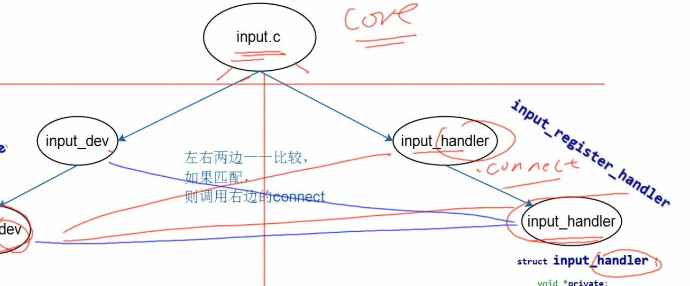
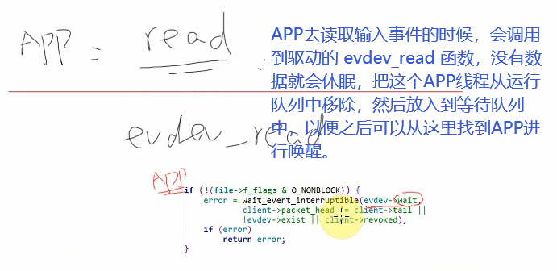
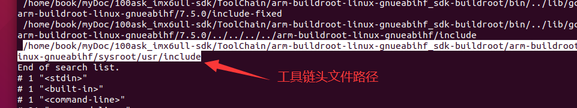
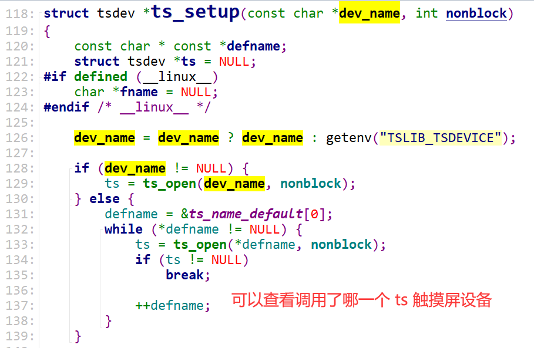

# Input子系统

参考资料：

* Linux 5.x内核文档
* Documentation\input\input-programming.rst
  * Documentation\input\event-codes.rst
* Linux 4.x内核文档
  * Documentation\input\input-programming.txt
  * Documentation\input\event-codes.txt

## 1.1 输入设备的种类

输入设备种类很多，有GPIO按键、鼠标、电阻触摸屏、电容触摸屏、USB键盘、遥控手柄等等。
安装它能产生的数据类型，可以分为(前面3项比较容易理解，后面的就属于扩展了)：

（input子系统上报的是事件，前面三个是基本的事件，后面还扩展出了很多事件）

* **按键**：EV_KEY，比如键盘
* **相对位移**：EV_REL，比如鼠标
* **绝对位移**：EV_ABS，比如触摸屏
* 杂项：EV_MSC
* 软件：EV_SW
* LED：EV_LED
* 声音：EV_SND
* 会自动发出重复按键：EV_REP
* 电源开关、按键：EV_PWR


## 1.2 输入设备的驱动程序框架

有没有一个驱动程序，能支持那么多的设备？没有！
有没有**一套驱动程序**，容易扩展，最终能支持那么多的设备？有！
这就是输入子系统的驱动程序，框架如下：


利用下面这一套框架，就可以实现对各种输入设备的适配，其中1、2两部分内核已经帮我们做好了，然后第三部分就由我们自己编写特定的输入设备。


evdev.c 内核中的这个文件比较重要，是输入事件的处理层。


## 1.3  ioctl 应用编程

### 1.1.1 ioctl读取 事件ID 

读取事件 ID

```c
// 3.ioctl读取 id值
err = ioctl(fd, EVIOCGID, &id);
if(err==0)  // 读取成功就返回0
{
    printf("bustype = 0x%x\n", id.bustype);
    printf("vendor  = 0x%x\n", id.vendor);
    printf("product = 0x%x\n", id.product);
    printf("version = 0x%x\n", id.version);
}
```

在开发板上运行，得到下面的结果

```c
[root@100ask:/mnt]# ./01_get_input_info /dev/input/event0
bustype = 0x19
vendor  = 0x0
product = 0x0
version = 0x0
```


### 1.1.2 ioctl读取 支持的事件类型

```c
// 事件类型对照表：大概23个，所以 ioctl读取返回的值为4字节就足够表示所有的事件类型了
char *ev_names[] = {
    "EV_SYN ",  /* 同步事件         */
    "EV_KEY ",  /* 按键事件         */
    "EV_REL ",  /* 相对位置事件 */
    "EV_ABS ",  /* 绝对位置事件 */
    "EV_MSC ",
    "EV_SW	",
    "NULL ",
    "NULL ",
    "NULL ",
    "NULL ",
    "NULL ",
    "NULL ",
    "NULL ",
    "NULL ",
    "NULL ",
    "NULL ",
    "NULL ",
    "EV_LED ",
    "EV_SND ",
    "NULL ",
    "EV_REP ",
    "EV_FF	",
    "EV_PWR ",
};
```


```c
unsigned int evbit[5];	 // 定义为5也没用，都是返回4个字节

// 4.ioctl读取 id值 sizeof(evbit)
//   都是返回 4字节，然后都是第1个字节有值，然后按位比较，就知道有哪些事件了
len = ioctl(fd, EVIOCGBIT(0, EV_MAX), &evbit);

printf("len = %d \n", len);
printf("sizeof(evbit) = %d \n", sizeof(evbit));

if(len>0 && len<=sizeof(evbit))  // 读取成功
{
    printf("support ev type: \n");
    for(i=0;i<len;i++)  // 打印所有的事件类型
    {
        byte = ((unsigned char *)evbit)[i];
        printf("evbit[%d] = %d \n", i, byte);
        for(bit=0; bit<8; bit++)
        {
            if(byte & (1<<bit))  // 如果该位为1的话，代表支持该类输入事件
            {
                printf("%s \n", ev_names[i*8+bit]);
            }
        }
    }
    printf("\n");
}
printf("evbit[4] = %d \n", evbit[4]);
```

在开发板上运行，得到下面的结果

```c
[root@100ask:/mnt]# ./01_get_input_info /dev/input/event0
len = 4
sizeof(evbit) = 20
support ev type:
evbit[0] = 3
EV_SYN
EV_KEY
evbit[1] = 0
evbit[2] = 0
evbit[3] = 0

evbit[4] = 1995341636  // 这个是多余的，没初始化所以是乱的初始值
```


### 1.1.3 ioctl读取 输入事件

```c
struct input_event {
	struct timeval time;
	__u16 type;         // 事件的类型
	__u16 code;         // 
	__s32 value;        // 事件值
};
```

#### 1.1.3.1 阻塞、非阻塞读取输入事件

读取输入事件的时候，可以使用阻塞或者非阻塞的方式进行，在open输入事件设备节点的时候可以带上参数 `noblock`来实现。

```c
struct input_event event;  // 输入事件

while(1)
{
    len = read(fd, &event, sizeof(event));  // 一次读取一个事件，而且是 event类型的值		
    if(len == sizeof(event))  // 如果读取事件成功
    {
        printf("get event:type = 0x%x, code = 0x%x, value = 0x%x\n", event.type, event.code, event.value);
    }
    else
    {
        printf("read err %d\n", len);
    }
}
```

在开发板上运行，得到下面的结果

```c

[root@100ask:/mnt]# ./02_input_read /dev/input/event1
// 这里触摸 LCD的触摸屏，就出现数据了，阻塞方式，放开手之后就没有数据了
get event:type = 0x3, code = 0x39, value = 0x18
get event:type = 0x3, code = 0x35, value = 0x279
get event:type = 0x3, code = 0x36, value = 0x1a4
get event:type = 0x1, code = 0x14a, value = 0x1
get event:type = 0x0, code = 0x0, value = 0x0
get event:type = 0x3, code = 0x39, value = 0xffffffff
get event:type = 0x1, code = 0x14a, value = 0x0

```

非阻塞方式运行结果

```c
[root@100ask:/mnt]# ./02_input_read /dev/input/event1 noblock
// 非阻塞方式，平时读取不到数据，直接返回 -1，触摸之后就返回事件值
read err -1
read err -1
read err -1
read err -1
read err -1
get event:type = 0x3, code = 0x39, value = 0x42
get event:type = 0x3, code = 0x35, value = 0x23d
get event:type = 0x3, code = 0x36, value = 0x1fa
get event:type = 0x3, code = 0x30, value = 0x17
get event:type = 0x3, code = 0x3a, value = 0x17
get event:type = 0x1, code = 0x14a, value = 0x1
get event:type = 0x0, code = 0x0, value = 0x0
```

一次 poll ，可以多次read读，需要把所有数据都读出来，类似于触摸屏触摸一下会有很多的事件数据。

所以 open文件的时候，要以非阻塞的方式进行。


#### 1.1.3.2 poll方式 读取输入事件

需要包含头文件

```c
#include <poll.h>
```

poll函数说明

```c
#include <poll.h>

int poll(struct pollfd fds[], nfds_t nfds, int timeout)；

参数说明:

fds：是一个struct pollfd结构类型的数组，用于存放需要检测其状态的Socket描述符；每当调用这个函数之后，系统不会清空这个数组，操作起来比较方便；特别是对于 socket连接比较多的情况下，在一定程度上可以提高处理的效率；这一点与select()函数不同，调用select()函数之后，select() 函数会清空它所检测的socket描述符集合，导致每次调用select()之前都必须把socket描述符重新加入到待检测的集合中。
    因此，select()函数适合于只检测一个socket描述符的情况
    而poll()函数适合于大量socket描述符的情况

nfds：nfds_t类型的参数，用于标记数组fds中的 结构体元素的总数量；

timeout：是poll函数调用阻塞的时间，单位：毫秒；

返回值:

>0：数组fds中准备好读、写或出错状态的那些socket描述符的总数量；

==0：数组fds中没有任何socket描述符准备好读、写，或出错；
    此时poll超时，超时时间是timeout毫秒；
    换句话说，如果所检测的 socket描述符上没有任何事件发生的话，那么poll()函数会阻塞timeout所指定的毫秒时间长度之后返回，如果timeout==0，那么 poll() 函数立即返回而不阻塞，如果timeout==INFTIM，那么poll() 函数会一直阻塞下去，直到所检测的socket描述符上的感兴趣的事件发 生是才返回，如果感兴趣的事件永远不发生，那么poll()就会永远阻塞下去；

-1：  poll函数调用失败，同时会自动设置全局变量errno；
```


测试程序：

```c
struct pollfd fds[1];  // 要poll监听的数组列表：1个元素，文件句柄
nfds_t nfds = 1;       // 输入事件的个数

// ##############################################################
fds[0].fd = fd;               // 监听 这个文件的 数据写入操作
fds[0].events = POLLIN;       // 监听 POLLIN 有数据进入事件
// ##############################################################

while(1)
{
// 看到上面和 select()的对比，说 fds的添加监测事件添加一次就可以永久使用，每次从 poll执行完之后
// 监测列表还在
// ##############################################################    
//    fds[0].fd = fd;               // 监听 这个文件的 数据写入操作
//    fds[0].events = POLLIN;       // 监听 POLLIN 有数据进入事件
// ##############################################################    
    
    fds[0].revents = 0;           // 清空等待事件的类型变量
    ret = poll(fds, nfds, 5000);  // 等待5s，
    if(ret > 0)
    {
        if(fds[0].revents == POLLIN)
        {
            while( read(fd, &event, sizeof(event)) == sizeof(event) )
            {
                printf("get event:type = 0x%x, code = 0x%x, value = 0x%x\n", event.type, event.code, event.value);
            }
        }
    }
    else if(ret == 0)
    {
        printf("time out\n");
    }
    else
    {
        printf("poll err %d\n", len);
    }
}	

```

在开发板上运行，得到下面的结果

```c
[root@100ask:/mnt]# ./03_input_read_poll /dev/input/event1
time out  // 前面没有监测到有数据读取的时候，就会超时返回
time out
get event:type = 0x3, code = 0x39, value = 0x44    // 有触摸动作了，就打印输入事件的数据
get event:type = 0x3, code = 0x35, value = 0x2c8
get event:type = 0x3, code = 0x36, value = 0x1a6
get event:type = 0x3, code = 0x30, value = 0x1c
get event:type = 0x3, code = 0x3a, value = 0x1c
get event:type = 0x1, code = 0x14a, value = 0x1
get event:type = 0x0, code = 0x0, value = 0x0
get event:type = 0x3, code = 0x39, value = 0xffffffff
get event:type = 0x1, code = 0x14a, value = 0x0
get event:type = 0x0, code = 0x0, value = 0x0

```

使用poll函数监测多个输入设备。应该可以通过那个数组来实现。可以监测多个。

```c
应该就是修改
    
struct pollfd fds[1];  // 要poll监听的数组列表：1个元素，文件句柄
nfds_t nfds = 1;       // 输入事件的个数

以及添加监测 fd
fds[0].fd = fd;               // 监听 这个文件的 数据写入操作
fds[0].events = POLLIN;       // 监听 POLLIN 有数据进入事件    
fds[0].revents = 0;           // 清空等待事件的类型变量
```

#### 1.1.3.2 select方式 读取输入事件


```c
#include <sys/select.h>
#include <sys/time.h>

int nfds;   // nfds 是最大的文件句柄+1, 注意: 不是文件个数, 这与poll不一样
struct timeval tv;  // select需要另外提供一个时间变量
fd_set readfds;
```


```c
while(1)
{	
    // 设定超时时间
    tv.tv_sec = 5;  // 5s
    tv.tv_usec = 0;

    // 想监测哪些文件
    FD_ZERO(&readfds);	   // 先全部清零
    FD_SET(fd, &readfds);  // 想监听 fd

    nfds = fd + 1;  // nfds 是最大的文件句柄+1, 注意: 不是文件个数, 这与poll不一样
    ret = select(nfds, &readfds, NULL, NULL, &tv);
    if(ret > 0)
    {
        if(FD_ISSET(fd, &readfds))  // 再次确认fd有数据
        {
            while( read(fd, &event, sizeof(event)) == sizeof(event) )
            {
                printf("get event:type = 0x%x, code = 0x%x, value = 0x%x\n", event.type, event.code, event.value);
            }
        }
    }
    else if(ret == 0)
    {
        printf("time out\n");
    }
    else
    {
        printf("select err %d\n", len);
    }
}
```

在开发板上运行，得到下面的结果

```c
[root@100ask:/mnt]# ./04_input_read_select /dev/input/event1
time out
get event:type = 0x3, code = 0x39, value = 0x4c
get event:type = 0x3, code = 0x35, value = 0x292
get event:type = 0x3, code = 0x36, value = 0x1fa
get event:type = 0x3, code = 0x30, value = 0x2f
get event:type = 0x3, code = 0x3a, value = 0x2f
get event:type = 0x1, code = 0x14a, value = 0x1
get event:type = 0x0, code = 0x0, value = 0x0
get event:type = 0x3, code = 0x35, value = 0x295
get event:type = 0x0, code = 0x0, value = 0x0
get event:type = 0x3, code = 0x39, value = 0xffffffff
get event:type = 0x1, code = 0x14a, value = 0x0
get event:type = 0x0, code = 0x0, value = 0x0
time out
time out
get event:type = 0x3, code = 0x39, value = 0x4d
get event:type = 0x3, code = 0x35, value = 0x23f

```

把下面两个移动到while(1)的外面，就只能监听一次了

```c
// 想监测哪些文件
FD_ZERO(&readfds);	   // 先全部清零
FD_SET(fd, &readfds);  // 想监听 fd
```

```c
[root@100ask:/mnt]# ./04_input_read_select /dev/input/event1
time out
time out
time out
time out
^C
[root@100ask:/mnt]#
```


#### 1.1.3.3 异步通知方式 读取输入事件


```c
#include <signal.h>
#include <sys/types.h>

int fd;
```

```c
// 异步通知处理函数
void my_sig_handler(int sig)
{
	struct input_event event;
	while (read(fd, &event, sizeof(event)) == sizeof(event))
	{
		printf("get event: type = 0x%x, code = 0x%x, value = 0x%x\n", event.type, event.code, event.value);		
	}
}
```

主要是通过signal 和fcntl来实现注册和开启 异步通知

```c

unsigned int flags;

// 1.注册信号处理函数
signal(SIGIO, my_sig_handler);

// 2.把这个应用程序的进程号告诉内核驱动
fcntl(fd, F_SETOWN, getpid());

// 3.使能内核驱动的异步通知功能
// 3.1 先读取出来 flags
flags = fcntl(fd, F_GETFL);
// 3.2 修改之后设置回 内核
fcntl(fd, F_SETFL, flags | FASYNC);

while(1)
{	
    printf("while running %d\n", len);
    sleep(2);  // 睡眠2s，有通知之前都可以做自己的事情
}	
```

在开发板上运行，得到下面的结果

```c
[root@100ask:/mnt]# ./05_input_read_fasync /dev/input/event1
while running 4
while running 4
get event: type = 0x3, code = 0x2f, value = 0x0
get event: type = 0x3, code = 0x39, value = 0x80
get event: type = 0x3, code = 0x35, value = 0x270
```


printf 碰到 \n 的时候，才会把字符串刷到屏幕上输出


## 2 input子系统框架详解


input子系统的架构和platform总线设备驱动模型非常的类似，左边是需要我们提供和注册的 input_dev，右边是系统内核已经写好的 input_handler，我们每注册一个 input_dev到链表上，都会与右边的 input_handler一一比较，匹配上了，就会调用  input_handler 里面的 connect 函数。 


dev 和 handler 的匹配过程


匹配成功之后，看看 evdev.c 这个文件中的 connect 函数做了什么事情

- 先是注册了一个 字符设备驱动，


- 然后之后应用程序调用 read,write这些函数的时候，就可以通过寻找 evdev_fops找到对应的驱动的程序了


- 如果是注册 input_handler 的话，也会与左边的 dev 一一进行匹配



- connect 函数还会做什么事情：**（建立联系）**

  还会把 指向左边input_dev的指针，和右边 input_handler的指针，放进一个称为 input_handle 的结构体中，然后还会把这个  input_handle结构体 放进左边的 input_dev的链表 h_list 以及右边的 input_handler 的链表 h_list 中。


- 有了 input_handle结构体 之后，就可以从左边通过这个 handle 找到右边，右边也可以通过这个 handle 找到左边。
- 并且两边的链表中 h_list 都是可以挂接很多项，所以 当input_dev发生的时候，可以通知 h_list 中的一项或者多项 input_handler ，右边到左边也是。

优先采用 input_handler 中的 filter 函数来处理事件，次之采用 events 一次处理多个事件，最后实在不行就采用 event 来一个个处理事件。


我们注册一个 input_dev，它会和 evdev.c 中写好的 input_handlers 进行匹配


最常用的 handler


### 2.1 注册一个 input 驱动，系统会做事情


- 注册一个 input_dev，调用 register_dev，里面会把这个 input_dev 挂接到  input_dev_list 链表上，并且会调用 match 函数，与右边的  input_handler_list 链表进行一一对比，如果匹配上的话，就会调用 connect 函数来建立  input_dev 和  input_handler 之间的联系。
- 匹配成功之后，调用的是  input_handler 里面的 connect 函数，里面会分配一个 evdev 结构体，这个结构体里面就有一项 input_handle 结构体，就是重要的联系  input_dev 和  input_handler 的桥梁。
- 这里面会给 input_handle的成员初始化，也就是存储有 input_handler到handle.handler中，存储有 input_dev到handle.dev中
- 然后就会注册这个 input_handle，其实就是把这个 input_handle 挂接到 input_dev 和 input_handler 结构体的对应内部链表中。
- 然后还会注册一个字符设备驱动


### 2.2 APP如何访问到输入设备

同一个输入设备，可以由多个应用程序同时打开

- 打开设备


- 读数据（阻塞）



- 如何上报数据

input_dev会通过h_list链表中的 input_handle找到对应的 input_handler，然后使用 Input_handler里面的函数来上报数据。


上面好像写错了，是通过 `input_event` 函数来上报数据。


- 上报数据函数

  


上报完数据之后，还会把应用程序唤醒


### 2.3 驱动开发者需要做什么


还需要注册一个中断，然后在中断处理函数中，读取硬件的输入数据，并且调用 input_event 函数上报数据，而且还会把应用程序给唤醒。


## 3 编写input_dev驱动框架


### 3.1 编写 input_dev 的框架

方法1：直接编写一个 .c 驱动文件，在入口函数中，直接分配、设置、注册这个 input_dev 结构体


方法2：使用总线设备驱动模型，在 probe 函数中进行分配、设置、注册这个 input_dev 结构体


### 3.2 步骤

#### **input-event-codes.h中，有很多重要的信息**

`event types`  和 `event codes` 都是在这个文件中定义，自己找

```c
/*
 * Event types
 */
#define EV_SYN			0x00  // 用于事件间的分割标志，事件的同步信号？
#define EV_KEY			0x01  // 用来描述键盘，按键或者类似键盘设备的状态变化。
#define EV_REL			0x02  // 用来描述相对坐标轴上数值的变化，例如：鼠标向左方移动了5个单位。
#define EV_ABS			0x03  // 用来描述相对坐标轴上数值的变化，例如：描述触摸屏上坐标的值。
#define EV_MSC			0x04  // 当不能匹配现有的类型时，使用该类型进行描述。
#define EV_SW			0x05  // 用来描述具备两种状态的输入开关。
#define EV_LED			0x11  // 用于控制设备上的LED灯的开和关。
#define EV_SND			0x12  // 用来给设备输出提示声音。
#define EV_REP			0x14  // 用于可以自动重复的设备（autorepeating）。
#define EV_FF			0x15  // 用来给输入设备发送强制回馈命令。（震动？）
#define EV_PWR			0x16  // 特别用于电源开关的输入。
#define EV_FF_STATUS	0x17  // 用于接收设备的强制反馈状态。

// 输入事件类型的最大数量，0x1f=31，也就是使用 4字节就可以表示所有的输入事件类型
#define EV_MAX			0x1f  
#define EV_CNT			(EV_MAX+1)  // 32
```


```c
struct input_dev {
	const char *name;  // 输入设备名字
	const char *phys;  // 到系统层次结构中的设备的物理路径
	const char *uniq;
	struct input_id id;

	unsigned long propbit[BITS_TO_LONGS(INPUT_PROP_CNT)];

	unsigned long evbit[BITS_TO_LONGS(EV_CNT)];    // 支持哪些输入事件类型
    // 下面这些就是，evbit中指定的输入事件类型，具体的某一类的话，就需要对应下面的每一个具体的输入事件
	unsigned long keybit[BITS_TO_LONGS(KEY_CNT)];  // 哪一个按键呢
	unsigned long relbit[BITS_TO_LONGS(REL_CNT)];  // X,Y,Z 还是其他的相对位置呢
	unsigned long absbit[BITS_TO_LONGS(ABS_CNT)];  // X,Y,Z 还是其他的绝对位置呢
	unsigned long mscbit[BITS_TO_LONGS(MSC_CNT)];  // 
	unsigned long ledbit[BITS_TO_LONGS(LED_CNT)];  // 哪一个LED呢
	unsigned long sndbit[BITS_TO_LONGS(SND_CNT)];
	unsigned long ffbit[BITS_TO_LONGS(FF_CNT)];
	unsigned long swbit[BITS_TO_LONGS(SW_CNT)];

	unsigned int hint_events_per_packet;

	unsigned int keycodemax;
	unsigned int keycodesize;
	void *keycode;

	int (*setkeycode)(struct input_dev *dev,
			  const struct input_keymap_entry *ke,
			  unsigned int *old_keycode);
	int (*getkeycode)(struct input_dev *dev,
			  struct input_keymap_entry *ke);

	struct ff_device *ff;

	unsigned int repeat_key;
	struct timer_list timer;

	int rep[REP_CNT];

	struct input_mt *mt;

	struct input_absinfo *absinfo;

	unsigned long key[BITS_TO_LONGS(KEY_CNT)];
	unsigned long led[BITS_TO_LONGS(LED_CNT)];
	unsigned long snd[BITS_TO_LONGS(SND_CNT)];
	unsigned long sw[BITS_TO_LONGS(SW_CNT)];

	int (*open)(struct input_dev *dev);
	void (*close)(struct input_dev *dev);
	int (*flush)(struct input_dev *dev, struct file *file);
	int (*event)(struct input_dev *dev, unsigned int type, unsigned int code, int value);

	struct input_handle __rcu *grab;

	spinlock_t event_lock;
	struct mutex mutex;

	unsigned int users;
	bool going_away;

	struct device dev;

	struct list_head	h_list;
	struct list_head	node;

	unsigned int num_vals;
	unsigned int max_vals;
	struct input_value *vals;

	bool devres_managed;
};
```

我们就是需要设置这个 input_dev 结构体里面的部分内容

找出比较重要的信息，如下

```c
@evbit: bitmap of types of events supported by the device (EV_KEY,EV_REL, etc.)
```


#### **input.c中，有很多重要的函数**

分配函数

```c
struct input_dev *devm_input_allocate_device(struct device *dev)
```

注册函数

```c
int input_register_device(struct input_dev *dev)
```

设置更加详细输入事件的信息

​		比如设置触摸屏的触摸绝对位置的范围（最大、最小值）

```c
void input_set_abs_params(struct input_dev *dev, unsigned int axis,
			  int min, int max, int fuzz, int flat)
```

input.c文件中，有 4个设置的函数


#### 中断的设置

一般输入设备的程序中都会有中断，通过中断处理函数来上报数据


#### 定时器

对于按下滑动事件，可以通过定时器来实现，按下之后启动一下定时器，然后在定时器中不断读取硬件信息并且上报，抬起手之后，再关闭定时器


**注意：linux的定时器都是一次性的，如果不在定时器处理函数中修改定时时间的话，定时器就不起作用了**


有时候在终端设置了一些值，或者拷贝了一些资源，可以执行一下下面这个同步指令 `sync` ，让这些值真正的写入到磁盘上面。


还有 tslib，可以根据例程的步骤来移植，而且我们可以不用指定那么复杂的环境变量，指定哪个输入设备是触摸屏设备，可以直接使用 tslib 里面的一个函数，调用 ioctl 来获取触摸屏的一些参数，判断是不是触摸屏设备。

驱动程序中需要设备这个属性


## 4 分析内核自带的GPIO按键驱动


### 4.1 指定设备树

所以设备树中，需要指定一个父节点，父节点中可以指定1个或者多个子节点

如下图所示，A，B（B1，B2）这些都是要指定的。


### 4.2 对比两款板子的输入事件设备树


### 4.3 分析gpio-key.c驱动程序

在 probe 函数中，会解析设备树，得到硬件信息。


根据设备树的设置值，对驱动中申请的 input_dev 进行设置


### 4.4 消抖


## 5 调试手段

### 5.1 查看系统有哪些输入事件

```c
ls /dev/input
```


### 5.2 查看系统中的输入事件是什么事件

```x
cat /proc/bus/input/devices
```


### 5.3 查看系统中输入设备的信息

```c
1. 查看系统中输入设备的信息
# cat /proc/bus/input/devices 查看系统中所有的输入设备节点的详细信息
# cat /proc/bus/input/handlers 查看系统中所有注册的handler的信息
# ls /sys/class/input/ 查看系统中所有的输入设备节点在/sysfs中的信息
# ls /dev/input/ 查看系统中所有的输入设备的设备文件
```


### 5.4 查看输入设备类型


那么这里的I、N、P、S、U、H、B对应的每一行是什么含义呢？

**① I:id of the device(设备ID)**

该参数由结构体struct input_id来进行描述，驱动程序中会定义这样的结构体：

​                               

**② N:name of the device**

设备名称

**③ P:physical path to the device in the system hierarchy**

系统层次结构中设备的物理路径。

**④ S:sysfs path**

位于sys文件系统的路径

**⑤ U:unique identification code for the device(if device has it)**

设备的唯一标识码

**⑥ H:list of input handles associated with the device.**

与设备关联的输入句柄列表。

**⑦ B:bitmaps(位图)**

**PROP**:device properties and quirks(设备属性)

**EV**:types of events supported by the device(设备支持的事件类型)

**KEY**:keys/buttons this device has(此设备具有的键/按钮)

**MSC**:miscellaneous events supported by the device(设备支持的其他事件)

**LED**:leds present on the device(设备上的指示灯)


值得注意的是B位图，比如上图中“B: EV=b”用来表示该设备支持哪类输入事件。b的二进制是1011，bit0、1、3为1，表示该设备支持0、1、3这三类事件，即EV_SYN、EV_KEY、EV_ABS。（对应关系需要查表或者宏定义）


### 5.5 使用命令读取数据

调试输入系统时，直接执行类似下面的命令，然后操作对应的输入设备即可读出数据：

`hexdump /dev/input/event0`


## 6 I2C接口触摸屏驱动分析

### 6.1 触摸事件的上报

肯定在触摸按键中断处理函数中，调用 IIC 的接口，去读取触摸点的位置信息，然后上报


下面这个流程，就是 IIC和Input子系统结合的典型应用：

首先创建IIC的框架，设备树中定义一个 I2C_Client，会被转换为一个 I2C设备节点，然后需要自己编写一个 I2C_Driver驱动程序，两者匹配之后，就可以在 I2C_Driver.probe 函数里面再分配、设置、注册一个 Input_Dev，然后和系统中的 input_handler 匹配之后，就会调用 connect函数，创建一个 Input_hande结构体连接两边。 I2C_Driver.probe 里面感觉还需要创建一个字符设备，在字符设备里面再设置 input_dev事件会比较好，然后字符设备驱动给应用程序提供 应用接口。


**离不开中断程序，需要在中断程序中读取和上报输入事件，input_event 上报数据函数是重点**


### 6.2 使用 tslib 测试触摸事件

（1）编译 tslib

```c
tar xJf tslib-1.21.tar.xz
```

```c
./configure --host=arm-buildroot-linux-gnueabihf --prefix=/
```

```c
make
```

```c
make install DESTDIR=$PWD/tmp
```


（2）复制头文件/库到工具链(非必须, 编译其他APP时需要)

我们可以把 temp 中编译出来的 include头文件，lib库文件，添加到工具链中去，这样我们之后编译其他程序时，就不需要指定这两个 头文件、库文件 目录了。

```c
// 确定工具链中头文件、库文件目录
echo 'main(){}'| arm-buildroot-linux-gnueabihf -E -v -
```



```c
/home/book/myDoc/100ask_imx6ull-sdk/ToolChain/arm-buildroot-linux-gnueabihf_sdk-buildroot/arm-buildroot-linux-gnueabihf/sysroot/usr/include
```

然后拷贝 tmp 目录中的东西到这个 inlcude 目录中

```c
cp include/* /home/book/myDoc/100ask_imx6ull-sdk/ToolChain/arm-buildroot-linux-gnueabihf_sdk-buildroot/arm-buildroot-linux-gnueabihf/sysroot/usr/include
```


```c
/home/book/myDoc/100ask_imx6ull-sdk/ToolChain/arm-buildroot-linux-gnueabihf_sdk-buildroot/arm-buildroot-linux-gnueabihf/sysroot/usr/lib/
```

然后拷贝 tmp 目录中的东西到这个 lib 目录中， -d 参数表示如果原来是链接文件，这里也保持是链接文件

```c
cp lib/*so* -d /home/book/myDoc/100ask_imx6ull-sdk/ToolChain/arm-buildroot-linux-gnueabihf_sdk-buildroot/arm-buildroot-linux-gnueabihf/sysroot/usr/lib/
```

（3）拷贝 tmp 中的测试程序和 lib 文件到单板上


参考下面需要拷贝的东西，**把库文件放到单板上：运行程序要用**


```c
// 在ubuntu 中，拷贝到 nfs 目录中
book@100ask:~/myLinux/Driver/14_input/02_tslib/tslib-1.21/tmp$ cp /bin/ lib/ -r ~/nfs_rootfs/
    
book@100ask:~/myLinux/Driver/14_input/02_tslib/tslib-1.21/tmp$ cp etc/ts.conf ~/nfs_rootfs/

// 单板中，挂载 nfs 目录到 /mnt 中，再拷贝到合适的位置
cp bin/* /bin/
cp lib/*so* -d /lib
cp ts.conf -d /etc
```

（4）移除掉 lvgl 和 qt 的应用程序


（5）改进驱动

如果在驱动程序里设置属性位：

```shell
	__set_bit(INPUT_PROP_DIRECT, g_input_dev->propbit);
```

那么tslib可以自动扫描到触摸屏设备，
使用tslib时就不需要设置这些环境变量：

```shell
export TSLIB_TSDEVICE=/dev/input/event3
export TSLIB_CALIBFILE=/etc/pointercal
export TSLIB_CONFFILE=/etc/ts.conf
export TSLIB_PLUGINDIR=/lib/ts
export TSLIB_CONSOLEDEVICE=none
export TSLIB_FBDEVICE=/dev/fb0
```

测试发现，应该 100ask下载整个系统的那个烧录的系统，是实现了这个


### 6.3 分析 tslib 的框架

tslib的主要代码如下：

​                               

核心在于“plugins”目录里的“插件”，或称为“module”，可以称为动态库，可以在使用的时候再调用。这个目录下的每个文件都是一个module，每个module都提供2个函数：read、read_mt，前者用于读取单点触摸屏的数据，后者用于读取多点触摸屏的数据。

**注意**：“plugins”目录里的“插件”，每个module 中的 read、read_mt 都是递归调用的，所以最终的情况就是串联起来依次处理数据。


​        有了tsdev的list和list_raw这个链表，分析 ts_read和ts_read_mt就简单了，肯定是先调用 input模块处理，然后再到 pthres模块处理，然后再到dejitter模块处理，再到linear模块处理，最后再返回给应用程序。

​        无论是调用ts_read还是ts_read_mt，都是通过tsdev.list中的模块来处理数据的。这写模块是递归调用的。





### 6.4 编译tslib程序


程序中主要是 `.valid` 这个参数，可以判断是否有数据更新（他自动会判断前后两次的值是否有变化）

```c
// 遍历所有触点
for(i=0;i<max_slots;i++)
{
    if(samp_mt[0][i].valid)  // 判断每个触摸点的数据是否有更新了
    {
        // 如果有新数据，就拷贝过去
        memcpy(&pre_samp_mt[0][i], &samp_mt[0][i], sizeof(struct ts_sample_mt));
    }
}
```


### 6.5 测试 tslib 多触点是怎么记录数据的


```c
while(1)
{
    // 循环读取数据
    ret = ts_read_mt(ts, samp_mt, max_slots, read_samples);
    if (ret < 0) 
    {
        printf("ts_print_mt err %d\n");
        ts_close(ts);
        return -1;			
    }

    // 判断前后两次的数据

    // 遍历所有触点
    for(i=0;i<max_slots;i++)
    {
        if(samp_mt[0][i].valid)  // 判断每个触摸点的数据是否有更新了
        {
            // 每次有数据更新的时候，都打印所有数据出来
            for(j=0;j<max_slots;j++)
            {
                printf("samp_mt[0][%d]: %08d \n", j, samp_mt[0][j]);
            }
            printf("############################### \n");
        }
    }
}
```

实验现象：

（1）就是当逐次按下按键时，它会记住每个触摸点的位置

（2）当全部触摸点都按下不动时，改变其中一个触点的位置，它是可以辨识出哪个触摸点变化了

（3）比如3个触摸点，当移开第2个触点时，剩下的两个触点又会变成数组 `samp_mt【】【】`中的前2个 


## 7 UInput分析_用户态创建input_dev


它的数据来源不是来自于硬件，而是来自于应用程序输入的数据


我们可以用 UInput 来完成一些自动化操作，模拟一些用户态的操作。


其实这个 uinput 有点自动化脚本的意思了，比如我们打开了一个触摸屏例程


## 8 如何支持其他LCD屏幕

参考这个文档：`在100ASK_IMX6ULL板子上支持其他型号的屏幕.docx`

包括 LCD的适配 和 触摸屏的适配

### 8.1 LCD适配

（1）需要修改设备树，根据LCD的参数修改值

（2）需要修改背光引脚或者复位引脚，是否接线不一样，就需要设备树中进行更换


### 8.2 触摸屏适配

（1）用i2cdetect检测出I2C设备的地址

（2）根据地址在设备树中搜索，看哪些节点使用到了这个地址，I2C设备节点都是在节点后面 @ 地址


（3）找到触摸芯片之后，就可以搜索 linux内核 中是否有这个芯片的驱动

（4）然后修改设备树，适合这个 I2C 芯片，主要是 compatible 属性

（5）重新配置内核添加驱动，搜索内核文件，搜索到这个，则 make menuconfig 添加个配置

重新编译内核

`Makefile:31:obj-$(CONFIG_TOUCHSCREEN_EDT_FT5X06)    += edt-ft5x06.o`

（6）然后调试，使用 tslib 可以快速进行验证

如果是出现 xy方向反转之类的，就可以 查看下面这个路径中的绑定文档，看其内核支持的触摸屏的型号和设备树的编写过程。


```c
要让x反转，或是y反转，在设备节类似点中加入这样的属性值就可以：
touchscreen-inverted-x = <1>;
touchscreen-inverted-y = <1>;
```


## 9 修改开发板的ip

```c
[root@100ask:~]# vi /etc/network/interfaces
修改并为如下内容，执行 :wq 保存并退出，执行/etc/init.d/S40network restart 重启网络服务。
auto lo
iface lo inet loopback
auto eth0
iface eth0 inet static
    address 192.168.5.9
    netmask 255.255.255.0
    gateway 192.168.5.1
```


## 10 分析 evdev.c


```c
// 驱动注册一个 input_dev 输入设备，和 input_handler匹配之后，就会调用 ipnut_handler 里面
// 的 connect 函数，里面会注册一个字符设备驱动，用于给应用程序提供一个设备节点和访问接口。

evdev_connect
    cdev_init(&evdev->cdev, &evdev_fops);
		static const struct file_operations evdev_fops = {
            .owner		= THIS_MODULE,
            .read		= evdev_read,
            .write		= evdev_write,
            .poll		= evdev_poll,
            .open		= evdev_open,
            .release	= evdev_release,
            .unlocked_ioctl	= evdev_ioctl,
        #ifdef CONFIG_COMPAT
            .compat_ioctl	= evdev_ioctl_compat,
        #endif
            .fasync		= evdev_fasync,
            .flush		= evdev_flush,
            .llseek		= no_llseek,
        };   
```


