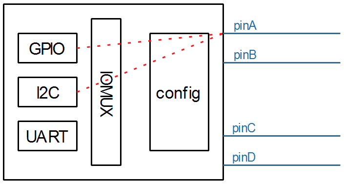
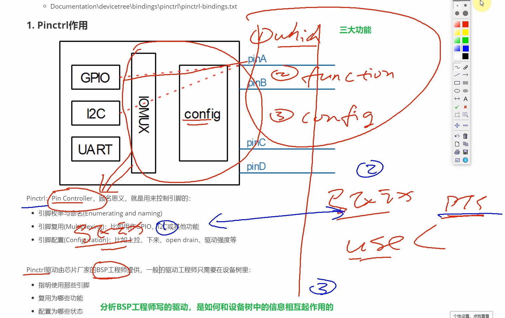
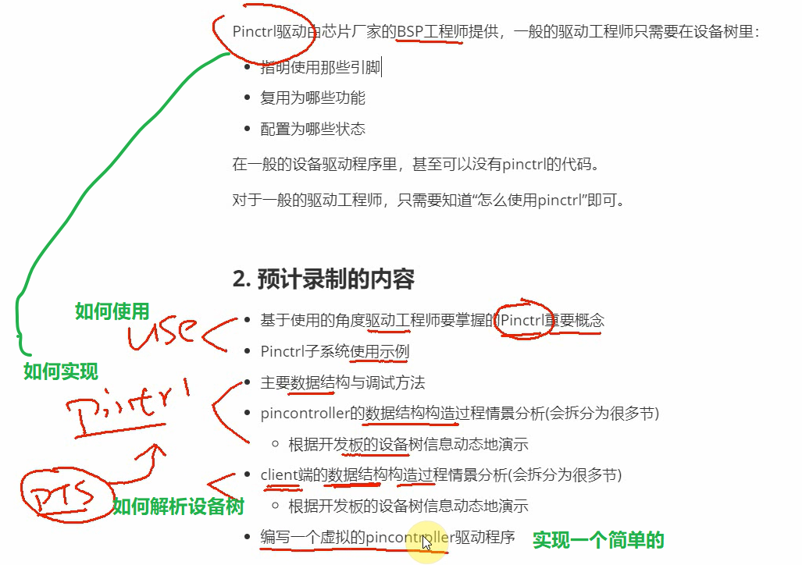
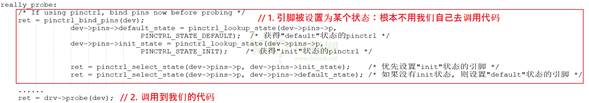
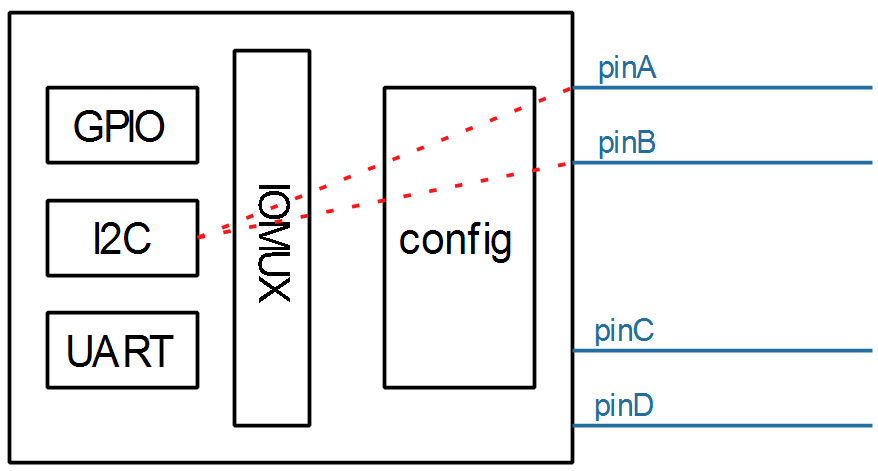
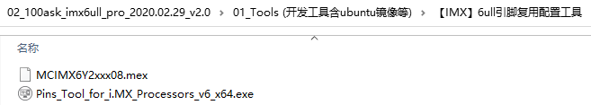
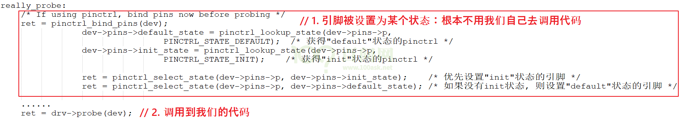

## 1 Pinctrl子系统视频介绍

参考资料：

* Linux 5.x内核文档
  * Documentation\devicetree\bindings\pinctrl\pinctrl-bindings.txt
* Linux 4.x内核文档
  * Documentation\pinctrl.txt
  * Documentation\devicetree\bindings\pinctrl\pinctrl-bindings.txt

### 1.1 Pinctrl作用



芯片内部有很多控制器 gpio i2c uart 然后他们都需要有引脚才能与外部交流，而芯片也有很多引脚 pin，然后这些 pin 是独立的，这些 pin连接到哪一个控制器（外设）上，就需要中间有一个 pin controller 子系统来管理，而这个 **pin controller 子系统** 这是软件上抽象的一个概念，其主要功能在下面介绍。


Pinctrl：Pin Controller，顾名思义，就是用来控制引脚的：

* 引脚枚举与命名(Enumerating and naming)
* 引脚复用(Multiplexing)：比如用作GPIO、I2C或其他功能
* 引脚配置(Configuration)：比如上拉、下来、open drain、驱动强度等


Pinctrl驱动由芯片厂家的BSP工程师提供，一般的驱动工程师只需要在设备树里：

* 指明使用那些引脚
* 复用为哪些功能
* 配置为哪些状态

在一般的设备驱动程序里，甚至可以没有pinctrl的代码。

对于一般的驱动工程师，只需要知道“怎么使用pinctrl”即可。


### 1.2 预计录制的内容

* 基于使用的角度驱动工程师要掌握的Pinctrl重要概念

* Pinctrl子系统使用示例

* 主要数据结构与调试方法

* pincontroller的数据结构构造过程情景分析(会拆分为很多节)

  * 根据开发板的设备树信息动态地演示

* client端的数据结构构造过程情景分析(会拆分为很多节)

  * 根据开发板的设备树信息动态地演示

* 编写一个虚拟的pincontroller驱动程序








### 1.3   代码中怎么引用pinctrl

这是透明的，我们的驱动基本不用管。当设备切换状态时，对应的pinctrl就会被调用。

比如在platform_device和platform_driver的枚举过程中，流程如下：



当系统休眠时，也会去设置该设备sleep状态对应的引脚，不需要我们自己去调用代码。

 

非要自己调用，也有函数：

```c
devm_pinctrl_get_select_default(struct device *dev);      // 使用"default"状态的引脚
pinctrl_get_select(struct device *dev, const char *name); // 根据name选择某种状态的引脚
pinctrl_put(struct pinctrl *p);   // 不再使用, 退出时调用
```


## 2 Pinctrl子系统使用示例_基于IMX6ULL

参考资料：

* Linux 5.x内核文档
  * Documentation\devicetree\bindings\pinctrl\pinctrl-bindings.txt
* Linux 4.x内核文档
  * Documentation\pinctrl.txt
  * Documentation\devicetree\bindings\pinctrl\pinctrl-bindings.txt

### 2.1 要做什么

以I2C为例：




* 查看原理图确定使用哪些引脚：比如pinA、pinB
* 生成pincontroller设备树信息
  * 选择功能：比如把pinA配置为I2C_SCL、把pinB配置为I2C_SDA
  * 配置：比如把pinA、pinB配置为open drain
* 使用pincontroller设备树信息：比如在i2c节点里定义"pinctrl-names"、"pinctrl-0"


### 2.2 生成pincontroller设备树信息

生成pincontroller设备树信息，有3中方法：

* 有些芯片有图形化的工具，可以点点鼠标就可以配置引脚信息，得到pincontroller中的信息
* 有些芯片，只能看厂家给的设备树文档或者参考设备树的例子
* 最差的就是需要阅读驱动代码才能构造设备树信息。

#### 2.2.1 安装工具

对于IMX6ULL，有引脚配置工具/设备树生成工具：

* 打开：http://download.100ask.net/
* 找到开发板："100ASK_IMX6ULL_PRO开发板"
* 下载开发板配套资料
* 下载完后，工具在如下目录里：




#### 2.2.2 根据原理图生成pinctrl信息

```shell
&iomuxc {
    pinctrl-names = "default";
    pinctrl-0 = <&BOARD_InitPins>;
    imx6ull-board {
        i2c1_pins: i2c1_pins {                /*!< Function assigned for the core: Cortex-A7[ca7] */
            fsl,pins = <
                MX6UL_PAD_UART4_RX_DATA__I2C1_SDA          0x000018B0
                MX6UL_PAD_UART4_TX_DATA__I2C1_SCL          0x000018B0
            >;
        };
    };
};
```


### 2.3 在client节点使用pinctrl

```shell
&i2c1 {
    clock-frequency = <100000>;
    pinctrl-names = "default";
    pinctrl-0 = <&i2c1_pins>;
    status = "okay";
};
```


### 2.4 使用过程

这是透明的，我们的驱动基本不用管。当设备切换状态时，对应的pinctrl就会被调用。

比如在platform_device和platform_driver的枚举过程中，流程如下：




