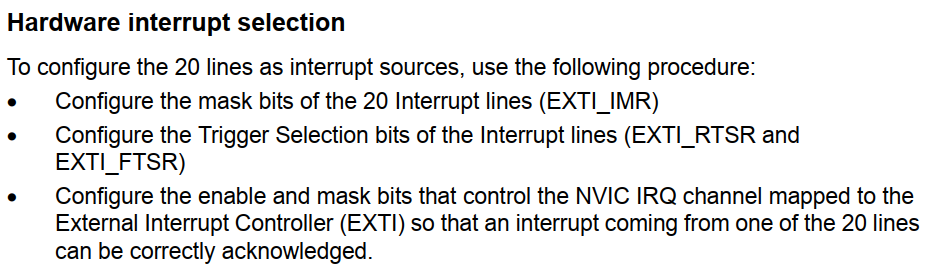
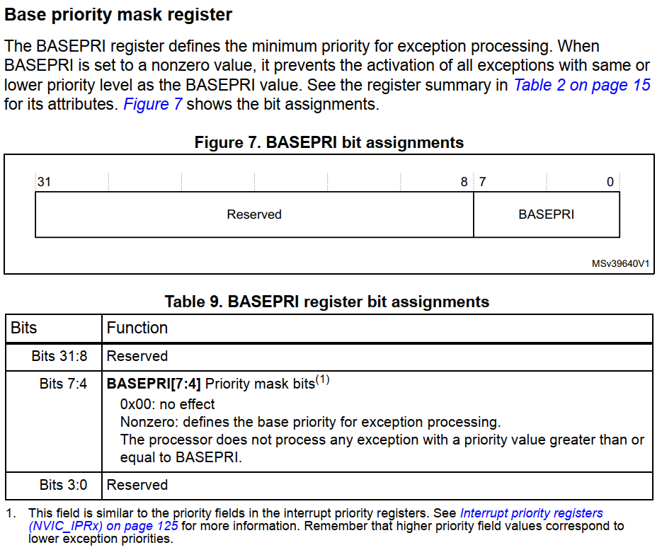
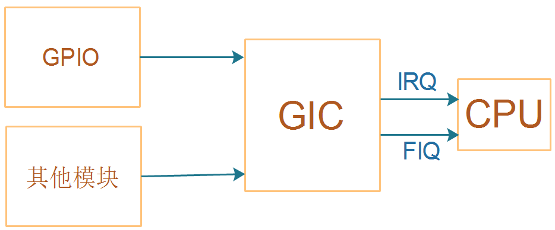
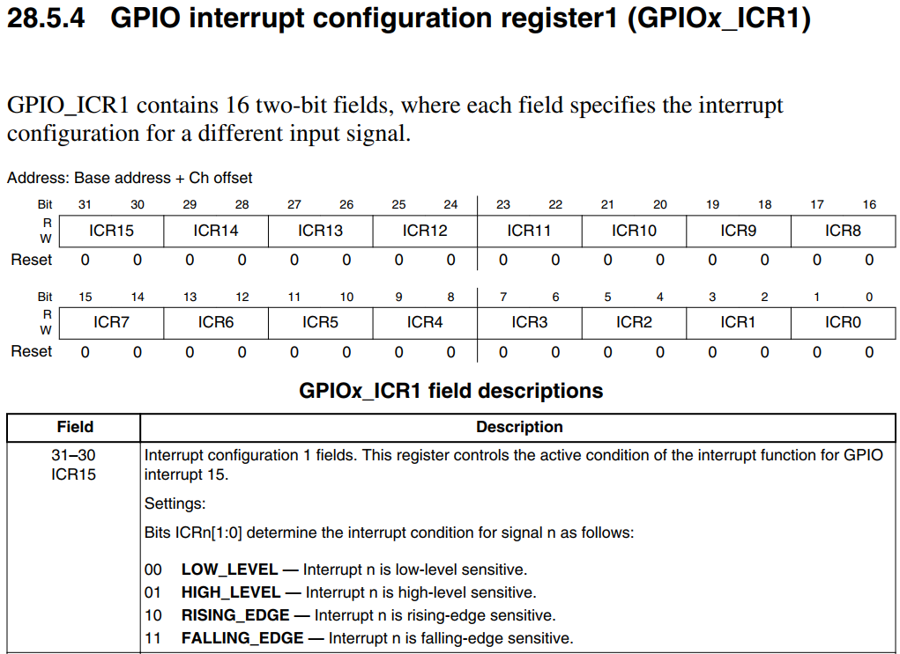

# 9 中断的硬件框架

## 9.1 中断路径上的3个部件

* 中断源
  中断源多种多样，比如GPIO、定时器、UART、DMA等等。
  它们都有自己的寄存器，可以进行相关设置：使能中断、中断状态、中断类型等等。
* 中断控制器
  各种中断源发出的中断信号，**汇聚到中断控制器**。
  可以在中断控制器中**设置各个中断的优先级**。
  中断控制器会向CPU发出中断信号，**CPU可以读取中断控制器的寄存器，判断当前处理的是哪个中断**。
  中断控制器有多种实现，比如：
  * STM32F103中被称为NVIC：Nested vectored interrupt controller(嵌套向量中断控制器)
  * ARM9中一般是芯片厂家自己实现的，没有统一标准
  * Cortex A7中使用GIC(Generic Interrupt Controller)
* CPU
  **CPU每执行完一条指令，都会判断一下是否有中断发生了。**
  CPU也有自己的寄存器，可以设置它来使能/禁止中断，这是中断处理的总开关。


## 9.2 STM32F103的GPIO中断

参考资料：`STM32F103数据手册.pdf`、`ARM Cortex-M3与Cortex-M4权威指南.pdf`、`PM0056.pdf`

对于GPIO中断，STM32F103又引入了`External interrupt/event controller (EXTI)`。
用来设置GPIO的中断类型，如下图：


EXTI可以给NVIC提供16个中断信号：EXTI0~EXTI15。
**那么某个EXTIx，它来自哪些GPIO呢？**这需要设置GPIO控制器。

### 9.2.1 GPIO控制器

STM32F103的GPIO控制器中有AFIO_EXTICR1~AFIO_EXTICR4一共4个寄存器
名为：External interrupt configuration register，外部中断配置寄存器。
用来选择某个外部中断EXTIx的中断源，示例如下：


**注意**：从上图可知，EXTI0只能从PA0、……、PG0中选择一个，这也**意味着PA0、……、PG0中只有一个引脚可以用于中断【st公司的是这样】**。**这跟其他芯片不一样，很多芯片的任一GPIO引脚都可以同时用于中断【imx6ull】**。


### 9.2.2 EXTI

在GPIO控制器中，可以设置某个GPIO引脚作为中断源，给EXTI提供中断信号。
但是，这个中断的触发方式是怎么的？高电平触发、低电平触发、上升沿触发、下降沿触发？
这需要进一步设置。
EXTI框图如下：


沿着上面框图中的红线，我们要设置：

* Falling trigger selection register：是否选择下降沿触发
* Rising trigger selection register：是否选择上升沿触发
* Interrupt mask register：是否屏蔽中断

当发生中断时，可以读取下列寄存器判断是否发生了中断、发生了哪个中断：

* Pending reqeust register

要使用EXTI，流程如下：



翻译如下：

* 配置EXTI_IMR：允许EXTI发出中断
* 配置EXTI_RTSR、EXTI_FTSR，选择中断触发方式
* 配置NVIC中的寄存器，允许NVIC把中断发给CPU

### 9.2.3 NVIC

多个中断源汇聚到NVIC，**NVIC的职责就是从多个中断源中取出优先级最高的中断**，向CPU发出中断信号。
处理中断时，程序可以写NVIC的寄存器，清除中断。
涉及的寄存器：


我们暂时只需要关注：ISER(中断设置使能寄存器)、ICPR(中断清除挂起寄存器)。
要注意的是，这些寄存器有很多个，比如ISER0、ISER1等等。里面的每一位对应一个中断。
ISER0中的bit0对应异常向量表中的第16项(向量表从第0项开始)，如下图：


### 9.2.4 CPU

cortex M3/M4处理器内部有这几个寄存器：

#### 1. PRIMASK

  

  把PRIMASK的bit0设置为1，就可以屏蔽所有**优先级可配置**的中断。
  可以使用这些指令来设置它：

  ```
  CPSIE I  ; 清除PRIMASK，使能中断
  CPSID I  ; 设置PRIMASK，禁止中断
  
  或者：
  MOV R0, #1
  MSR  PRIMASK R0  ; 将1写入PRIMASK禁止所有中断
  
  MOV R0, #0
  MSR PRIMASK, R0  ; 将0写入PRIMASK使能所有中断
  ```

  

#### 2. FAULTMASK

  

  FAULTMASK和PRIMASK很像，它更进一步，出来一般的中断外，把HardFault都禁止了。
  只有NMI可以发生。
  可以使用这些指令来设置它：

  ```
  CPSIE F  ; 清除FAULTMASK
  CPSID F  ; 设置FAULTMASK
  
  或者：
  MOV R0, #1
  MSR  FAULTMASK R0  ; 将1写入FAULTMASK禁止中断
  
  MOV R0, #0
  MSR FAULTMASK, R0  ; 将0写入FAULTMASK使能中断
  ```

  

#### 3. BASEPRI

  


  BASEPRI用来屏蔽这些中断：它们的优先级，其值大于或等于BASEPRI。
  可以使用这些指令来设置它：

  ```
  MOVS R0, #0x60
  MSR BASEPRI, R0   ; 禁止优先级在0x60~0xFF间的中断
  
  MRS R0, BASEPRI   ; 读取BASEPRI
  
  MOVS R0, #0
  MSR BASEPRI, R0    ; 取消BASEPRI屏蔽
  ```


## 9.3 STM32MP157的GPIO中断

STM32MP157的GPIO中断在硬件上的框架，跟STM32F103是类似的。
它们的中断控制器不一样，STM32MP157中使用的是GIC：


### 9.3.1 GPIO控制器

对于STM32MP157，**除了把GPIO引脚配置为输入功能外，GPIO控制器里没有中断相关的寄存器**。
请参考前面的课程《01_使用按键控制LED(STM32MP157)》。

所以，stm32f103和mp157的区别就是，103的gpio里面有中断相关的寄存器，而157没有，gpio和interrupt是分离开的。


### 9.3.2 EXTI

GPIO引脚可以向CPU发出中断信号，所有的GPIO引脚都可以吗？
不是的，需要在EXTI控制器中设置、选择。
GPIO引脚触发中断的方式是怎样的？高电平触发、低电平触发、上升沿触发、下降沿触发？
这需要进一步设置。
这些，都是在EXTI中配置，EXTI框图如下：


沿着红线走：

#### 1. 设置`EXTImux`

选择哪些GPIO可以发出中断。
**只有16个EXTI中断**，从EXTI0~EXTI15；每个EXTIx中断只能从PAx、PBx、……中选择某个引脚，如下图所示：


**注意**：从上图可知，EXTI0只能从PA0、……中选择一个，这也意味着PA0、……中只有一个引脚可以用于中断。这跟其他芯片不一样，很多芯片的任一GPIO引脚都可以同时用于中断。

通过EXTI_EXTICR1等寄存器来设置EXTIx的中断源是哪个GPIO引脚，入下图所示：

  

#### 2. 设置`Event Trigger`

设置中断触发方式：


#### 3. 设置`Masking`

允许某个EXTI中断：


#### 4. 查看中断状态、清中断


### 9.3.3 GIC

ARM体系结构定义了通用中断控制器（GIC），该控制器包括一组用于管理单核或多核系统中的中断的硬件资源。**GIC提供了内存映射寄存器，可用于管理中断源和行为，以及（在多核系统中）用于将中断路由到各个CPU核**。它使软件能够屏蔽，启用和禁用来自各个中断源的中断，以（在硬件中）对各个中断源进行优先级排序和生成软件触发中断。它还提供对TrustZone安全性扩展的支持。GIC接受系统级别中断的产生，并可以发信号通知给它所连接的每个内核，从而有可能导致IRQ或FIQ异常发生。

GIC比较复杂，下一个视频再详细讲解。

### 9.3.4 CPU

**CPU的CPSR寄存器中有一位：I位，用来使能/禁止中断。**


可以使用以下汇编指令修改I位：

```
  CPSIE I  ; 清除I位，使能中断
  CPSID I  ; 设置I位，禁止中断
```


## 9.4 IMX6ULL的GPIO中断

IMX6ULL的GPIO中断在硬件上的框架，跟STM32MP157是类似的。
IMX6ULL中没有EXTI控制器，**对GPIO的中断配置、控制，都在GPIO模块内部实现**：




### 9.4.1 GPIO控制器

#### 1. 配置GPIO中断

每组GPIO中都有对应的GPIOx_ICR1、GPIOx_ICR2寄存器(interrupt configuration register )。
每个引脚都可以配置为中断引脚，并配置它的触发方式：



#### 2. 使能GPIO中断


#### 3. 判断中断状态、清中断


### 9.4.2 GIC

ARM体系结构定义了通用中断控制器（GIC），该控制器包括一组用于管理单核或多核系统中的中断的硬件资源。GIC提供了内存映射寄存器，可用于管理中断源和行为，以及（在多核系统中）用于将中断路由到各个CPU核。它使软件能够屏蔽，启用和禁用来自各个中断源的中断，以（在硬件中）对各个中断源进行优先级排序和生成软件触发中断。它还提供对TrustZone安全性扩展的支持。GIC接受系统级别中断的产生，并可以发信号通知给它所连接的每个内核，从而有可能导致IRQ或FIQ异常发生。

GIC比较复杂，下一个视频再详细讲解。

### 9.4.3 CPU

CPU的CPSR寄存器中有一位：I位，用来使能/禁止中断。


可以使用以下汇编指令修改I位：

```
  CPSIE I  ; 清除I位，使能中断
  CPSID I  ; 设置I位，禁止中断
```


