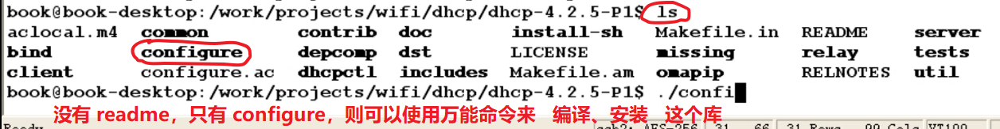
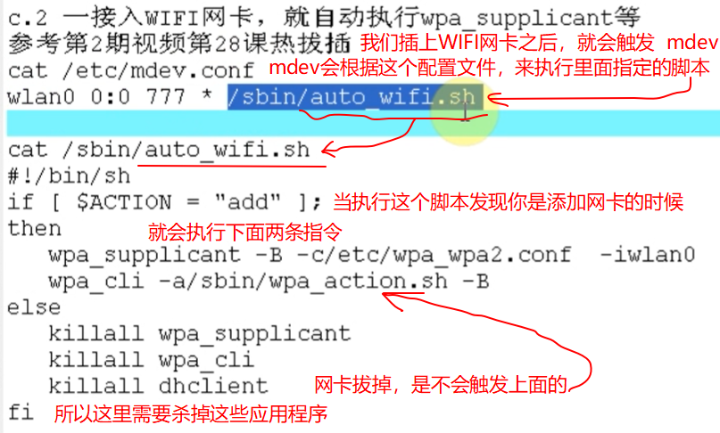
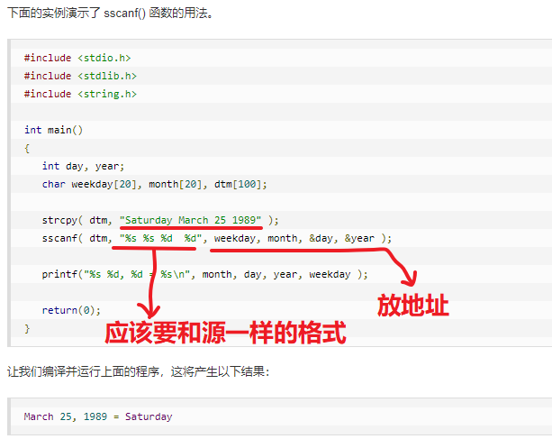
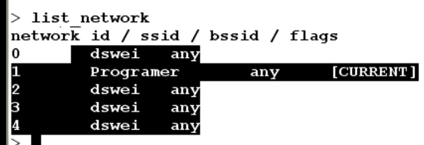
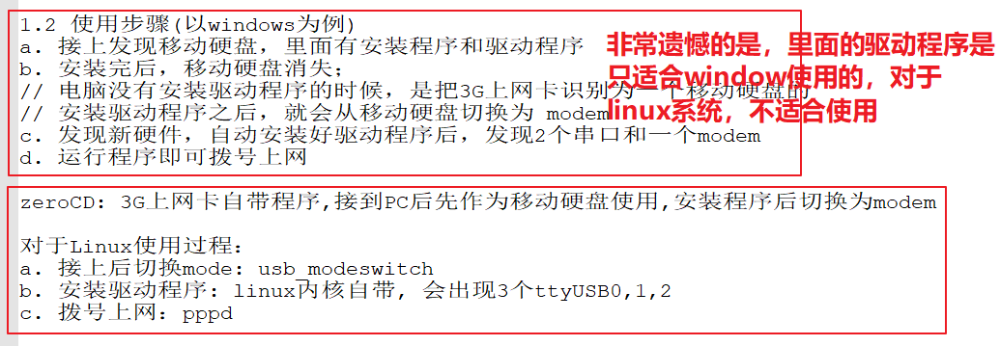
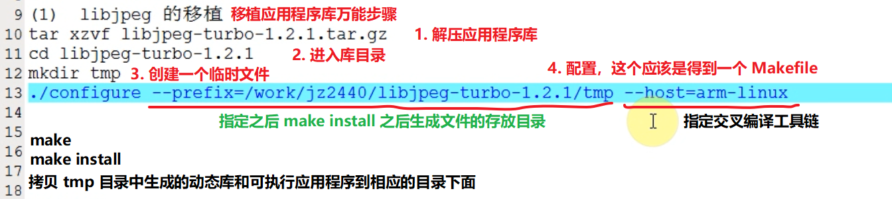
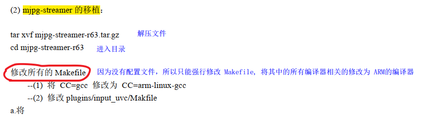
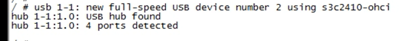
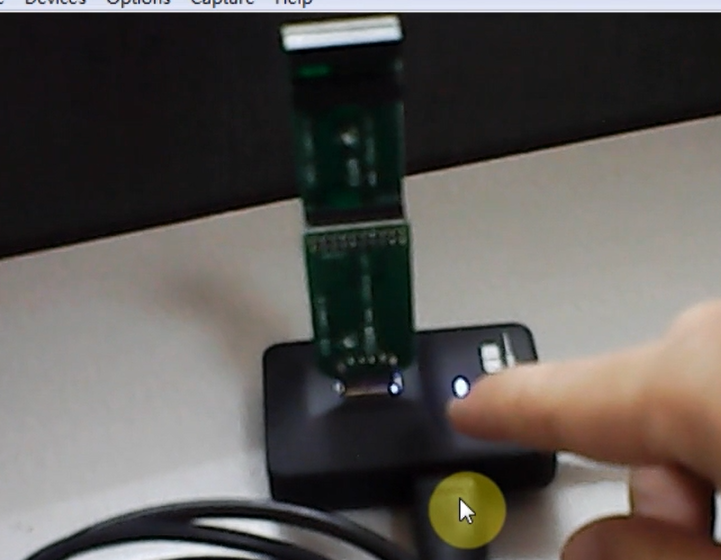

## 1.1 整体数据流动过程


## 1.2 WIFI网卡


### 1.2.1 iw工具


在小公司或者在家庭里面，直接使用 AP 就行，直接在里面预先设置好密码，如果外部设备连接到 AP 上，密码对了就会连接上。


### 1.2.2 wpa工具


修改Makefile，因为需要交叉编译，所以需要修改里面的

```c
CC= arm-linux-gcc
```


发现需要 openssl 库的支持，所以还需要找到这个依赖库进行编译，然后将编译出来的 头文件、库文件 全部拷贝到交叉编译工具链中。


拿到一个新的库，先ls看看有没有说明readme文件。


shared 是指定生成动态库

--prefix=DIR是指定之后 make install 的时候安装到哪个目录下面

```c
// 编译之前的配置，就是为了自动生成一个 Makefile
// no-asm 是不使用里面的汇编代码进行优化，这里使用汇编代码就会出错提示给 X86 使用的
./config shared no-asm --prefix=$PWD/tmp
    
// 因为不能直接指定交叉编译器，所以上面的指令生成的 Makefile中，需要手动修改里面的编译指令
CC= arm-linux-gcc
AR= arm-linux-ar $(ARFLAGS) r
RANLIB= arm-linux-ranlib
NM= arm-linux-nm
MAKEDEPPROG= arm-linux-gcc
```


wpa的操作，好像都是修改配置文件，然后使用 supplicant 命令来操作

- 这里相当于把开发板（接上无线WIFI网卡）当作一个设备来使用，直接连接到手机热点（AP），或者通过AP连接到服务器上面。


上面的文件 .conf 就是下面这个样子


然后查看状态


不同的加密方式，需要拷贝不同的配置文件出来，然后修改里面的 热点名称和密码。


如果不借助 iw，wpa 这些应用工具，我们连接配置好WIFI网卡之后，也只能查询或者设置一下 IP地址，但是却还不能上网，因为我们的 WIFI还没有连接到热点或者网络上面。所以借助 iw 和 wpa 这些工具可以很方便的连接到外部网络上。


DNS的配置


### 1.2.3 dhcp 自动获得IP

之前通过 iw，wpa 工具连接到热点之后，我们都是通过手工的方式来设置 IP，我们能不能设置自动获得 IP呢？

可以的，就是通过移植一个 dhcp 库来实现自动获得 IP。





- 使用测试


**一连接上 WIFI AP ，就自动指定 dhclient**


- 自动连接


- 脚本


**一连接上 WIFI AP ，就自动指定 dhclient**




### 1.2.4 疑问


### 1.2.5 使用WIFI网卡_AP模式


我们手机一般工作于 STA 模式，能不能将开发板作为 AP模式，让手机连接开发板的热点呢？

- 需要移植  hostapd 到开发板上，建立无线热点

- 然后我们怎么编译它呢？官方文档中有说明

  如果没有configure 文件，则可以直接修改 Makefile，修改里面的交叉编译器。


- 启动 dhcpd服务


- AP模式的自启动

  也是采用 mdev.conf 中，修改为别的自启动脚本。

  


下面箭头指着的两个是配置好的文件系统，打包了，到时候直接放到一个 nfs中，替换原来的文件系统就可以挂载这些文件系统了。


### 1.2.6 使用WIFI网卡_仿手机写wifi操作程序

功能如下：


- 再次熟悉一下 wpa_cli 的命令

输入 wpa_cli ，直接回车的话，进入的是一个交互模式


然后在里面可以运行各种命令


- 参考 wpa_cli 源码编程


**核心：wpa_cli 通过 wpa_request函数 向 wpa_supplicant 发出命令，并得到结果**


函数（指令），可以看源码的 readme ，里面有提到


扫描出来的 wifi 热点的信息，在 while 循环里面定时打印出来，可以实现定时刷新 wifi热点信息的功能。


- sscanf函数





- strstr


- sprintf

  

配凑字符串


**注意点：**


- 所以我们还需要 enbale 它们才行





- 保存配置文件的功能  save_conf


如果我们成功连接了某个wifi之后，这个 wifi号和密码就会保存到一个配置文件中。


这就完成了 模拟手机wifi的功能

- 如果后面我们要把这些功能应用到产品上面，就改变 peintf和scantf信息的来源
- 把scan到的热点信息打印到 LCD上面去
- 从触摸屏上面获得输入信息


## 1.3 3G上网卡


### 1.3.1 3G模块选型




说明：

- usb_modeswitch是一个应用程序，借助这个应用程序来切换为 modem模式
- 幸好linux内核自带有某些信号的3G上网卡的驱动程序，所以需要配置内核，编译进内核里面
- 两个串口：其中1个用来发AT命令，一个串口用来诊断
- 还有一个是 modem用来拨号上网


不知道这些含义是什么，可以全部 ppp 都选上。


之后我们得到的是 ttyUSB是吧，所以还需要把USB串口给配置了。

- 注意，这里是把驱动.c所在的同目录中的Makefile打开


- 需要应用程序 usb_modeswitch，需要交叉编译


### 1.3.2 超好的参考文章

把下面的文章看完之后，对3G USB Modem就会了如指掌。


参考文章:
嵌入式Linux下3G USB Modem的使用 - 空之轨迹～约修亚 - 博客频道 - CSDN.NET.htm
http://blog.csdn.net/ling1874/article/details/8148822
http://wenku.baidu.com/link?url=HLRk3U9Jbr2Zx35e5knamYeUKYs14bhV3F9-hzC6rWMwdxCu2gTtAR89VBAdpoAF4UC9LmxCPxGLbjAu_XoSXuy065ZbbvfwtWm9vLy5UWe

配置文件最全：
HI3515海思开发板移植3G模块笔记 - 倔强的晓奇 - 博客频道 - CSDN.NET.htm
http://blog.csdn.net/alangdangjia/article/details/9413009

好文章：ppp及usb_modeswitch等工具移植说明_百度文库.htm
http://wenku.baidu.com/link?url=Y7gsW5izmXwzur3VS3hGYWV_k_glZwzmu7Prdh_F69LuFxcOGT1LwhtsmXA3TVhR6F0l8_ozspcQvO08nlHex2yss0EW7wWIzysw9cZn-wu


### 1.3.3 交叉编译 usb_modeswitch


- 安装Linux内核编译出来的驱动程序模块


- 用pppd拨号


### 1.3.4 测试步骤

- 插入3G上网卡

使用 lsusb 可以查看到 ID值为：12d11505


- 然后到 usb_modeswitch  中的说明文件 device_refernece.txt 下面搜索

找到之后，就把里面对应的配置信息拷贝出来，


把配置文件另存为 eq10b.cfg


- 拷贝  eq10b.cfg 配置文件到单板上，然后执行如下命令，就可以实现切换模块到 modem模式


切换完成之后，其 ID就会发生变化


华为的这个，有4个 USB串口


- 测试过程


- 注意点：


### 1.3.5 3G上网卡自动模式切换

对于移动这款比较奇怪的上网卡，就不能实现自动的模式切换。


参考ubuntu上对3G上网卡的自动识别过程来学习

- 在pc上编译usb_modeswitch  非常简单，直接 ./configure， 然后make就行      

- 在pc上编译 ppp


PC使用的是 udev


它并不使用配置文件，而是使用 -f 配置信息


- 我们将会大量使用到 libUSB的函数


- 自动切换函数的程序框架


然后我们可以仿照lsusb的源码来写这个功能


- 编程自动确认拨号端口  

前面实现了热插拔自动切换3G上网卡的模式到modem，然后出现了 ttyUSB*

下面还要确定是哪个 ttyUSB* 作为拨号端口


## 1.4 mjpg-streamer_移植与效果演示

### 1.4.1 总体代码框图

四种接线方法

- 第一种接线方式

  C:\BaiduNetdiskDownload\01_无线监控文档源码\01_课堂笔记及代码\01_课堂笔记及代码\第2课第1.1_18节_讲解mjpg-streamer\doc\视频监控的实现.pdf

  这个pdf文档中介绍的移植方法，是这种方式。


- 第二种接线方式


- 第三种接线方式【课程使用这种接线方式】

USB_Hub 的作用是可以将2440上的一个USB接口扩展为多个USB接口来使用。


这里开发板竟然是工作在 AP模式？？？这怎么实现远程传输呢？


- 第四种接线方式


mjpg-streamer分析源码可以知道其是通过 ioctl 的方式来获取摄像头数据的，而我们写的 CMOS摄像头的驱动中，只支持 read，write 两种方式的读取摄像头数据。

所以想实现这种方式，有两种方法：

- 修改 mjpg-streamer 源码，使其支持 read/write 方式
- 或者修改 cmos 摄像头源码，使其有 ioctl 的功能


### 1.4.2 移植和演示mjpg-streamer



- 首先需要移植 libjpeg


- 移植 mjpg-streamer




还有很多 .so 文件


- 更换内核


- 启动内核


- 将 USB_HUB插入板子的USB上




- 然后插入无线WIFI网卡

  成功识别到无线网卡


- 然后插入USB摄像头

  插入USB摄像头，也自动识别到 UVC摄像头，并且出现了设备节点


- 运行 mjpg-streamer 


​		执行上面的指令，mjpg-streamer就运行起来了


- 手机连接开发板的AP热点

  因为开发板的无线WIFI是工作在AP模式的，所以我们手机（STA模式）需要连接到这个AP热点才能实现连接。





### 1.4.3 mjpg-streamer源码分析

mjpg-streamer是怎么实现采集数据和传输数据两个功能的，将在后面分析这个应用程序的源代码的时候深入了解。


- 先分析mjpg-streamer整体的框架


dlopen是打开一个动态链接库

这些输入输出动态链接库是实现了什么功能呢？里面有  .init  .run  .stop，通过这些函数来实现不同的功能。


output_hppt.so就是使用 socket 编程，来模拟 http协议。


### 1.4.4 讲解mjpg-streamer 源码分析(上) 主进程


- 应用程序都有参数输入功能，因此需要解析参数，而这里使用了 `getopt_long_only` 函数来解析参数

分析 `getopt_long_only` 的用法（用于解析命令行选项）


- 是否让程序在后台运行


**mjpg-streamer.c函数的主流程**

- input_init(&global.in.param)函数，初始化输入源接口

- output_init(&global.out[i].param)函数，对于所有的输出接口都调用，初始化多有的输出接口

- 调用 input_uvc.c中的input_run函数
- 调用 output_http.c 中的 output_run 函数，对于所有的输出接口都调用


**下面依次分析上面这4个函数**


### 1.4.5 分析 input_init

我们输入的命令行是   `"input_uvc.so -f 10 -r 320*240"`

则这里我们也可以仿照 mian 函数的参数解析，自己构造好 argc 和 argv[]，来实现调用 getopt_long_only

来解析出参数。

- 分辨率   -r 320*240

- 帧率  -f 10


**input_init 函数实现的功能**

- 初始化一堆局部变量，初始化互斥锁

- 将传入的参数字符串，分割存进数组中argv[]，方便后面解析选项参数

- getopt_long_only解析参数，主要得到 分辨率和帧率

- 分配一个 vdIn 结构体，并初始化为0

- 打印出相关的调试信息，也就是上面的 使用的是哪个设备节点 、分辨率、帧率 等等

- 调用 init_videoIn(videoIn, dev, width, height, fps, format, 1) 函数

  - format=V4L2_PIX_FMT_MJPEG

  - init_videoIn 函数里面会：

    - 设置 videoIn 结构体
    - 将videoIn作为参数，调用init_v4l2 函数初始化v4l2，里面主要是使用 ioctl
      - 打开摄像头的设备节点(/dev/vide0) 
      - 查看所打开的设备是否是视频捕获设备
      - 判断是否是视频捕获设备
      - 判断是否支持该种数据传输方式：流传输、读写方式传输
      - 设置摄像头的输出格式(分辨率、输出格式(MJPEG/YUV))
      - 设置摄像头参数,比如输出帧率
      - 申请缓存
      - 将上述申请的缓存映射到用户空间  mmap
      - 投放一个空的视频缓冲区到视频缓冲区队列中

    - 分配一个临时缓冲区,用于接收摄像头数据

  - 动态调整摄像头的焦距之类的，这个项目没有使用到

    

### 1.4.5 分析 input_run

这里面涉及到摄像头的操作，都是采用 V4L2的ioctl来实现的


**input_run 函数实现的功能**

给仓库buf 分配一段内存空间，分配1帧视频数据那么大

创建一个线程，线程函数是 cam_thread

- 当线程执行完后,会调用 cam_cleanup 来做些清理工作

- 进入死循环while( !pglobal->stop )，直到按 `<CTRL>+C` 时触发信号，信号函数设置stop=1

- uvcGrab 函数获得一帧数据

  MJPEG格式的话：则将一帧视频数据存放到 videoIn->tempbuffer 中

  YUV格式的话：则将一帧数据存放到 videoIn->framebuffer 中

  - video_enable 使能视频捕获设备，通过ioctl发VIDIOC_STREAMON来实现
  - 从视频缓冲区队列中取出一个已经存有一帧数据的视频缓冲区
  - 根据视频数据的大小,判断该帧数据是否有效
  - 将视频数据拷贝到 vd->tmpbuffer 中
  - 投放一个空的视频缓冲区到视频缓冲区队列中

- 打印调试信息,一帧数据有多大

- 如果这一帧数据太小,则认为他是无效数据

- 拷贝 JPG 图像到 仓库中 (这段区间的内容是不允许被别的线程打断的)

  - 如果摄像头输出的视频数据为YUV格式,则执行该分支

    最终的MJPEG数据存放到 pglobal->buf 中

  - 如果摄像头输出的数据为MJPEG格式,则直接将它拷贝到  pglobal->buf 中

  - pthread_cond_broadcast(&pglobal->db_update);	

    // 发出一个数据更新的信号，通知发送通道来取数据,也就是输入通道进程已经把数据传输到仓库buf中了,需要通知一下 输出通道来仓库中获取一下数据.

- 如果我们的帧率小于5,则要做一个小的延时操作

- 等待线程执行完,然后回收它的资源


	将YUV转换为JPEG
	YUV->RGB->JPEG (RGB->JPEG 利用libjpeg)(YUV->RGB 利用公式转换一下)
	先将 YUV格式的颜色空间转换为RGB格式的颜色空间，然后再将RGB颜色空间转换为JPEG格式


### 1.4.6 分析 output_init

output_http.c


**output_init 函数实现的功能**

output_http.so -w www

- 也是将字符串命令配凑成 argc 和 argv 
- 然后调用 getopt_long_only 函数进行参数解析,给对应的变量赋值


### 1.4.7 分析 output_run

output_http.c


**output_run 函数实现的功能**

- 打印出一个调试信息

- 创建一个线程 server_thread

  - 取出globals结构体变量

  - pthread_cleanup_push   当线程结束的时候，会调用 server_cleanup 来做些清理工作

  - socket(PF_INET, SOCK_STREAM, 0)   打开 socket,充当服务器的角色,相当于open函数

  - 设置套接字  etsockopt(pcontext->sd, SOL_SOCKET, SO_REUSEADDR, &on, sizeof(on))

    - SO_REUSEADDR:可以重复使用同一个IP和端口号

  - bind  绑定本地的端口和IP

  - listen  启动监测数据,最多可以同时连接10个客服端

  - 给每一个连接客户端创建一个 child

    - 分配一个cfd结构体

    - 判断是否分配成功

    - accept  等待客服端的链接，如果有链接,则建立链接       这里会阻塞住

    - pthread_create  创建一个线程 client_thread

      - 	第一个参数:线程标识符的指针
          	第二个参数:设置线程的属性
          	第三个参数:线程函数的起始地址
          	第四个参数:传给线程函数的参数

      - client_thread

        - 如果我们传人的参数不为空,则将参数的内容拷贝到 lcfd 中(参数为 pcfd ,不为空)

        - init_request(&req);// http协议,需要客服端给服务器发送一个请求,而request就是这个请求

        - ```c
          /* _readline:从客服端中读取一行的数据,以换行符结束 */
          /* buffer中存有"abcd\n" */
          /*
          如果需要我们自己来写 mjpg-streamer 的客户端程序,则:
          	客服此时必须发送一个请求字符串，以换行符作为结束!
          	问:可以发送哪些字符串?
          	答:有
          		"GET /?action=snapshot\n"    快照类型
          		"GET /?action=stream\n"      视频流类型    让服务器发送视频流
          		"GET /?action=command\n"     命令类型请求
          */
          ```

        - 解析buf中的字符串,看是哪一种类型的请求

        - 将请求后面的参数保存到 req.parameter

        - do while     

          - 从客服端读取一行数据到 buffer中
          - 开始解析 buffer 中的数据
          - 如果buffer(客服端)中存有(发送了)用户名,则将用户名保存到 req.client 中
          - 如果buffer(客服端)中存有(发送了)密码,则将密码保存到 req.credentials 中

        - 如果支持密码功能,则要检查用户名和密码是否匹配 

        - 根据请求的类型，采取相应的行动

          - send_snapshot

            - pthread_cond_wait  等待输入通道发送数据更新请求,这里就会阻塞等待

              这个有意思了,之前输入通道的线程中互斥锁,然后取到数据到Buf中了才通知数据更新

            - 得到一帧数据的大小

            - 根据一帧数据的大小,分配一个 frame 缓冲区

            - 从仓库(pglobal->buf)中取出数据放到这个缓冲区中

            - 让buffer = "字符串"

            - 将buffer中的字符串发送给客服端, socket模仿http请求,所以客户端请求数据之后,服务器要回复一个应答,这里就是回复应答的功能

            - 将一帧图片给发送出去,真正的发送数据出去

            - 释放缓冲区

              

          - send_stream(lcfd.fd)

            - 让buffer = "字符串"

            - 将 buffer 中的字符串发送出去(报文), socket模仿http请求, 回复一个应答

            - while ( !pglobal->stop )   因为是视频流,所以要一直发送,就有一个 while循环

              contl+C的时候,才会跳出这个 while 循环

              --> pthread_cond_wait   等待输入通道发出数据更新的信号

              --> 得到一帧图片的大小

              --> 检查我们之前分配的缓存是否够大,如果不够,则重新分配 

              --> 从仓库中取出一帧数据

              --> 让 buffer = ""报文，告诉客服端即将发送的图片的大小

              -->  write   将一帧图片发送出去

              --> 让 buffer = "boundarydonotcross"

              --> write  buffer   发送给客户端，让客户端知道一帧数据接收完了

            - 

          - command

        - free_request

- 等待线程结束,以便回收它的资源


### 1.4.8 自己写客户端怎么写


- 前面演示的时候,这个命令是启动了 mjpg-streamer 的服务器而已,客户端还没有写


- 让虚拟机连接上开发板的WIFI热点


- 运行写好的客户端程序,看看实验现象


- 然后就可以看到摄像头采集到的视频数据


