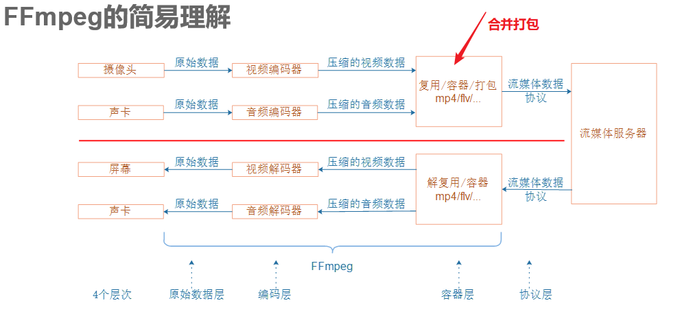
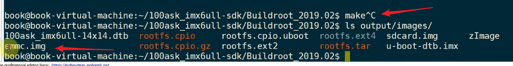
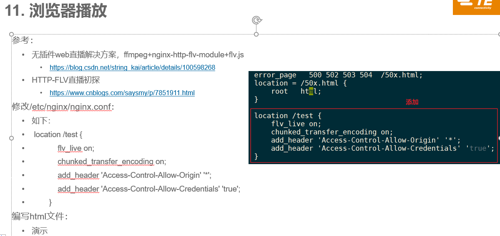
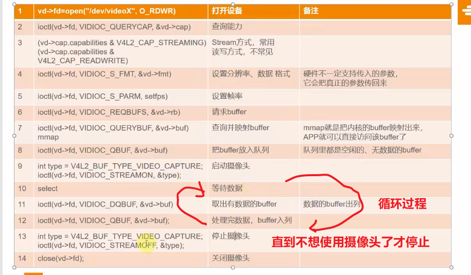
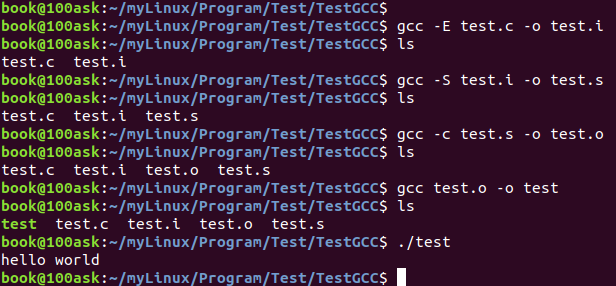

# 第1节：视频监控方案介绍

## 1.1 两种方案介绍

- 一种可以运行在低性能的板子上
- 另一种是热门的流媒体方案


## 1.2 准备资料


## 1.3 课题介绍

### 1.3.1 自己实现

- 小思路

  无人机上可以运行一个摄像头和wifif热点。


- 整体的流程

  这种方案的缺点就是，两边的网络程序都要自己来写，自己定义数据协议。


- 自己实现的话


作为程序员，我们需要写2个程序：

- 在连接摄像头的ARM板子上，实现一个服务器程序：它一边读取摄像头数据，一边等待客户端连接并发送数据

- 在手机或电脑上，编写客户端程序，它会从ARM板上获得数据并显示出来

- 这2个程序之间，并不需要实现复杂的协议
  - 约定数据格式
  - 传输一帧帧的数据


### 1.3.2 mjpg-streamer

实际上，我们可以使用现成的程序：

- mjpg-streamer，它运行在ARM板上

- 在手机上使用浏览器直接观看视频


**优点：**

- 程序简单，所有源码一目了然，便于学习
- 对ARM板的性能要求不高，主频200MHz的ARM芯片也能实现

**缺点：**

- 只能实现**局域网**内的视频监控，【怪不得三期项目中是采用开发板作为wifi服务器，然后手机局域网连接到这上面】
- 要实现互联网视频监控，【需要另外实现内网穿透】
- mjpg-streamer没有实现声音传输
- mjpg-streamer项目已经不再维护，仅仅建议用于学习


### 1.3.3 流媒体


作为程序员，我们需要写3个程序：

- 在连接摄像头的ARM板子上，实现一个**推送程序**：它一边**读取摄像头数据**，一边**把数据推送给服务器**

- 在服务器上，实现“流媒体服务器”程序：它**接收ARM板发来的数据**，并**把数据转换格式后发给手机等客户端**

- 在手机等客户端上，实现**拉取程序**：它从服务器上**拉取数据**，并**显示出来**

实际上，我们可以把互联网功能去掉：

- 把“推送程序”、“流媒体服务器”程序，都在ARM板上运行；手机等客户端只能在同一个局域网里观看视频

- 或者也使用内网穿透技术实现互联网视频监控


- 介绍
  - 这一套模式，使用了服务器，肯定不仅仅给一个设备使用的，可以有很多推流端和拉流端来实现
  - 服务器 要给成千上万的人来连接
  - 然后推流端和拉流端都需要对应的协议来实现


我们并不需要从头实现这些功能：

- 推送程序：ffmpeg

- 流媒体服务器程序：Nginx

- 客户端程序：VLC浏览器

我们需要了解一些协议：

- 程序一多，大家都遵守一些协议才好协同工作

- 有很多流媒体协议

- STMP、HTTP-FLV、HLS

```c
参考资料：
•HTTP-FLV直播初探
•https://www.cnblogs.com/saysmy/p/7851911.html
•理解RTMP、HttpFlv和HLS的正确姿势
•https://www.jianshu.com/p/32417d8ee5b6
```


**Adobe公司提供的两种协议介绍**：延时小，适合做直播


### 1.3.4 RTMP协议介绍

- Real Time Messaging Protocol

- Adobe公司出品，需要Flash player才能观看

- 延时小，适合直播


视频的数据是存在服务器上的，手机客户端通过TCP与服务器建立连接，所以这个连接很容易被防火墙拦截。

然后因为视频数据是在服务器上的，所以手机客户端可以实时拖动进度条，查看不同地方的内容。


### 1.3.5 Http-FLV协议

- 针对 RTMP协议的TCP协议连接容易被防火墙拦截的问题，Adobe公司提出了一种新的协议 Http-FLV协议。

HttpFlv：

- 在HTPP上实现RTMP，传输的数据跟RTMP一样都是flv文件

- B站开源了flv.js，实现了纯HTML5观看直播，不再需要Flash player
- 延时小，适合直播
- HttpFlv只能做直播，而RTMP可以实现更多操作
- 但是HttpFlv通过Http 80端口传输，穿透性强


它是把服务器上的视频数据划分为一块块，然后手机客户端是通过 http协议连接到服务器上，提前将服务器上的一块块视频文件下载到本地，然后再在本地播放。文件被下载到本地，就出现容易被盗取的问题。

- 播放插件容易崩溃


### 1.3.6 HLS协议

苹果公司受不了上面两种协议，就提出了一种新的协议 HLS


它是通过提供下载连接，然后本地还是要根据这些连接把视频文件下载到本地，然后再播放

- HTTP Live Streaming

- Apple出品

- 延时大，适合看视频，不适合直播


### 1.3.7 最终方案


# 第2节：MJPG-streamer方案的实现

## 2.1 方案介绍


## 2.2 移植和使用

查看某个文件大小  `ls -l filename`

查看某个文件夹大小 `进入该文件夹，然后 du -sh`

查看磁盘大小  `df -h`


- **编译和移植 mjpg-streamer 有两种方法**


- （1）打开 Buildroot 工具链的源码


- （2）


- （3）用 / 搜索一下，mjpg-streamer在哪里


- （4）


- （5）根据提示找到对应的路径


- （6）上面输入 y 选上，然后 save 保存，然后退出，在顶层目录下这些配置内容就会被写入 .config 中了。 

- （7）执行 make 进行编译


- （8）编译完成之后，在目录 output/images/目录下就会有系统印象文件，可以烧写到 emmc 或者 sdcard 中，然后启动系统

  ​          我们使用的这个 100ask_6ull prob 开发板上已经配置好了 mjpg_streamer ，可以直接使用了


- （9）mjpg_streamer --help 查看帮助信息


```c
-----------------------------------------------------------------------
Usage: mjpg_streamer
  -i | --input "<input-plugin.so> [parameters]"
  -o | --output "<output-plugin.so> [parameters]"
 [-h | --help ]........: display this help
 [-v | --version ].....: display version information
 [-b | --background]...: fork to the background, daemon mode
-----------------------------------------------------------------------
Example #1:
 To open an UVC webcam "/dev/video1" and stream it via HTTP:          // 这个有指定设备节点
  mjpg_streamer -i "input_uvc.so -d /dev/video1" -o "output_http.so"  // 使用 uvc摄像头作为输入，http 作为输出
-----------------------------------------------------------------------
Example #2:
 To open an UVC webcam and stream via HTTP port 8090:
  mjpg_streamer -i "input_uvc.so" -o "output_http.so -p 8090"    // 使用 uvc摄像头作为输入，http 作为输出
-----------------------------------------------------------------------
Example #3:
 To get help for a certain input plugin:
  mjpg_streamer -i "input_uvc.so --help"
-----------------------------------------------------------------------
In case the modules (=plugins) can not be found:
 * Set the default search path for the modules with:
   export LD_LIBRARY_PATH=/path/to/plugins,
 * or put the plugins into the "/lib/" or "/usr/lib" folder,
 * or instead of just providing the plugin file name, use a complete
   path and filename:
   mjpg_streamer -i "/path/to/modules/input_uvc.so"
-----------------------------------------------------------------------
```


- （10）开发板接上摄像头，就会出现一个新的设备节点 video1

  


- （11）运行 `mjpg_streamer -i "input_uvc.so -d /dev/video1" -o "output_http.so"`

  ​			提示找不到共享库，这些  .so 是动态库，在手动移植的时候会指定好在系统的 lib 目录中的

  ​			但是它 buildroot 编译出来的 .so 就不知道在哪了，所以可以添加绝对路径来实现


- （12）添加绝对路径再测试

  ​			查找绝对路径


```c
[root@100ask:/]# find -name "input_uvc.so"
./usr/lib/mjpg-streamer/input_uvc.so
[root@100ask:/]# find -name "output_http.so"
./usr/lib/mjpg-streamer/output_http.so
```


- （13）ppt上的使用这个绝对路径

```c
mjpg_streamer -i "/usr/lib/mjpg-streamer/input_uvc.so -d /dev/video1 -f 30 -q 90 -n" -o "/usr/lib/mjpg-streamer/output_http.so -w /usr/share/mjpg-streamer/www"
```

依照这个修改成相应的

```c
mjpg_streamer -i "/usr/lib/mjpg-streamer/input_uvc.so -d /dev/video1 -f 30 -q 90 -n" -o "/usr/lib/mjpg-streamer/output_http.so -w /usr/share/mjpg-streamer/www"


mjpg_streamer -i "input_uvc.so -d /dev/video1" -o "output_http.so

/usr/lib/mjpg-streamer/input_uvc.so    
/usr/lib/mjpg-streamer/output_http.so

    
mjpg_streamer -i "/usr/lib/mjpg-streamer/input_uvc.so  -d /dev/video1 -f 30 -q 90 -n" -o "/usr/lib/mjpg-streamer/output_http.so -w /usr/share/mjpg-streamer/www"  
```


- （14）使用上面的指令

  ```c
  mjpg_streamer -i "/usr/lib/mjpg-streamer/input_uvc.so  -d /dev/video1 -f 30 -q 90 -n" -o "/usr/lib/mjpg-streamer/output_http.so -w /usr/share/mjpg-streamer/www"  
  ```

  运行之后显示打开成功


- （15）打开浏览器查看

  开发板的 ip 地址是  192.168.5.9，端口上面可以看到是 8080，所以这里可以在浏览器中访问这个 IP和端口


http://192.168.5.9:8080   在浏览器输入这个，也可以点击下面的快捷方式

[MJPG-streamer](http://192.168.5.9:8080/)

出现这个界面之后，点击下面的 Stream 视频流，就可以查看了


还挺清晰的


## 2.3 框架讲解，代码讲解

- （1）源码在这里


- （2）源码框架


- （3）启动 mjpg_streamer 之后，就打开了 3 个线程


## 2.4 能不能修改源码

- 按照三期视频最后一节中添加的 TCP、UDP 的方法，把字节流输出还是怎么样
- 修改源码，把数据转移到 LCD 上显示


# 第3节：流媒体方案的实现之ffmpeg

## 3.1 FFmpeg介绍





- 处理
  - 旋转、拉伸
  - 添加LOGO、消除LOGO等等
  - 音频和视频处理是分开来进行的


## 3.2 移植、使用

- 在buildroot文件目录中，make menuconfig，然后 / 搜索FFmpeg，得到配置的路径。

  

- 把 ffmpeg 内容都选上


- make 之后，生成镜像文件，然后烧写到emmc中，进入的系统就具有这个 FFmpeg 库和应用程序了。



- 查看用法， ffmpeg --help


- `ffmpeg -f v4l2 -framerate 10 -i /dev/video1 -q 10 my.mp4`


- 采集数据，ctrl+c 退出，然后生成 mp4文件保存在当前目录


- 把 mp4 文件传输过来，然后打开可以查看
  - 有个点注意一下：就是我们拍了很久，其实只得到很少的数据，这是因为 6ull 板子的性能太弱了
  - 可以在window上来测试，熟悉这些参数。


# 第4节：流媒体方案的实现之Nginx

## 4.1 移植


- 编译 buildroot 成功


- 测试


- 


```c
ffmpeg -f v4l2 -framerate 10 -i /dev/video1 -q 10  -f flv rtmp://127.0.0.1/live/wei
//-framerate 10   一秒十帧
//-q 10           质量为10
// 以 rtmp 服务器推送数据到本地的服务器
```


```c
有两种方法：
下载源码，手工编译
使用Buildroot，配置选择Nginx，直接编译生成映象文件
我们使用Buildroot：
设置交叉编译工具链
下载第3方模块：
在Buildroot目录下，创建目录：mkdir  dl/nginx
使用git下列载：cd  dl/nginx  &&  git clone https://github.com/winshining/nginx-http-flv-module.git
在Buildroot根目录
make menuconfig
把原来的lighttpd去掉，否则板子也会自动启动它，就会有两个HTTP服务了：lighttpd, nginx
如图选择Nginx，建议把所有功能都选上
并且设置额外的参数，在“additional modules”中添加： $(TOPDIR)/dl/nginx/nginx-http-flv-module
最后执行(先删除之前编译的nginx，我发现有时设置的第3方模块不起作用，删除后再make就可以了)：rm -rf output/build/nginx-1.15.7   &&  make
这会在Buildroot的dl/nginx目录下自动下载源码，并编译
结果保存在output/images目录下，有emmc.img, sdcard.img，可以直接烧写到板能的EMMC或SD卡上
```





# 第5节：摄像头和声卡接口

## 5.1 摄像头V4L2接口


- 设置参数的时候，会寻找一个相近的来设置





## 5.2 声卡ALSA接口


### 5.2.1 声卡开发介绍


### 5.2.2 声卡示例最好的文章

•A Tutorial on Using the ALSA Audio API：http://www.equalarea.com/paul/alsa-audio.html


-  在开发板上使用 buildroot 配置了 alsa-utils 开源应用库程序之后，就可以在终端使用一些命令来录制声音了。
- 并且可以播放
  - 前提是开发板的镜像文件中已经按照 V4L2 和 ALSA 的标准协议编写好驱动了，这些开源的库源程序才能按照这些协议来调用和操作硬件
  - 这个 ALSA-UTILS 是在应用程序的层面上封装了一层，再提供给用户使用


- **把视频和声音一起推流**

```c
推流
在开发板上执行：
只推声音：ffmpeg -f alsa -ac 1 -ar 11025  -i  hw:0,0 -acodec aac  -f flv rtmp://127.0.0.1/live/wei
视频声音同时推：ffmpeg -f alsa -ac 1 -ar 11025  -i  hw:0,0 -acodec aac -f v4l2 -framerate 10 -i /dev/video1 -q 10  -f flv rtmp://127.0.0.1/live/wei
拉流
在PC上安装VLC播放器：https://www.videolan.org/
使用RTMP协议拉流：VLC播放器中点击“媒体”->“打开网络串流”，输入：rtmp://192.168.1.6/live/wei  ，就可以播放了
使用
```


# 第6节：内网穿透

## 6.1 原理


## 6.2 两种实现方法


### 6.2.1 路由器的 NAT 技术

- 只有局域网主动通过路由器访问外部的公网设备，外面的公网设备才能通过路由器记录的路由表找到局域网中的这个设备

- 如果一个陌生的外部设备想要主动访问这个局域网设备，因为路由表中没有这个记录，就会请求失败

  


### 6.2.2 方法1：设置路由器


### 6.2.3 方法2：设置路由器


- 


- 


```c
我们可以上传一个mp4文件到开发板，把它推到Nginx： 
    ffmpeg -re -i my.mp4 -vcodec copy -acodec copy -f flv rtmp://127.0.0.1/live/wei

```


# 7 动态库.so文件的学习

参考博客：

[(26条消息) SO文件的编写，编译，使用方法_慎薇的博客-CSDN博客_如何编译so文件](https://blog.csdn.net/qq_33832591/article/details/52288255)

## 7.1 so文件简介

​		`linux`下的.so文件为共享库，相当于windows下的`dll`文件。在系统目录 `/usr/lib/` 下，我们可以看到很多应用程序库文件（常用的动态链接库和软件包的配置文件）。

​		.so 文件也是一些 .c /.h 文件生成的，一般这些文件里面都只是提供一些函数，没有main函数，编译成 .so 文件放到对应的系统目录中之后，别的程序调用它的时候，需要添加它的头文件，然后才能调用它里面的函数。

​		

## 7.2 动态库和静态库

[(26条消息) Linux下C++/C 编译生成.a 或者.so 库文件_wx_14678的博客-CSDN博客](https://blog.csdn.net/wx_14678/article/details/103597303?spm=1001.2101.3001.6650.13&utm_medium=distribute.pc_relevant.none-task-blog-2~default~CTRLIST~Rate-13.pc_relevant_default&depth_1-utm_source=distribute.pc_relevant.none-task-blog-2~default~CTRLIST~Rate-13.pc_relevant_default&utm_relevant_index=15)

### 7.2.1 两种库的区别

​		一般程序编译的过程可以分为**编译**和**链接**两个阶段。链接阶段，需要把所有的obj文件(.o)链接起来，生成可执行程序，这个过程可以链接其他外部的库文件。 

​		库文件里的具体实现时对用户透明的，只是提供功能函数，而用户不能知道库文件爱你的源码实现。如果你不想开源你的具体实现，你就可以只提供库文件供别人使用。库文件分为静态库和动态库文件：

​		**静态库**：一般情况下也就是 .a 文件。静态库就是指在链接的过程中，将库文件所有数据都整合到目标代码，这样生成的可执行文件执行时就不再需要外部库支持，随便哪里运行。这样就导致了静态库编译生成的可执行库文件较大，而且当库文件需要更新改变时，可执行文件也必须重新编译生成。

​		**动态库**：一般情况下就是 .so 文件。与静态库不同，动态库文件在链接时不会将所有的代码实现整合到目标代码中，而是在可执行程序执行到相应位置时才会去库文件中搜索相应的方法。所以动态库链接生成的函数就比较小，而且库文件更新时，只需要重新生成库文件就可以了，不需要重新编译可执行程序。这就给库文件升级更新带来了极大的便利。


### 7.2.2 静态库的编译生成

​		静态库的编译生成需要用到 **ar 指令**：

- 链接过程参数 -L 表示库文件路径，-l 表示库文件名称。
- 库文件要以 lib{name}.a 命名格式，name指库文件的名字。

​		写一个测试小程序，三个文件，`funTest.c`，`funTest.h` 和 `testMain.c`，`testMain.c` 调用 一个 库函数输出：

`funTest.h` 

```c
// function declare
int myAdd(int a, int b);
int mySub(int a, int b);
```

`funTest.c`

```c
int myAdd(int a, int b)
{
	return a+b;
}

int mySub(int a, int b)
{
	return a-b;
}
```

把上面的.c源码和头文件，编译称为一个静态库

```shell
# 库文件形式下
gcc -c funTest.c                                # 编译生成funa.o
ar -rsv libfunTest.a funTest.o                  # ar指令， 编译生成静态库文件
gcc -o testMain testMain.c -L./ -lfunTest       # 链接静态库文件，生成可执行文件
```


`编写 main.c 函数，调用这个静态库文件看看`

```c
#include <stdio.h>
#include "funTest.h"
int main()
{
	int a = 10;
	int b = 4;
	int c;
	int d;

	printf("a=%d, b=%d\n", a, b);
	c = myAdd(a, b);
	d = mySub(a, b);

	printf("c=%d, d=%d\n", c, d);

	return 0;
}
```

```c
gcc -o myMain myMain.c -lfunTest -L ./
```


### 7.2.3 动态库的编译生成

​		编译动态库的时候，需要使用到 `-fPIC` 和 `-shared` 两个基本参数。

​		把上面的 funTest.c 也编译成动态库看看。

```c
// -o 指定生成目标
// libfunTest.so 自定义的动态库名字
// -fPIC -shared 是必备的参数
gcc -o libfunTest.so -fPIC -shared funTest.c
```


```c
// 生成动态库之后，使用这个动态库来编译 myMain.c
gcc -o myMain_so myMain.c -L ./ -lfunTest_so
```


```shell
# 试图运行生成的 myMain_so
# 提示说找不到动态库，因为程序在运行的时候，需要调用动态库才能正常运行，而我们也没有把这个 .so 动态库文件拷贝到默认的动态库目录中，所以这里找不到，下面介绍一下怎么指定或者添加动态库目录。
book@100ask:~/myLinux/Program/Test/TestGCC$ ./myMain_so 
./myMain_so: error while loading shared libraries: libfunTest_so.so: cannot open shared object file: No such file or directory
```


`可以通过 ldd 命令查看某个可执行文件需要哪些动态库支持。`


## 7.3 c语言编译的四大阶段

### 7.3.1 预处理（生成 .i 文件）    gcc -E

​		此阶段主要完成#符号后面的各项内容到源文件的替换，往往一些莫名其妙的错误都是出现在头文件中的，要在工程中注意积累一些错误知识。

- #ifdef 等内容，完成条件编译内容的替换
- #include 中内容，在当前目录或者指定目录，或者默认目录搜索头文件，并将头文件拷贝到源文件中
- #define 的内容，替换define的内容（包括上一步的头文件中的define内容）

此阶段产生[.i]文件。


### 7.3.2 编译（生成 .s 文件）  gcc -S

​		此阶段完成语法和语义分析，然后生成中间代码，此中间代码是汇编代码，但是还不可执行。

​		在此阶段会出现各种语法和语义错误，特别要小心未定义的行为，这往往是致命的错误。

​		第一个阶段和第二个阶段由**编译器**完成。

​		gcc 编译的中间文件是[.s]文件。


### 7.3.3 汇编（生成 .o 文件）  gcc -c

​		汇编阶段是把编译阶段生成的“.s”文件转化成目标文件，读者可以使用选项“-c”把汇编代码转化为“.o”的二进制目标代码了。 gcc -c  (小写)。

​		gcc 编译的中间文件是[.o]文件。

### 7.3.3 链接（生成 可执行文件）  gcc

​		在成功编译之后，就进入了链接阶段。在这里涉及到一个重要的概念：**函数库**。

————————————————

​		读者可以重新查看这个小程序，在这个程序中并没有定义 `“printf ”` 的函数实现，且在预编译中包含进去的 `“stdio.h”` 中也只有该函数的声明，而没有定义函数的实现，那么是在哪里实现的 `“printf”` 函数的呢？答案是：系统把这些函数实现都做到了名为 `libc.so.6` 的库文件中去了，在没有特别指定时，`gcc` 会到系统默认的搜索路径 `“/usr/lib”` 下进行查找，也就是链接到 `libc.so.6` 库函数中去，这样就能实现函数 `“printf”` 了，而这也就是链接的作用。

————————————————

​		函数库一般分为静态库和动态库两种。静态库是指在编译链接时，把库文件的代码全部加入到可执行文件中，因此生成的文件比较大，但在运行时也就不需要库文件了，其后缀一般为“.a”。动态库与之相反，在编译链接时并没有把库文件的代码加入到可执行文件中，而是在程序执行时链接文件加载库，这样就可以节省系统的开销，动态库一般后缀名为“.so”，如前面所述的libc.so.6就是动态库。gcc在编译时默认使用动态库。
————————————————
​		gcc 编译后的文件是 [可执行] 文件。




```shell
# -o 都是指定目标生成文件
# -l库 指定库：-lm   -lpthread   -lgcc  ...
# -L 头文件路径：-L 头文件目录

book@100ask:~/myLinux/Program/Test/TestGCC$ gcc -E test.c -o test.i #（阶段1）-E指定源文件
book@100ask:~/myLinux/Program/Test/TestGCC$ ls
test.c  test.i
book@100ask:~/myLinux/Program/Test/TestGCC$ gcc -S test.i -o test.s #（阶段2）-S指定源文件
book@100ask:~/myLinux/Program/Test/TestGCC$ ls
test.c  test.i  test.s
book@100ask:~/myLinux/Program/Test/TestGCC$ gcc -c test.s -o test.o #（阶段3）-c指定源文件
book@100ask:~/myLinux/Program/Test/TestGCC$ ls
test.c  test.i  test.o  test.s
book@100ask:~/myLinux/Program/Test/TestGCC$ gcc test.o -o test #（阶段4）链接工作，所有.o都列出来就可以，不需要选项指定，但是 .o 文件前后位置是有顺序关系的，eg: gcc main.o func.o -o app.out -lm
book@100ask:~/myLinux/Program/Test/TestGCC$ ls
test  test.c  test.i  test.o  test.s
book@100ask:~/myLinux/Program/Test/TestGCC$ ./test 
hello world
book@100ask:~/myLinux/Program/Test/TestGCC$ 
```


## 7.4 总结

​		静态库或者动态库，都是一个工程文件（里面有 .c文件和 .h文件），编写好工程之后，里面会有很多自己定义的函数，需要在头文件中声明，然后就按照动态库或者静态库的编译方法，把这个工程编译成 .so 文件或者 .a 文件。

​		测试：静态库的使用，在main.c中包含了静态库的头文件，然后就可以在程序中直接调用静态库中的函数来使用了。只是编译的时候，需要指定 -L 库文件的路径，以及 -l 指定库的名字。

​		静态库在编译链接的时候，会把所有的代码都编译链接进去，所以最终得到的可执行文件会很大。

​		

​		


