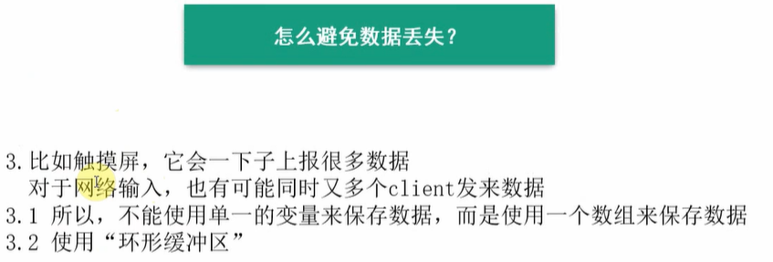
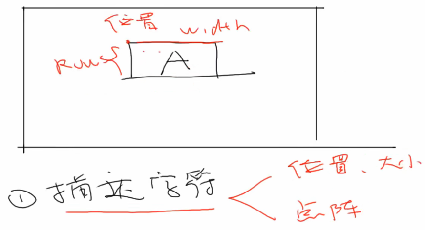

# 1 量产工具项目

## 1.1 项目涉及到的知识

① Framebuffer应用编程 

② 文字显示及图像显示

③ 输入系统应用编程

④ 网络通信

⑤ 多线程编程


## 1.2 程序框架


# 2 显示部分

## 2.1 数据结构抽象

### 2.1.1 显示部分分析

显示部分有多种形式显示设备，在程序框架中可以看出可以有LCD显示，也可以有网络传输之后Web显示。

如何构造一个通用的数据结构，使得不管对于LCD显示还是Web显示，都可以很方便的修改移植呢？

- 首先需要在应用程序上构造一个临时的buffer，用于存储需要显示的数据
- 对于LCD显示，只需要初始化Framebuffer之后，再把临时buffer中的数据拷贝到framebuffer中，就可以在LCD上显示出来了
- 对于Web显示，只需要初始化TCP/UDP的socket编程，然后通过网络把临时buffer中的数据发送出去，在Web中接收到这些要显示的数据之后，再通过Web的UI界面显示出来
- 中间还需要添加一层显示管理层，提供注册函数，让fb或者web把自己的显示结构体注册到一个链表中，同时还给综合应用程序提供一个函数，用来选择使用哪一个显示设备。还可以提供一些描点函数，这个函数可以在形参中指定使用哪一个设备。


### 2.1.2 显示部分抽象结构体


### 2.1.3 编程

`C:\Users\Administrator\Desktop\LYH\myLinux\量产工具项目\myCode\disp_manager.h`

```c
#ifndef _DISP_MANAGER_H  // 防止头文件被重复定义
#define _DISP_MANAGER_H

// 一块区域
typedef struct Region{
	int iLeftUpX;
	int iLeftUpY;
	int iWidth;
	int iHeigh;
}Region, *PRegion;


typedef struct DispOpr{
	char *name;
    int DeviceInit();  // 初始化函数
    int DeviceExit();  // 退出函数，做一些清理工作
	char *GetBuffer(int *pXres, int *pYres, int *pBpp);  // 获得一个Buffer的数据
	int FlushRegion(PRegion ptRegion, char *buffer);  // 把buffer数据刷新到ptRegion区域
	struct DispOpr *ptNext;  // 如果有多个显示设备，可以用链表把它们串起来
}DispOpr, *PDispOpr;

#endif /* _DISP_MANAGER_H */
```


## 2.2 Framebuffer编程

## 2.2.1 fb应用编程思路

- 打开fb设备节点 /dev/fb0
- 通过ioctl获取fb的可变参数
- 根据可变信息计算一屏幕显示，需要多少个字节数据
- mmap将framebuffer内存映射到用户空间fb_base
- 使用memset给用户空间的fb_base刷一屏黑色背景数据
- 之后的操作都是通过往 fb_base 以及结合可变数据，编写绘画函数了，写入 fb_base 中就会自动刷新到LCD上
- 用完LCD之后，记得 unmap映射的内存空间
- 记得关闭fb设备节点 /dev/fb0


### 2.2.2 编程

`C:\Users\Administrator\Desktop\LYH\myLinux\量产工具项目\myCode\framebuffer.c`

```c
#include <sys/types.h>
#include <sys/stat.h>
#include <fcntl.h>
#include <unistd.h>
#include <sys/ioctl.h>
#include <stdio.h>
#include <linux/fb.h>
#include <sys/mman.h>
#include <string.h>

#include "disp_manager.h"

static int fd_fb;  // lcd节点句柄
static struct fb_var_screeninfo var;  // 可变参数
static unsigned int line_width;       // 显示一行需要多少字节
static unsigned int pixel_width;      // 显示一个像素需要多少字节
static int screen_size;
static unsigned char *fb_base;


static int FbDeviceInit(void)
{
	// 1.打开framebuffer设备
	fd_fb = open("/dev/fb0", O_RDWR);
	if(fd_fb<0)
	{
		printf("can't open /dev/fb0 \n");
		return -1;
	}
	// 2.测试ioctl能否获取可变信息，信息存储在 var变量中
	if(ioctl(fd_fb, FBIOGET_VSCREENINFO, &var))
	{
		printf("can't get var \n");
		return -1;
	}

	// 3.从可变参数总提取重要信息
	// 3.1 x方向1行需要多少个字节
	line_width = var.xres * var.bits_per_pixel / 8;
	// 3.2 1个像素需要多少个字节
	pixel_width = var.bits_per_pixel / 8;
	// 3.3 1幅屏幕需要多少个字节
	screen_size = var.xres * var.yres * var.bits_per_pixel / 8;
	
	// 4.framebuffer基地址
	/* 作用：将内存空间映射到用户空间，用户空间直接访问映射的空间就是访问实际的内核态的内存空间
	 * addr：都写为NULL
	 * length：映射多少字节
	 * prot：可读可写属性 PROT_EXEC  PROT_READ  PROT_WRITE  PROT_NONE
	 * flags：MAP_SHARED写共享模式，两边同步   MAP_PRIVATE写复制模式
	 * fd：打开lcd的设备文件，里面有对应的 mmap函数
	 * offset：偏移多少
	 * 返回虚拟基地址：fb_base
	 */
	fb_base = (unsigned char *)mmap(NULL, screen_size, PROT_READ | PROT_WRITE,
									MAP_SHARED, fd_fb, 0);
	if(fb_base == (unsigned char *)-1)
	{
		printf("can't mmap \n");
		return -1;
	}

	// 5.虚拟地址映射之后，直接往该framebuffer中填充像素数据就可以显示出来了
	// 5.1 清屏：0xff是黑色，0x00是白色
	memset(fb_base, 0xff, screen_size);

	// 前面都成功的话，返回 0
	return 0;
	
}


static int FbDeviceExit(void)
{
	// 取消mmap地址映射
	munmap(fb_base, screen_size);

	// 关闭framebuffer文件句柄
	close(fd_fb);
	
	return 0;	
}


/* 可以返回一个LCD的framebuffer，以后上层APP可以直接操作LCD，可以不用FbFlushRegion，可以写为空
 * 也可以malloc返回一块无关的buffer，要使用FbFlushRegion
 */
static char *FbGetBuffer(int *pXres, int *pYres, int *pBpp)
{
	*pXres = var.xres;
	*pYres = var.yres;
	*pBpp  = var.bits_per_pixel;
	
	return fb_base;
}


static int FbFlushRegion(PRegion ptRegion, char *buffer)
{
	return 0;
}


// 实现一个使用LCD显示的结构体，需要实现里面的函数
// 之后综合程序只需要调用这个 g_tFramebufferOpr 里面的函数
// 就可以实现用 LCD显示了，相当于再封装了一层
static DispOpr g_tFramebufferOpr = {
	.name        = "fb",
	.DeviceInit  = FbDeviceInit,
	.DeviceExit  = FbDeviceExit,
	.GetBuffer   = FbGetBuffer,
	.FlushRegion = FbFlushRegion,	
};

```


## 2.3 显示管理


- 这种添加一层 disp_manager.c ，在里面又重新定义一套函数的目的，就是这套函数可以直接提供给应用程序使用，从而封装了底层对于不同显示设备的差异性
- 当我们想要更换一个显示设备的时候，就不需要修改应用程序中的函数了，只需要修改中间部分的 disp_manager.c 中的函数，让其支持更加多的 显示设备程序就行
- 就将应用程序和各个显示设备的程序分割开来
- 应用程序只需要包含 disp_manager.h 这个头文件，使用这里面的函数


## 2.4 单元测试

### 2.4.1 通用Makefile

`gedit ~/.bashrc`   修改交叉编译工具链路径

`source ~/.bashrc `  使能环境变量

```c
export ARCH=arm
export CROSS_COMPILE=arm-buildroot-linux-gnueabihf-
export PATH=$PATH:/home/book/myDoc/100ask_imx6ull-sdk/ToolChain/gcc-linaro-6.2.1-2016.11-x86_64_arm-linux-gnueabihf/bin
```


### 2.4.2 顶层目录Makefile

```makefile
# ?= 是如果前面有定义，这里就不定义了
CROSS_COMPILE ?= 
AS		= $(CROSS_COMPILE)as
LD		= $(CROSS_COMPILE)ld
CC		= $(CROSS_COMPILE)gcc
CPP		= $(CC) -E
AR		= $(CROSS_COMPILE)ar
NM		= $(CROSS_COMPILE)nm

STRIP		= $(CROSS_COMPILE)strip
OBJCOPY		= $(CROSS_COMPILE)objcopy
OBJDUMP		= $(CROSS_COMPILE)objdump

export AS LD CC CPP AR NM
export STRIP OBJCOPY OBJDUMP

CFLAGS := -Wall -O2 -g
CFLAGS += -I $(shell pwd)/include

LDFLAGS := 

export CFLAGS LDFLAGS

TOPDIR := $(shell pwd)
export TOPDIR

# 目标文件，最终在顶层目录中生成可执行文件 test
TARGET := test

# 表示要进入subdir这个子目录下去寻找文件来编进程序里，是哪些文件由subdir目录下的Makefile决定。
obj-y += display/
obj-y += unittest/

all : start_recursive_build $(TARGET)
	@echo $(TARGET) has been built!

start_recursive_build:
	make -C ./ -f $(TOPDIR)/Makefile.build

$(TARGET) : built-in.o
	$(CC) -o $(TARGET) built-in.o $(LDFLAGS)

clean:
	rm -f $(shell find -name "*.o")
	rm -f $(TARGET)

distclean:
	rm -f $(shell find -name "*.o")
	rm -f $(shell find -name "*.d")
	rm -f $(TARGET)
	
```


### 2.4.3 子目录Makefile

需要添加下面的语句

```c
EXTRA_CFLAGS  := 
CFLAGS_file.o := 

obj-y += disp_manager.o
obj-y += framebuffer.o
```


### 2.4.4 测试过程

- 要测试自己的framebuffer，需要把自带的QT GUI给去掉，这个GUI脚本文件在 rsz自启动脚本中。

- 关闭屏幕休眠

```c
echo -e "\033[9;0]" > /dev/tty1
echo -e "\033[?25l"  > /dev/tty1
```


- 显示结果

  可以在屏幕上显示出一个字符 A


## 2.5 小结

在显示设备中添加了一层，显示管理层，承上启下的作用，编写应用程序的时候，就不用苦哈哈的去打开设备节点，去mmap之后再进行逻辑操作了。应用程序就会比较清晰。


# 3 输入系统

## 3.1 数据结构抽象

在应用程序和各种输入设备之间，需要添加一层输入管理层，可以用来给应用程序提供统一的接口函数，同时可以管理各种不同的输入设备。


```c
#ifndef _INPUT_MANAGER_H
#define _INPUT_MANAGER_H

#define INPUT_TYPE_TOUCH 1
#define INPUT_TYOE_NET   2


typedef struct InputEvent{
	struct timeval tTime;  // 加上一个时间
	int iType;
	int iX;
	int iY;
	int iPressure;
	char str[1024];
}InputEvent，*PInputEvent;


typedef struct InputDevice{
	char *name;  // 哪一个输入设备
	int (*GetInputEvent)(PInputEvent ptInputEvent);  // 获得输入设备数据函数
	int (*DeviceInit)(void);  // 输入设备初始化函数：打开设备节点
	int (*DeviceExit)(void);  // 输入设备退出函数：关闭设备节点
	struct InputDevice *ptNext;  // 所有输入设备可以链在一起
}InputDevice, InputDevice;

#endif /* _INPUT_MANAGER_H */
```

## 3.2 触摸屏编程


## 3.3 触摸屏单元测试

### 3.3.1 Makefile需要指定库

- 怎么自己指定库文件目录、指定要用的库文件？
  - 编译时，加上“-L <库文件目录>”这样的选项，用来指定库目录；
  - 编译时，加上“-labc”这样的选项，用来指定库文件libabc.so。

- 而且编译之前，需要先移植 tslib
  - 先交叉编译 tslib，然后将动态库和头文件添加到ubuntu的交叉工具链中
  - 同时把动态库添加到开发板的库文件路径中


```c
#if 1  // 单元测试触摸屏

int main(int argc, char **argv)
{
	InputEvent event;
	int ret;

	g_tTouchscreenDev.DeviceInit();

	while(1)
	{
		// ts_read 函数 没有监测到触摸，就会阻塞
		ret = g_tTouchscreenDev.GetInputEvent(&event);
		if(ret)
		{
			printf("GetInputEvent err!\n");
			return -1;
		}
		else
		{
			printf("Type:      %d \n", event.iType);
			printf("iX:        %d \n", event.iX);
			printf("iY:        %d \n", event.iY);
			printf("iPressure: %d \n", event.iPressure);
		}
	}
}

#endif 
```

【测试结果】是真的能得到压力值的。


## 3.4 网络输入编程


## 3.5 网络输入单元测试

直接移植 UDP1的程序，在开发板上测试就行。


处于同一个局域网的两台电脑进行通信


## 3.6 输入管理_先写框架

### 3.6.1 输入系统分析

为什么需要添加一层输入系统呢？

- 这和显示设备好像不太一样，因为多个显示设备显示的都是一样的内容，所以可以在 disp_manager.c 的一个函数中同时刷新两个显示设备
- 但是对于输入设备，每个设备都是不一样的，而且触摸屏输入的时候，如果没有数据就会阻塞，此时网络设备输入就读取不到数据，而网络输入设备没有数据也会阻塞
- 所以对于每一类的输入设备，都可以创建一个线程，用来独立接收各个设备的输入数据。
- 当某个输入设备有数据来的时候，就可以触发线程函数，可以在线程函数中刷新 GUI 或者把数据记录进缓存中，然后同步唤醒另外一个业务处理线程也是可以的。


- 线程的创建，数据的读取，都由输入管理器来做，应用程序不用操心


## 3.7 输入管理_环形缓冲区

- 为了避免数据来的太快出现丢失数据的问题，可以使用环形缓冲区把数据保存起来，之后再处理。





## 3.8 输入管理单元测试

- 注意：对于环形缓冲区，触摸屏会访问环形缓冲区，网络输入也会访问环形缓冲区，同时上层APP也会访问环形缓冲区，所以访问环形缓冲区要添加锁。


### 3.8.1 输入框架重要思路

```c
// 基本思路就是：主函数线程中一直读取环形缓冲区的 InputEvent 类型数据
// 没有数据就阻塞等待，有数据就通过 InputEvent 里面的 iType类型来判断是哪个输入设备数据
// 各个输入设备（触摸屏和网络输入），都有自己的线程，会一直获取数据，获取到了就往环形缓冲区里面填
```


查看是否生成了线程的方法：


【测试结果】

- 在后台运行
- 后台运行的程序，使用完成之后，记得 kill -9 pid 杀掉


- ubuntu和触摸屏两个输入，它都能识别到，都能全部分类然后打印出来


# 4 文字系统

## 4.1 数据结构抽象

- 怎么描述一个字符 "A" ？



- 需要抽象出2个结构体
  - 一个是描述字体的函数
  - 一个是字体的操作函数


- freetype中使用的是笛卡尔坐标，而LCD是左上角为坐标原点，所以需要进行坐标转换


## 4.2 实现Freetype代码


## 4.3 文字管理

- 添加一个字典管理器，用于管理下面不同的字库。


- 承上启下的作用。


## 4.4 单元测试_编程

- 注意头文件互相包含，你包含我，我包含你，是不行的。
- 注意修改 freetype交叉编译后的一个问题
- 注意包含字库文件为：新宋字库


关闭LCD屏幕自动息屏功能

```c
echo -e "\033[9;0]" > /dev/tty1
echo -e "\033[?25l"  > /dev/tty1
```


## 4.5 单元测试_上机

### 4.5.1 思考

- freetype 只是提供了一个函数操作库，可以帮我们实现字体大小变换以及旋转这些计算工作，里面有一些函数根据字库提供的关键点信息进行缩放和旋转
- 所以执行 freetype 的时候，也是想要提供一个字库文件的，字库的样式，比如宋体，微软雅黑，等等之类的
- 如果字库中的文字，各个都是方方正正的，每个字符的宽度都是一样的，那么使用 freetype 绘制出来的字体也是方方正正宽度一样的，如果字库的字体和宽度信息是根据字符实际大小定义的，那么绘制出来也是比较瘦小的。


# 5 UI系统

## 5.1 按钮数据结构抽象


## 5.2 编写按钮

### 5.2.1 typedef函数指针

可以给函数指针起别名

```c
typedef int (*ONDRAW_FUNC)(struct Button *ptButton, PDispBuff ptDispBuff);
typedef int (*ONPRESSED_FUNC)(struct Button *ptButton, PDispBuff ptDispBuff, PInputEvent ptInputEvent);


typedef struct Button {
	char *name;
	Region tRegion;
	ONDRAW_FUNC OnDraw;
	ONPRESSED_FUNC OnPressed;
}Button, *Button;
```


- 注意需要指定字体文件


## 5.3 按钮单元测试


# 6 页面系统

## 6.1 数据结构抽象


- page_manager 把很多页面管理起来
- 原来页面切换是这么回事


## 6.2 编写页面管理器


## 6.3 单元测试


# 7 业务系统

## 7.1 流程及代码框架


- 有一点比较有意思的：
  - 各个子模块都有自己的 .c 函数，然后各个子模块的 抽象结构体对象都在自己的 .c函数中创建和定义了，然后还提供了对于该抽象结构体对象的相关处理函数，并且暴露给外接使用
  - 然后业务逻辑的 main 函数，只需要调用各个子模块的处理函数就行，不涉及到 抽象结构体的操作


## 7.2 处理配置文件

- 业务系统，根据配置文件的信息来生成一个 UI 界面


## 7.3 生成界面


## 7.4 处理输入事件


## 7.5 综合测试

- 注意:使用到math.h,需要使用数学库 -lm
- 触摸屏按下和抬起都会有输出事件,因为按下会有压力值的数据输出,抬起会有压力值为0的数据输出.
  - 所以触摸这里,需要判断按下的时候,也就是压力值>0的时候,才改变颜色才行.


# 8 改进

## 8.1 按钮文字


## 8.2 接口函数名优化


## 8.3 支持配置文件的command

- 注意在window中写的 shell 脚本，移动到 linux 之后，会加上一个奇怪的后缀。


- 要在 ubuntu 中执行 dos2unix 转换一下 shell  脚本的格式，才能移动到 开发板中


- 加上可执行程序才行


- 注意 shell 的一些编写规范


- 注意配置文件也会有 unix显示的问题


- 触摸屏线程响应慢的问题


## 8.4 触摸按下抬起判断

- 之前按下抬起触摸屏都有响应
- 直接在有触摸事件的时候，判断压力值是否大于0就可以了

