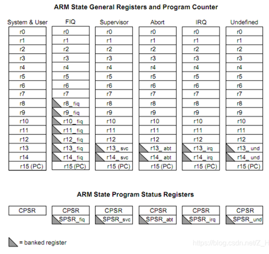
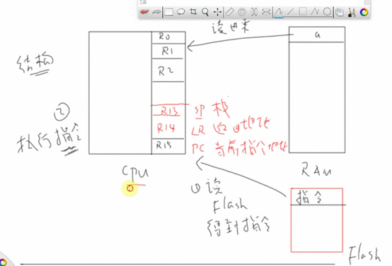
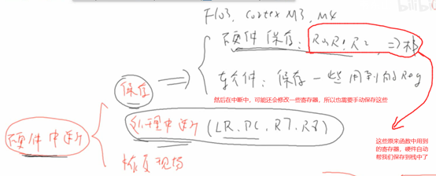
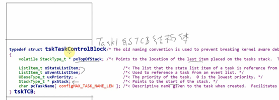
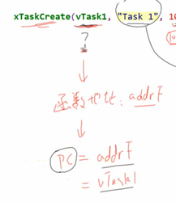
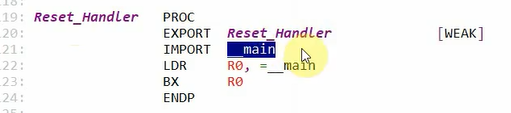
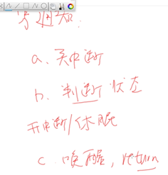

# 4小时中度掌握FreeRTOS

## 1. 任务的引入  ARM架构  汇编简明教程

​                               

### 对FreeRTOS的三种学习深度

 

### 什么是任务

 

函数被打断之后，需要保存的内容包括：

（1）函数执行的位置：运行位置

（2）函数的局部变量的值：运行环境

 

### ARM架构的基本知识

SRAM上存放的是数据，可读可写。

Flash上存放的是代码，需要通过专用的工具来烧写，避免随便破坏代码。

 

### CPU和内存的关系

内存只有两个功能：读和写，两个功能，不具备运算的功能，由CPU来计算。

 

​    把内存的数据读到哪里去呢？得对CPU的内部结构有所了解。靠的是15个寄存器Ri。

R13(SP栈指针)，R14(LR返回位置)，R15(PC指针)

 

（1）ldr 读取某地址的值到某个寄存器上

 

（2）str把某个寄存器的值写入到某个地址上

 

（3）add把R1的值加上R2的值，结果存放到R0上

 

（4）push 把所列出的寄存器的值存储到内存中

**注意：**SP指针，指向的是地址的位置，SP的值本身就是地址的位置，而32位单片机的地址都是32位的， 所以指针的值都是32bit的。

所以sp指针移动的时候，都是4字节移动的。

**而且push**指令还有一个特点，就是高标号的寄存器值存储在高地址，低标号的寄存器值保存在低地址。**

所以 push{LR, R3}里面的顺序无关。

 

**之所以这么干，是方便出栈时，最后一个出来的可以是LR**的值，可以直接赋值给PC**指针。**

 

（5）pop出栈，出栈是按照顺序读取出来的

 

### CPU的寄存器及其功能

[ARM寄存器及功能介绍/R0-R15寄存器_pikachu的博客-CSDN博客_r0寄存器](https://blog.csdn.net/Z_H_Z_0/article/details/106574292)

7种处理器模式：

（1）用户模式：USR

（2）管理模式：SVC

（3）中断模式：IRQ

（4）快速中断模式：FIQ

（5）数据范文中止模式：ABORT

（6）未定义指令中止模式：UND

（7）系统模式：SYS

 

CPSR：程序状态寄存器

SPSR：备份的程序状态寄存器

 

### CPU怎么知道读取数据保存到哪个寄存器呢？

CPU就是一个傻大个，其读取flash中的指令来执行对应的操作。

 

 

 

## 2.栈的作用

进入函数add_val的时候，需要保存执行的位置，通常是**通过****Lr****寄存器保存下一条需要执行的代码位置**。对于函数来说就是函数下面的一条指令位置。

**函数传参的汇编**，其实参数1传入R0里，参数2传入到R1里。

 

 

Ldr r2,[r0,#0x00]  #后面的是立即数，然后这个值是偏移量

R0=*pa=a的指针，也就是一个地址值;

R1=*pb=b的指针，也就是一个地址值;

 

把r0（地址）所在的值，赋给R2；R2=a

 

把r2的值，赋给sp指针所指向的地址上去。

 

 

### 什么是现场？保存现场？

暂且认为是被打断瞬间，这些所有寄存器的值

 

 

可以保存在栈中。

 

### 三种保存现场的情况

（1）任务切换的情况

任务切换的时候，根本不知道你用到了什么寄存器，所以所有的寄存器都保存

（2）函数中调用别的子函数的情况

会把R0,R1,R2用来传参，这些传参是函数特地传给子函数的，原来的函数本来就知道我要传哪些寄存器的参数给子函数，知道这些变量可能会变，所以无需保存现场。

而且实际上，形参好像是复制值过去而已，并不会修改原来的值。

（3）中断的情况

函数执行过程中，硬件中断打断程序，硬件中断中，并不需要保存所有的寄存器，硬件会帮你保存一部分寄存器的值，保存在栈中，代码不用写；然后软件上需要保存一些需要用到的寄存器。

 

 

 

## 3.创建任务的函数解析

### 创建任务函数

 

函数内部会使用malloc动态在堆中创建一个栈空间，专门给这个任务使用。

创建任务可以指定优先级，硬件实现寻找最高优先级的就绪任务，**前导零指令**，还有就是普通寻找。

 

创建任务可以得到一个结构体指针，也就是任务句柄，指向任务控制块TCB，用于描述任务。

任务函数的参数，是记录在任务控制块中。

 

 

## 4.创建任务的内部细节

### 精简的任务控制块

 

TCB数据是存储在内存SRAM的栈中的。

任务栈中最后一项的位置，也就是栈当前使用到的最后一个位置

状态列表项

事件列表项

任务优先级

指向栈开始的地方，所以说是栈尾部？

任务名称

那创建任务时候的，任务函数和任务函数参数在哪了呢？

 

（1）先说栈

### 从哪分配？大怎么分配？？？

局部变量保存在栈中，volatile修饰一个很大的局部变量不被优化，看一下

 

看反汇编代码，可以看到栈指针sp指向了sp-0x194，sp是任务创建时系统自动分配的地方。

 

**注意**：这个函数里面都没有函数调用关系，所以返回地址Lr都不用保存。所以Lr寄存器不用保存到栈中，所以不占用栈空间。

下面就添加一个函数调用关系看看：

 

就要保存lr指针了。

 

 

 

 

 

 

任务栈的大小怎么确定：取决于局部变量，和调用深度（保存现场使用）

所以根据经验估算一下需要使用到的局部变量，放大一两倍测试一下。

 

### 栈从哪来

栈，栈就是一块空闲的内存

 

Freertos定义了一块17K的堆，使用heap_4内存管理方法的话，采用最优适配算法，相邻内存合并。而且是定义一个巨大的数组，其实就是堆。

 

 

 

### 函数指针，函数参数去哪了

函数指针：就是函数地址，想调用这个函数的时候，就把这个函数块的指针（地址）赋给pc就行了，然后CPU就跳转到这里开始执行。

 

 

 

 

过程：

创建任务-->分配栈空间-->把创建任务的部分参数填充到任务控制块TCB中-->同时把任务参数和函数指针的值，保存到这个任务的栈空间中-->此时任务处于就绪任务-->如果它可以运行了，则会恢复这个任务的寄存器值，也就是所说的现场，然后PC指针会得到任务函数指针的值，并且函数参数的值也会从R0中恢复出来，然后就可以执行了。

 

注意了：pxstack是指向栈开始的地方，也就是栈地址最低的地方，任务的栈指针指向的是栈顶，也就是地址最高的地方。

 

## 5.任务调度机制

（1）抢占式任务调度，高优先级任务可以抢占低优先级的任务

（2）时间片轮转，同等优先级的任务轮流执行

 

运行，阻塞（等待某件事情，时间相关的或者是同步相关的），挂起，就绪

### 怎么取出要运行的任务？

有3类链表：

 

### 谁来调度？

谁来找出下一个最高优先级的**就绪任务**。

 

 

找不到最高的就平级，就轮流调用。

 

## 6.状态的切换

Pdms_to_ticks，执行vtaskdelay(建议使用转换成的tick数)，调用这个函数会让这个任务从运行任务变为阻塞任务。

 

高优先级的任务如果不自动让出CPU，低优先级的任务永远无法运行。

 

将阻塞链表移动到就绪链表之后，还需要执行一**遍任务调度**。

 

### 同优先级任务，哪个先运行

最后创建的同等级任务先运行。如果创建的任务高优先级，就会满足<判断，然后就会作为当前任务。

如果全部任务的优先级都为0，然后启动任务调度器，里面也创建了一个空闲任务，然后是空闲任务先运行。

 

 

### 反汇编的栈和任务的栈的区别

 

 

 

 

 

 

Main函数里面的栈，是给中断函数使用，或者是main中的全局变量使用，或者是一些系统变量。

任务的栈是给任务内部的局部变量使用的。

### STM32上电运行的内容

系统上电，首先运行的是设置sp栈指针，然后调用中断，然后调用__main，然后里面做一些初始化操作，然后再调用用户的main函数。

## 7.任务调度深入探讨

看一下空闲任务函数，如果创建的任务优先级都是0，则空闲任务先执行

 

 

可以设置空闲任务是否礼让。

不设置抢占优先级，则空闲任务每次都跳出。

 

 

最低优先级的中断都必最高优先级的任务先执行

 

主动放弃会引起一次调度

## 8.回顾任务调度链表

 

 

假设就绪的链表阻塞了，就会从就绪链表移动到阻塞链表中来。

同等优先级的任务，取第一个来执行，然后执行完成之后，就把这个任务移动到链表的后面。

这样任务就一次顺序循环执行了。

 

 

## 9.队列的内部机制（链表）

 

队列结构体，队列有一个队列头

 

注意：链表的写指针，指向队列的头部；链表的读指针，指向队列的尾部。

 

 

 

 

 

队列就是一个环形缓冲区，同时具有休眠和唤醒的功能，环形缓冲区可以通过pW和pR是否相同来判断有新数据过来，队列则是通过阻塞或者超时来判断是否有数据过来。

### 队列里面2个重要链表

 

 

 

队列有数据过来了，需要去唤醒在等待接收数据的任务就会去队列的重要链表 xTaskWaitingToReceive中寻找需要唤醒的任务，原则就是：优先级最高的任务，等待时间最长的任务。唤醒的过程，既会从队列的这个链表中移除，也会从系统的阻塞链表中移动到就绪链表中。

 

注意：同等优先级的，唤醒等待时间最长的。

Freertos就是使用链表来管理

 

 

 

 

### **创建队列**做了啥

（1）分配空间；（2）填充队列的一些头部信息

 

写数据：已有数据的个数小于队列的长度，就直接写入

 

越界了又指向头部

 

写入，不够空间了，可以设置超时时间

 

如果设置了超时时间

 

A任务写入不了，然后被记录到队列的taskwaitingSend链表中，然后还会把这个任务从就绪链表放到阻塞链表中。然后B任务如果读取数据了，就会唤醒任务。

 

 

 

 

 

 

### 链表的理解

 

系统对象（队列，信号量）这些里面可能有自己的阻塞链表

 

系统自己就有3个重要的链表：阻塞、挂起、就绪

 

系统运行过程中，系统的3个链表和系统对象的链表是相辅相成的，都会其作用。

 

 

 

 

## 10 FreeRTOS答疑直播

 

队列的实质：是环形缓冲区

队列表示方法：队列头+数据存储空间

 

 

一开始读指针指向最后一个位置，它是先加再读，多以才指向最后一个位置

写指针，是先写再加

然后里面有两个重要的链表

 

**假设任务A**和任务B**都想写队列的一个位置，那么怎么做到互斥访问系统资源。**

 

例如：

 

 

这个函数，**那个任务先进入，谁就先占有主动权。**

**临界区保护函数**，直接把中断给关了。

 

其他任务的切换，是依赖于中断的，所以谁先进入拥有这个函数就占有CPU的使用权，后面再开中断。

 

 

 

信号量、互斥量的本质也是队列，二值型和互斥型，相当于一个值的队列

 

事件组，就是只维护一个整数 32bit，其实现互斥访问的本质，也是关中断或者调度器

 

 

### 问题1：

 

想要清零，可以自己去到那个文件下面，定义一个函数，通过自定义函数来实现。

 

 

 

### 问题2：

 

 

假设某个任务或者函数调用这个函数，把调度器挂起之后，函数里面的实质就是将一个变量累加。

 

 

 

 

 

 

 

 

 

 

 

 

先把你挂在这里（就绪），等调度器再次开启的时候，并且去判断一下是否想要调度，就是为了解决实时性问题。为什么不放入就绪链表，是这个库里面没有写标记，放入就绪链表也想要标记一下开启调度器之后想要进行任务切换的标记。

 

### 问题3：

智能手环的逻辑

 

   

（1）让一个任务单独操作OLED显示设备

（2）对于蓝牙这种复杂的，可以单独一个任务（线程）

 

   

 

 

### 问题4：

 

Json只是数据格式，自己定义好解析函数就行。

 

### 问题5：

 

 

不受FreeRTOS管理的任务，处理完紧急事情之后，怎么通知其他任务呢？

然后做好中断写和任务读，都只有1个对象来做，设置好没有2个东西来操作，就解决了互斥问题。

 

如果想双向通信的话，就使用2个环形缓冲区（比全局变量好在，可以避免数据覆盖）

 

### 问题6：

 

不要尝试去移植，找现成的代码

要移植到其他单板，学习完arm架构之后再移植。

 

### 问题7：

 

优势在于，main函数不用写的那么复杂。

 

 

 

### 问题8：

 

 

 

 

### 问题9：

多任务如何喂狗

 

任何高优先级的任务死机了，空闲任务就无法执行，然后就无法实现喂狗，然后就触发复位。

正常的时候，就要在空闲任务中进行喂狗的，说明系统运行正常。

 

 

 

 

 

 

 

 

 

 

 

 

## 11 FreeRTOS中度掌握（下）

 

### ***************队列的核心+++++

**1.**关中断，实现互斥写队列，写完再开中断，让其他任务可以切换运行

 

**2.**环形缓冲区，可以写入很多数据

 

**3.**链表，可以实现休眠唤醒功能，别人任务读队列失败，就会休眠，避免使用全局变量时，要一直死循环判断某个flag是否改变了的情况，节省cpu资源

写等待链表，读等待链表

 

### ***************信号量的核心+++++

**1.**也有一个队列头部信息，没有数据buf，信号量靠一个变量来存储，在头部的之前计数变量中，队列里面这个值是迎来保存队列buf中有效值的长度

 

**2.**释放信号量要么成功要么失败，没有阻塞

 

**3.**获取信号量，释放信号量，里面都关中断

 

**4.**让计数值加一，然后判断有没有在等待信号量的任务，把它唤醒

 

### ***************互斥量的核心+++++

**1.**互斥量和二值型信号量的区别，优先级继承和递归互斥量

 

**2.**高优先级获取资源失败，才会提高占用资源的低优先级的任务的优先级到和自己一样

 

**3.**提升优先级，就是把互斥量持有者从readlist低优先级的地方移动到高优先级的readlist链表中

 

**4.**等到低优先级的任务使用完互斥量之后，就可以释放互斥量，同事在释放互斥量的函数里面，把优先级反转恢复，其实就要应到队列头里面的一个变量，存储了任务原始的优先级，先把任务从高优先级readlist移除，然后修改优先级，然后把任务添加到原始优先级的readlist链表中

 

### ***************事件组+++++

**1.**终于没有复用队列的那一套代码了，有自己的实现结构体

 

**2.**事件组的写事件这一边是永远不会阻塞的，要么成功要么失败，等待事件的任务就可以阻塞。

 

**3.**事件组的结构体很简单，就一个整形变量，好像只使用到里面的 24bit，等待事件组的时候，可以选择等待所指定的所有位，或者

 

 

**4.**以前（队列、信号量、互斥量）在操作队列读写的时候，一言不合就关中断

现在是关闭调度器了，而不是关中断了？这意味着不会在中断中来使用事件组。

如果只是担心任务B来抢的话，可以关闭调度器；但是如果还有中断的话，关闭调度器也防止不了中断对队列的修改，所以只能关闭中断。

 

 

**5.**等待事件

休眠的时候，别人得之后可以找到我呀，所以想要把自己放入到事件组的等待链表中。这只是记录而已，真正的休眠是要把自己从readlist移动到delaylist中。

 

 

 

 

 

 

 

 

 

**6.**设置事件

设置事件很简单，就是设置某些位。同时还要判断是否想要唤醒一些在等待事件的任务。

 

可以唤醒所有符合条件的任务。而之前那些队列，只能有1个任务获得。

 

等待到了事件，退出之前还可以决定是否清除这些事件的位。

 

**7.**为什么不关中断

我们不能在中断里面等待事件，根本就没有 FromISR 的等待事件函数；

但是我们可以在中断里面设置事件，

 

 

老师说，这个中断里面设置事件组的这个函数，并不会设置这个值，只是触发唤醒一个任务来

 

如果中断中直接触发所有等待事件组的任务的话，这里面的时间是不确定的，太多了。所以不允许在中断中有不确定的事情产生。

 

 

这个函数只是去写一个队列，意味着有别的任务来等待这个队列，然后这个任务就被唤醒，然后这个任务就根据这个队列的值来执行相应的函数

 

 

 

 

 

 

 

 

 

然后再在这个函数里面去设置位

 

 

***************任务通知+++++

**1.**之前队列，信号量，互斥量，事件组，都想要先创建，然后再设置，然后会有一个对应的结构体，里面会有一些自己的链表，用来存储那些写等待或者读等待的任务

 

找出来把你唤醒

 

 

**2.**每个任务都有一个TCB结构体

任务通知里面根本不需要等待链表，因为别的任务都知道它要唤醒或者写数据的对象是谁，之前那些是因为有太多任务来等待这个队列之类的，就需要把所有的任务都挂载在这个等待链表上。

 

 

任务通知，反过来就是通知任务

 

**3.TCB**中任务通知相关变量

具体的值

这个数组的值是1，之所以定义为数组，是为了防止以后想要扩展而已。

 

通知的状态

 

看看状态什么样：

 

 

情景分析：

 

上面是先复位再成功返回。

 

任务TCB中的状态值，别的任务是可以修改的

 

**4.**任务通知相关函数

 

在函数的入口处可以清除某些位，退出也可以清除某些位。

 

 

 

 

 

 

 

 

 

发送通知，可以让一个参数，来决定任务通知可以模仿之前的通信机制。

 

也是需要关闭中断，然后根据eAction参数来修改 notifyvalue，然后后面就是根据这个任务是否在等待任务通知，来决定是否需要唤醒这个任务。

不管这个任务是否在等待任务通知，别的任务发送任务通知，都是会修改TCB里面的值的。

 

 

 

总结

 

 

 

 

 

### ***************通信机制总结 +++++

休眠-唤醒机制：是为了提高 CPU 资源的利用率

关中断-关调度器：是为了实现对资源的互斥访问

队列、信号线、互斥量、任务通知：读写函数里面都是关闭中断（中断没了，调度器也不起作用）

事件组：只是关闭调度器，因为根本不会在中断中去等待事件组，而设置事件组也是使用发送队列，唤醒一个定时器守护进程，然后在任务中来实现设置事件组的

 

 

### ***************定时器 +++++

**1.**每来1个tick中断，就会有一个累计值

1个定时器应该有1个结构体来描述

 

 

**2.**怎么实现定时器

 

很多RTOS都是这么做的，RTT也是这么做的

会有1个定时器链表，上面挂接这些各个定时器的结构体

​    在每一个 systick 中来处理一下这个定时器链表

​    

 

但是FreeRTOS是另外想一种方法的

 

因为FreeRTOS中，想的是，不要在定时器 systick 中来判断处理这些定时器处理函数，因为这些函数处理时间很长的话，容易影响 systick ，或者是别的中断。

 

FreeRTOS 是通过一个定时器守护进程来实现的，这个定时器守护任务一直在等待队列，然后systick 中判断有定时器时间到了，systick任务中是发送队列到定时器守护任务中进行的。

 

 

 

这个效率不高，freertos是任务中来处理定时器函数的，但是这个定时器任务的优先级要设置很高才行，别的RTOS是直接在硬件定时器中来处理定时器函数的，这样效率高一点。

 

定时器链表是会排序的，所以判断超时时间只需要判断第一个就好了。

 

 

 

创建定时器

（1）分配1个定时器结构体，初始化这个结构体

只是设置初始化了，不一定会使用，所以还没有挂载进链表中。

 

 

（2）启动定时器

 

启动一个定时器为什么要加一个超时时间？

因为启动定时器是通过写一个队列来实现的，所以写队列可能不成功，所以需要超时时间。

 

里面是构造了一个消息，然后写队列

 

然后根据你这个参数，发现你是想启动一个定时器，就把你这个定时器挂入一个定时器链表。

 

 

（3）处理定时器任务

从定时器链表里面算出下一个定时器超时的时间，然后就去休眠。

在休眠过程中会被唤醒的原因有2个：

​    有别的任务又发来新的队列消息了

最近的一个定时器超时时间到了

 

 

 

 

 

 

 

 

 

### ***************中断 +++++

 

#### 1. 两套API

没有后缀的给任务使用的，有后缀的在中断里面使用的

 

 

 

 

任务使用的函数，里面做这些事情

 

 

 

 

为什么不在中断中跳出更高优先级的任务来运行它呢？因为没有意义：

比如一个按键中断中，我们在中断处理函数里面写了两次队列，如果任务B在等待这个按键队列。

 

 

 

在切换函数里面才寻找优先级最高的就绪任务来运行

 

 

 

#### 2. 两类中断

 

 

COTEX M3

 

freeRTOS中，把可编程中断一刀切成2部分

 

 

这么考虑的原因：因为这是一个实时操作系统，这个系统需要用在一些性命攸关的地方，所以就把中断分成2部分。不要指望我的函数。笑死。

 

关的是这些中断：portVECTACTIVE_MASK中断。

 

 

 

 

 

FromISR的函数，里面也做了一些保证，如果在不受FreeRTOS控制的中断函数中调用了这些API函数，这些API函数里面，判断当前这个中断的优先级是否满足约束条件，不满足就会触发问题。

 

 

 

 

 

 

 

这样你在测试程序的时候，肯定就测试不通过，所以就会找原因，在发布产品阶段肯定就不会犯这些错误了。

 

 

#### 3. 中断函数

Systick 和 pendSV 这两个中断都是为任务服务的，所以他两的优先级设置为最低

 

 

 

 

pendSV的代码：

 

取出当前TCB

当前TCB里面有什么？第一个元素就是栈，然后保存这些寄存器到栈里面去，

 

 

 

 

 

这个好绝

（1）保存老任务寄存器的值在老任务的栈里面

（2）然后寻找下一个优先级最高的任务，并且切换任务

（3）切换新的任务，需要重新运行新的任务嘛，所以需要把这个新的任务之前退出时保存的寄存器值释放出来。

 

所以每个任务的进入和退出，都关系到该任务资源现场的保存。

任务的局部变量不用保存，在栈中，但是 CPU 的寄存器 R0~R15这些寄存器是各个任务共用的，所以每个任务要被切换出去之后，就要保持任务当前时刻的 CPU 的寄存器 R0~R15 寄存器值，下次再进入任务的时候，才恢复出来。

 

 

 

#### 4. 自己手动保护临界资源

 

 

 

 

