# 项目1：功能及学习顺序

\## 1. 项目功能
 项目1是：基于HAL库的智能家居。
 \## 2. 学习顺序
 \* 环境搭建及C语言基础知识（完成）
 \* 项目必备的HAL库基础
    \* LED和按键
    \* I2C协议和OLED操作
    \* 串口操作
 \* AT指令(基于ESP8266)
    \* 用于联网
 \* 项目1_基于HAL库的智能家居
    \* 综合起来实现项目

# 项目1：智能家居

### 学习路线

​                               

 

 

### 项目特点

写的通用化一点，应用这驱动之间做出抽象层

 

 

 

对于这个简单的程序，抽象出了6层，是为了容易扩展和通用，以后更换某一部分直接更换该部分就行了。

 

 

 

### 学习Source Insight

只是阅读源码，编写源码的工具，没有调试和编译的功能。

（1）添加可打开汇编文件

 

（2）创建工程

 

（3）打开右边的视图窗口

 

（4）建立依赖关系

 

点击同步也行

 

（5）中文显示问题调整

（6）显示函数实体

 

（7）左边是显示文件中的所有函数

（8）自动缩进问题

 

 

### STCubMux创建工程时的问题

 

用这个烧写程序的路径，不能有中文，不然就会闪退。

 

注意：生成的文件目录不要有中文名，同时不要在工程名上添加空格。

 

### 程序调试

单步，运行一整句，跳出函数

 

 

## C语言基础

### 进制转换

（8进制转2进制）

 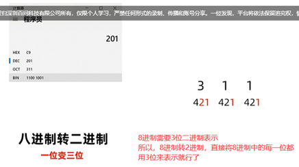

 

（10进制转2进制）

 

（16进制转2进制）

 

（2进制转8进制）

 

（2进制转10进制）

 

（2进制转16进制）

 

区分

 

 

**注意**：C语言不支持使用二进制进行赋值。

 

16进制，使用0x

8进制，使用0开头

2进制，使用0b开头

 

### 位运算符

都是针对2进制的。

 

​    

 

### Stm32系统架构

 

 

 

 

嵌入式操作外设，其实就是通过给CPU指令，让其通过地址总线和数据总线来在对应外设的寄存器地址（在内存的地址位置处），对应位置上按照其手册功能，写入对应的值（0/1）,然后CPU就可以执行相应的功能。

### 封装寄存器

其实就是定义一个不会被优化的指针（32位），指向某个地址（地址的值通过查询芯片手册来找到对应寄存器的值）。

 

巧妙定义寄存器指针

 

通过定义一个结构体，然后结构体里面的成员变量的在内存地址中是连续的，所以就可以只需要定义每个外设的基地址为该结构体类型，然后通过访问成员变量，就可以实现访问到正确的寄存器地址了。

 

### 函数指针

 

 

注意：可以给函数指针起别名。

 

函数指针，可以作为函数的参数和函数的返回值来使用。

 

函数里面，调用函数指针所指向的函数来进行运算。

在单片机裸机开发中，函数指针使用的不多，但是在RTOS中，函数指针使用的非常多。创建任务的任务函数就是通过函数指针来传值的。

 

 

 

### 函数指针的用法

 

 

 

 

### 链表

 

 

 

 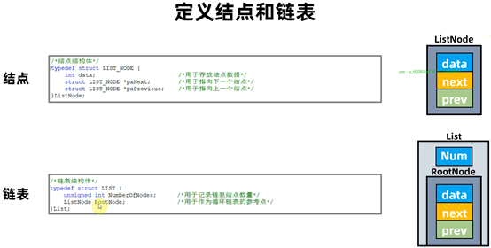

注意：链表头，里面有2个数据，一个就是有多少个链表项，另外一个就是根节点，一开始的时候，根节点也是一个节点，自己指向自己。

 

 

 

 

 

 

链表，需要先定义一个节点，然后再定义一个链表结构体

 

 

 

 

 

 

 

 

 

### CPU与地址与外设

 

 

 

 

 

 

 

 

 CPU很任性，只是发出地址而已，具体是对谁进行访问，靠内存管理器来进行分配。

 

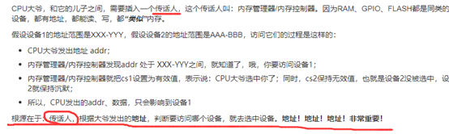

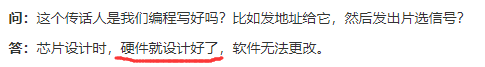

其实可以这样想：就是如果一个char a没有用4字节存储，只是用1字节存储，那么下一个如果是int b，就会占用char a之外的3字节加另外的4字节的首字节。

这样系统对int b 的读取就要读连个字节，然后再拼凑起来才行。

 

 

 

 

 

 

 

 

### 结构体占用内存问题

 

 

 

 

 

### 堆的使用

 

 

 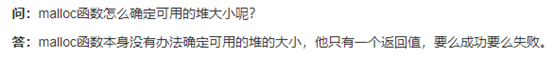

 

 

 

Malloc从堆里面分配空间，其实返回的就是一个指针，指向分配的内存高地址，我们使用的时候，就是通过这个指针的移位来操作数值的。添加的头部分析，可以用来释放内存。

 

 

 

 

## Hall库基础学习

 

### STM32CubeMx设置时钟

 

 

### Hal的GPIO操作函数

 

 

 

### 流水灯和跑马灯的区别

 

 

### 按键抖动

 

### CubeMx的硬件初始化函数

 

引脚初始化状态也是在cubemx里面设置好的

 

 

 

### Oled显示

 

 

 

 

 

 

### STM32F103的GPIO模式

 

 

### 模拟IIC

// IIC 发送1字节数据（字节高位先传：MSB）

 

 

 

 

### OLED显示格式

 

 

 

 

 

 

 

 

OLED里面的处理器，会周期的读取显存的数据，然后刷新显示到oled上。

 

 

 

 

 

 

这款oled显示，低位在前，高位在后，所以需要取字模软件

 

 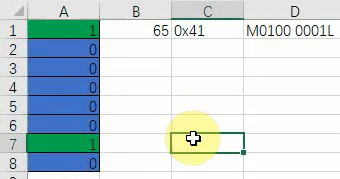

 

 

 

 

 

 

 

 

 

 

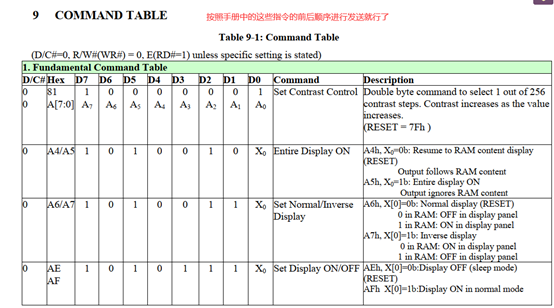

### 串行通信

 

 

 

 

 

 

 

 

 

 

对于同步信号，可以通过调整时钟的频率，可以很快地提高数据传输的频率。

对于异步信号，要提前约定好速率，不能随意更改。

 

 

 

 

 

 

 

 

 

 

单片机编程的时候，应该可以使用所有的c库，keil编译器可以调用内部的库帮我们做处理，最终还是转化为机器码。

 

 

 

 

 

### 环形缓冲区

 

 

 

 

 

 

 

 

 

 

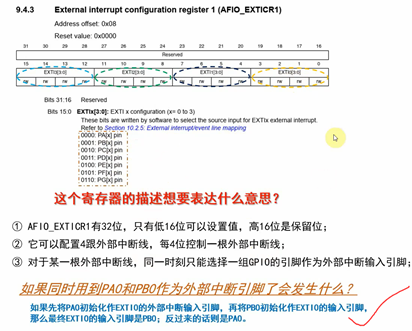

### IIC的提问

 

 

 

 

 

 

 

 

### 环形缓冲区的提问

 

 

 

 

 

 

 

 

## ESP8266的AT指令

 

 

 

 

 

 

 

 

 

 

Flash是需要擦除的，有寿命，能不擦除就不擦除

 

### 实操手册

 

### 单连接 TCP Client

 

**注意：**如果没有后缀的，其实就是DFF，保存到flash中的

8266连接不了5G的wifi

 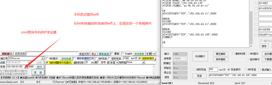

 

8266接收到电脑服务器发来的数据显示内容，6代表有6个有效字节，最后两个字节是 \r\n，占用2个字节。

 

### UDP可变远端实验

之前的连接都要指定发送长度，指定哪个端口，比较麻烦，**能不能使用透传呢？**

 

 

 

 

# 【项目1】基于HAL库的智能家居

 

 

 

 

 

 

 

裸机可以在中断中触发一个定时器，然后在定时器中断中进行处理。

 

### 程序编写习惯

 

 

 

 

### 输入子程序

#### 输入系统按键子系统与定时器消抖

 

 

 

 

 

 

 

 

 

### LED设备子系统

#### 设计思路

 

对于裸机，可以使用Hal库来操作硬件

对于freeRTOS，也是通过Hal库或者其他自定义库来访问硬件

对于RTT，既可以使用裸机的方法，也可以使用RTT的驱动框架来实现，如上图所示，给应用程序定死了调用接口，驱动程序需要适配应用程序的接口。但是则个统一的接口只是对RTT来说是统一的。

对于Linux，则只能使用驱动框架来实现对硬件的操作。

 

要抽象出对于三种不同系统的层，则可以在它们上面再添加一层，下面对不不同的系统调用不同的接口函数来访问硬件，但是对于再上层的应用程序，则是统一调用我们抽象出来的这层接口函数。

 

 

LED设备，根据可能会用到的功能，抽象出了一个结构体：

 

和设备相关的，具体的抽象结构体，可以建立一个文件夹进行设置

Delay函数，也需要分层

 

 

 

 

### 显示设备系统

 

 

 

 

第三种要和第一种进行对比，这个是直接写显存，oled是通过IIC来写显存。

[(19条消息) 屏幕的8080接口和RGB接口_qlexcel的专栏-CSDN博客_8080接口](https://blog.csdn.net/qlexcel/article/details/113833575)

 

 

 

 

 

 

### 风扇设备系统

### 字体设备系统

 

 

 

 

### 网络设备系统

 

网络输入系统设计

解析后面的数据

 

 

 

# FreeRTOS快速入门

## 02-1堆

 

## 02-2栈

 

 

Stm32上电执行的过程

 

 

 

 

 

## 03-1从官方源码精简出第一个FreeRTOS程序

 

 

 

学习FreeRTOS就是学习这几个文件，所以我们可以彻底的分析FreeRTOS的内部实现。

## 03-2函数指针类型

 

加上typedef之后，以后就可以使用里面的TaskFunction_t这个来表示这个函数指针类型了。

 

然后当函数需要函数指针作为参数输入的时候，这个参数的类型就可以使用上面那个函数指针类型。

 

## 04-1_自己的第1个FreeRTOS程序

查看debug串口打印信息

 

在debug模式下，点击viewàserial windowsàuart #1，就调出窗口了。

 

05-1_动态_静态创建任务

### 动态创建任务

分析任务控制块 TCB_t 结构体

 

 

看这个结构体，使用typedef 重命名了2次。

 

### 静态创建任务

需要注意的是，想要使用这个函数，想要定义前面的这个宏

 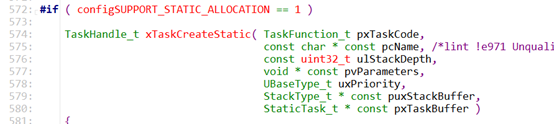

还有静态创建任务函数中，自己定义了一个任务控制块的类型

 

 

因为stm32单片机的系统RAM资源是非常有限的，如果某些函数不需要使用的则可以使用宏开关关闭它。

 

打印任务的名字：我直接操作任务控制块->索引，编译报错，需要查看freertos专用的函数是怎么实现的。

 

 

 

### 任务优先级的问题

\#define configMAX_PRIORITIES       ( 5 ) // 任务的最大优先级，这里定义为5，采用前导零指令，最多可以32个，数值越大优先级越高

 

 

### FreeRTOS任务状态信息查询

uxTaskPriorityGet()：查询某个任务的优先级

vTaskPrioritySet()：改变某个任务的任务优先级

uxTaskGetSystemState()：获取系统中任务状态

vTaskGetInfo()：获取某个任务信息

xTaskGetApplicationTaskTag()：获取某个任务的标签(Tag)值

xTaskGetCurrentTaskHandle()：获取当前正在运行的任务的任务句柄

xTaskGetHandle()：根据任务名字查找某个任务的句柄

xTaskGetIdleTaskHandle()：获取空闲任务的任务句柄

uxTaskGetStackHighWaterMark()：获取任务的堆栈的历史剩余最小值，FreeRTOS 中叫做“高水位线”

eTaskGetState()：获取某个任务的壮态，这个壮态是 eTaskState 类型

pcTaskGetName()：获取某个任务的任务名字

xTaskGetTickCount()：获取系统时间计数器值

xTaskGetTickCountFromISR()：在中断服务函数中获取时间计数器值

xTaskGetSchedulerState()：获取任务调度器的壮态，开启或未开启

uxTaskGetNumberOfTasks()：获取当前系统中存在的任务数量

vTaskList()：以一种表格的形式输出当前系统中所有任务的详细信息

vTaskGetRunTimeStats()：获取每个任务的运行时间

vTaskSetApplicationTaskTag()：设置任务标签(Tag)值

SetThreadLocalStoragePointer()：设置线程本地存储指针

GetThreadLocalStoragePointer()：获取线程本地存储指针

 

 

 

### Const关键字

c语言中const全局变量存储在只读数据段，编译期最初将其保存在符号表中（const全局有的编译器直接当立即数存在ROM中），第一次使用时为其分配内存，在程序结束时释放。

而const局部变量（局部变量就是在函数中定义的一个const变量，）存储在栈中，代码块结束时释放。

在c语言中可以通过指针对const局部变量进行修改，而不可以对const全局变量进行修改。因为const全局变量是存储在只读数据段

 

 

.data段和.bss段的内容只是初始化与未初始化的区别：全局变量(包括静态)，静态局部变量

rodata全局常量，字符串常量

.text 函数代码

 

难道上面的这些值都是存储在flash中的？？？然后局部变量才是在程序运行过程中，才存储到内存SRAM中的？？？？

 

### 100UL的含义

 

 

## 05-2_创建任务函数的进一步实验

### （1）为什么任务控制块中没有保存有任务函数指针？

函数指针保存在栈中了，创建任务的时候，创建了栈，然后栈的第一个指针指向的就是pc指针，pc指针的值保存的就是任务函数的入口地址。

任务控制块的大小在定义的时候就确定下来了的。

### （2）静态创建任务中任务句柄传入指针的指针

 

 

 

所以可以传入一个指针的指针，然后这个指针指向上面分配地址的那个内存的首地址。

 

 

### （3）最后创建的同优先级的任务先运行

 

### （4）FreeRTOS的任务不能直接返回

 

 

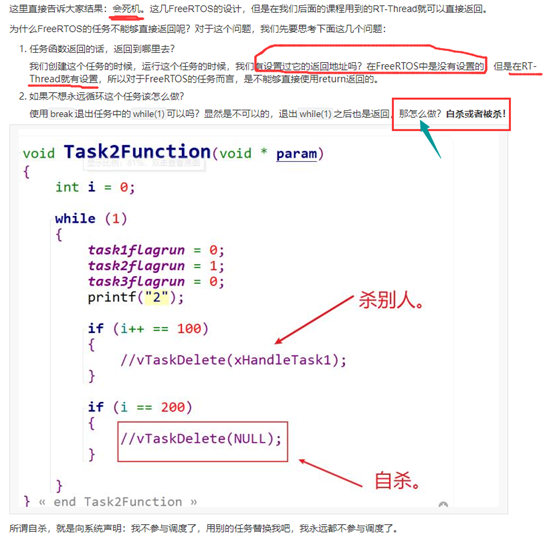

### （5）自问自答

 

区别在于把显示初始化为非零的全局变量存在.data段中，而把显式初始化为0或者并未显式初始化（C语言规定未显式初始化的全局变量值默认为0）的全局变量存在bss段。

 

### （6）作业题

 

### （7）malloc申请的内存和free怎么知道释放哪些

 

 

 

结果是：程序崩掉了，产生了hardfault错误

 

 

## 06-1_任务状态理论讲解

### （1）如何设置keil仿真时间准确

 

 

### （2）后创建的任务先运行

 

创建任务的顺序是 1 2 3，然后任务3先运行，然后又轮转回任务1.

### （3）tick中断的时间可以设置

\#define configTICK_RATE_HZ         ( ( TickType_t ) 1000 ) // 1ms

 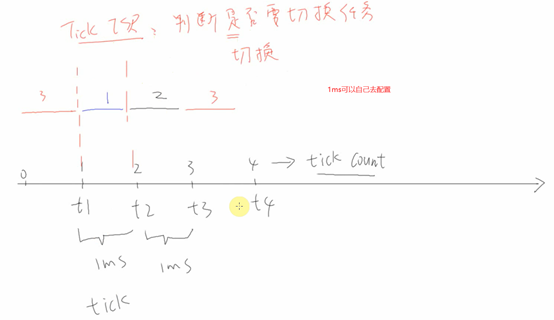

### （4）任务的状态

 

任务状态的切换

 

实验：如何任务调用vTaskSuspend挂起自己，则必须要由别人调用vTaskResume来唤醒自己才行。

 

 

 

 

 

 

 

 

 

 

## 06-3_vTaskDelay和vTaskDelayUntil

 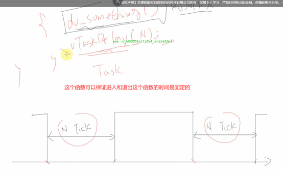

如果想周期性地执行，怎么办？

 

 

 

 

 

 

 06-x任务调度回顾 

钩子函数可以做一些统计信息

 

 

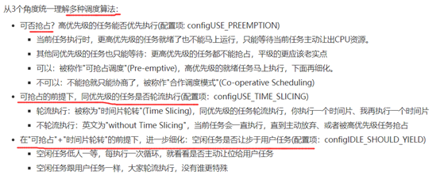

 

## 06-xx 新的见解

 

 

 

 

 

## 07_同步互斥与通信概述

全局变量的缺点

 

还可以使用一个全局变量，来标志是否在利用资源，但是另外一个任务会死等，没有睡眠机制，比较消耗资源。

 

 

 

 

别的系统资源是多对多的关系，任务通知是多对一的关系

 

 

## 08-1_队列的理论讲解

 

注意队列头尾的位置了，注意数据的写入可以写到头部也可以写到尾部

 

队列有一个结构体，里面至少有真正存放数据的buf，写等待链表，读等待链表。

 

 

注意队列读指针

 

**注意**，写到队列的头部或者尾部，其实是对于环形缓冲区的读指针和写指针来说的，读指针指向上一次读取的位置，如果需要写一个新数据到队列中，则先移动读指针，插入新数据，则下一次直接就把新数据读取出来的。

 

 

 

 

这个比较有意思

 

 

### （1）写队列是拷贝数据

### （2）使用队列来实现互斥访问

 

### （3）分辨数据源和传输大块数据

 

 

### （4）队列的答疑

队列=环形缓冲区+休眠+唤醒

创建队列的时候，是动态给队列分配空间，会分配**存储数据的空间**+Queue_t结构体

int8_t * pcReadFrom; /*< Points to the last place that a queued item was read from when the structure is used as a queue. */

**指向上一次队列读取的位置，所以一开始的时候，队列读指针应该在3****的位置，而不是队列头部。**

 

 

 

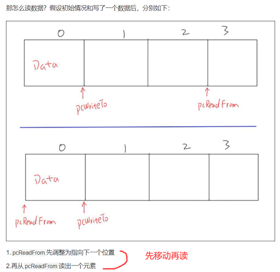

可以看这个函数的源码

 

 

 

写入一个数据之后，移动写指针，然后会判断等待读队列的链表里面是否有数据，有的话，就把这个等待队列的第一个任务给唤醒（从这个等待队列中移除，然后加入就绪链表中，然后主动发起一次任务调度），在任务插入队列的等待事件链表的时候，是会按照优先级进行排序的，优先级高的放在头部，同等优先级的放在后面，所以最先唤醒的就是优先级最高的或者是最早插入的同等优先级的任务。

 

 

 

这个分析很清楚

 

 

 

 

 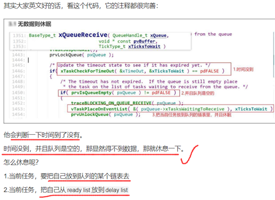

超时时间，并不会影响队列的位置

 

 

 

 

 

## 08-3_队列集

 

使用队列集，主要是可以检测多个队列，可以知道有数据的队列，然后打印队列

视频的源码在：

 

 

 

### （1）队列集的长度

 

 

 

 

 

 

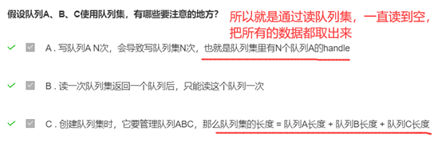

### （2）5个重要的步骤

 

### （3）实验

 

 

 

这个手册有用

 

 

### （4）队列集的必要性

 

所以，队列集的作用就像起到一个提醒的作用，各个任务使用适合于自己的队列，然后有数据了就通过队列集来通知。

 

解决的方法：

 

**传递结构体的方法就是，把数据存在其他地方，结构体用来提示数据大小和位置，但是好麻烦。**

 

队列集图解

 

 

队列与队列集建立联系

 

 

 

读取队列集最好的方法就是：因为读一次就可以让队列集元素少一个，然后同时把队列的一个数据读出来，一一对应。

 

队列和信号量的区别

 

 

### （5）无法分辨返回的是哪个队列

 

### （6）队列集类似于Linux中的poll机制

 

 

### （7）队列接收阻塞链表的任务插入顺序

 

 

### （8）读队列超时在这里实现

 

### （9）中断中写队列会引起调度嘛？

 

 

 

 

 

 

 

 

 

## 08-4 邮箱

只有1个数值的队列

### （1）读邮箱

 

 

### （2）写邮箱

 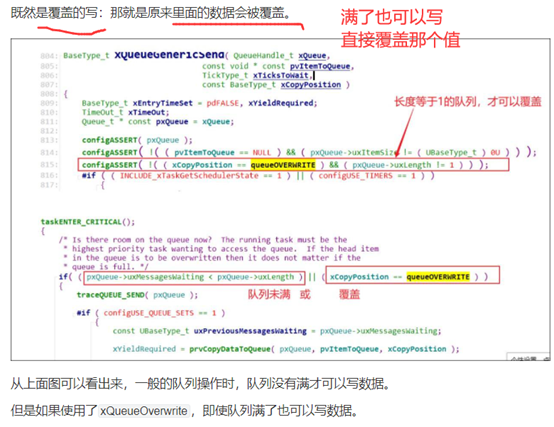

### （3）唯一注意的地方

 

 

 

 

 

 

 

 

 

 

 

## 09-1_信号量的理论讲解

无法使用信号量来传输数据，只能用计数值来表示资源的数量

 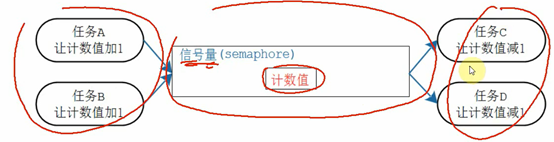

只涉及3个函数

 

 

 

 

 

  使用这个来保存value值

对于计数型信号量，可以给这个计数值累加，但是不能超过创建时设定的最大值

 

Give没有阻塞时间，要是写满了直接就返回错误，take可以指定阻塞时间，一段时间后没有获取到就返回。

 

 

 

## 09-2_信号量的常规使用

### （1）队列也可以实现同步，为什么还想要使用信号量

 

不能使用全局变量：

A）全局变量互斥，会导致等待的那个任务在循环死等，会消耗CPU资源

B）全局变量，任务2，任务3都在访问一个资源，如果任务3解开的全局变量，但是此时还没进行操作就被别的任务切换出去了，则任务2此时就可以直接进入里面使用资源了，所以说全局变量有可能导致互斥不成功的现象。

### （2）信号量的give不会阻塞，take可以阻塞

 

### （3）计数值加到最大，会返回错误

 

### （4）什么情况下使用信号量

 

### （5）队列和信号量的区别

 

 

 

 

 

 

## 10-1_互斥量的理论讲解

### （1）为什么有了二值型信号量来实现互斥，还需要互斥型信号量

比如A获得二值型信号量，然后打印的时候，被切换出去了，但是这时候C任务偷偷去释放了信号量，则此时D任务又可以获得信号量了，可以实现打印。

所以，二值型信号量无法实现谁上锁谁解锁。而互斥量则可以（但是FreeRTOS没有实现这点，只能由程序员来保证了）。但是互斥量还有一些优点，可以缓解优先级反转和递归上锁的问题。

 

### （2）互斥量初始化值为1

 

### （3）互斥量和二值型信号量

 

### （4）互斥锁的监守自盗

使用递归锁就可以实现由谁持有就由谁释放，对于递归锁其内部会记录锁的持有者，只能由他来递归调用或者解锁。

 

### （5）优先级反转

 

就是高优先级的任务去获取互斥量失败的时候，就会把占有这个互斥量的任务的优先级提高到和自己一样，直到低优先级的任务释放了互斥量才把优先级恢复。

### （6）优先级是怎么继承的

当前高优先级的任务3，他会找到互斥量的当前持有者（任务1），然后把他从低优先级的就绪链表中移除，然后插入高优先级的就绪链表中。

 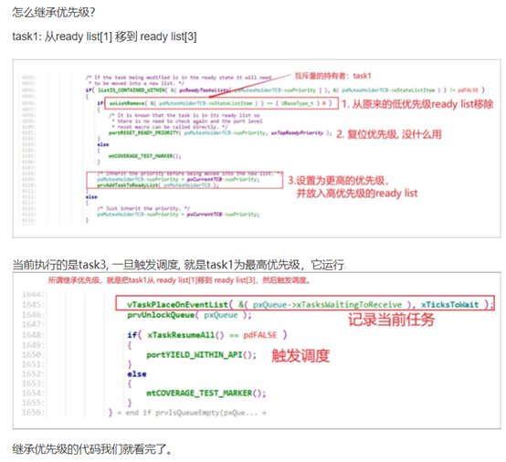

 

### （7）何时恢复原来优先级

在Task1释放互斥量之后，就主动自己降低自己的优先级

 

 

### （8）优先级一直提升

 

### （9）Cotex M3没有原子操作

 

 

 

### （10）死锁举例

 

 

## 11-1_事件组的理论讲解

 

 

 

### （1）同步点

可以实现所有的任务在完成自己事情的时候，标记一下事件组，然后等待的事情没有全部来临的话，所有的任务的还不能退出这个函数，所以等到全部事情都满足了，所有等待的任务同时可以得到运行，实现了同步点。

 

 

### （2）事件组等待事件

就是某个任务只等待事件组中的某些位置，满足了就可以运行或者清除事件组中的某些位。

 

### （3）什么时候清除事件？

 

### （4）xEventListItem中的xItemValue有什么用？

 

 

 

### （5）事件组，要么等待其中任意一个发生，要么都发生

 

 

### （6）事件组只起到通知的作用，数据的存储还需要队列来实现

 

### （7）编译事宜

 

 

### （8）事件组和队列集比较

 

 

 

修改这些系统资源的前提，是把中断给关了，因为中断这些添加操作都不是原子操作，可能会中途被切换出去了。

 

 

 

### （9）事件组同步源码实现

 

 

 

### （10）RTOS中断唤醒任务的优点

中断唤醒的任务可以和别的任务同时运行

 

 

## 实际项目讲解 à 3人射球机

先跳过，有时间再分析

 

 

## 12-1_任务通知理论讲解

### （1）是否会等待

 

 

### （2）任务通知的两套函数

第一套API

例子：任务A给任务B发通知，也就是改变任务B里面的值。

 

第二套API

 

 

 

## 12-2_ 任务通知使用_轻量级信号量

### （1）初始值问题

 

 

### （2）测试发现顺序问题

任务1优先级为1，任务2优先级为2，则任务2首先运行，想要获取通知值，但是阻塞了，任务1运行，给出1个通知值，然后唤醒了任务2，任务2得到运行，打印出通知值value=1，然后再次获取通知值阻塞，然后就切换到任务1继续执行。

 

如果两者的优先级一样的话，职责

 

### （3）任务通知同等优先级不会马上调度

 

都会唤醒在等待的任务，把他们放到就绪列表中，但是只有高优先级的任务才会马上进行任务切换，不然的话就是进行一次tick中断才会进行任务调度。

 

## 12-3_任务通知使用_轻量级队列

### （1）任务通知实现的队列，只能有1个元素

 

 

 

 

## 12-4_任务通知使用_轻量级事件组

### （1）任务通知事件组和普通事件组的区别

普通事件组，如果别的任务操作事件组，但是不满足任务1的等待条件，根本不会去唤醒任务1.

但是对于任务通知，如果别的任务给任务1发送任务通知，会马上唤醒任务1

 

 

 

### （2）如果目标任务没有等待目标值，则一样会把通知值记录下来，并且改变通知状态

 

 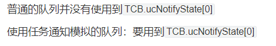

### （3）写队列的时候不会阻塞

 

### （4）学员提问

 

### （5）屏蔽中断的用法

 

 

 

## 13-1_定时器的理论介绍

 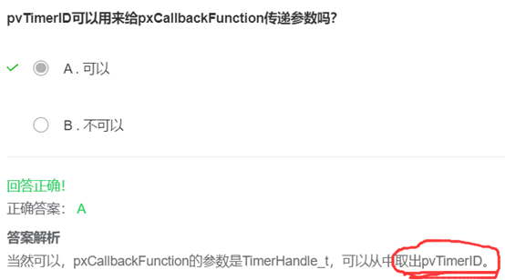

### （1）定时器解释

定时时间到了，在Linux中，是直接在tick中断中去调用定时器回调函数，但是在FreeRTOS中，则是通过队列将命令发送给一个定时器任务，由定时器任务来解析命令并执行对应的操作。

因为FreeRTOS中，实时性要求比较强，如果在tick中断中去执行定时器回调函数，则不就把CPU霸占了嘛，所以放到任务中执行，就可以实现多个任务同时运行。

 

 

### （2）定时器的精度

定时器的精度应该是ms级别的，因为时钟就是ms

 

 

就唤醒一个定时器任务（守护任务）

 

 

### （3）定时器任务的创建

静态创建任务方法

 

动态创建任务方法

 

 

## 13-2_定时器的一般使用

### （1）优先级设置问题

\#define configTIMER_TASK_PRIORITY   configMAX_PRIORITIES-1 // 定时器守护任务的优先级

\#define configTIMER_QUEUE_LENGTH   10  // 队列的长度

\#define configTIMER_TASK_STACK_DEPTH 100 // 400字节

\#define configUSE_TIMERS      1 // 使用定时器

定时器守护任务的优先级要设置的高一点，定时服务才能得到及时的运行，

如果有更高优先级的任务，是会打断定时器守护任务的。

 

任务的优先级，只能达到最大优先级-1，达不到最大优先级。

 

 

## 13-3_使用定时器消除抖动

在每个按键中断触发的时候，都重新启动或者复位一个定时器。如果定时器回调函数能够执行，则表示按键是正常按下的。

### （1）定时器要设置成1次触发

xTimerReset

 

### （2）注意定时器的时间间隔

是从调用定时器start这个函数就开始计时的，并不是等到它内部的队列发送成功了才开始。

 

### （3）定时器原理

 

 

 

 

 

### （4）start成功了，定时器却不一定真正启动了

 

### （5）定时器任务管理所有的定时器函数链表

 

 

### （6）定时器函数会按照等待时间进行排序

 

 

 

 

 

 

## 14_中断管理

### （1）为什么使用2套API函数

任务中的函数，可以阻塞，调度在里面

 

中断里面的函数，不可以阻塞，并且会返回是否有唤醒了阻塞的更高优先级的任务，提醒你在退出中断之后需要手动进行一次任务切换。如果队列满，不能阻塞，直接返回错误。

 

如何判断哪些函数可以在中断里面使用？看函数名是否有 FromISR 后缀。

 

为什么不在中断里面发起调度，是因为调度比较浪费时间，就算调度了也打断不了中断的执行，所以就是无用功，还不如记录一下，然后集中进行一次调度。调度触发的PendSV，在

103中它只是设置一个中断，说一回你来处理一下这个中断，而且它的优先级最低。

 

 

等这些普通中断退出后，这个中断会即刻处理。

 

### （2）PendSV中断

 

 

 

 

 

 

 

## 15_资源管理

### （1）SuspendALL

Tick中断中，如果变量 uxSchedulweSuspended不等于0的时候，都不会进行任务调度。

 

 

### （2）屏蔽中断的两套函数

 

 

 

 

 

# 问题汇总

## （1）system tick 中断优先级

 

 

 

 

## （2）这个函数的作用是什么？

FreeRTOS的定时器实现不是通过硬件定时器实现的，它也是通过创建一个定时器任务，每到那个时间点就调用哪个任务来通知时间到了，所以这个定时器任务的初始化就在开启任务调度器的时候就实现了。

 

## （3）这个函数的作用是什么？

设置PenSV和SysTick中断为最低优先级，这个怎么理解？

是所有中断中优先级最低，因为硬件中断的优先级是最高的，比所有任务都高，但是systick中断是为任务服务的，所以其定时精度可以不那么高。

 

 

 

 

 

## （4）

.bss段是未初始化的数据，在flash中给占用该段的数据全部赋值为0

.text和.rodata是存放到flash中的，.data段也是存在flash中的，在程序运行之前会把这些数据复制进内存中，然后在内存中使用这些数据，flash中的这些数据只会初始化1遍嘛，所以就是这个意思。

 

全局变量、静态变量都保存在数据段.data里，只有1份

局部变量保存在栈中

**一个程序**本质上都是由 **bss段**、**data段**、**text段**三个段组成

bss段属于静态内存分配，即程序一开始就将其清零了

比如，在C语言程序**编译完成之后**，已初始化的全局变量保存在**.data** **段**中，未初始化的全局变量保存在**.bss** **段**中。

data段 :用于存放在**编译阶段**(而非运行时)就能确定的数据**，可读可写。也是通常所说的静态存储区，赋了初值的全局变量、常量和静态变量都存放在这个域。

 

 

注意：

bss段（未手动初始化的数据）并**不给该段的数据分配空间**，只是**记录数据所需空间的大小**。

data段（已手动初始化的数据）为**数据分配空间**，数据保存在目标文件中。

data段包含经过初始化的全局变量以及它们的值。

BSS段的大小从可执行文件中得到，然后链接器得到这个大小的内存块，紧跟在数据段后面。当这个内存区进入程序的地址空间后全部清零，包含data和bss段的整个区段此时通常称为数据区。

 

 

可以认为初值保存在程序里，也就是flash上。

 

## （5）创建同优先级任务，空闲任务就是第一个运行的任务吗？

是的，使用钩子函数可能是打印的位置不对。如果空闲任务没有开启礼让，空闲任务可以一直运行到钩子函数，所以就会先打印出信息，如果空闲任务开启了礼让，那么空闲任务先运行但是没有运行到钩子函数就切换出去了，所以才任务1先运行。

## （6）可以直接索引TCB中的内容吗

如果要引用的话，先把

printf(&( xHandleTask1->pcTaskName[0] )); // pcTaskGetName

 

在main函数中，只引用了#include "task.h"

但是"task.h"头文件中，对于任务句柄只做了如下定义，只是给struct tskTaskControlBlock *结构体指针起个别名，

typedef struct tskTaskControlBlock * TaskHandle_t;

结构体的真实内容却在.c文件中实现的，所以别的文件只引用task.h是无法索引到其成员变量的，除非把这个结构体移动到.h文件中。

typedef struct tskTaskControlBlock 

 

测试了发现确实是这样，结构体的具体内容在头文件.h中定义的时候，main函数 #include它，在预解析阶段就会把这个结构体的内容补充进来，所以main.c才能索引到具体的内容。

不然的话，结构体内在led.c中定义的话，只在头文件中声明一下，在main.c中是索引不到具体内容的。

 

Extern也只是可以extern实例化了的具体的变量对象，对于结构体原型是不可以extern的。

 

 

## （7）静态创建的任务，是如何释放任务控制块和栈的

任务删除之后，我自己定义的栈空间和任务控制块随之变成全局变量了。

检测到是静态任务的话，不对栈内容和TCB做任何的更改。

## （8）空闲任务礼让模式

空闲任务礼让模式，在礼让之前，也是进行了删除任务栈和TCB的释放的

## （10）

如果空闲任务礼让，那么空闲任务释放了任务控制块和栈之后，然后主动发起一次调度，然后任务1运行了，然后下一次调度，又是空闲任务运行，那么这次运行是从上一次运行的位置开始还是重新开始。

比如上一次空闲任务从礼让那里切换出去了，那下一次空闲任务重新得到运行，就会重新从礼让的位置再次运行，循环反复。

 

 

## （11）具体使用哪种内存管理方式，是通过添加哪个内存.c文件实现的

 

 

## （12）为什么？

 

 

 

main函数在进入的时候，会分配一段main函数的栈空间，是根据main函数的局部变量的大小来设定的，运行到启动调度器之后，会回收栈空间，如果不回收就会浪费一点资源，回收的话，中断使用的栈就可以继续利用这些资源了。

 

所以很多系统资源需要定义为全局变量。

 

 

 

## （13）freRTOS为什么没有从挂起状态变阻塞状态的

 

 

 

 

 

 

 

 